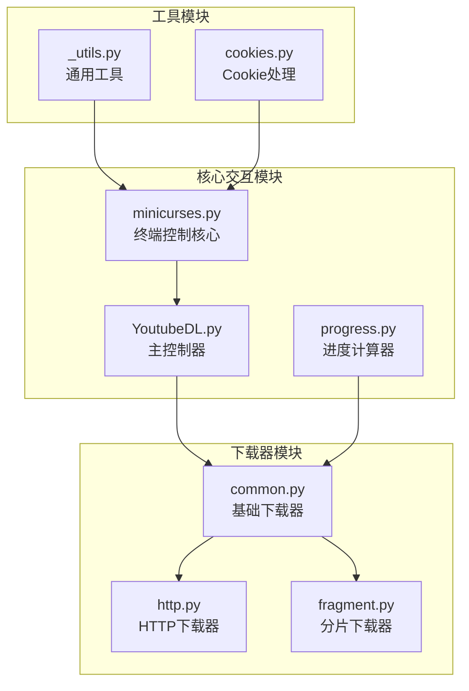
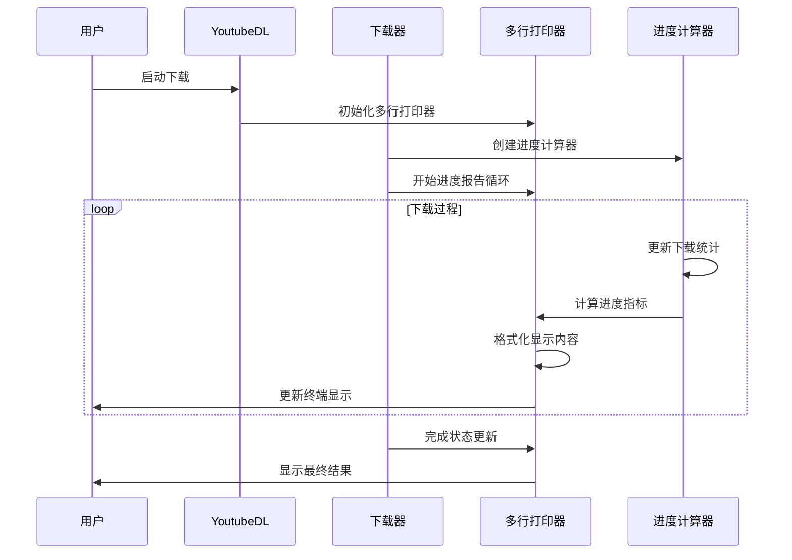
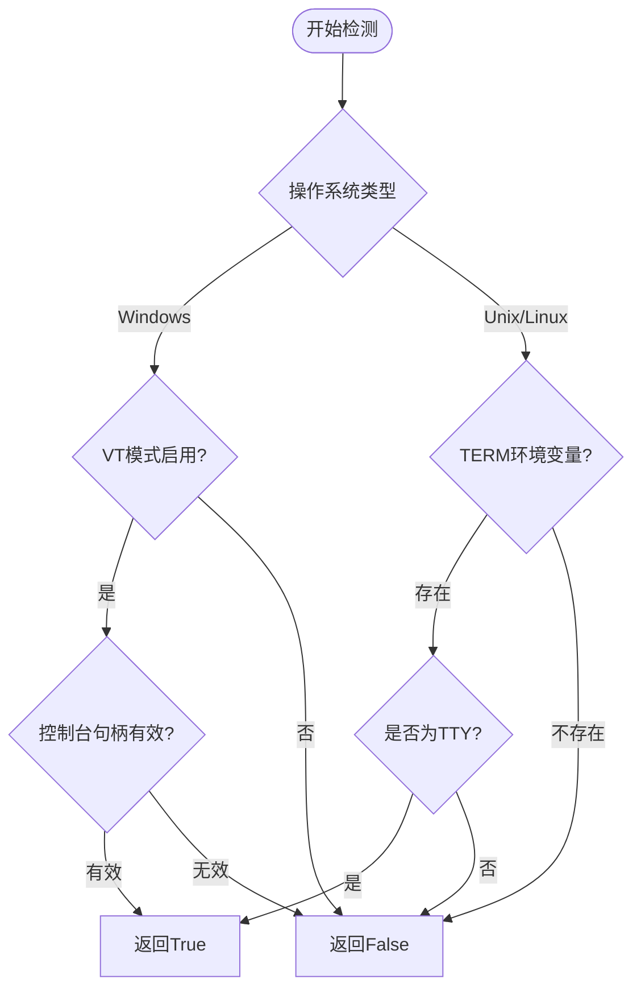
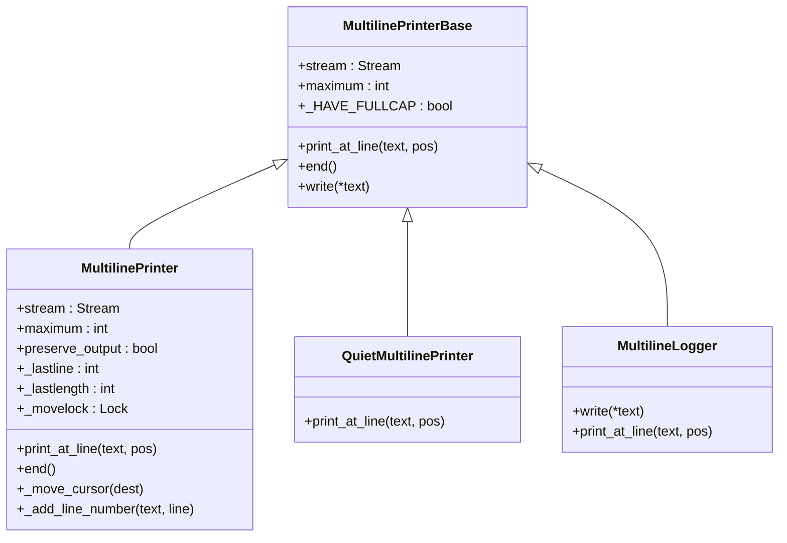
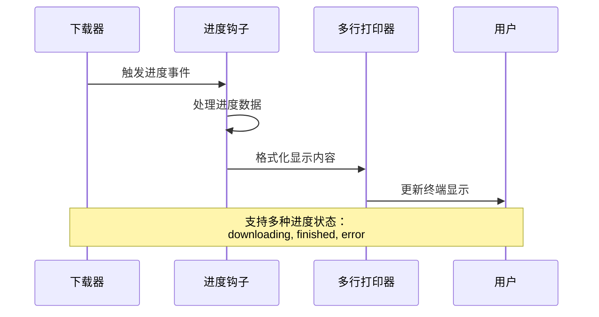
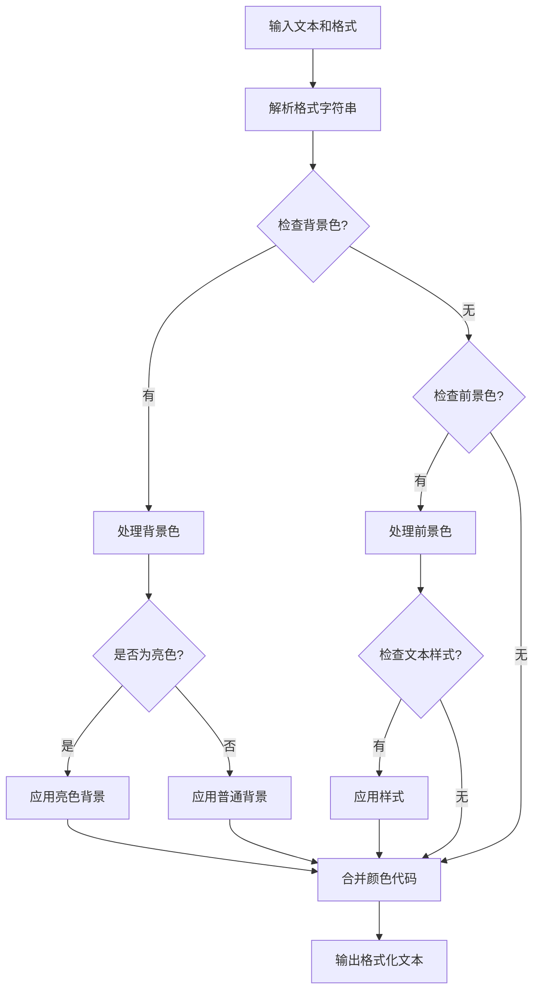
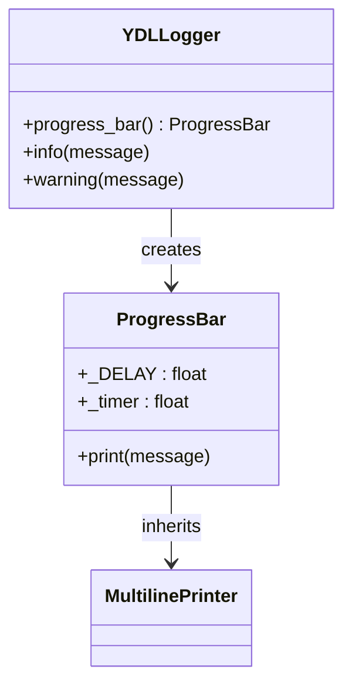
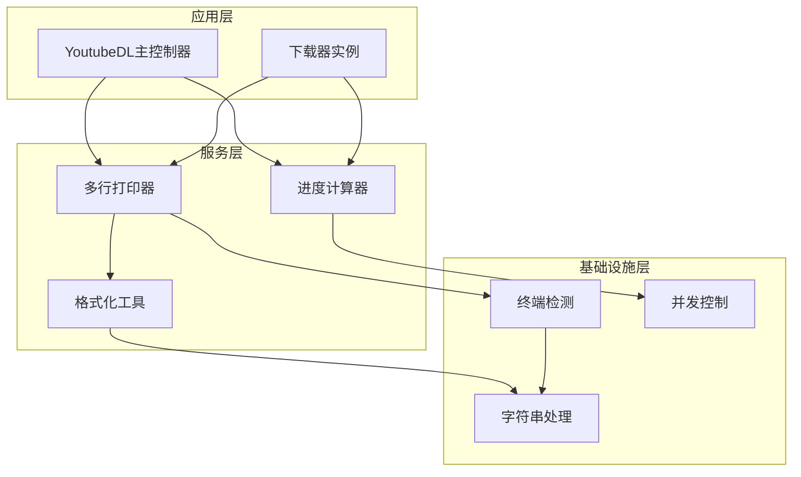

# 交互模式（TTY）

<cite>
**本文档中引用的文件**
- [minicurses.py](file://yt_dlp/minicurses.py)
- [YoutubeDL.py](file://yt_dlp/YoutubeDL.py)
- [progress.py](file://yt_dlp/utils/progress.py)
- [common.py](file://yt_dlp/downloader/common.py)
- [_utils.py](file://yt_dlp/utils/_utils.py)
- [cookies.py](file://yt_dlp/cookies.py)
</cite>

## 目录
1. [简介](#简介)
2. [项目结构概览](#项目结构概览)
3. [核心组件分析](#核心组件分析)
4. [架构概览](#架构概览)
5. [详细组件分析](#详细组件分析)
6. [依赖关系分析](#依赖关系分析)
7. [性能考虑](#性能考虑)
8. [故障排除指南](#故障排除指南)
9. [结论](#结论)

## 简介

yt-dlp的交互模式是其核心功能之一，提供了丰富的终端用户界面体验。该系统基于minicurses.py模块构建，实现了智能的进度显示、状态更新和用户交互功能。通过与YoutubeDL主控制器的深度集成，交互模式能够在各种终端环境中提供一致且高效的用户体验。

交互模式的主要特点包括：
- 智能的终端序列检测和兼容性处理
- 多行输出管理和光标控制
- 实时进度跟踪和状态更新
- 颜色支持和格式化文本输出
- 自适应的显示策略（全功能vs简化模式）

## 项目结构概览

yt-dlp的交互模式实现分布在多个关键模块中：

**图表来源**
- [minicurses.py](file://yt_dlp/minicurses.py#L1-L183)
- [YoutubeDL.py](file://yt_dlp/YoutubeDL.py#L1-L799)
- [common.py](file://yt_dlp/downloader/common.py#L1-L520)

## 核心组件分析

### Minicurses模块

Minicurses模块是交互模式的核心，提供了跨平台的终端控制功能：

#### 控制序列定义
系统定义了标准的终端控制序列，支持光标移动、行擦除和颜色重置等操作。

#### 颜色和样式系统
- 支持8种基本颜色（黑、红、绿、黄、蓝、紫、青、白）
- 提供文本样式选择（正常、粗体、下划线）
- 支持前景色和背景色组合
- 兼容亮色版本的颜色规范

#### 多行打印器基类
MultilinePrinterBase提供了统一的多行输出接口，支持不同的输出策略。

**章节来源**
- [minicurses.py](file://yt_dlp/minicurses.py#L1-L183)

### 进度计算器

ProgressCalculator模块负责实时计算下载进度指标：

#### 性能指标计算
- 平滑速度计算（平滑因子0.7）
- 估计剩余时间（平滑因子0.9）
- 时间窗口采样（默认3秒）
- 最小采样间隔（0.05秒）

#### 多线程支持
- 线程本地大小跟踪
- 原子更新操作
- 锁保护的状态管理

**章节来源**
- [progress.py](file://yt_dlp/utils/progress.py#L1-L110)

## 架构概览

交互模式的整体架构采用分层设计，从底层的终端控制到高层的应用逻辑：

**图表来源**
- [YoutubeDL.py](file://yt_dlp/YoutubeDL.py#L940-L949)
- [common.py](file://yt_dlp/downloader/common.py#L280-L479)
- [minicurses.py](file://yt_dlp/minicurses.py#L122-L181)

## 详细组件分析

### 终端能力检测

系统通过supports_terminal_sequences函数检测终端能力：

**图表来源**
- [_utils.py](file://yt_dlp/utils/_utils.py#L4747-L4788)

### 多行输出管理

#### MultilinePrinter类
这是主要的多行输出管理器，支持复杂的光标控制和屏幕刷新：

**图表来源**
- [minicurses.py](file://yt_dlp/minicurses.py#L77-L181)

#### 输出策略选择

系统根据不同的使用场景选择合适的输出策略：

| 策略类型 | 使用场景 | 特点 |
|---------|---------|------|
| MultilinePrinter | 标准交互模式 | 支持全功能终端序列，动态更新 |
| QuietMultilinePrinter | 静默模式 | 不输出任何内容 |
| MultilineLogger | 日志模式 | 将输出重定向到日志系统 |
| BreaklineStatusPrinter | 新行模式 | 每次输出后换行 |

**章节来源**
- [minicurses.py](file://yt_dlp/minicurses.py#L104-L117)

### 进度显示系统

#### 进度钩子机制

YoutubeDL通过progress_hooks系统实现进度回调：

**图表来源**
- [YoutubeDL.py](file://yt_dlp/YoutubeDL.py#L389-L400)
- [common.py](file://yt_dlp/downloader/common.py#L492-L498)

#### 状态模板系统

系统提供了灵活的状态模板配置：

| 模板键 | 用途 | 默认值 |
|-------|------|--------|
| download | 下载进度显示 | '[download] %(progress._default_template)s' |
| postprocess | 后处理进度显示 | 无默认值 |
| download-title | 控制台标题 | 'yt-dlp %(progress._default_template)s' |
| postprocess-title | 后处理标题 | 无默认值 |

**章节来源**
- [common.py](file://yt_dlp/downloader/common.py#L300-L305)

### 颜色和格式化

#### 文本格式化系统

format_text函数提供了强大的文本格式化功能：

**图表来源**
- [minicurses.py](file://yt_dlp/minicurses.py#L44-L105)

#### 颜色策略配置

系统支持多种颜色策略：

| 策略 | 描述 | 适用场景 |
|------|------|----------|
| always | 强制启用颜色 | 调试或特殊需求 |
| never | 禁用颜色 | 简单输出或管道重定向 |
| auto | 自动检测 | 默认推荐设置 |
| auto-tty | TTY自动检测 | 交互式终端 |
| no_color-tty | 禁用颜色的TTY | 强制纯文本输出 |

**章节来源**
- [YoutubeDL.py](file://yt_dlp/YoutubeDL.py#L650-L678)

### Cookie加载进度

Cookie加载过程也集成了交互模式：

**图表来源**
- [cookies.py](file://yt_dlp/cookies.py#L56-L83)

**章节来源**
- [cookies.py](file://yt_dlp/cookies.py#L50-L100)

## 依赖关系分析

交互模式的依赖关系体现了清晰的分层架构：

**图表来源**
- [YoutubeDL.py](file://yt_dlp/YoutubeDL.py#L1-L100)
- [common.py](file://yt_dlp/downloader/common.py#L1-L50)

**章节来源**
- [YoutubeDL.py](file://yt_dlp/YoutubeDL.py#L1-L799)
- [common.py](file://yt_dlp/downloader/common.py#L1-L520)

## 性能考虑

### 内存优化

- 使用functools.lru_cache缓存终端能力检测结果
- 进度计算器采用平滑算法减少显示抖动
- 多行打印器使用锁机制保证线程安全

### CPU优化

- 控制台标题更新采用条件判断避免不必要的系统调用
- 进度更新频率可配置，防止过度刷新
- 字符串格式化操作最小化

### I/O优化

- 批量写入减少系统调用次数
- TTY检测避免在非终端设备上进行复杂操作
- 缓冲区管理优化输出性能

## 故障排除指南

### 常见问题及解决方案

#### 终端序列不支持
**症状**: 进度显示异常或乱码
**原因**: 终端不支持ANSI转义序列
**解决**: 设置`TERM=dumb`环境变量或使用`--no-color`参数

#### 进度显示卡顿
**症状**: 进度更新缓慢或不及时
**原因**: 进度更新过于频繁
**解决**: 调整`progress_delta`参数或使用`--no-progress`禁用进度显示

#### 颜色显示异常
**症状**: 颜色显示不正确或缺失
**原因**: 终端颜色支持检测失败
**解决**: 设置`NO_COLOR`环境变量或使用`--no-color`参数

**章节来源**
- [_utils.py](file://yt_dlp/utils/_utils.py#L4747-L4788)
- [YoutubeDL.py](file://yt_dlp/YoutubeDL.py#L650-L678)

### 调试技巧

1. **启用详细输出**: 使用`--verbose`参数查看详细调试信息
2. **检查终端能力**: 运行`echo $TERM`检查终端类型
3. **测试颜色支持**: 使用简单的颜色测试命令验证终端支持

## 结论

yt-dlp的交互模式是一个精心设计的终端用户界面系统，通过minicurses.py模块提供了强大而灵活的终端控制能力。该系统成功地平衡了功能丰富性和跨平台兼容性，为用户提供了优秀的下载体验。

主要优势包括：
- **跨平台兼容性**: 支持Windows、macOS和Linux的各种终端环境
- **智能适配**: 自动检测终端能力并选择最优的显示策略
- **性能优化**: 通过缓存、平滑算法和批量操作确保流畅的用户体验
- **扩展性强**: 模块化设计便于添加新的显示特性和功能

未来的改进方向可能包括：
- 更丰富的终端特性支持（如Unicode字符、高分辨率显示）
- 更智能的自适应算法
- 更好的无障碍访问支持