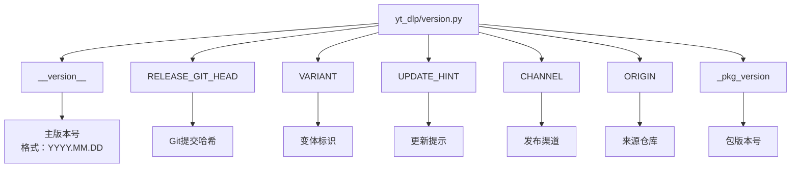
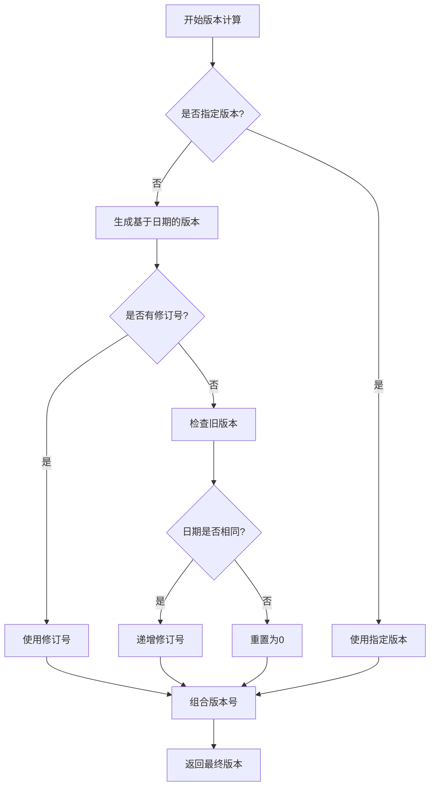
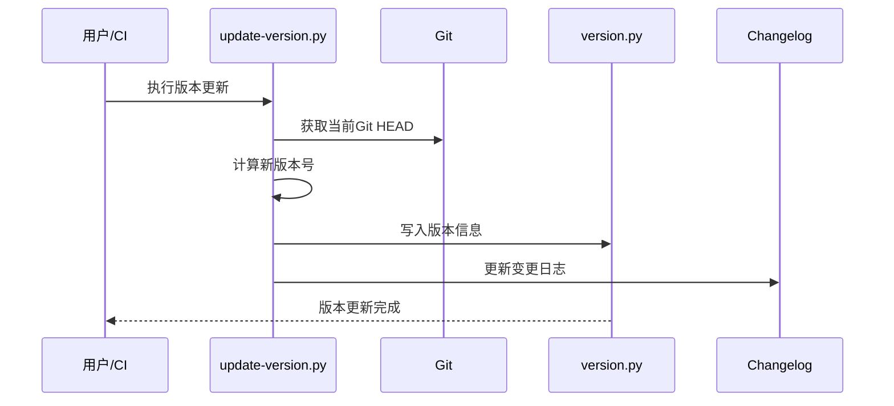
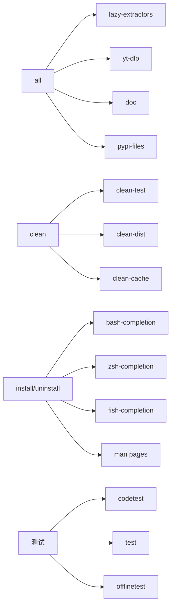
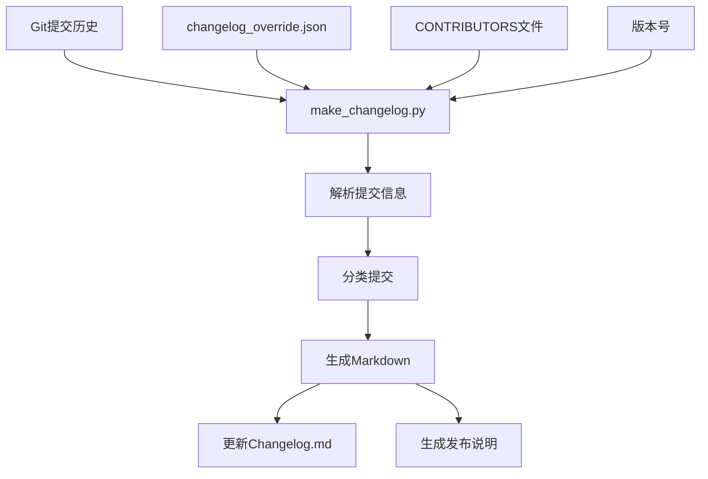
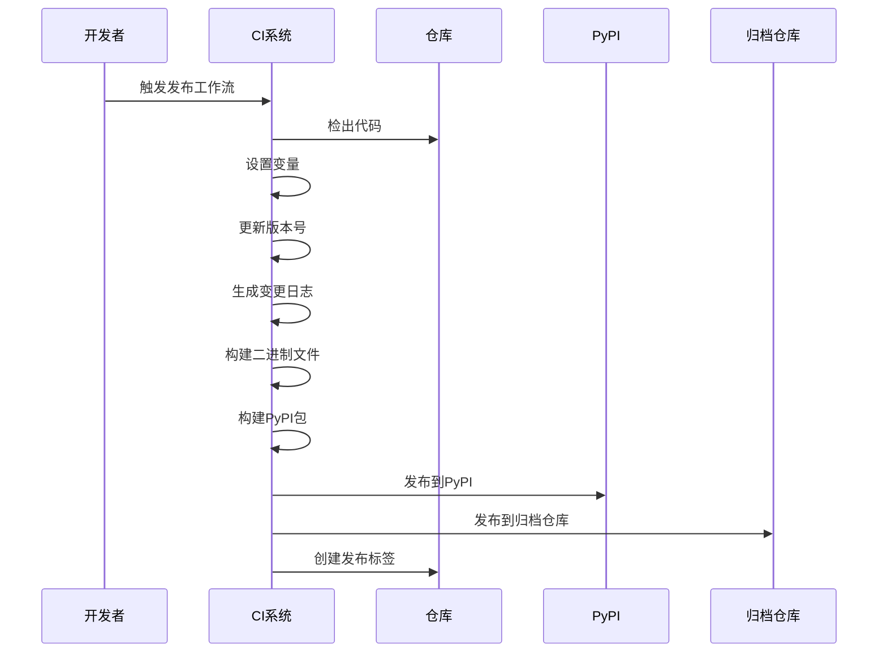
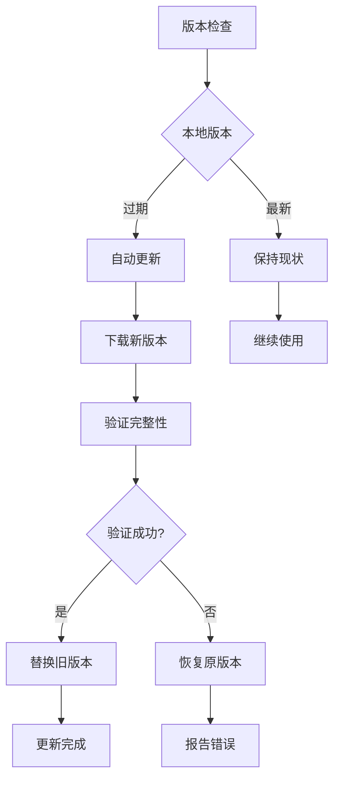

# 发布与版本管理

<cite>
**本文档中引用的文件**
- [yt_dlp/version.py](file://yt_dlp/version.py)
- [Makefile](file://Makefile)
- [devscripts/update-version.py](file://devscripts/update-version.py)
- [devscripts/utils.py](file://devscripts/utils.py)
- [devscripts/make_changelog.py](file://devscripts/make_changelog.py)
- [devscripts/setup_variables.py](file://devscripts/setup_variables.py)
- [devscripts/update_changelog.py](file://devscripts/update_changelog.py)
- [pyproject.toml](file://pyproject.toml)
- [.github/workflows/release.yml](file://.github/workflows/release.yml)
- [Changelog.md](file://Changelog.md)
</cite>

## 目录
1. [简介](#简介)
2. [版本号管理架构](#版本号管理架构)
3. [语义化版本控制](#语义化版本控制)
4. [自动化版本更新流程](#自动化版本更新流程)
5. [构建系统与Makefile](#构建系统与makefile)
6. [变更日志管理系统](#变更日志管理系统)
7. [发布工作流](#发布工作流)
8. [版本兼容性与更新策略](#版本兼容性与更新策略)
9. [降级指南](#降级指南)
10. [最佳实践](#最佳实践)

## 简介

yt-dlp采用了一套完整的发布与版本管理系统，支持自动化版本控制、语义化版本管理、自动化的变更日志生成以及多渠道的发布流程。该系统确保了软件版本的可追溯性、发布的一致性和用户的升级体验。

## 版本号管理架构

### 核心版本文件

yt-dlp的版本管理核心位于`yt_dlp/version.py`文件中，该文件包含了所有必要的版本信息：



**图表来源**
- [yt_dlp/version.py](file://yt_dlp/version.py#L1-L16)

### 版本号结构

版本号采用以下结构：
- **主版本号**：`YYYY.MM.DD`格式，表示发布日期
- **修订版本**：可选的数字后缀，用于同一天内的多次发布
- **包版本号**：包含变体后缀的完整版本标识

**章节来源**
- [yt_dlp/version.py](file://yt_dlp/version.py#L1-L16)

## 语义化版本控制

### 版本号计算逻辑

系统使用智能的版本号计算算法，支持多种版本生成模式：



**图表来源**
- [devscripts/utils.py](file://devscripts/utils.py#L25-L42)

### 支持的版本格式

系统支持以下版本格式：
- **完整版本**：`YYYY.MM.DD.rev`（如：`2025.10.22.1`）
- **仅日期版本**：`YYYY.MM.DD`（如：`2025.10.22`）
- **修订版本**：`rev`（如：`1`）

**章节来源**
- [devscripts/utils.py](file://devscripts/utils.py#L25-L42)

## 自动化版本更新流程

### 版本更新脚本

版本更新通过`devscripts/update-version.py`脚本实现自动化：



**图表来源**
- [devscripts/update-version.py](file://devscripts/update-version.py#L1-L66)

### 版本更新参数

脚本支持以下参数配置：
- `-c, --channel`：更新渠道（默认：`stable`）
- `-r, --origin`：源仓库标识（默认：`local`）
- `-s, --suffix`：包版本后缀（如：`dev`）
- `-o, --output`：输出文件路径（默认：`yt_dlp/version.py`）

**章节来源**
- [devscripts/update-version.py](file://devscripts/update-version.py#L35-L55)

## 构建系统与Makefile

### Makefile目标体系

Makefile定义了完整的构建流程，支持多种构建目标：



**图表来源**
- [Makefile](file://Makefile#L1-L175)

### 关键构建目标

| 目标 | 功能描述 | 输出文件 |
|------|----------|----------|
| `yt-dlp` | 主程序构建 | `yt-dlp` 可执行文件 |
| `lazy-extractors` | 延迟加载提取器 | `yt_dlp/extractor/lazy_extractors.py` |
| `pypi-files` | PyPI分发文件准备 | 多个文档和配置文件 |
| `doc` | 文档生成 | README.md, man pages等 |
| `test` | 完整测试 | 测试结果报告 |

**章节来源**
- [Makefile](file://Makefile#L1-L175)

## 变更日志管理系统

### 变更日志生成架构

变更日志系统通过多个脚本协同工作，实现自动化的变更记录和格式化：



**图表来源**
- [devscripts/make_changelog.py](file://devscripts/make_changelog.py#L1-L509)

### 提交分类系统

系统自动将提交分类到以下组别：

| 组别 | 描述 | 示例 |
|------|------|------|
| `Priority` | 重要变更 | 安全修复、重大功能 |
| `Core` | 核心功能 | 核心逻辑、API变更 |
| `Extractor` | 提取器 | 新增或修改的站点支持 |
| `Downloader` | 下载器 | 下载功能改进 |
| `Postprocessor` | 后处理器 | 音视频处理功能 |
| `Networking` | 网络层 | 网络请求优化 |
| `Misc.` | 其他 | 构建、测试、文档 |

**章节来源**
- [devscripts/make_changelog.py](file://devscripts/make_changelog.py#L20-L50)

### 变更日志格式

变更日志采用层次化格式，支持折叠显示：

```markdown
### 2025.10.22

#### Important changes
- **安全修复**：修复了潜在的安全漏洞

#### Core changes
- **功能增强**：改进了下载性能

#### Extractor changes
- **youtube**: 修复了播放列表提取问题
- **twitter**: 支持新的URL格式

#### Misc. changes
- **build**: 更新了构建脚本
- **test**: 添加了新的测试用例
```

**章节来源**
- [Changelog.md](file://Changelog.md#L1-L100)

## 发布工作流

### GitHub Actions发布流程

发布工作流通过GitHub Actions实现完全自动化：



**图表来源**
- [.github/workflows/release.yml](file://.github/workflows/release.yml#L1-L326)

### 发布配置选项

| 参数 | 类型 | 描述 | 默认值 |
|------|------|------|--------|
| `source` | string | 源更新渠道 | 空 |
| `target` | string | 目标发布渠道 | 空 |
| `version` | string | 版本号 | 自动生成 |
| `prerelease` | boolean | 是否预发布 | false |
| `linux_armv7l` | boolean | 包含ARMv7L构建 | true |

**章节来源**
- [.github/workflows/release.yml](file://.github/workflows/release.yml#L10-L30)

### 多渠道发布支持

系统支持多种发布渠道：
- **稳定版**：`yt-dlp/yt-dlp`主仓库
- **夜间构建**：`yt-dlp/yt-dlp-nightly-builds`
- **主分支构建**：`yt-dlp/yt-dlp-master-builds`
- **自定义归档**：用户自定义的归档仓库

**章节来源**
- [devscripts/setup_variables.py](file://devscripts/setup_variables.py#L15-L25)

## 版本兼容性与更新策略

### Python版本兼容性

根据`pyproject.toml`配置，yt-dlp支持以下Python版本：

| Python版本 | 支持状态 | 最低要求 |
|------------|----------|----------|
| 3.10 | ✅ 推荐 | 最低推荐版本 |
| 3.11 | ✅ 支持 | 完全兼容 |
| 3.12 | ✅ 支持 | 完全兼容 |
| 3.13 | ✅ 支持 | 完全兼容 |
| 3.14 | ✅ 支持 | 实验性支持 |
| PyPy 3.11 | ✅ 支持 | 完全兼容 |

**章节来源**
- [pyproject.toml](file://pyproject.toml#L30-L40)

### 版本更新策略



### 更新检测机制

系统实现了智能的更新检测：
- **版本比较**：自动比较本地版本与远程版本
- **更新提示**：当版本严重过时时显示警告
- **自动下载**：支持自动下载和安装新版本

**章节来源**
- [yt_dlp/update.py](file://yt_dlp/update.py#L322-L349)

## 降级指南

### 版本降级场景

在某些情况下可能需要降级到之前的版本：

#### 场景1：新版本存在严重问题
```bash
# 查看可用的历史版本
yt-dlp --list-versions

# 降级到特定版本
yt-dlp --version 2025.09.26
```

#### 场景2：功能不兼容
```bash
# 恢复到已知稳定的版本
yt-dlp --version 2025.08.27
```

### 降级注意事项

1. **备份配置**：降级前备份用户配置文件
2. **检查依赖**：确认系统依赖兼容性
3. **测试功能**：降级后验证核心功能正常
4. **记录原因**：记录降级原因便于后续决策

### 回滚机制

系统提供了完整的回滚支持：
- **版本锁定**：可以锁定特定版本
- **配置备份**：自动备份配置文件
- **快速恢复**：一键恢复到上一个版本

## 最佳实践

### 开发阶段最佳实践

1. **版本规划**
   - 使用语义化版本命名
   - 明确版本发布计划
   - 维护清晰的变更日志

2. **自动化测试**
   - 在版本发布前运行完整测试
   - 验证不同平台的兼容性
   - 检查依赖项的稳定性

3. **文档维护**
   - 及时更新变更日志
   - 维护版本迁移指南
   - 提供清晰的发布说明

### 发布阶段最佳实践

1. **质量保证**
   - 进行充分的功能测试
   - 验证性能指标
   - 检查安全漏洞

2. **发布流程**
   - 使用自动化发布流程
   - 验证所有构建产物
   - 确保文档完整性

3. **监控与反馈**
   - 监控发布后的用户反馈
   - 跟踪问题报告
   - 准备紧急修复方案

### 用户管理最佳实践

1. **版本选择**
   - 根据需求选择合适的版本
   - 考虑稳定性与功能需求
   - 评估升级成本

2. **升级策略**
   - 制定定期升级计划
   - 在测试环境中验证
   - 准备回滚方案

3. **维护建议**
   - 定期检查版本更新
   - 保持配置文件备份
   - 关注社区反馈

**章节来源**
- [devscripts/setup_variables.py](file://devscripts/setup_variables.py#L1-L158)