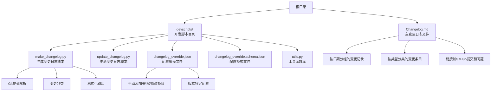
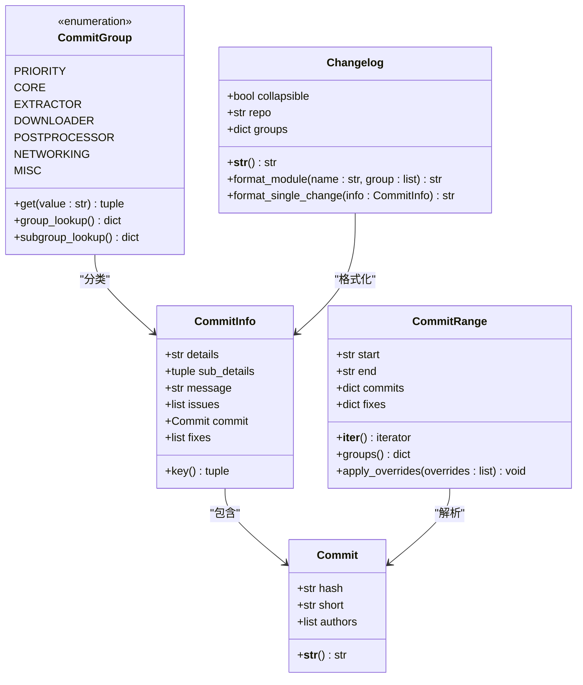
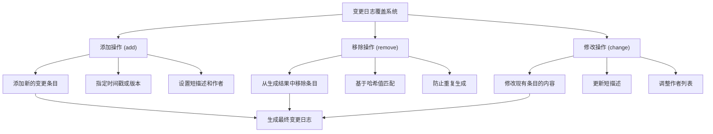
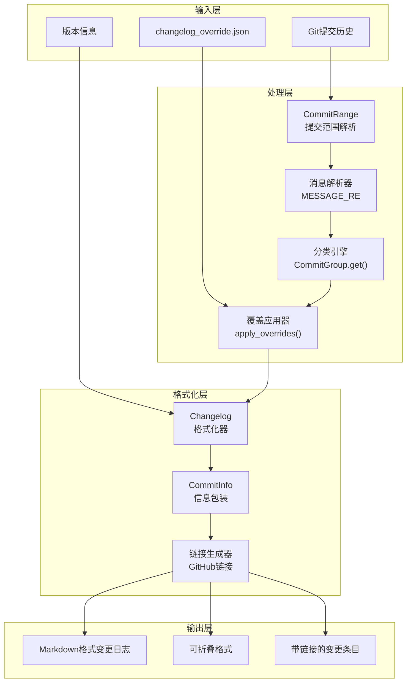
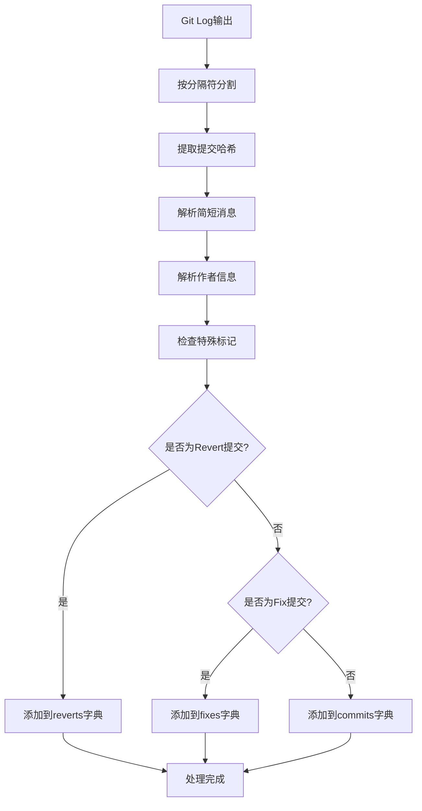
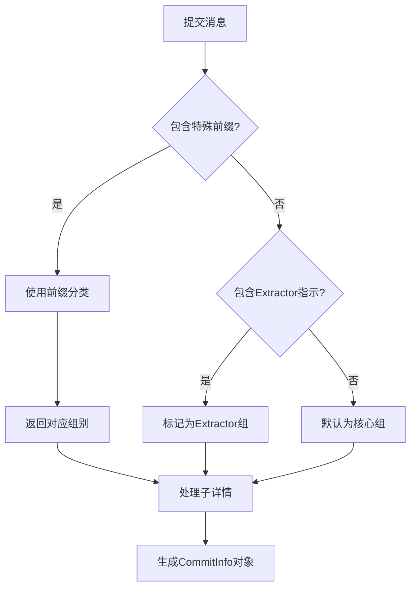
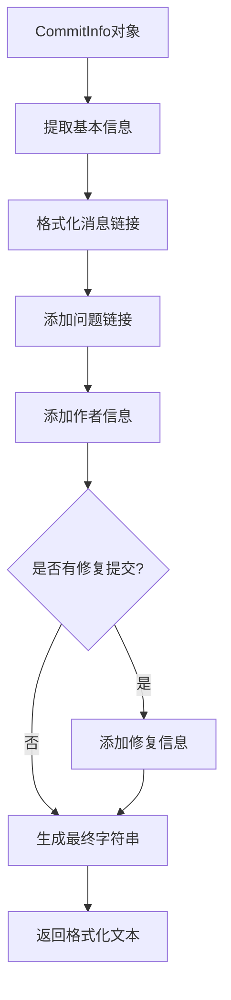

# 变更日志管理

<cite>
**本文档中引用的文件**
- [Changelog.md](file://Changelog.md)
- [devscripts/make_changelog.py](file://devscripts/make_changelog.py)
- [devscripts/update_changelog.py](file://devscripts/update_changelog.py)
- [devscripts/changelog_override.json](file://devscripts/changelog_override.json)
- [devscripts/changelog_override.schema.json](file://devscripts/changelog_override.schema.json)
- [devscripts/utils.py](file://devscripts/utils.py)
- [CONTRIBUTING.md](file://CONTRIBUTING.md)
</cite>

## 目录
1. [简介](#简介)
2. [项目结构概览](#项目结构概览)
3. [核心组件分析](#核心组件分析)
4. [架构概览](#架构概览)
5. [详细组件分析](#详细组件分析)
6. [变更日志格式规范](#变更日志格式规范)
7. [最佳实践指南](#最佳实践指南)
8. [故障排除指南](#故障排除指南)
9. [结论](#结论)

## 简介

yt-dlp项目采用了一套完善的变更日志管理系统，通过自动化脚本和手动配置相结合的方式，确保每次发布都能生成清晰、一致且易于理解的变更日志。该系统主要由两个核心脚本组成：`make_changelog.py`用于生成新的变更日志条目，`update_changelog.py`用于更新现有的变更日志文件。

变更日志管理系统的核心目标是：
- 自动化处理Git提交信息的解析和格式化
- 提供灵活的自定义配置机制
- 确保变更日志的一致性和可读性
- 支持多种类型的变更分类和标记

## 项目结构概览

yt-dlp的变更日志管理系统主要分布在以下目录结构中：



**图表来源**
- [Changelog.md](file://Changelog.md#L1-L50)
- [devscripts/make_changelog.py](file://devscripts/make_changelog.py#L1-L50)
- [devscripts/update_changelog.py](file://devscripts/update_changelog.py#L1-L29)

**章节来源**
- [Changelog.md](file://Changelog.md#L1-L100)
- [devscripts/make_changelog.py](file://devscripts/make_changelog.py#L1-L100)

## 核心组件分析

### 变更日志生成器 (make_changelog.py)

变更日志生成器是系统的核心组件，负责从Git提交历史中提取和格式化变更信息。它包含以下关键功能：

#### 主要类和数据结构



**图表来源**
- [devscripts/make_changelog.py](file://devscripts/make_changelog.py#L25-L115)
- [devscripts/make_changelog.py](file://devscripts/make_changelog.py#L117-L140)
- [devscripts/make_changelog.py](file://devscripts/make_changelog.py#L142-L170)

#### 提交分类机制

系统通过前缀识别机制自动将提交分类到不同的变更类型：

| 前缀 | 分类 | 描述 |
|------|------|------|
| `[priority]` | 重要变更 | 系统级别的重大更新或安全修复 |
| `[core]` | 核心功能 | 核心库和基础功能的改进 |
| `[ie]` | 提取器 | 新增或改进的网站支持 |
| `[fd]` | 下载器 | 下载功能的增强 |
| `[pp]` | 后处理器 | 音视频处理功能的改进 |
| `[misc]` | 杂项 | 构建、测试、文档等辅助工作 |

**章节来源**
- [devscripts/make_changelog.py](file://devscripts/make_changelog.py#L25-L115)
- [devscripts/make_changelog.py](file://devscripts/make_changelog.py#L172-L250)

### 配置覆盖系统

变更日志覆盖系统允许开发者手动干预自动生成的变更日志，提供三种操作类型：

#### 覆盖操作类型



**图表来源**
- [devscripts/changelog_override.json](file://devscripts/changelog_override.json#L1-L50)
- [devscripts/changelog_override.schema.json](file://devscripts/changelog_override.schema.json#L1-L50)

**章节来源**
- [devscripts/changelog_override.json](file://devscripts/changelog_override.json#L1-L313)
- [devscripts/changelog_override.schema.json](file://devscripts/changelog_override.schema.json#L1-L97)

## 架构概览

变更日志管理系统采用分层架构设计，从底层的Git提交解析到顶层的Markdown输出，形成了一个完整的处理流水线：



**图表来源**
- [devscripts/make_changelog.py](file://devscripts/make_changelog.py#L250-L350)
- [devscripts/make_changelog.py](file://devscripts/make_changelog.py#L350-L450)

## 详细组件分析

### Git提交解析器

提交解析器是系统的基础组件，负责从Git命令输出中提取有用的信息：

#### 解析规则



**图表来源**
- [devscripts/make_changelog.py](file://devscripts/make_changelog.py#L350-L420)

#### 消息格式匹配

系统使用正则表达式模式来解析提交消息：

| 组件 | 正则表达式模式 | 示例 |
|------|----------------|------|
| 前缀 | `\[(?P<prefix>[^\]]+)\]` | `[core]` |
| 子详情 | `(?P<sub_details>`?`[\w.-]+`?`: )` | `ie/youtube:` |
| 主消息 | `(?P<message>.+?)` | `Fix extractor` |
| 问题链接 | `\ \((?P<issues>\#\d+(?:,\ \#\d+)*)\)` | `(#123, #456)` |

**章节来源**
- [devscripts/make_changelog.py](file://devscripts/make_changelog.py#L250-L350)

### 变更分类系统

变更分类系统通过智能识别机制将提交归类到合适的类别中：

#### 分类优先级



**图表来源**
- [devscripts/make_changelog.py](file://devscripts/make_changelog.py#L420-L480)

**章节来源**
- [devscripts/make_changelog.py](file://devscripts/make_changelog.py#L420-L509)

### 格式化引擎

格式化引擎负责将结构化的变更信息转换为美观的Markdown格式：

#### 输出格式规范



**图表来源**
- [devscripts/make_changelog.py](file://devscripts/make_changelog.py#L172-L220)

**章节来源**
- [devscripts/make_changelog.py](file://devscripts/make_changelog.py#L172-L250)

## 变更日志格式规范

### 标准格式结构

yt-dlp的变更日志遵循严格的格式规范，确保所有条目的一致性：

#### 版本标题格式

```
### 2025.10.22

#### Important changes
- [变更描述](链接) ([#问题编号](链接)) by [@作者](链接)

#### 核心变更
- [变更描述](链接) ([#问题编号](链接)) by [@作者](链接)

#### 提取器变更
- **网站名称**: [变更描述](链接) ([#问题编号](链接)) by [@作者](链接)

#### 杂项变更
- **构建**: [变更描述](链接) ([#问题编号](链接)) by [@作者](链接)
```

#### 变更条目格式

每个变更条目都包含以下元素：
- **链接到GitHub提交**：提供直接访问完整提交信息的链接
- **问题追踪链接**：关联相关的Issue或PR
- **作者信息**：显示贡献者的GitHub用户名
- **修复信息**：如果包含修复其他提交的问题，会显示修复的提交

### 变更类型分类

系统支持以下主要变更类型：

| 类型 | 标题 | 用途 | 示例 |
|------|------|------|------|
| Priority | 重要变更 | 系统级别重大更新 | Python版本升级、安全修复 |
| Core | 核心变更 | 核心功能改进 | 新增选项、性能优化 |
| Extractor | 提取器变更 | 网站支持更新 | 新增网站、修复提取器 |
| Downloader | 下载器变更 | 下载功能改进 | 新增下载协议、错误处理 |
| Postprocessor | 后处理器变更 | 音视频处理改进 | 新增后处理功能 |
| Networking | 网络变更 | 网络请求处理 | 请求头、代理支持 |
| Misc | 杂项变更 | 辅助工作 | 构建、测试、文档 |

**章节来源**
- [Changelog.md](file://Changelog.md#L1-L100)

## 最佳实践指南

### 提交消息编写规范

为了确保变更日志生成的质量，贡献者应该遵循以下提交消息编写规范：

#### 推荐的提交消息格式

```
[类别] 简短描述 (#问题编号)
```

#### 类别前缀推荐

- **[priority]**：重要系统更新
- **[core]**：核心功能改进
- **[ie]**：提取器相关
- **[fd]**：下载器相关
- **[pp]**：后处理器相关
- **[misc]**：杂项工作

#### 示例提交消息

```
[core] Add --preset-alias option (#12839)
[ie/youtube] Fix premium formats extraction (#13586)
[fd/hls] Do not fall back to ffmpeg when native is required (#13655)
[misc] Bump PyInstaller to v6.13.0 (#13082)
```

### 变更日志维护流程

#### 日常维护步骤

1. **代码审查和合并**：确保所有提交都符合规范
2. **运行变更日志生成脚本**：使用`python devscripts/make_changelog.py`
3. **检查生成结果**：验证格式和链接的正确性
4. **应用覆盖配置**：根据需要调整生成的条目
5. **更新主变更日志**：使用`python devscripts/update_changelog.py`

#### 发布前检查清单

- [ ] 所有重要变更都已包含在变更日志中
- [ ] 所有链接都能正常访问
- [ ] 作者信息准确无误
- [ ] 格式统一规范
- [ ] 包含必要的安全警告

**章节来源**
- [CONTRIBUTING.md](file://CONTRIBUTING.md#L1-L200)

### 自定义配置最佳实践

#### 覆盖文件使用指南

覆盖文件应该只在必要时使用，避免过度干预自动生成的流程：

```json
{
    "action": "change",
    "when": "commit-hash",
    "short": "[类别] 修改后的描述",
    "authors": ["作者名"]
}
```

#### 使用场景

- **修正错误分类**：当自动分类不准确时
- **补充缺失信息**：当自动生成的信息不足时
- **格式化调整**：改善输出的可读性
- **移除重复条目**：避免同一变更被多次记录

**章节来源**
- [devscripts/changelog_override.json](file://devscripts/changelog_override.json#L1-L100)

## 故障排除指南

### 常见问题及解决方案

#### 问题1：生成的变更日志格式不正确

**症状**：生成的Markdown格式混乱，链接无效

**原因**：提交消息格式不符合预期

**解决方案**：
1. 检查提交消息是否包含正确的前缀
2. 确保消息包含问题编号格式
3. 验证作者信息格式

#### 问题2：某些提交未被包含

**症状**：期望的变更没有出现在生成的日志中

**原因**：提交被跳过或过滤

**解决方案**：
1. 检查是否为Release提交或版本更新
2. 查看日志中的调试信息
3. 使用覆盖配置手动添加

#### 问题3：链接指向错误的提交

**症状**：生成的链接指向了错误的提交

**原因**：提交哈希冲突或覆盖配置错误

**解决方案**：
1. 验证提交哈希的唯一性
2. 检查覆盖配置中的when字段
3. 确认提交确实存在于指定范围内

### 调试技巧

#### 启用详细日志

```bash
python devscripts/make_changelog.py -v
```

这将显示详细的解析过程和调试信息，帮助定位问题。

#### 测试覆盖配置

```bash
python devscripts/make_changelog.py --no-override
```

先生成不应用覆盖配置的结果，然后对比差异。

**章节来源**
- [devscripts/make_changelog.py](file://devscripts/make_changelog.py#L480-L509)

## 结论

yt-dlp的变更日志管理系统是一个高度自动化且灵活的解决方案，它成功地平衡了人工控制和自动化处理的需求。通过合理的架构设计和严格的标准规范，该系统能够：

- **保证一致性**：所有变更条目都遵循相同的格式规范
- **提高效率**：自动化处理大部分重复性工作
- **保持灵活性**：通过覆盖配置应对特殊情况
- **便于维护**：清晰的代码结构和文档

对于贡献者而言，理解这套系统的运作机制不仅有助于编写符合规范的提交消息，还能更好地参与项目的变更日志维护工作。随着项目的持续发展，这套系统将继续发挥重要作用，确保用户能够获得清晰、准确的变更信息。

建议贡献者在参与项目时：
1. 遵循提交消息编写规范
2. 理解变更分类机制
3. 了解覆盖配置的使用场景
4. 积极参与变更日志的审查和维护

这样不仅能提高个人贡献的质量，也能为整个项目的可维护性和用户体验做出重要贡献。