# 版本兼容性与更新策略

<cite>
**本文档引用的文件**
- [yt_dlp/version.py](file://yt_dlp/version.py)
- [Changelog.md](file://Changelog.md)
- [devscripts/make_changelog.py](file://devscripts/make_changelog.py)
- [devscripts/update-version.py](file://devscripts/update-version.py)
- [devscripts/changelog_override.json](file://devscripts/changelog_override.json)
- [pyproject.toml](file://pyproject.toml)
- [yt_dlp/update.py](file://yt_dlp/update.py)
- [devscripts/utils.py](file://devscripts/utils.py)
- [yt_dlp/compat/compat_utils.py](file://yt_dlp/compat/compat_utils.py)
</cite>

## 目录
1. [简介](#简介)
2. [语义化版本管理](#语义化版本管理)
3. [版本兼容性承诺](#版本兼容性承诺)
4. [更新策略与渠道](#更新策略与渠道)
5. [变更日志管理系统](#变更日志管理系统)
6. [API变更处理机制](#api变更处理机制)
7. [用户升级指南](#用户升级指南)
8. [向后兼容性维护](#向后兼容性维护)
9. [故障排除与最佳实践](#故障排除与最佳实践)
10. [总结](#总结)

## 简介

yt-dlp采用严格的语义化版本控制（SemVer）策略，确保用户能够清晰了解版本间的兼容性变化，并提供灵活的更新机制。本文档详细说明了yt-dlp的版本管理原则、更新策略、变更日志生成机制以及向后兼容性保证。

## 语义化版本管理

### 版本号格式

yt-dlp遵循语义化版本控制规范，版本号格式为：`YYYY.MM.DD[.revision]`

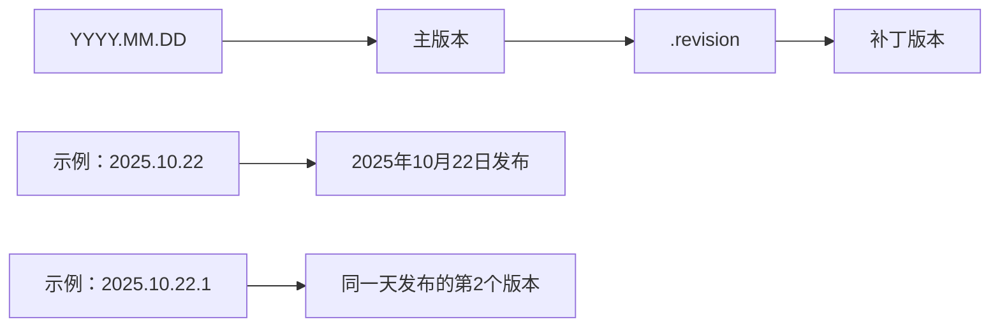

**图表来源**
- [yt_dlp/version.py](file://yt_dlp/version.py#L3-L15)
- [devscripts/utils.py](file://devscripts/utils.py#L25-L40)

### 版本计算逻辑

版本号的生成遵循以下规则：

1. **日期基础版本**：使用UTC时间的`YYYY.MM.DD`格式
2. **修订号递增**：同一天内发布的新版本会自动递增修订号
3. **手动指定**：支持通过命令行参数指定完整版本号

**章节来源**
- [devscripts/utils.py](file://devscripts/utils.py#L25-L40)
- [devscripts/update-version.py](file://devscripts/update-version.py#L45-L65)

## 版本兼容性承诺

### 向后兼容性原则

yt-dlp严格遵守以下兼容性承诺：

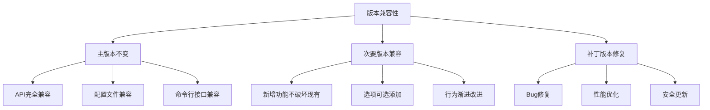

### Python版本支持策略

| Python版本 | 支持状态 | 最低要求 | 推荐版本 |
|------------|----------|----------|----------|
| 3.10+ | ✅ 完全支持 | ✅ 必需 | ✅ 推荐 |
| 3.9 | ⚠️ 已废弃 | ❌ 不推荐 | ❌ 不推荐 |
| 3.8及以下 | ❌ 不支持 | ❌ 不支持 | ❌ 不支持 |

**章节来源**
- [pyproject.toml](file://pyproject.toml#L25-L35)
- [yt_dlp/update.py](file://yt_dlp/update.py#L200-L220)

## 更新策略与渠道

### 发布渠道体系

yt-dlp提供三个独立的发布渠道：

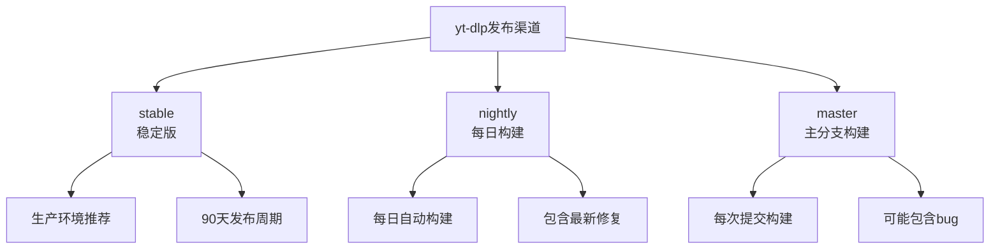

**图表来源**
- [yt_dlp/update.py](file://yt_dlp/update.py#L30-L35)
- [yt_dlp/update.py](file://yt_dlp/update.py#L280-L300)

### 更新机制详解

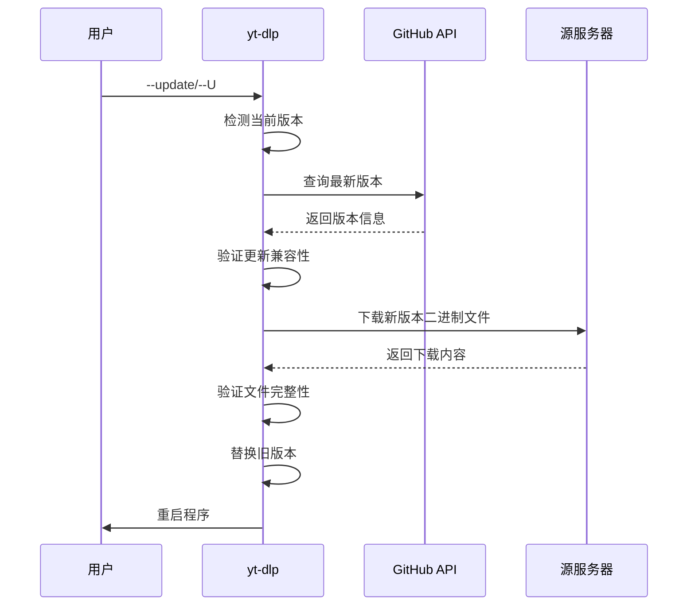

**图表来源**
- [yt_dlp/update.py](file://yt_dlp/update.py#L400-L500)

### 自动更新限制

某些情况下自动更新被禁用：

| 构建类型 | 更新状态 | 原因 |
|----------|----------|------|
| 源码运行 | ❌ 不支持 | 使用Git拉取更新 |
| 手动构建 | ❌ 不支持 | 包管理器更新 |
| py2exe | ❌ 不支持 | 已停止官方支持 |
| 未打包执行 | ❌ 不支持 | 需要重新下载 |

**章节来源**
- [yt_dlp/update.py](file://yt_dlp/update.py#L180-L200)

## 变更日志管理系统

### 自动化生成机制

变更日志通过自动化脚本生成，确保准确性和一致性：

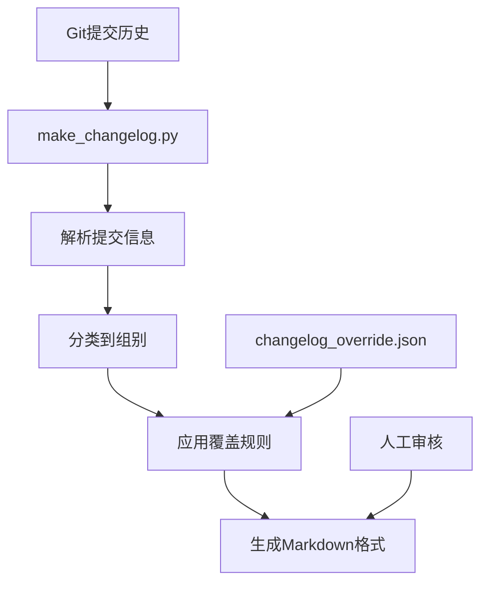

**图表来源**
- [devscripts/make_changelog.py](file://devscripts/make_changelog.py#L450-L500)

### 提交分类系统

变更按以下类别进行组织：

| 类别 | 标识符 | 描述 |
|------|--------|------|
| Priority | `[priority]` | 重要变更通知 |
| Core | `core` | 核心功能更新 |
| Extractor | `ie` | 提取器更新 |
| Downloader | `fd` | 下载器更新 |
| Postprocessor | `pp` | 后处理器更新 |
| Networking | `rh` | 网络层更新 |
| Misc. | 其他 | 杂项变更 |

**章节来源**
- [devscripts/make_changelog.py](file://devscripts/make_changelog.py#L20-L50)

### 覆盖规则系统

管理员可以通过JSON配置文件精确控制变更日志内容：

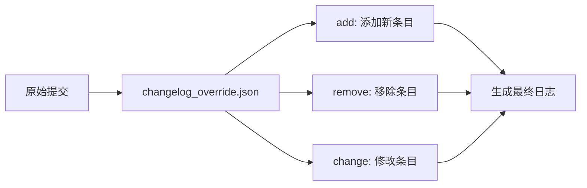

**图表来源**
- [devscripts/make_changelog.py](file://devscripts/make_changelog.py#L420-L450)
- [devscripts/changelog_override.json](file://devscripts/changelog_override.json#L1-L50)

**章节来源**
- [devscripts/make_changelog.py](file://devscripts/make_changelog.py#L420-L500)

## API变更处理机制

### 弃用策略

yt-dlp采用渐进式弃用策略，确保用户有足够时间迁移：

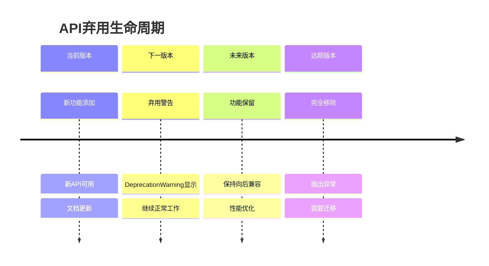

### 兼容性模块系统

yt-dlp使用增强模块系统处理API变更：

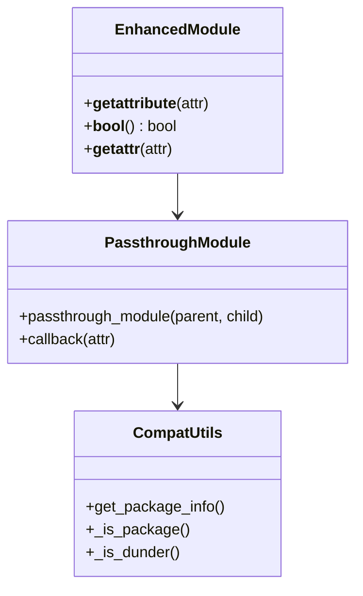

**图表来源**
- [yt_dlp/compat/compat_utils.py](file://yt_dlp/compat/compat_utils.py#L25-L80)

**章节来源**
- [yt_dlp/compat/compat_utils.py](file://yt_dlp/compat/compat_utils.py#L1-L84)

## 用户升级指南

### 升级前检查清单

在执行升级前，请完成以下检查：

1. **备份配置文件**
   ```bash
   cp ~/.config/yt-dlp/config ~/.config/yt-dlp/config.backup
   ```

2. **验证当前版本**
   ```bash
   yt-dlp --version
   ```

3. **检查更新可用性**
   ```bash
   yt-dlp --update-to latest
   ```

### 安全更新处理

对于安全相关的更新，建议立即执行：

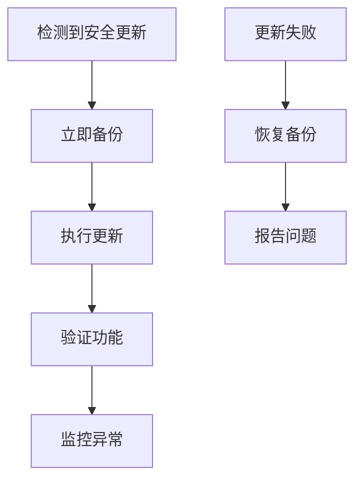

### 功能更新策略

对于非安全更新，建议采用渐进式部署：

| 更新类型 | 推荐策略 | 时间安排 |
|----------|----------|----------|
| Bug修复 | 立即更新 | 24小时内 |
| 性能优化 | 周末更新 | 1周内 |
| 新功能 | 测试环境验证 | 1个月内 |
| 重大重构 | 分阶段部署 | 3个月内 |

### 回滚程序

如果更新导致问题，可以执行回滚：

```bash
# 查看可用版本
yt-dlp --update-to stable@2025.09.26

# 或使用特定版本
yt-dlp --update-to 2025.09.26
```

**章节来源**
- [yt_dlp/update.py](file://yt_dlp/update.py#L500-L600)

## 向后兼容性维护

### 版本锁定机制

yt-dlp使用更新规范文件实现版本锁定：

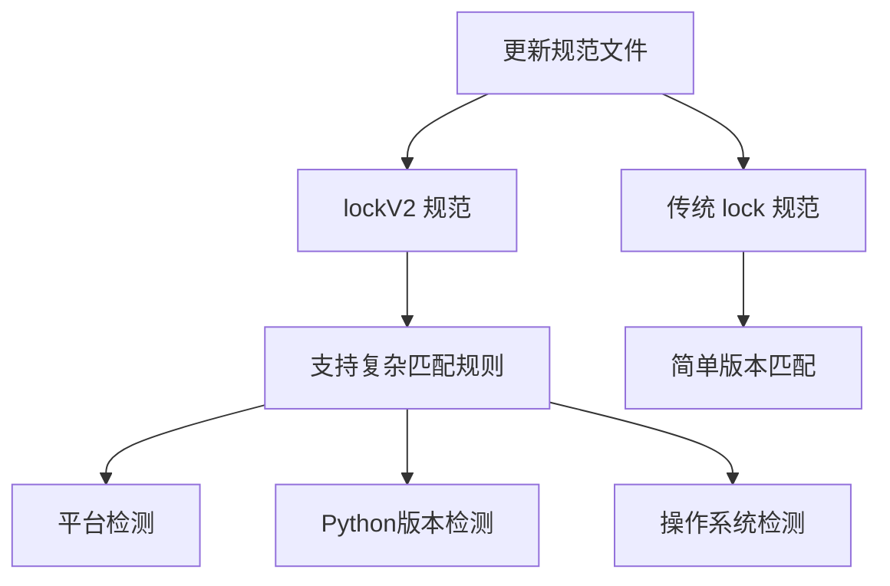

### 平台兼容性矩阵

不同平台的兼容性限制：

| 平台 | 最低Python版本 | 操作系统限制 | 特殊说明 |
|------|----------------|--------------|----------|
| Windows x86 | 3.8 | Windows 7+ | 3.9开始支持 |
| Windows x64 | 3.8 | Windows 7+ | 3.9开始支持 |
| macOS | 3.8 | macOS 10.15+ | 早期版本已停止支持 |
| Linux | 3.8 | glibc 2.31+ | ARM架构特殊处理 |

**章节来源**
- [yt_dlp/update.py](file://yt_dlp/update.py#L350-L400)

### 配置文件兼容性

配置文件的向后兼容性保证：

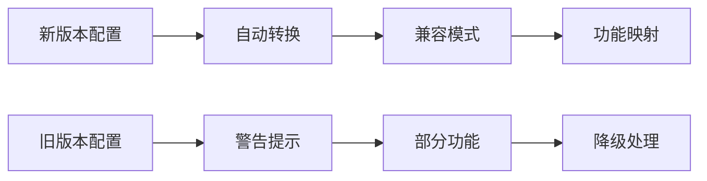

## 故障排除与最佳实践

### 常见更新问题

1. **权限不足**
   ```
   错误：Unable to write to /usr/local/bin/yt-dlp
   解决：使用sudo或移动到用户目录
   ```

2. **网络连接问题**
   ```
   错误：Unable to fetch update information
   解决：检查防火墙设置或使用代理
   ```

3. **文件损坏**
   ```
   错误：Checksum verification failed
   解决：重新下载或使用--no-checksum
   ```

### 最佳实践建议

1. **定期检查更新**
   ```bash
   # 设置定时任务
   echo "0 2 * * * yt-dlp --update" >> ~/.crontab
   crontab ~/.crontab
   ```

2. **测试新版本**
   ```bash
   # 在测试环境中验证
   yt-dlp --update-to nightly --dry-run
   ```

3. **监控更新日志**
   ```bash
   # 查看最近更新
   yt-dlp --update-to latest --verbose
   ```

### 性能优化建议

1. **选择合适的更新渠道**
   - 生产环境：stable
   - 开发测试：nightly
   - 实验性功能：master

2. **避免频繁更新**
   - 稳定版本：每90天检查一次
   - 安全更新：立即处理
   - 功能更新：评估后再部署

**章节来源**
- [yt_dlp/update.py](file://yt_dlp/update.py#L550-L610)

## 总结

yt-dlp的版本兼容性与更新策略体现了对用户需求的深度理解和对软件质量的严格要求。通过语义化版本控制、自动化变更日志生成、渐进式弃用策略和多渠道更新机制，yt-dlp为用户提供了可靠、灵活且安全的更新体验。

关键要点：
- **严格的向后兼容性**：确保现有配置和脚本的稳定性
- **灵活的更新策略**：满足不同用户场景的需求
- **自动化工具链**：提高开发效率和发布质量
- **完善的兼容性保证**：覆盖各种平台和Python版本

这种设计不仅保护了现有用户的利益，也为未来的功能扩展奠定了坚实的基础。随着项目的持续发展，这些机制将继续发挥重要作用，确保yt-dlp始终处于技术前沿的同时保持稳定可靠。