# 版本发布流程

<cite>
**本文档中引用的文件**
- [Makefile](file://Makefile)
- [devscripts/update-version.py](file://devscripts/update-version.py)
- [devscripts/make_changelog.py](file://devscripts/make_changelog.py)
- [devscripts/utils.py](file://devscripts/utils.py)
- [devscripts/run_tests.py](file://devscripts/run_tests.py)
- [bundle/docker/compose.yml](file://bundle/docker/compose.yml)
- [bundle/pyinstaller.py](file://bundle/pyinstaller.py)
- [bundle/docker/linux/Dockerfile](file://bundle/docker/linux/Dockerfile)
- [bundle/docker/linux/build.sh](file://bundle/docker/linux/build.sh)
- [bundle/docker/linux/verify.sh](file://bundle/docker/linux/verify.sh)
- [pyproject.toml](file://pyproject.toml)
- [yt_dlp/version.py](file://yt_dlp/version.py)
- [Changelog.md](file://Changelog.md)
</cite>

## 目录
1. [简介](#简介)
2. [项目结构概览](#项目结构概览)
3. [版本发布流程架构](#版本发布流程架构)
4. [核心组件分析](#核心组件分析)
5. [详细发布流程](#详细发布流程)
6. [Docker容器化构建](#docker容器化构建)
7. [质量保证措施](#质量保证措施)
8. [发布部署流程](#发布部署流程)
9. [故障排除指南](#故障排除指南)
10. [总结](#总结)

## 简介

yt-dlp是一个功能丰富的命令行音频/视频下载器，其版本发布流程采用高度自动化的多阶段构建系统。该流程涵盖了从代码提交到正式发布的完整生命周期，包括版本号管理、构建打包、Docker镜像生成、测试验证和发布部署等关键环节。

本文档基于Makefile中的构建目标和devscripts目录下的自动化脚本，系统性地说明了yt-dlp的版本发布工作流，为开发者提供全面的操作指南。

## 项目结构概览

yt-dlp项目采用模块化的组织结构，主要包含以下关键目录：

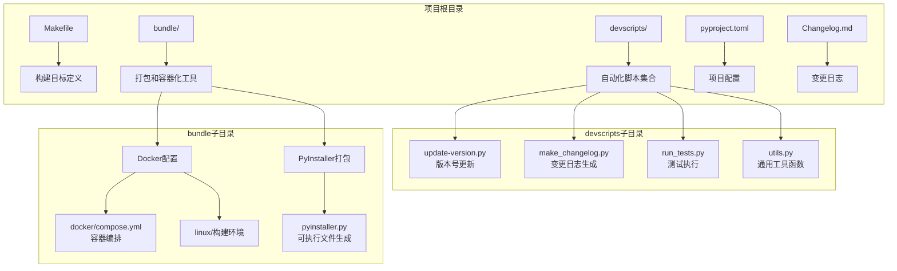

**图表来源**
- [Makefile](file://Makefile#L1-L175)
- [devscripts/update-version.py](file://devscripts/update-version.py#L1-L66)
- [bundle/docker/compose.yml](file://bundle/docker/compose.yml#L1-L179)

**章节来源**
- [Makefile](file://Makefile#L1-L175)
- [devscripts/update-version.py](file://devscripts/update-version.py#L1-L66)

## 版本发布流程架构

yt-dlp的版本发布流程采用分层架构设计，确保每个阶段都有明确的责任和质量控制点：

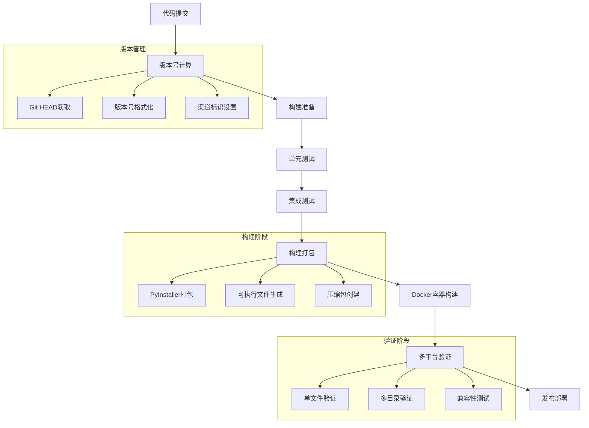

**图表来源**
- [devscripts/update-version.py](file://devscripts/update-version.py#L15-L65)
- [bundle/pyinstaller.py](file://bundle/pyinstaller.py#L20-L142)
- [bundle/docker/linux/verify.sh](file://bundle/docker/linux/verify.sh#L1-L52)

## 核心组件分析

### 版本号管理系统

版本号管理系统是发布流程的核心组件，负责维护软件版本的一致性和可追溯性：

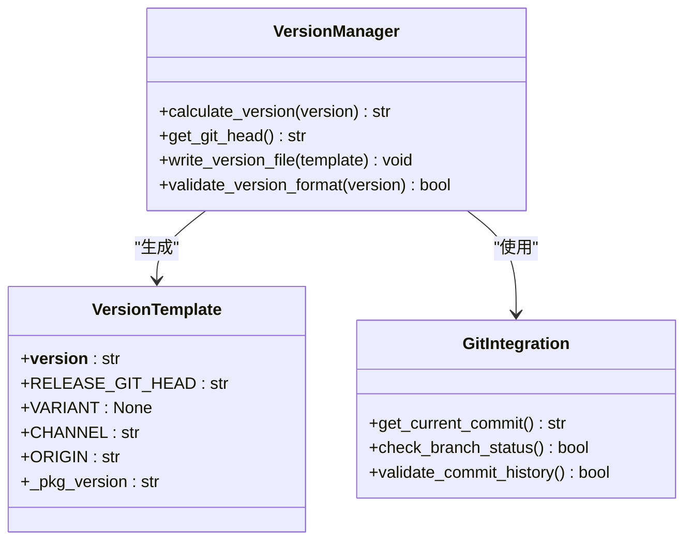

**图表来源**
- [devscripts/update-version.py](file://devscripts/update-version.py#L15-L65)
- [devscripts/utils.py](file://devscripts/utils.py#L20-L40)

**章节来源**
- [devscripts/update-version.py](file://devscripts/update-version.py#L15-L65)
- [devscripts/utils.py](file://devscripts/utils.py#L20-L40)

### 构建自动化系统

构建自动化系统通过Makefile和相关脚本实现复杂的构建任务：

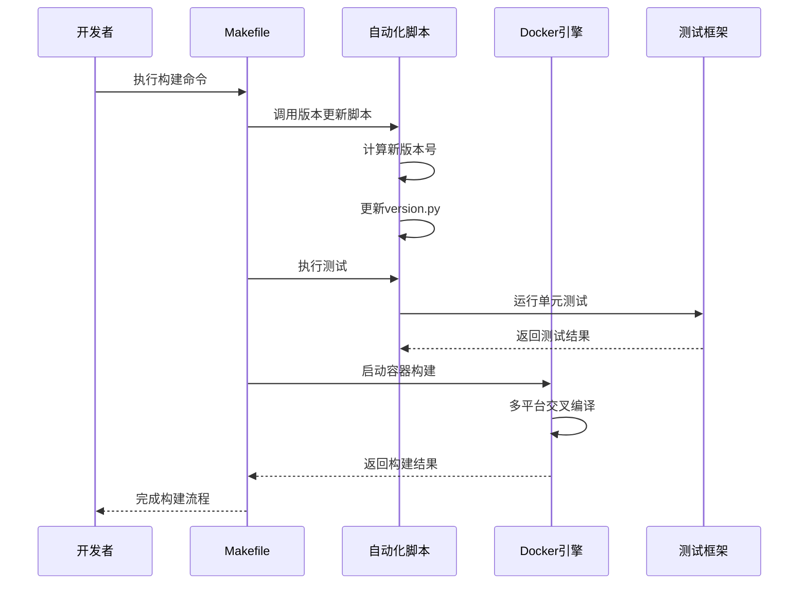

**图表来源**
- [Makefile](file://Makefile#L1-L175)
- [bundle/docker/linux/build.sh](file://bundle/docker/linux/build.sh#L1-L49)

**章节来源**
- [Makefile](file://Makefile#L1-L175)
- [bundle/docker/linux/build.sh](file://bundle/docker/linux/build.sh#L1-L49)

## 详细发布流程

### 第一阶段：版本号更新

版本号更新是发布流程的第一步，涉及多个关键操作：

#### 1.1 版本号计算逻辑

版本号计算遵循特定的规则和格式：

| 组件 | 描述 | 示例 |
|------|------|------|
| 基础日期 | YYYY.MM.DD格式的当前日期 | 2025.10.22 |
| 修订号 | 当天的递增版本号 | 0, 1, 2... |
| 渠道标识 | 发布渠道类型 | stable, beta, alpha |
| 源码标识 | 来源仓库信息 | yt-dlp/yt-dlp |

#### 1.2 版本文件生成

版本文件生成过程包括以下步骤：

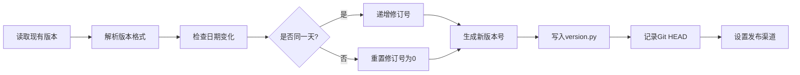

**图表来源**
- [devscripts/utils.py](file://devscripts/utils.py#L20-L40)
- [devscripts/update-version.py](file://devscripts/update-version.py#L40-L65)

#### 1.3 版本号参数配置

版本号更新支持多种命令行参数：

| 参数 | 类型 | 默认值 | 描述 |
|------|------|--------|------|
| -c, --channel | 字符串 | stable | 发布渠道标识 |
| -r, --origin | 字符串 | local | 源码仓库标识 |
| -s, --suffix | 字符串 | 空 | 版本后缀 |
| -o, --output | 字符串 | yt_dlp/version.py | 输出文件路径 |
| version | 字符串 | 自动生成 | 指定版本号 |

**章节来源**
- [devscripts/update-version.py](file://devscripts/update-version.py#L40-L65)
- [devscripts/utils.py](file://devscripts/utils.py#L20-L40)

### 第二阶段：构建准备工作

构建准备工作包括清理环境、依赖安装和资源准备：

#### 2.1 环境清理

Makefile提供了完整的清理机制：

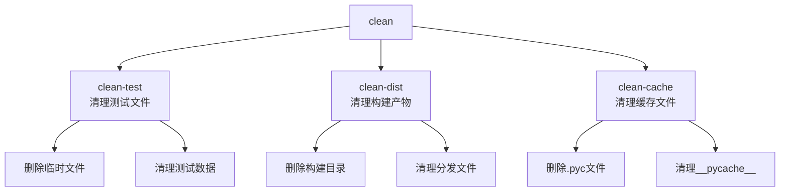

**图表来源**
- [Makefile](file://Makefile#L15-L25)

#### 2.2 依赖管理和安装

项目使用Hatch作为构建系统，支持多种依赖配置：

| 依赖类别 | 包含的包 | 用途 |
|----------|----------|------|
| 默认依赖 | brotli, certifi, mutagen | 核心功能 |
| curl-cffi | curl-cffi | HTTP客户端 |
| secretstorage | cffi, secretstorage | 密钥存储 |
| build | build, hatchling | 构建工具 |
| dev | pre-commit, static-analysis | 开发工具 |
| test | pytest, pytest-rerunfailures | 测试框架 |
| pyinstaller | pyinstaller | 可执行文件打包 |

**章节来源**
- [Makefile](file://Makefile#L15-L25)
- [pyproject.toml](file://pyproject.toml#L30-L80)

### 第三阶段：测试验证

测试验证确保发布版本的质量和稳定性：

#### 3.1 测试分类和执行

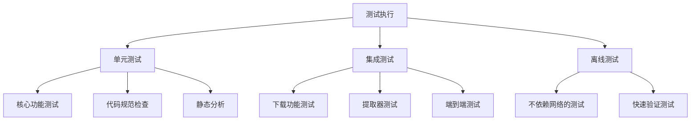

**图表来源**
- [devscripts/run_tests.py](file://devscripts/run_tests.py#L20-L77)
- [Makefile](file://Makefile#L100-L110)

#### 3.2 测试参数配置

测试执行支持多种配置选项：

| 参数 | 功能 | 示例 |
|------|------|------|
| test | 指定测试类型 | core, download |
| -k | 表达式匹配 | "not download" |
| --pytest-args | 传递给pytest的参数 | --tb=short |

**章节来源**
- [devscripts/run_tests.py](file://devscripts/run_tests.py#L20-L77)

### 第四阶段：构建打包

构建打包阶段生成各种格式的发布产物：

#### 4.1 PyInstaller打包流程

PyInstaller打包支持多种输出格式：

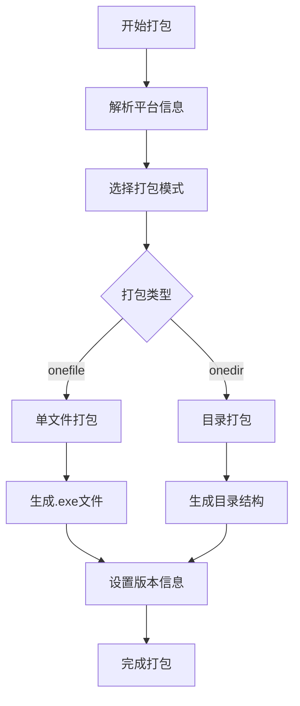

**图表来源**
- [bundle/pyinstaller.py](file://bundle/pyinstaller.py#L20-L142)

#### 4.2 多平台支持

项目支持多种操作系统和架构：

| 平台 | 架构 | 支持状态 |
|------|------|----------|
| Linux | x86_64 | ✅ 完全支持 |
| Linux | aarch64 | ✅ 完全支持 |
| Linux | armv7l | ✅ 完全支持 |
| Linux | musllinux_x86_64 | ✅ 完全支持 |
| Linux | musllinux_aarch64 | ✅ 完全支持 |
| Windows | x86_64 | ✅ 完全支持 |
| macOS | x86_64 | ✅ 完全支持 |
| macOS | aarch64 | ✅ 完全支持 |

**章节来源**
- [bundle/pyinstaller.py](file://bundle/pyinstaller.py#L20-L142)

### 第五阶段：Docker容器化构建

Docker容器化构建确保跨平台一致性和可重复性：

#### 5.1 Docker构建架构

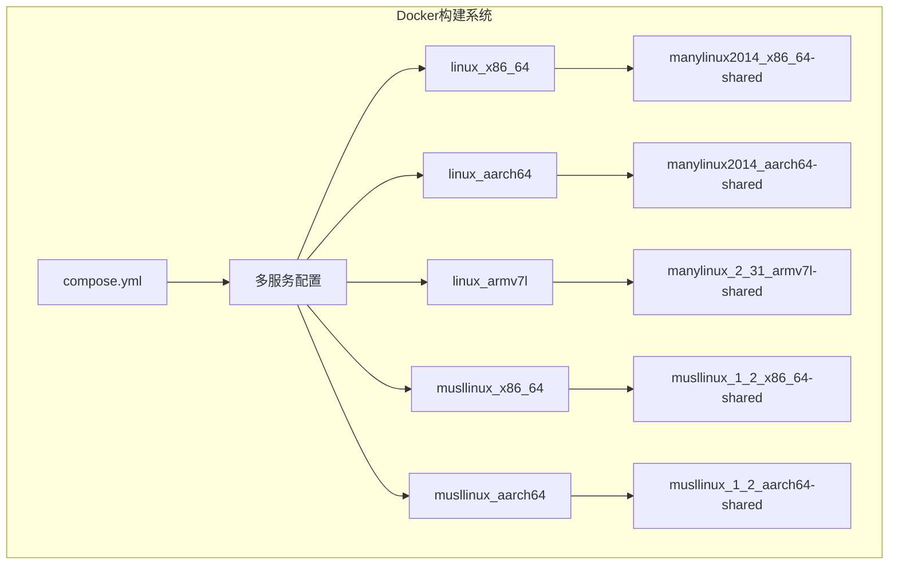

**图表来源**
- [bundle/docker/compose.yml](file://bundle/docker/compose.yml#L1-L179)

#### 5.2 构建脚本流程

构建脚本执行以下关键步骤：

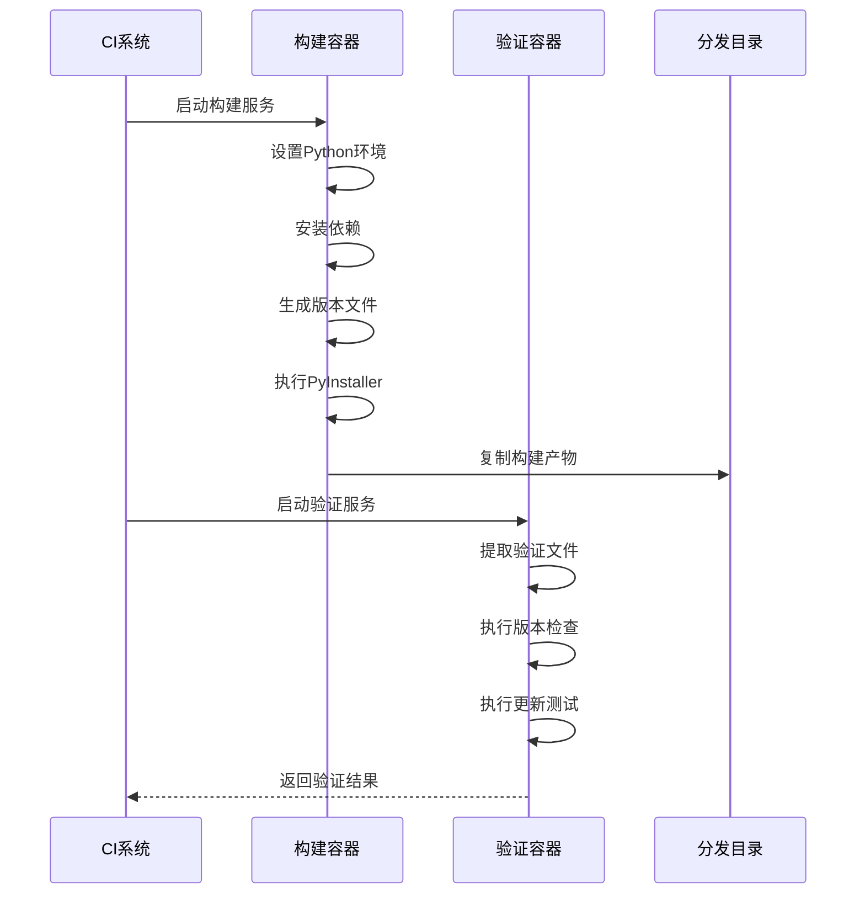

**图表来源**
- [bundle/docker/linux/build.sh](file://bundle/docker/linux/build.sh#L1-L49)
- [bundle/docker/linux/verify.sh](file://bundle/docker/linux/verify.sh#L1-L52)

**章节来源**
- [bundle/docker/compose.yml](file://bundle/docker/compose.yml#L1-L179)
- [bundle/docker/linux/build.sh](file://bundle/docker/linux/build.sh#L1-L49)

## 质量保证措施

### 代码质量控制

项目实施多层次的质量保证措施：

#### 6.1 静态代码分析

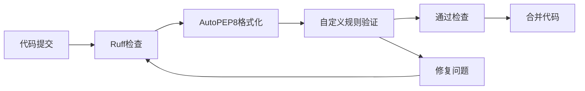

**图表来源**
- [pyproject.toml](file://pyproject.toml#L200-L350)

#### 6.2 测试覆盖率和验证

测试系统提供全面的质量保障：

| 测试类型 | 工具 | 覆盖范围 |
|----------|------|----------|
| 单元测试 | pytest | 核心功能模块 |
| 集成测试 | pytest | 端到端流程 |
| 离线测试 | pytest | 不依赖网络的功能 |
| 下载测试 | 自定义测试套件 | 实际下载场景 |

**章节来源**
- [pyproject.toml](file://pyproject.toml#L200-L350)
- [devscripts/run_tests.py](file://devscripts/run_tests.py#L20-L77)

### 发布前检查清单

发布前需要完成以下检查：

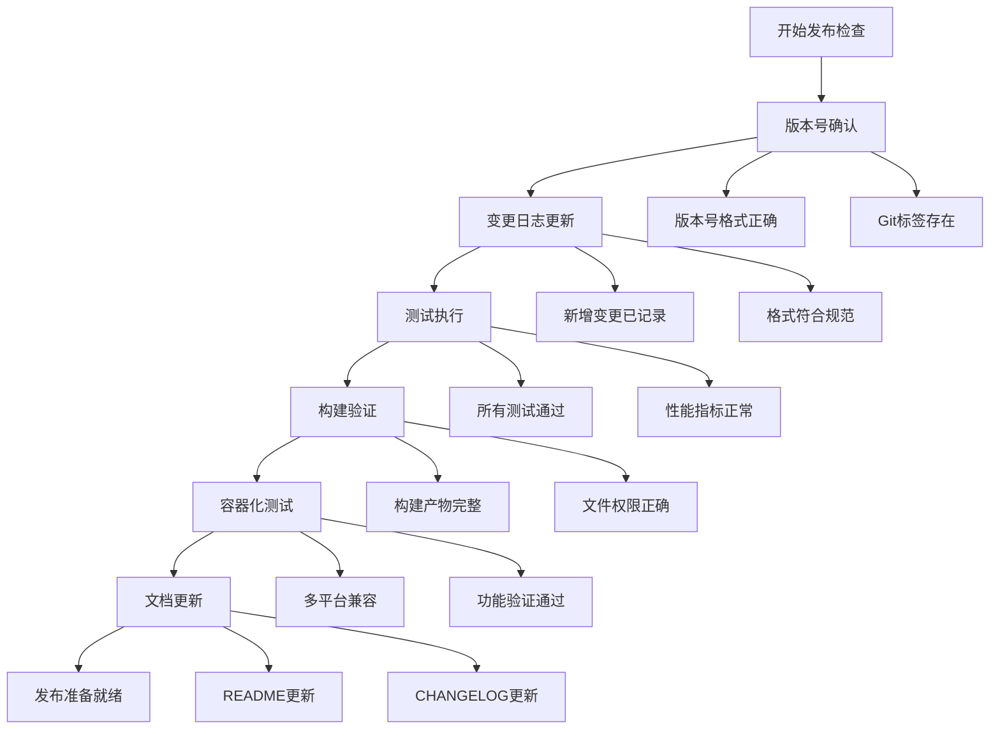

## 发布部署流程

### GitHub Actions工作流

发布流程通过GitHub Actions自动化执行：

#### 7.1 自动化发布工作流

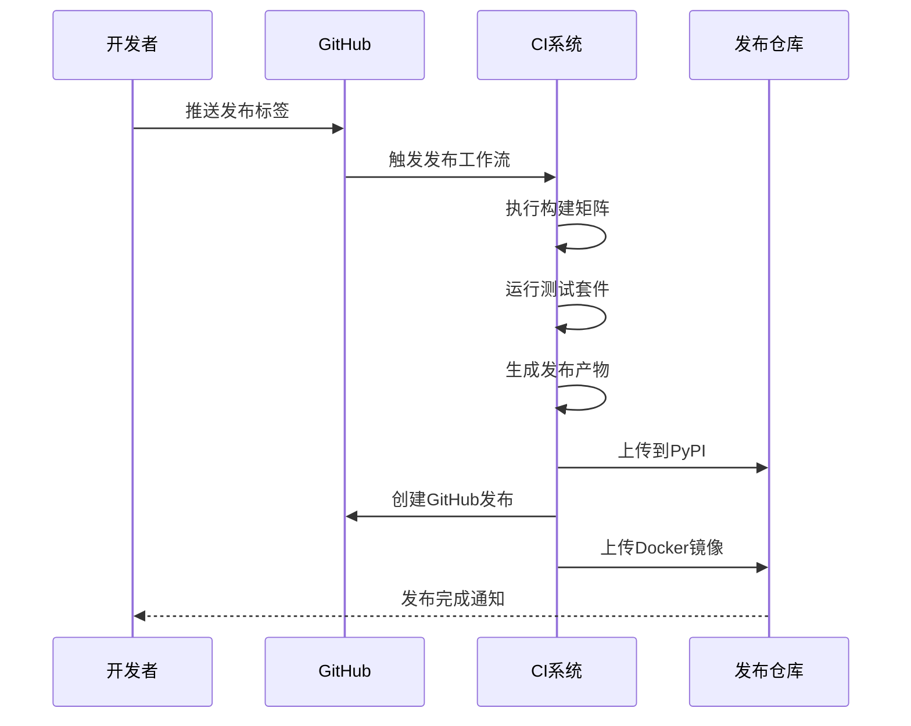

#### 7.2 发布产物管理

发布产物包括多种格式和分发渠道：

| 产物类型 | 文件扩展名 | 用途 |
|----------|------------|------|
| 源码分发 | .tar.gz | 源码安装 |
| Wheel包 | .whl | 二进制安装 |
| 可执行文件 | .exe, .app | 平台原生运行 |
| Docker镜像 | :tag | 容器部署 |

**章节来源**
- [Makefile](file://Makefile#L150-L175)
- [pyproject.toml](file://pyproject.toml#L100-L150)

### 变更日志管理

变更日志系统自动跟踪和生成发布说明：

#### 8.1 日志生成流程

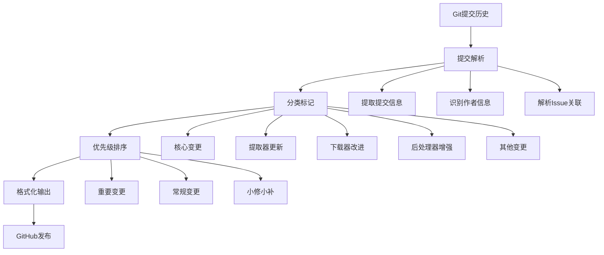

**图表来源**
- [devscripts/make_changelog.py](file://devscripts/make_changelog.py#L100-L200)

**章节来源**
- [devscripts/make_changelog.py](file://devscripts/make_changelog.py#L100-L200)

## 故障排除指南

### 常见问题和解决方案

#### 9.1 构建失败问题

| 问题类型 | 可能原因 | 解决方案 |
|----------|----------|----------|
| 依赖冲突 | 版本不兼容 | 更新requirements.txt |
| 内存不足 | 大型构建任务 | 增加系统内存或优化构建 |
| 权限错误 | 文件访问限制 | 检查文件权限设置 |
| 网络超时 | 依赖下载失败 | 使用国内镜像源 |

#### 9.2 Docker构建问题

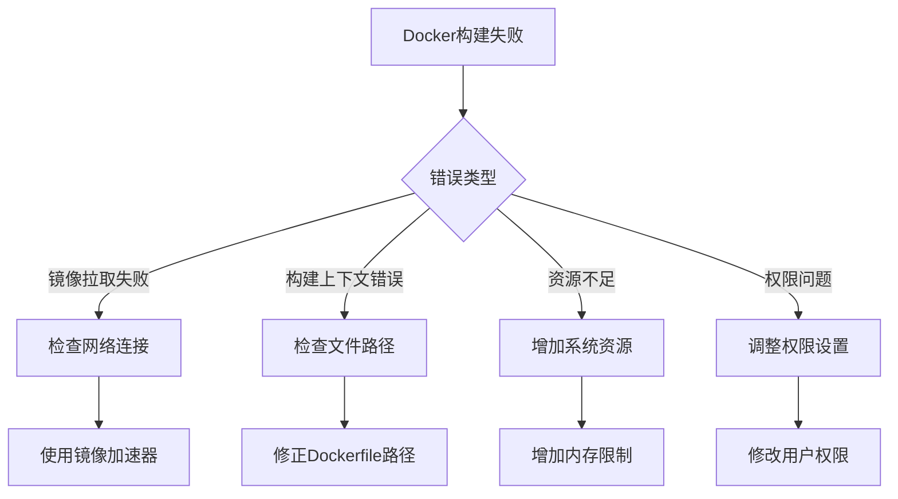

#### 9.3 版本号冲突

版本号冲突的常见场景和解决方法：

| 场景 | 症状 | 解决方法 |
|------|------|----------|
| 版本号重复 | PyPI拒绝上传 | 更新版本号或清理缓存 |
| Git标签冲突 | 发布流程中断 | 删除冲突标签重新创建 |
| 渠道混淆 | 错误的发布渠道 | 明确指定channel参数 |
| 源码标识错误 | 版本追踪困难 | 正确设置origin参数 |

**章节来源**
- [devscripts/update-version.py](file://devscripts/update-version.py#L40-L65)
- [bundle/docker/linux/build.sh](file://bundle/docker/linux/build.sh#L1-L49)

## 总结

yt-dlp的版本发布流程体现了现代软件开发的最佳实践，通过自动化工具链实现了高效、可靠的发布管理。该流程的主要优势包括：

### 核心优势

1. **高度自动化**：从版本号计算到最终发布的全流程自动化
2. **多平台支持**：覆盖主流操作系统和架构平台
3. **质量保证**：多层次的测试和验证机制
4. **容器化部署**：确保构建环境的一致性和可重复性
5. **灵活配置**：支持多种发布渠道和定制需求

### 最佳实践建议

1. **版本管理**：严格遵循语义化版本控制规范
2. **测试策略**：保持全面的测试覆盖和定期验证
3. **文档维护**：及时更新发布说明和变更日志
4. **监控告警**：建立完善的发布监控和异常处理机制
5. **回滚机制**：制定清晰的版本回滚和应急响应流程

通过这套完整的版本发布流程，yt-dlp能够持续稳定地向用户提供高质量的软件产品，同时为社区贡献者提供了清晰的工作指导和质量保障机制。