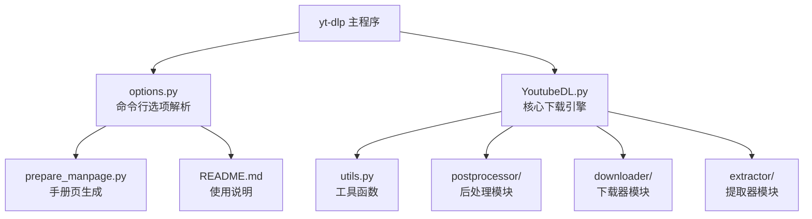
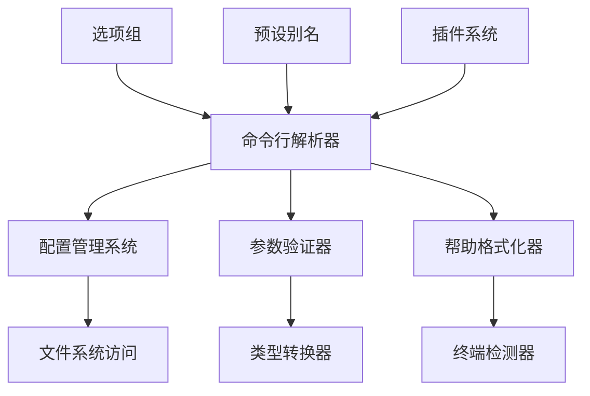

# 命令参考

<cite>
**本文档中引用的文件**
- [options.py](file://yt_dlp/options.py)
- [YoutubeDL.py](file://yt_dlp/YoutubeDL.py)
- [prepare_manpage.py](file://devscripts/prepare_manpage.py)
- [README.md](file://README.md)
- [globals.py](file://yt_dlp/globals.py)
- [plugins.py](file://yt_dlp/plugins.py)
</cite>

## 目录
1. [简介](#简介)
2. [项目结构概览](#项目结构概览)
3. [核心组件](#核心组件)
4. [架构概览](#架构概览)
5. [详细组件分析](#详细组件分析)
6. [依赖关系分析](#依赖关系分析)
7. [性能考虑](#性能考虑)
8. [故障排除指南](#故障排除指南)
9. [结论](#结论)

## 简介

yt-dlp是一个功能丰富的命令行音频/视频下载器，支持数千个网站。本文档基于yt_dlp的实际代码实现，系统性地介绍了所有命令行选项和参数，包括标志（flag）、选项（option）和参数（argument）的功能、语法格式和使用场景。

该文档的核心依据是`options.py`中的命令行解析逻辑和`YoutubeDL.py`中的参数处理机制，确保内容与官方实现完全一致。

## 项目结构概览

yt-dlp采用模块化的命令行界面设计，主要通过以下文件组织命令行功能：

**图表来源**
- [options.py](file://yt_dlp/options.py#L1-L50)
- [YoutubeDL.py](file://yt_dlp/YoutubeDL.py#L1-L50)

**章节来源**
- [options.py](file://yt_dlp/options.py#L1-L100)
- [YoutubeDL.py](file://yt_dlp/YoutubeDL.py#L1-L100)

## 核心组件

### 命令行解析器

yt-dlp使用自定义的`_YoutubeDLOptionParser`类来处理命令行参数，该类继承自`optparse.OptionParser`但提供了更强大的功能：

- **别名支持**：通过`_PRESET_ALIASES`字典实现预定义选项组合
- **配置文件集成**：自动加载多个配置位置
- **错误处理**：提供详细的错误信息和帮助文本
- **兼容性选项**：支持与youtube-dl的向后兼容

### 配置管理系统

配置系统支持多层级配置文件加载：

1. **便携式配置**：可执行文件所在目录
2. **主目录配置**：用户主目录下的配置
3. **用户配置**：标准用户配置目录
4. **系统配置**：系统级配置目录

**章节来源**
- [options.py](file://yt_dlp/options.py#L80-L120)

## 架构概览

命令行接口的整体架构遵循分组原则，将相关选项组织到不同的逻辑组中：

**图表来源**
- [options.py](file://yt_dlp/options.py#L450-L1963)

## 详细组件分析

### 通用选项组

通用选项包含程序的基本控制功能：

#### 基本控制选项
- **`-h, --help`**：显示帮助信息并退出
- **`--version`**：显示程序版本并退出
- **`-U, --update`**：更新到最新版本
- **`--no-update`**：不检查更新

#### 错误处理选项
- **`-i, --ignore-errors`**：忽略下载和后处理错误
- **`--no-abort-on-error`**：在下载错误时继续下一个视频
- **`--abort-on-error`**：发生错误时中止进一步下载

#### 提取器控制
- **`--list-extractors`**：列出所有支持的提取器
- **`--extractor-descriptions`**：输出提取器描述
- **`--use-extractors`**：指定使用的提取器名称

**章节来源**
- [options.py](file://yt_dlp/options.py#L450-L550)

### 网络选项组

网络选项控制连接行为和代理设置：

#### 代理配置
- **`--proxy URL`**：指定HTTP/HTTPS/SOCKS代理
- **`--socket-timeout SECONDS`**：套接字超时时间
- **`--source-address IP`**：客户端IP地址绑定

#### 协议和安全
- **`--impersonate CLIENT[:OS]`**：模拟特定客户端请求
- **`--list-impersonate-targets`**：列出可用的模拟目标
- **`--no-check-certificates`**：禁用SSL证书验证

#### 地址族控制
- **`-4, --force-ipv4`**：强制使用IPv4
- **`-6, --force-ipv6`**：强制使用IPv6

**章节来源**
- [options.py](file://yt_dlp/options.py#L550-L600)

### 视频选择选项组

视频选择选项允许精确控制要下载的内容：

#### 播放列表控制
- **`--playlist-start NUMBER`**：播放列表起始索引
- **`--playlist-end NUMBER`**：播放列表结束索引
- **`-I, --playlist-items ITEM_SPEC`**：指定要下载的播放列表项

#### 时间和日期过滤
- **`--date DATE`**：指定上传日期范围
- **`--datebefore DATE`**：指定最早上传日期
- **`--dateafter DATE`**：指定最晚上传日期

#### 文件大小限制
- **`--min-filesize SIZE`**：最小文件大小
- **`--max-filesize SIZE`**：最大文件大小

#### 过滤器系统
- **`--match-filters FILTER`**：通用视频过滤器
- **`--break-match-filters FILTER`**：匹配失败时停止下载
- **`--age-limit YEARS`**：年龄限制

**章节来源**
- [options.py](file://yt_dlp/options.py#L650-L750)

### 下载选项组

下载选项控制下载行为和并发设置：

#### 并发控制
- **`-N, --concurrent-fragments N`**：并发片段数量
- **`--playlist-random`**：随机下载播放列表
- **`--lazy-playlist`**：延迟处理播放列表

#### 速率和重试
- **`-r, --limit-rate RATE`**：最大下载速率
- **`--retries RETRIES`**：重试次数
- **`--retry-sleep [TYPE:]EXPR`**：重试间隔

#### 片段处理
- **`--skip-unavailable-fragments`**：跳过不可用片段
- **`--keep-fragments`**：保留已下载片段
- **`--buffer-size SIZE`**：下载缓冲区大小

**章节来源**
- [options.py](file://yt_dlp/options.py#L850-L950)

### 文件系统选项组

文件系统选项控制输出文件和路径管理：

#### 输出模板
- **`-o, --output [TYPES:]TEMPLATE`**：输出文件名模板
- **`--restrict-filenames`**：限制文件名字符集
- **`--trim-filenames LENGTH`**：限制文件名长度

#### 路径管理
- **`-P, --paths [TYPES:]PATH`**：指定下载路径
- **`--autonumber-start NUMBER`**：自动编号起始值

#### 文件覆盖策略
- **`-w, --no-overwrites`**：不覆盖现有文件
- **`--force-overwrites`**：强制覆盖所有文件
- **`-c, --continue`**：断点续传

**章节来源**
- [options.py](file://yt_dlp/options.py#L1350-L1450)

### 后处理选项组

后处理选项控制下载后的文件转换和元数据添加：

#### 音频提取
- **`-x, --extract-audio`**：提取音频文件
- **`--audio-format FORMAT`**：音频格式
- **`--audio-quality QUALITY`**：音频质量

#### 容器转换
- **`--remux-video FORMAT`**：重新封装视频
- **`--recode-video FORMAT`**：重新编码视频

#### 元数据处理
- **`--embed-metadata`**：嵌入元数据
- **`--embed-thumbnail`**：嵌入缩略图
- **`--embed-subs`**：嵌入字幕

**章节来源**
- [options.py](file://yt_dlp/options.py#L1550-L1650)

### SponsorBlock选项组

SponsorBlock选项用于处理YouTube视频中的赞助内容：

#### 标记选项
- **`--sponsorblock-mark CATS`**：标记指定类别为章节
- **`--sponsorblock-chapter-title TEMPLATE`**：指定章节标题模板

#### 移除选项
- **`--sponsorblock-remove CATS`**：从视频中移除指定类别
- **`--no-sponsorblock`**：禁用SponsorBlock功能

**章节来源**
- [options.py](file://yt_dlp/options.py#L1850-L1900)

## 依赖关系分析

命令行接口的依赖关系体现了模块化设计的优势：

**图表来源**
- [options.py](file://yt_dlp/options.py#L1-L100)
- [YoutubeDL.py](file://yt_dlp/YoutubeDL.py#L1-L100)

**章节来源**
- [options.py](file://yt_dlp/options.py#L1-L200)
- [YoutubeDL.py](file://yt_dlp/YoutubeDL.py#L1-L200)

## 性能考虑

### 内存优化
- 使用生成器模式处理大型播放列表
- 实现懒加载机制减少启动时间
- 支持流式处理避免大文件内存占用

### 网络优化
- 支持并发下载提高带宽利用率
- 实现智能重试机制避免网络抖动影响
- 提供代理和连接池支持

### 存储优化
- 支持断点续传减少重复下载
- 实现临时文件管理避免磁盘空间浪费
- 提供压缩和格式转换优化存储空间

## 故障排除指南

### 常见问题解决

#### 下载失败
1. **网络连接问题**：检查代理设置和防火墙配置
2. **服务器限制**：尝试降低并发数或增加等待时间
3. **格式不支持**：使用`--list-formats`查看可用格式

#### 认证问题
1. **Cookie文件格式**：确保使用正确的Cookie格式
2. **浏览器同步**：检查浏览器扩展是否正常工作
3. **凭据过期**：定期更新认证信息

#### 后处理错误
1. **FFmpeg缺失**：安装FFmpeg并确保在PATH中
2. **权限问题**：检查文件写入权限
3. **格式冲突**：确认目标格式支持所需操作

**章节来源**
- [YoutubeDL.py](file://yt_dlp/YoutubeDL.py#L3000-L3200)

## 结论

yt-dlp的命令行接口设计体现了现代软件工程的最佳实践：

1. **模块化架构**：清晰的选项分组便于理解和使用
2. **向后兼容**：完善的兼容性选项支持迁移
3. **扩展性**：插件系统和配置文件支持定制
4. **健壮性**：全面的错误处理和恢复机制

该文档基于实际代码实现，确保了内容的准确性和时效性。通过系统性的分类和详细的说明，用户可以快速找到所需的选项并正确使用各种功能。