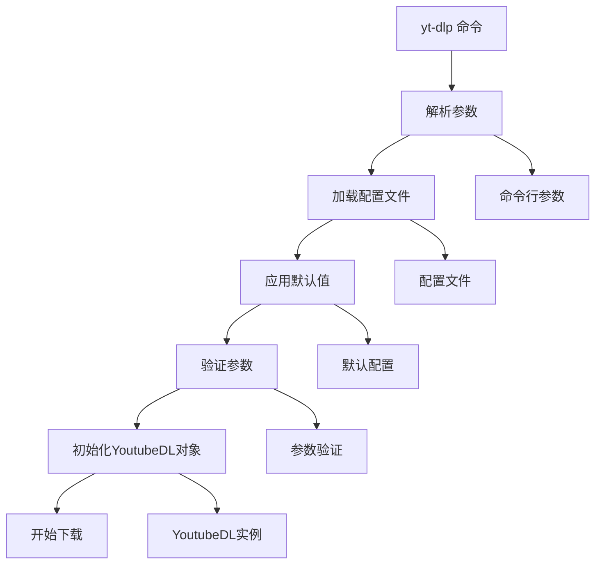
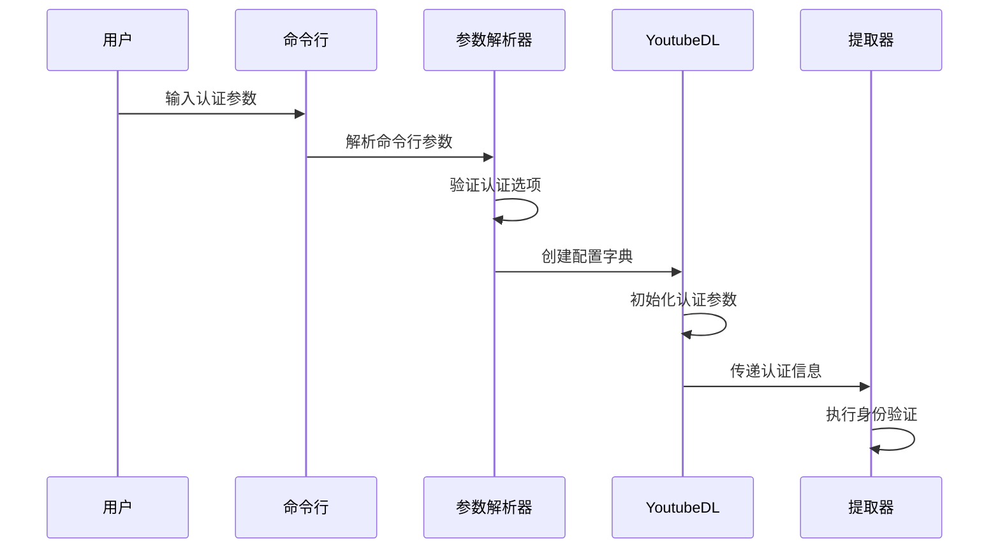
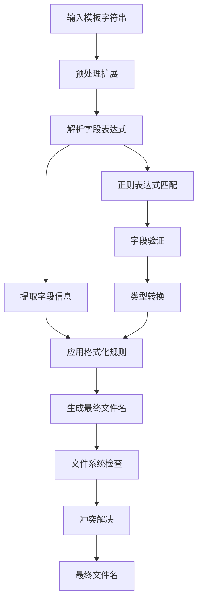
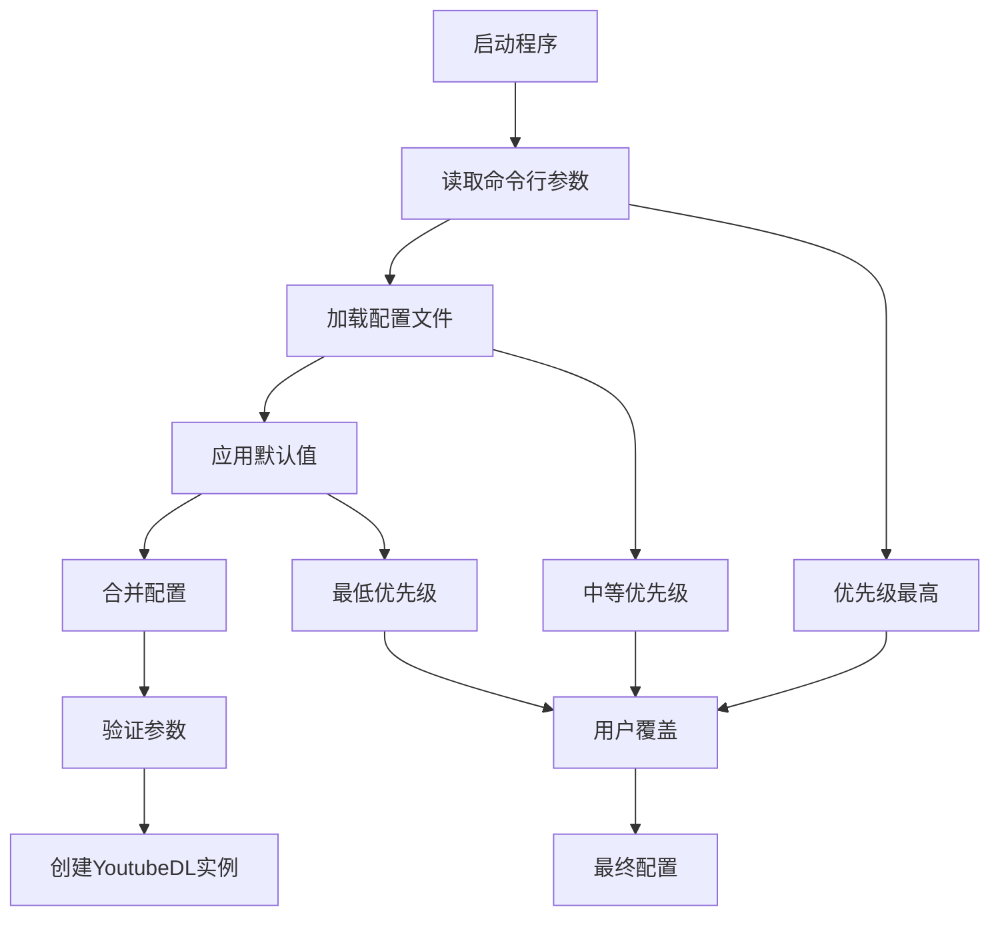
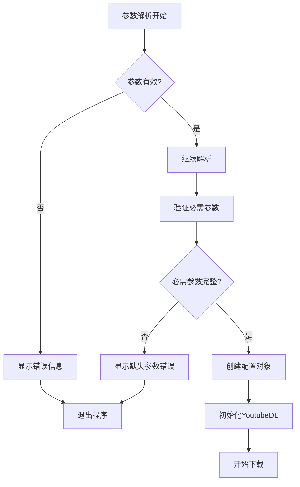
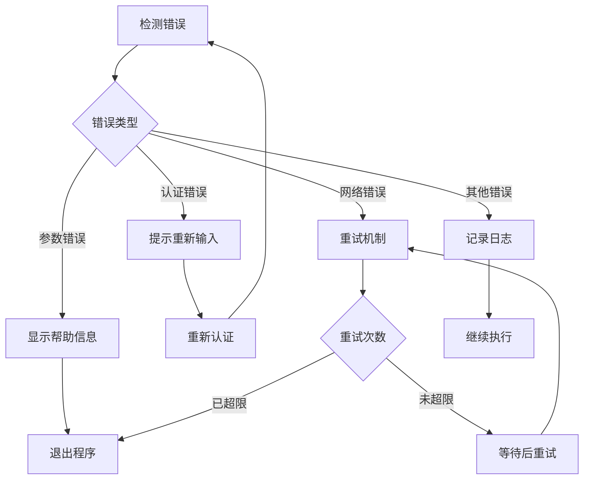
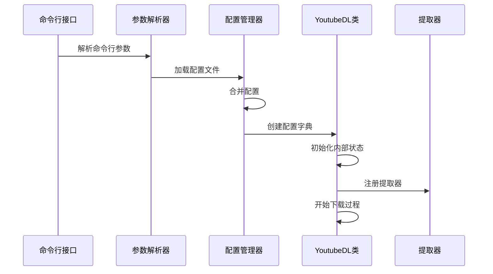
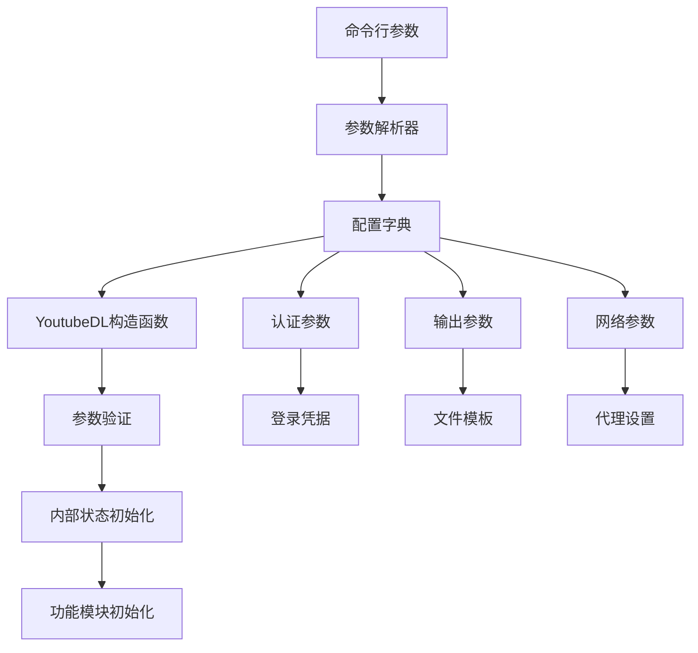

# 基本用法

<cite>
**本文档中引用的文件**
- [YoutubeDL.py](file://yt_dlp/YoutubeDL.py)
- [options.py](file://yt_dlp/options.py)
- [utils/_utils.py](file://yt_dlp/utils/_utils.py)
- [README.md](file://README.md)
- [__init__.py](file://yt_dlp/__init__.py)
</cite>

## 目录
1. [简介](#简介)
2. [基本命令结构](#基本命令结构)
3. [核心认证选项](#核心认证选项)
4. [输出模板系统](#输出模板系统)
5. [参数解析流程](#参数解析流程)
6. [实际使用示例](#实际使用示例)
7. [错误处理机制](#错误处理机制)
8. [与YoutubeDL类的交互](#与youtubedl类的交互)
9. [最佳实践建议](#最佳实践建议)

## 简介

yt-dlp是一个功能丰富的命令行音视频下载器，支持数千个网站。本文档详细介绍了最基本的使用方法，重点讲解核心参数解析逻辑和基础功能。

## 基本命令结构

### 标准语法

yt-dlp的基本命令结构遵循以下模式：
```
yt-dlp [OPTIONS] URL [URL...]
```

### 参数位置

- **OPTIONS**: 可选的命令行选项，用于控制下载行为
- **URL**: 要下载的视频或播放列表的URL
- **[URL...]**: 可以指定多个URL进行批量下载



**图表来源**
- [options.py](file://yt_dlp/options.py#L30-L100)
- [YoutubeDL.py](file://yt_dlp/YoutubeDL.py#L600-L700)

**章节来源**
- [options.py](file://yt_dlp/options.py#L30-L100)
- [README.md](file://README.md#L1200-L1250)

## 核心认证选项

### 用户名和密码认证

yt-dlp提供了多种身份验证方式，其中最基本的是用户名和密码认证：

#### 基本语法
```bash
yt-dlp -u USERNAME -p PASSWORD URL
```

#### 选项别名
- `-u, --username`: 指定账户登录ID
- `-p, --password`: 指定账户密码（可选，会交互式提示）

#### 认证流程



**图表来源**
- [options.py](file://yt_dlp/options.py#L750-L850)
- [YoutubeDL.py](file://yt_dlp/YoutubeDL.py#L150-L250)

#### 认证参数定义

在options.py中，认证选项被定义为：

| 选项 | 类型 | 默认值 | 描述 |
|------|------|--------|------|
| `username` | 字符串 | None | 登录账户ID |
| `password` | 字符串 | None | 账户密码 |
| `usenetrc` | 布尔值 | False | 使用.netrc文件进行认证 |
| `netrc_location` | 字符串 | ~/.netrc | .netrc文件位置 |

#### netrc认证

对于更安全的认证方式，可以使用.netrc文件：

```bash
# ~/.netrc 文件内容示例
machine example.com
login myusername
password mypassword
```

然后使用：
```bash
yt-dlp -n URL
```

**章节来源**
- [options.py](file://yt_dlp/options.py#L750-L850)
- [YoutubeDL.py](file://yt_dlp/YoutubeDL.py#L150-L300)

## 输出模板系统

### 默认输出模板

yt-dlp使用灵活的输出模板系统来控制文件命名。默认模板为：
```
%(title)s [%(id)s].%(ext)s
```

这将生成类似以下格式的文件名：
```
视频标题 [视频ID].mp4
```

### 模板字段类型

#### 核心元数据字段

| 字段 | 描述 | 示例 |
|------|------|------|
| `title` | 视频标题 | "我的视频标题" |
| `id` | 视频ID | "dQw4w9WgXcQ" |
| `ext` | 文件扩展名 | "mp4", "webm" |
| `uploader` | 上传者名称 | "用户频道" |
| `upload_date` | 上传日期 | "20231201" |
| `duration` | 视频时长 | "3600" |

#### 高级模板功能

##### 条件格式化
```bash
# 如果存在则显示，否则使用默认值
-o "%(title)s.%(ext)s"  # 基本格式
-o "%(title)s [%(id)s].%(ext)s"  # 包含ID
-o "%(uploader)s/%(title)s.%(ext)s"  # 分层目录
```

##### 路径分隔符
```bash
# 支持嵌套路径
-o "%(uploader)s/%(upload_date)s/%(title)s.%(ext)s"
```

### 模板解析流程



**图表来源**
- [YoutubeDL.py](file://yt_dlp/YoutubeDL.py#L1160-L1200)
- [utils/_utils.py](file://yt_dlp/utils/_utils.py#L2840-L2860)

**章节来源**
- [utils/_utils.py](file://yt_dlp/utils/_utils.py#L2840-L2860)
- [YoutubeDL.py](file://yt_dlp/YoutubeDL.py#L1160-L1200)

## 参数解析流程

### 解析阶段概览

yt-dlp的参数解析遵循严格的顺序：



**图表来源**
- [options.py](file://yt_dlp/options.py#L30-L150)

### 参数优先级

1. **命令行参数** (最高优先级)
2. **配置文件** (中等优先级)
3. **环境变量** (低优先级)
4. **默认值** (最低优先级)

### 错误处理机制



**图表来源**
- [options.py](file://yt_dlp/options.py#L50-L100)

**章节来源**
- [options.py](file://yt_dlp/options.py#L30-L150)

## 实际使用示例

### 基础下载示例

#### 单个视频下载
```bash
# 最简单的下载
yt-dlp https://www.youtube.com/watch?v=dQw4w9WgXcQ

# 指定输出目录
yt-dlp -o "/downloads/%(title)s.%(ext)s" https://www.youtube.com/watch?v=dQw4w9WgXcQ

# 使用用户名和密码认证
yt-dlp -u myusername -p mypassword https://example.com/private-video
```

#### 批量下载
```bash
# 从文件读取URL列表
yt-dlp -a urls.txt

# 指定多个URL
yt-dlp https://example.com/video1 https://example.com/video2

# 下载播放列表
yt-dlp --yes-playlist https://example.com/playlist
```

### 高级配置示例

#### 自定义输出模板
```bash
# 按上传日期组织文件
yt-dlp -o "%(upload_date)s/%(title)s.%(ext)s" URL

# 包含上传者信息
yt-dlp -o "%(uploader)s/%(title)s.%(ext)s" URL

# 使用时间戳
yt-dlp -o "%(upload_date)s_%(title)s.%(ext)s" URL
```

#### 认证配置
```bash
# 使用.netrc文件
yt-dlp -n URL

# 指定.netrc文件位置
yt-dlp --netrc-location ~/.my_netrc URL

# 交互式密码输入
yt-dlp -u username URL
```

### 配置文件示例

#### 基本配置文件 (~/.yt-dlp.conf)
```ini
# 基本设置
username = myusername
password = mypassword
output = ~/Downloads/%(title)s.%(ext)s

# 下载选项
format = bestvideo+bestaudio/best
retries = 10
buffer-size = 1024

# 文件系统选项
restrict-filenames = true
no-overwrites = true
```

#### 多样化配置
```ini
# 默认配置
[default]
output = ~/Videos/%(title)s.%(ext)s
format = best

# 特定网站配置
[youtube]
output = ~/YouTube/%(title)s.%(ext)s
format = bestvideo[ext=mp4]+bestaudio[ext=m4a]/best[ext=mp4]/best
retries = 15

# 私有网站配置
[private-site]
username = private_user
password = private_pass
output = ~/Private/%(title)s.%(ext)s
```

**章节来源**
- [README.md](file://README.md#L1400-L1500)

## 错误处理机制

### 常见错误类型

#### 参数错误
```bash
# 缺少URL
yt-dlp -u username  # 错误：缺少URL参数

# 无效格式
yt-dlp -f invalid_format URL  # 错误：格式无效
```

#### 认证错误
```bash
# 无效凭据
yt-dlp -u wrong_user -p wrong_pass URL  # 认证失败

# 网络问题
yt-dlp URL  # 网络连接失败
```

### 错误处理流程



**图表来源**
- [options.py](file://yt_dlp/options.py#L100-L150)

### 调试技巧

#### 启用详细输出
```bash
# 显示调试信息
yt-dlp -v URL

# 显示HTTP流量
yt-dlp --print-traffic URL

# 转储页面内容
yt-dlp --dump-pages URL
```

#### 配置文件调试
```bash
# 显示配置信息
yt-dlp --verbose --ignore-config URL

# 测试配置文件
yt-dlp --config-location ~/.yt-dlp.conf --verbose URL
```

**章节来源**
- [options.py](file://yt_dlp/options.py#L100-L200)

## 与YoutubeDL类的交互

### 初始化过程

当用户运行yt-dlp时，以下步骤发生：



**图表来源**
- [YoutubeDL.py](file://yt_dlp/YoutubeDL.py#L600-L700)
- [options.py](file://yt_dlp/options.py#L30-L100)

### 关键初始化步骤

#### 1. 参数验证
```python
# 在YoutubeDL.__init__中
def __init__(self, params=None, auto_init=True):
    if params is None:
        params = {}
    self.params = params
    # 验证必需参数
    self._validate_params()
```

#### 2. 配置合并
```python
# 合并不同来源的配置
final_config = self._merge_configs(
    command_line_config,
    config_file_config,
    default_config
)
```

#### 3. 提取器注册
```python
# 注册可用的提取器
self.add_default_info_extractors()
```

### 参数传递机制



**图表来源**
- [YoutubeDL.py](file://yt_dlp/YoutubeDL.py#L600-L800)

**章节来源**
- [YoutubeDL.py](file://yt_dlp/YoutubeDL.py#L600-L800)

## 最佳实践建议

### 性能优化

#### 并发下载
```bash
# 使用多个片段并发下载
yt-dlp -N 4 URL

# 限制总下载速度
yt-dlp -r 500K URL
```

#### 网络优化
```bash
# 设置合理的重试次数
yt-dlp -R 5 URL

# 使用代理
yt-dlp --proxy http://proxy:8080 URL
```

### 文件管理

#### 输出组织
```bash
# 按日期组织
yt-dlp -o "~/Downloads/%(upload_date)s/%(title)s.%(ext)s" URL

# 按上传者组织
yt-dlp -o "~/Videos/%(uploader)s/%(title)s.%(ext)s" URL
```

#### 冲突处理
```bash
# 不覆盖现有文件
yt-dlp -w URL

# 强制覆盖
yt-dlp --force-overwrites URL
```

### 安全考虑

#### 认证安全
```bash
# 使用.netrc而不是明文密码
echo "machine example.com login user password pass" >> ~/.netrc
chmod 600 ~/.netrc
yt-dlp -n URL
```

#### 网络安全
```bash
# 验证SSL证书
yt-dlp --no-check-certificates URL  # 警告：不推荐

# 使用客户端证书
yt-dlp --client-certificate cert.pem URL
```

### 批量处理

#### 脚本化下载
```bash
#!/bin/bash
# 批量下载脚本
urls=("url1" "url2" "url3")
for url in "${urls[@]}"; do
    yt-dlp -o "~/downloads/%(title)s.%(ext)s" "$url"
done
```

#### 进度监控
```bash
# 监控下载进度
yt-dlp --progress URL

# 静默模式下载
yt-dlp -q URL
```

### 故障排除

#### 常见问题诊断
```bash
# 检查版本
yt-dlp --version

# 更新到最新版本
yt-dlp -U

# 测试网络连接
yt-dlp --dump-single-json URL
```

#### 日志分析
```bash
# 详细日志
yt-dlp -v URL > download.log 2>&1

# 分析日志
grep ERROR download.log
```

**章节来源**
- [README.md](file://README.md#L1600-L1700)