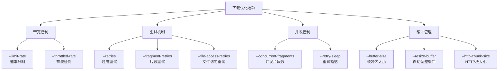
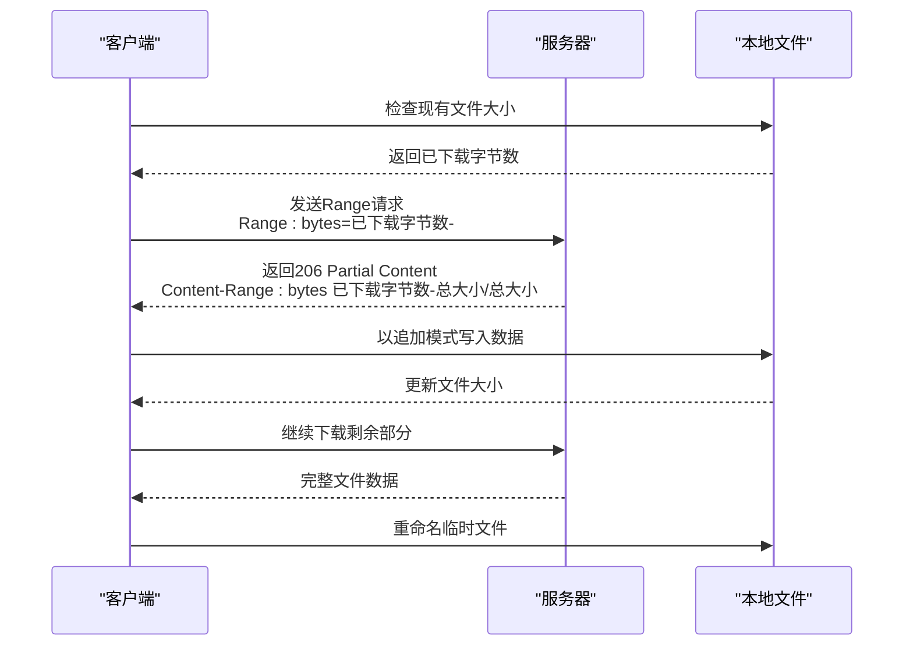
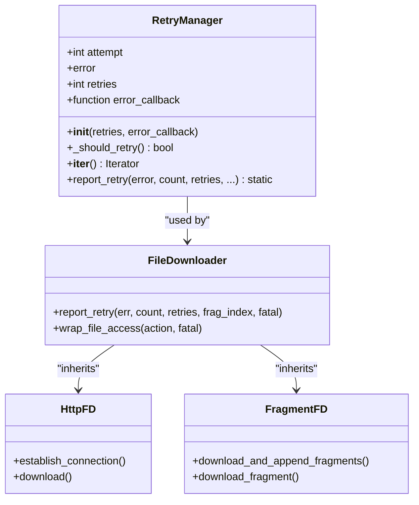
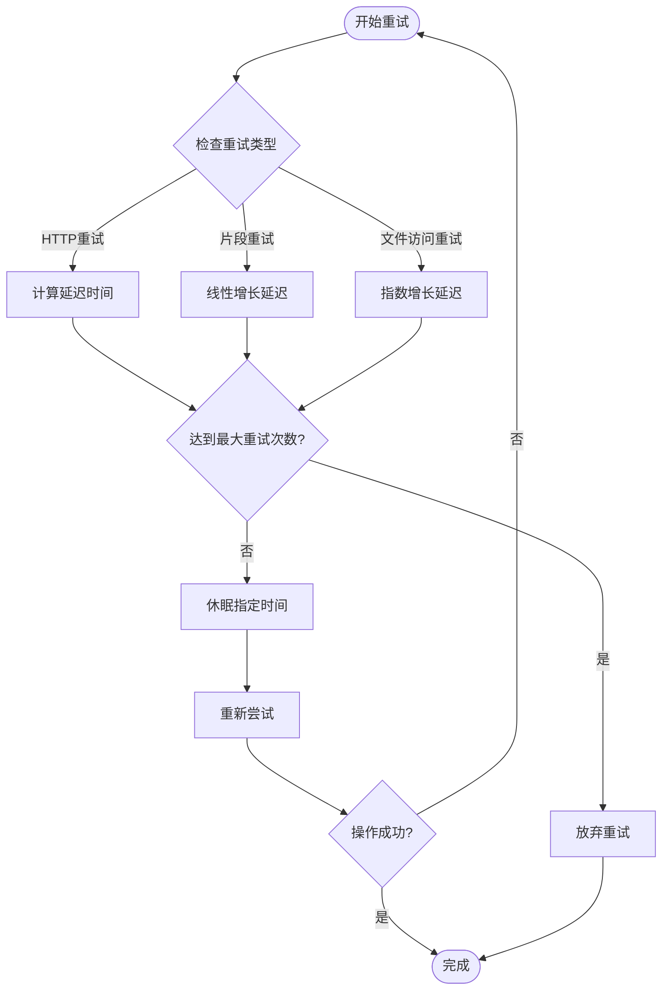
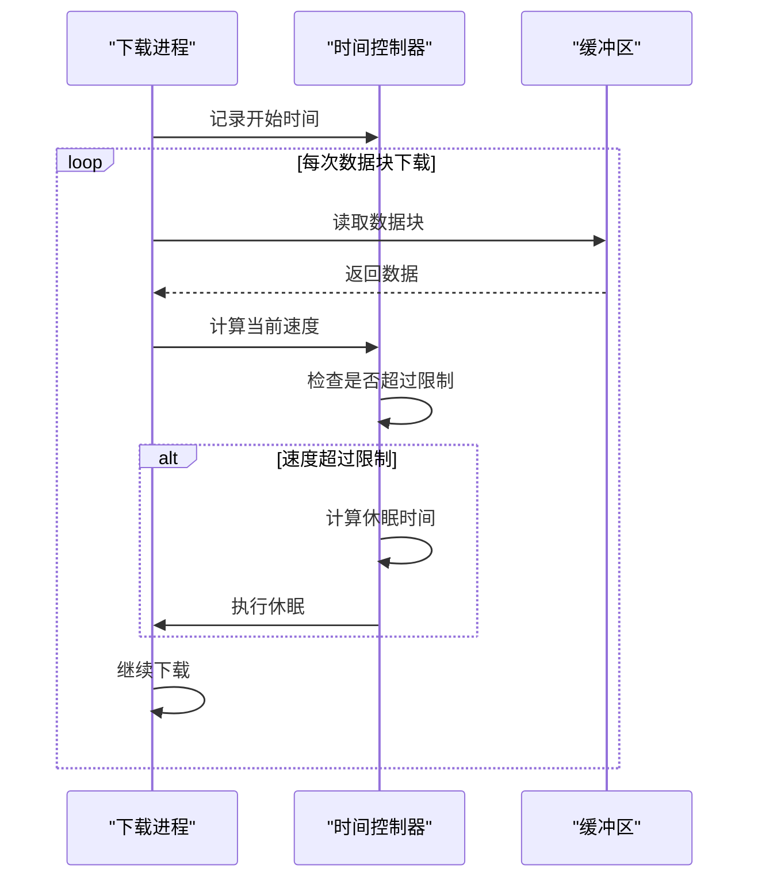
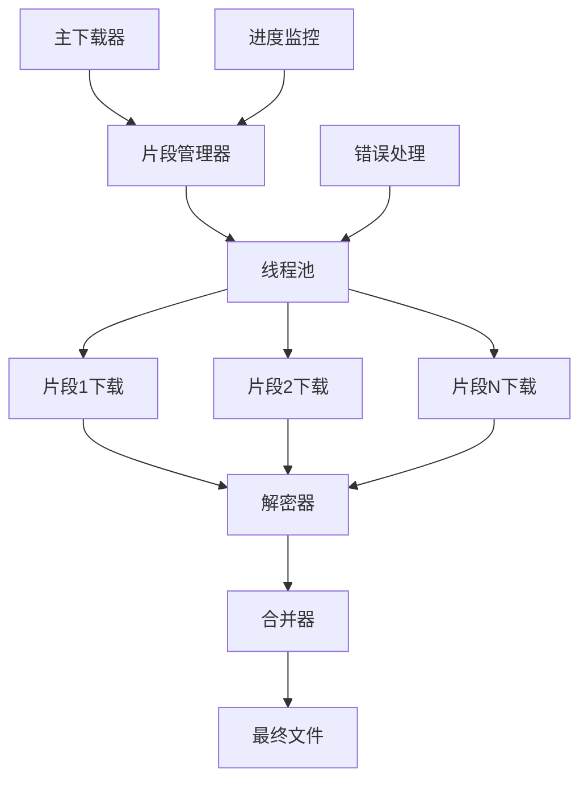
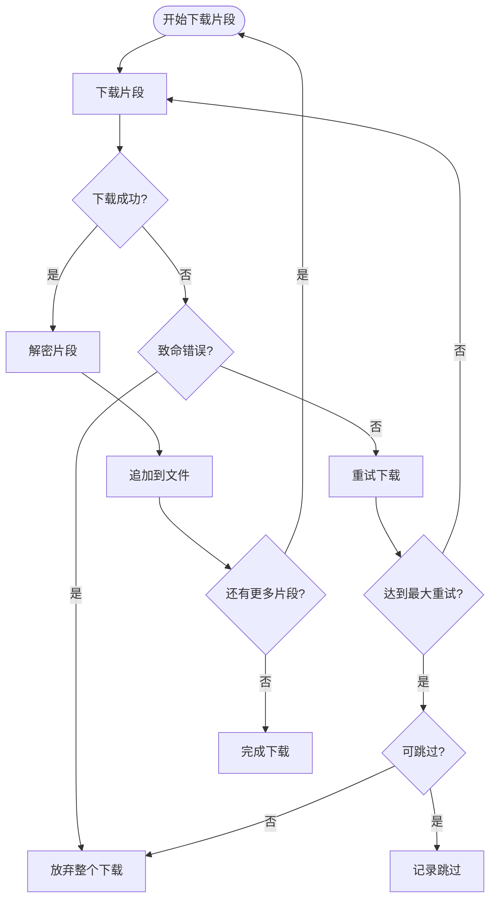
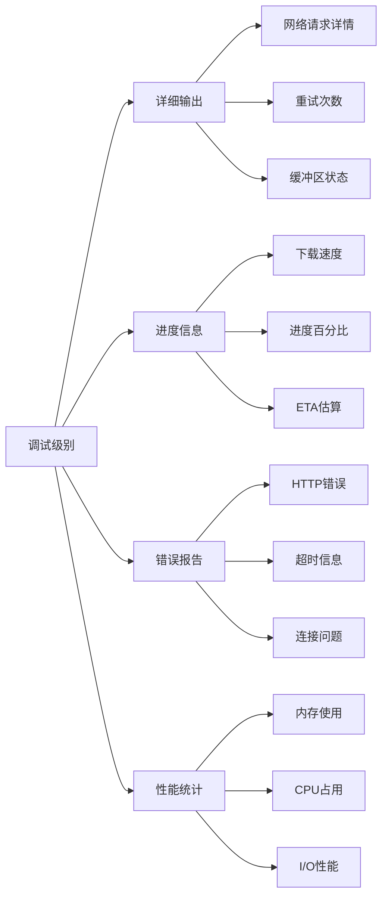
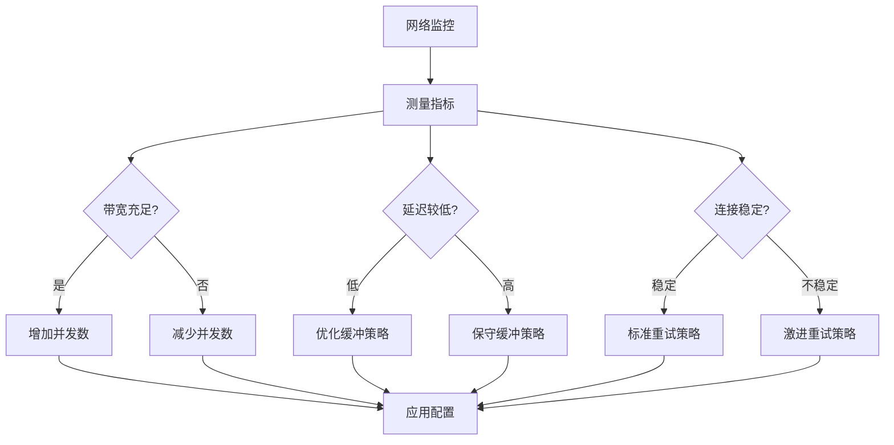

# 下载优化

<cite>
**本文档中引用的文件**
- [yt_dlp/downloader/common.py](file://yt_dlp/downloader/common.py)
- [yt_dlp/downloader/http.py](file://yt_dlp/downloader/http.py)
- [yt_dlp/downloader/fragment.py](file://yt_dlp/downloader/fragment.py)
- [yt_dlp/utils/_utils.py](file://yt_dlp/utils/_utils.py)
- [yt_dlp/options.py](file://yt_dlp/options.py)
- [yt_dlp/networking/_helper.py](file://yt_dlp/networking/_helper.py)
- [yt_dlp/YoutubeDL.py](file://yt_dlp/YoutubeDL.py)
- [test/test_download.py](file://test/test_download.py)
</cite>

## 目录
1. [简介](#简介)
2. [核心优化选项](#核心优化选项)
3. [断点续传机制](#断点续传机制)
4. [重试策略详解](#重试策略详解)
5. [带宽控制与限速](#带宽控制与限速)
6. [片段下载优化](#片段下载优化)
7. [性能监控与调试](#性能监控与调试)
8. [网络环境适配](#网络环境适配)
9. [实用示例与最佳实践](#实用示例与最佳实践)
10. [故障排除指南](#故障排除指南)

## 简介

yt-dlp提供了丰富的下载优化功能，旨在提升下载效率、稳定性和用户体验。这些功能包括带宽限制、重试机制、断点续传、片段并发下载等特性，能够适应各种网络环境和使用场景。

## 核心优化选项

### 主要性能相关选项

yt-dlp提供了多个关键的性能优化选项：



**图表来源**
- [yt_dlp/options.py](file://yt_dlp/options.py#L961-L985)

### 选项配置表

| 选项 | 默认值 | 描述 | 适用场景 |
|------|--------|------|----------|
| `--limit-rate RATE` | 无限制 | 设置最大下载速率（字节/秒） | 带宽受限环境 |
| `--throttled-rate RATE` | 无限制 | 检测节流的最小速率 | 避免服务器节流 |
| `--retries N` | 10 | 通用网络错误重试次数 | 不稳定网络连接 |
| `--fragment-retries N` | 10 | 片段下载重试次数 | 大文件或不稳定连接 |
| `--file-access-retries N` | 3 | 文件访问错误重试次数 | 存储设备问题 |
| `--concurrent-fragments N` | 1 | 并发片段下载数量 | 提升大文件下载速度 |
| `--buffer-size SIZE` | 1024 | 下载缓冲区大小 | 内存受限环境 |
| `--http-chunk-size SIZE` | 无限制 | HTTP分块大小 | 绕过服务器限速 |

**章节来源**
- [yt_dlp/options.py](file://yt_dlp/options.py#L961-L985)

## 断点续传机制

### 工作原理

断点续传是yt-dlp的核心功能之一，通过HTTP Range请求实现部分文件下载恢复。



**图表来源**
- [yt_dlp/downloader/http.py](file://yt_dlp/downloader/http.py#L72-L110)

### 实现细节

断点续传机制的关键实现包括：

1. **范围验证**：检查服务器是否支持断点续传
2. **内容范围匹配**：验证返回的内容范围与请求范围一致
3. **自动恢复**：当无法续传时自动重新开始下载
4. **临时文件管理**：使用`.part`扩展名避免覆盖未完成的文件

**章节来源**
- [yt_dlp/downloader/http.py](file://yt_dlp/downloader/http.py#L50-L73)
- [yt_dlp/downloader/http.py](file://yt_dlp/downloader/http.py#L170-L191)

## 重试策略详解

### RetryManager类架构

yt-dlp使用统一的重试管理器来处理各种类型的下载错误：



**图表来源**
- [yt_dlp/utils/_utils.py](file://yt_dlp/utils/_utils.py#L5225-L5278)
- [yt_dlp/downloader/common.py](file://yt_dlp/downloader/common.py#L250-L270)

### 重试类型与策略

| 重试类型 | 默认重试次数 | 错误处理策略 | 适用场景 |
|----------|--------------|--------------|----------|
| HTTP重试 | 10 | 指数退避延迟 | 网络连接问题 |
| 片段重试 | 10 | 可选择跳过 | 流媒体片段缺失 |
| 文件访问重试 | 3 | 线性延迟 | 存储权限问题 |
| 抽取器重试 | 3 | 固定延迟 | 数据提取失败 |

### 重试延迟计算



**图表来源**
- [yt_dlp/utils/_utils.py](file://yt_dlp/utils/_utils.py#L5225-L5278)

**章节来源**
- [yt_dlp/utils/_utils.py](file://yt_dlp/utils/_utils.py#L5225-L5278)
- [yt_dlp/downloader/common.py](file://yt_dlp/downloader/common.py#L250-L270)

## 带宽控制与限速

### 速率限制算法

yt-dlp实现了精确的带宽控制机制：



**图表来源**
- [yt_dlp/downloader/common.py](file://yt_dlp/downloader/common.py#L180-L195)

### 速率控制实现

速率控制的核心逻辑包括：

1. **实时速度计算**：基于下载时间和字节数计算当前速度
2. **休眠机制**：当速度超过限制时计算并执行休眠
3. **动态调整**：根据网络状况动态调整缓冲区大小
4. **精度控制**：确保速率限制的准确性

**章节来源**
- [yt_dlp/downloader/common.py](file://yt_dlp/downloader/common.py#L180-L195)
- [yt_dlp/downloader/http.py](file://yt_dlp/downloader/http.py#L272-L297)

## 片段下载优化

### 并发片段下载

对于DASH、HLS等流媒体格式，yt-dlp支持并发片段下载：



**图表来源**
- [yt_dlp/downloader/fragment.py](file://yt_dlp/downloader/fragment.py#L430-L456)

### 片段重试机制

片段级别的重试提供了更高的可靠性：



**图表来源**
- [yt_dlp/downloader/fragment.py](file://yt_dlp/downloader/fragment.py#L430-L456)

**章节来源**
- [yt_dlp/downloader/fragment.py](file://yt_dlp/downloader/fragment.py#L430-L456)

## 性能监控与调试

### 进度跟踪系统

yt-dlp提供了详细的进度监控功能：

| 监控指标 | 计算方式 | 更新频率 | 用途 |
|----------|----------|----------|------|
| 下载速度 | 字节数 / 时间差 | 实时 | 评估网络质量 |
| 进度百分比 | 已下载 / 总大小 | 实时 | 显示完成度 |
| 剩余时间 | 剩余字节数 / 速度 | 实时 | 预估完成时间 |
| 已用时间 | 当前时间 - 开始时间 | 实时 | 统计耗时 |
| 缓冲区大小 | 动态调整 | 自适应 | 优化内存使用 |

### 调试信息输出



**章节来源**
- [yt_dlp/downloader/common.py](file://yt_dlp/downloader/common.py#L288-L323)
- [yt_dlp/YoutubeDL.py](file://yt_dlp/YoutubeDL.py#L1073-L1102)

## 网络环境适配

### 不同网络条件的优化策略

| 网络环境 | 推荐配置 | 说明 |
|----------|----------|------|
| 高带宽低延迟 | 较高并发数，较小缓冲区 | 充分利用网络带宽 |
| 低带宽高延迟 | 较小并发数，较大缓冲区 | 减少网络开销 |
| 不稳定连接 | 较多重试次数，较长延迟 | 提高稳定性 |
| 移动网络 | 严格限速，保守重试 | 节省流量和电池 |
| 局域网 | 无特殊限制，快速传输 | 最大化本地性能 |

### 自适应优化机制



## 实用示例与最佳实践

### 带宽受限环境优化

```bash
# 限制总下载速度为50MB/s
yt-dlp --limit-rate 50M --retries 5 --buffer-size 8K

# 对于更严格的带宽控制
yt-dlp --limit-rate 10M --retries 3 --no-resize-buffer
```

### 不稳定网络环境优化

```bash
# 增加重试次数，使用保守的重试策略
yt-dlp --retries 20 --fragment-retries 15 \
       --retry-sleep exp=1:60 \
       --file-access-retries 5 \
       --concurrent-fragments 2
```

### 大文件下载优化

```bash
# 优化大文件下载性能
yt-dlp --http-chunk-size 10M \
       --concurrent-fragments 4 \
       --buffer-size 64K \
       --fragment-retries infinite
```

### 移动设备优化

```bash
# 移动设备专用配置
yt-dlp --limit-rate 5M --retries 3 \
       --buffer-size 16K --no-resize-buffer \
       --concurrent-fragments 1 \
       --skip-unavailable-fragments
```

## 故障排除指南

### 常见问题诊断

| 问题症状 | 可能原因 | 解决方案 |
|----------|----------|----------|
| 下载速度极慢 | 服务器限速或网络拥塞 | 使用`--throttled-rate`检测，调整`--limit-rate` |
| 频繁重试失败 | 网络不稳定或服务器问题 | 增加重试次数，检查网络连接 |
| 断点续传失效 | 服务器不支持Range请求 | 禁用断点续传`--no-continue` |
| 内存使用过高 | 缓冲区过大或并发过多 | 调整`--buffer-size`和`--concurrent-fragments` |
| 文件损坏 | 网络中断或存储问题 | 启用文件完整性检查，增加重试次数 |

### 性能调优检查清单

1. **网络环境评估**
   - 测试基础网络速度
   - 检查网络稳定性
   - 识别网络瓶颈

2. **配置参数优化**
   - 根据网络条件调整并发数
   - 设置合适的缓冲区大小
   - 配置重试策略

3. **监控指标跟踪**
   - 监控下载速度变化
   - 跟踪重试次数和成功率
   - 分析错误类型分布

4. **日志分析**
   - 收集详细的调试信息
   - 分析错误模式
   - 识别性能瓶颈

**章节来源**
- [test/test_download.py](file://test/test_download.py#L0-L199)

## 结论

yt-dlp的下载优化功能提供了全面而灵活的解决方案，能够适应各种网络环境和使用需求。通过合理配置这些优化选项，用户可以显著提升下载效率、稳定性和资源利用率。建议根据具体的网络条件和使用场景，选择合适的优化策略，并持续监控下载性能以进行进一步调优。