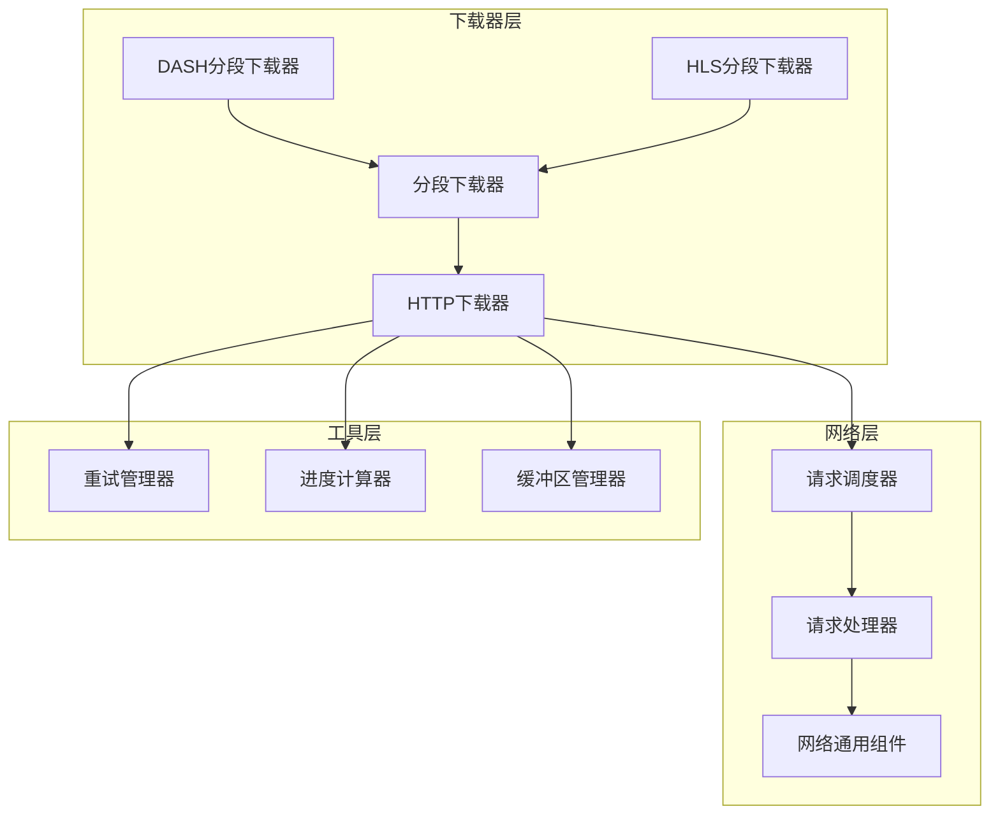
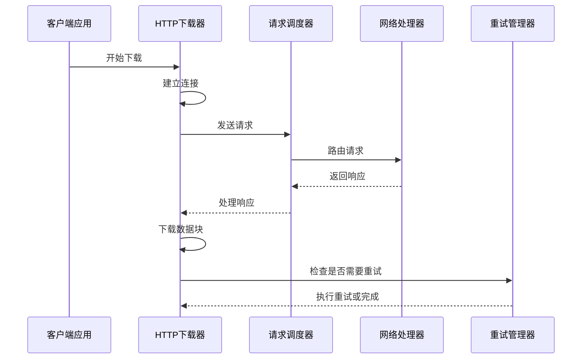
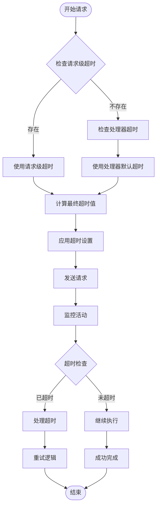
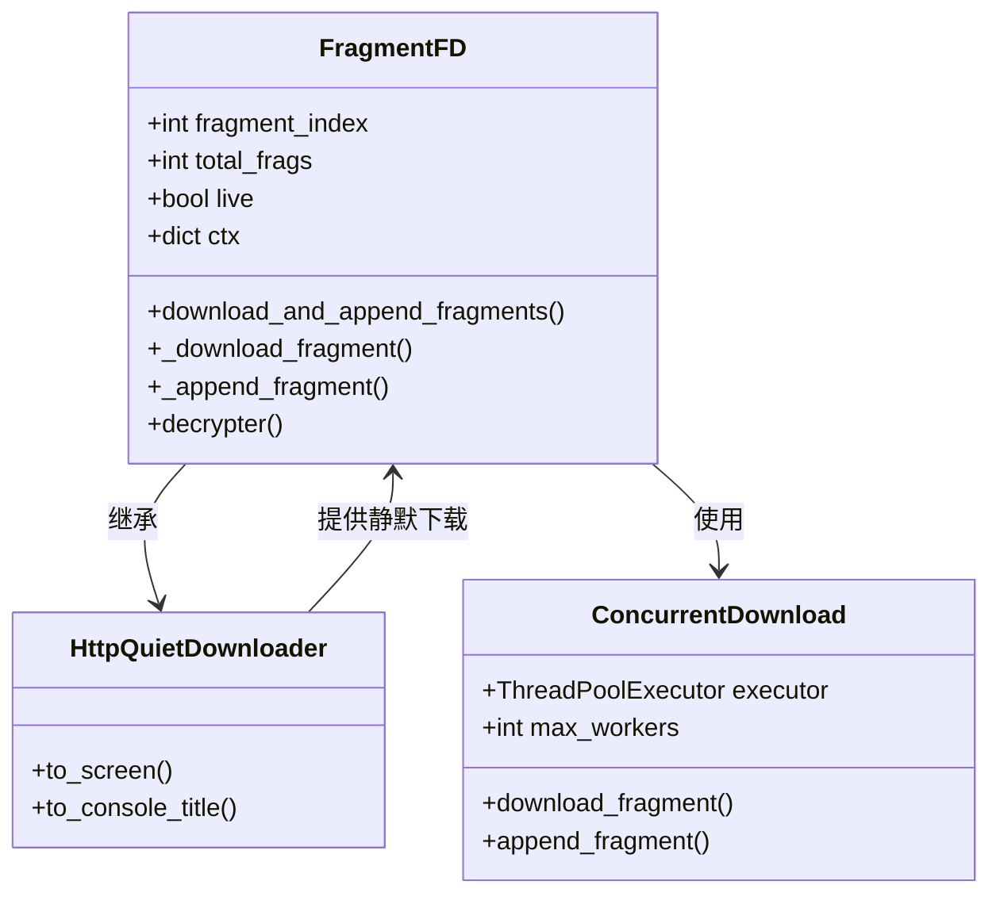
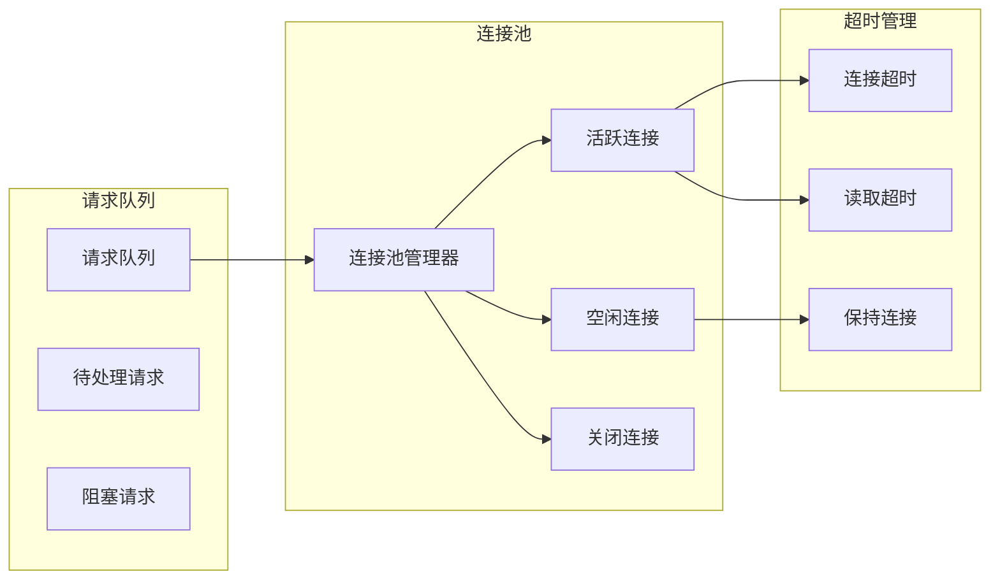
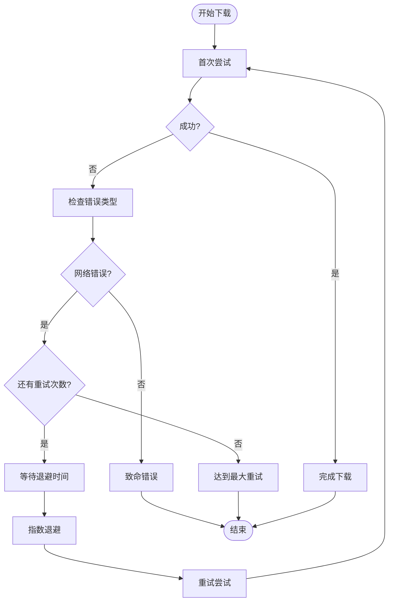
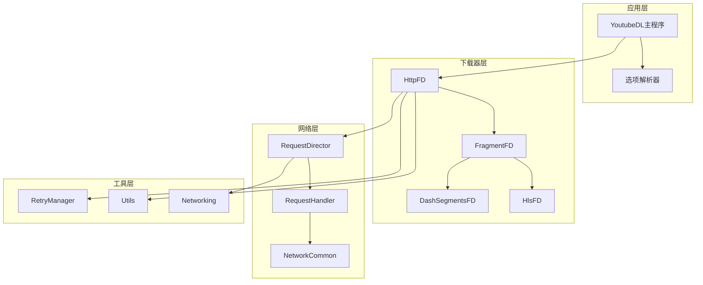

# 连接优化

<cite>
**本文档中引用的文件**
- [http.py](file://yt_dlp/downloader/http.py)
- [fragment.py](file://yt_dlp/downloader/fragment.py)
- [dash.py](file://yt_dlp/downloader/dash.py)
- [hls.py](file://yt_dlp/downloader/hls.py)
- [common.py](file://yt_dlp/networking/common.py)
- [_utils.py](file://yt_dlp/utils/_utils.py)
- [options.py](file://yt_dlp/options.py)
- [test_downloader_http.py](file://test/test_downloader_http.py)
- [test_networking.py](file://test/test_networking.py)
</cite>

## 目录
1. [简介](#简介)
2. [项目结构概览](#项目结构概览)
3. [核心组件分析](#核心组件分析)
4. [架构概览](#架构概览)
5. [详细组件分析](#详细组件分析)
6. [依赖关系分析](#依赖关系分析)
7. [性能考虑](#性能考虑)
8. [故障排除指南](#故障排除指南)
9. [结论](#结论)

## 简介

yt-dlp 的连接优化系统是一个高度模块化的网络下载框架，专门设计用于处理各种流媒体协议和大文件下载场景。该系统通过智能的连接管理、分段下载策略和错误恢复机制，实现了高效的网络资源利用和卓越的下载性能。

本文档深入探讨了连接优化的核心机制，包括连接超时管理、分段下载技术、HTTP/HTTPS连接复用以及针对不同网络环境的参数调优策略。

## 项目结构概览

yt-dlp 的连接优化系统采用分层架构设计，主要包含以下核心模块：



**图表来源**
- [http.py](file://yt_dlp/downloader/http.py#L1-L50)
- [fragment.py](file://yt_dlp/downloader/fragment.py#L1-L50)
- [common.py](file://yt_dlp/networking/common.py#L1-L100)

## 核心组件分析

### HTTP下载器 (HttpFD)

HTTP下载器是连接优化的核心组件，负责处理标准HTTP/HTTPS下载任务。它实现了智能的分块下载机制和断点续传功能。

#### 主要特性：
- **动态分块大小调整**：根据网络条件自动调整下载块大小
- **智能断点续传**：支持从任意字节位置继续下载
- **范围请求优化**：精确控制下载范围，减少带宽浪费
- **压缩禁用**：为大文件下载禁用不必要的内容编码

#### 关键算法：
- **块大小计算**：基于历史传输速度动态调整缓冲区大小
- **重试策略**：指数退避和线性回退相结合的重试机制
- **错误恢复**：自动检测和恢复各种网络错误

**章节来源**
- [http.py](file://yt_dlp/downloader/http.py#L15-L100)

### 分段下载器 (FragmentFD)

分段下载器是处理流媒体内容的核心组件，支持DASH、HLS等多种流媒体协议。

#### 核心功能：
- **并发分段下载**：多线程同时下载多个视频片段
- **片段状态跟踪**：维护详细的下载进度和状态信息
- **加密内容解密**：支持AES-128等常见加密算法
- **广告片段跳过**：智能识别和跳过广告内容

#### 技术特点：
- **.ytdl文件系统**：使用JSON格式保存下载状态
- **进度钩子系统**：实时更新下载进度和统计信息
- **内存优化**：及时清理已完成的片段文件

**章节来源**
- [fragment.py](file://yt_dlp/downloader/fragment.py#L20-L150)

### 协议特定下载器

#### DASH下载器
专门处理DASH（Dynamic Adaptive Streaming over HTTP）协议，支持自适应码率流。

#### HLS下载器  
处理HLS（HTTP Live Streaming）协议，支持Apple的流媒体标准。

**章节来源**
- [dash.py](file://yt_dlp/downloader/dash.py#L1-L50)
- [hls.py](file://yt_dlp/downloader/hls.py#L1-L100)

## 架构概览

连接优化系统采用事件驱动的异步架构，通过多层次的抽象实现灵活的网络处理能力：



**图表来源**
- [http.py](file://yt_dlp/downloader/http.py#L350-L377)
- [common.py](file://yt_dlp/networking/common.py#L80-L120)

## 详细组件分析

### 连接超时管理

#### 超时类型和配置

连接优化系统实现了多层次的超时管理机制：



**图表来源**
- [common.py](file://yt_dlp/networking/common.py#L280-L290)
- [test_networking.py](file://test/test_networking.py#L573-L601)

#### 超时参数配置

| 参数名称 | 默认值 | 描述 | 优化建议 |
|---------|--------|------|----------|
| `timeout` | 20秒 | 基础连接超时时间 | 高延迟网络：增加到30-60秒 |
| `connect_timeout` | 动态计算 | 连接建立超时 | 移动网络：增加到15秒 |
| `read_timeout` | 动态计算 | 数据读取超时 | 大文件下载：增加到60秒 |
| `fragment_retries` | 10次 | 分段重试次数 | 不稳定网络：增加到15次 |

**章节来源**
- [common.py](file://yt_dlp/networking/common.py#L280-L290)
- [http.py](file://yt_dlp/downloader/http.py#L72-L110)

### 分段下载工作原理

#### 分段下载流程

分段下载是连接优化的核心技术，特别适用于流媒体内容和大文件下载：



**图表来源**
- [fragment.py](file://yt_dlp/downloader/fragment.py#L20-L80)
- [fragment.py](file://yt_dlp/downloader/fragment.py#L430-L490)

#### DASH协议处理

DASH（Dynamic Adaptive Streaming over HTTP）协议的分段下载具有以下特点：

- **自适应码率**：根据网络状况选择合适的视频质量
- **并行下载**：同时下载多个质量级别的片段
- **无缝切换**：在不同质量级别间平滑切换

**章节来源**
- [dash.py](file://yt_dlp/downloader/dash.py#L15-L50)

#### HLS协议处理

HLS（HTTP Live Streaming）协议的分段下载支持：

- **M3U8清单解析**：解析播放列表文件
- **加密内容处理**：支持AES-128加密
- **广告片段过滤**：自动跳过广告内容

**章节来源**
- [hls.py](file://yt_dlp/downloader/hls.py#L15-L80)

### HTTP/HTTPS连接复用

#### 连接池管理

连接优化系统实现了智能的连接池管理机制：



**图表来源**
- [common.py](file://yt_dlp/networking/common.py#L150-L200)

#### 连接复用策略

| 策略类型 | 实现方式 | 性能收益 | 适用场景 |
|---------|----------|----------|----------|
| HTTP/1.1 Keep-Alive | 复用TCP连接 | 减少握手开销 | 多文件下载 |
| HTTP/2多路复用 | 单连接多流 | 避免队头阻塞 | 流媒体下载 |
| 连接预热 | 预先建立连接 | 减少首次访问延迟 | 频繁访问 |
| 连接池化 | 维护连接池 | 快速响应新请求 | 批量下载 |

**章节来源**
- [common.py](file://yt_dlp/networking/common.py#L150-L200)

### 错误恢复机制

#### 重试管理器

重试管理器实现了智能的错误恢复策略：



**图表来源**
- [http.py](file://yt_dlp/downloader/http.py#L350-L377)

#### 错误分类和处理

| 错误类型 | 处理策略 | 重试次数 | 回退时间 |
|---------|----------|----------|----------|
| 网络超时 | 指数退避 | 10次 | 1s → 10s |
| HTTP 4xx错误 | 直接失败 | 0次 | 不重试 |
| HTTP 5xx错误 | 线性回退 | 5次 | 5s → 25s |
| 连接中断 | 状态恢复 | 15次 | 1s → 30s |
| 内容不完整 | 断点续传 | 3次 | 2s → 6s |

**章节来源**
- [http.py](file://yt_dlp/downloader/http.py#L236-L270)

## 依赖关系分析

连接优化系统的依赖关系体现了清晰的分层架构：



**图表来源**
- [http.py](file://yt_dlp/downloader/http.py#L1-L20)
- [fragment.py](file://yt_dlp/downloader/fragment.py#L1-L20)
- [common.py](file://yt_dlp/networking/common.py#L1-L50)

**章节来源**
- [http.py](file://yt_dlp/downloader/http.py#L1-L377)
- [fragment.py](file://yt_dlp/downloader/fragment.py#L1-L527)
- [common.py](file://yt_dlp/networking/common.py#L1-L200)

## 性能考虑

### 缓冲区优化

连接优化系统实现了动态缓冲区管理策略：

- **自适应缓冲区大小**：根据网络速度动态调整
- **零拷贝优化**：减少内存复制操作
- **流式处理**：边下载边写入磁盘，减少内存占用

### 并发控制

- **线程池管理**：合理控制并发下载线程数量
- **资源限制**：防止过多并发导致系统资源耗尽
- **优先级调度**：重要文件优先下载

### 网络适配

针对不同网络环境的优化策略：

| 网络类型 | 推荐配置 | 优化重点 |
|---------|----------|----------|
| 高延迟网络 | 增加超时时间，减少并发数 | 降低超时阈值，启用连接复用 |
| 不稳定网络 | 增加重试次数，使用断点续传 | 启用更多重试，定期保存进度 |
| 大带宽网络 | 增加并发数，使用大缓冲区 | 最大化并发，优化缓冲区大小 |
| 移动网络 | 保守配置，启用压缩 | 减少重试，启用内容压缩 |

## 故障排除指南

### 常见问题诊断

#### 下载速度慢

**可能原因**：
- 缓冲区大小设置不当
- 并发下载数过多
- 网络拥塞或限速

**解决方案**：
- 调整 `buffersize` 参数
- 减少 `concurrent_fragment_downloads`
- 使用 `--retries` 增加重试次数

#### 连接频繁超时

**可能原因**：
- 超时设置过短
- 网络不稳定
- 服务器负载过高

**解决方案**：
- 增加 `timeout` 参数
- 启用连接复用
- 使用备用服务器地址

#### 分段下载失败

**可能原因**：
- 片段URL无效
- 加密密钥缺失
- 网络连接中断

**解决方案**：
- 检查 `skip_unavailable_fragments` 设置
- 验证加密密钥配置
- 增加 `fragment_retries` 参数

**章节来源**
- [http.py](file://yt_dlp/downloader/http.py#L215-L297)
- [fragment.py](file://yt_dlp/downloader/fragment.py#L430-L490)

### 性能调优建议

#### 高延迟网络环境

```bash
# 增加超时时间
yt-dlp --timeout 60 --retries 15 --fragment-retries 15

# 减少并发数避免网络拥塞
yt-dlp --concurrent-fragment-downloads 2

# 启用连接复用
yt-dlp --http-chunk-size 1048576
```

#### 大文件下载优化

```bash
# 使用较大的缓冲区
yt-dlp --buffersize 8M --http-chunk-size 4M

# 启用断点续传
yt-dlp --continuedl --retries 10

# 限制下载速度避免影响其他应用
yt-dlp --ratelimit 5M
```

#### 移动网络优化

```bash
# 保守配置
yt-dlp --timeout 30 --retries 5 --fragment-retries 3
yt-dlp --concurrent-fragment-downloads 1
yt-dlp --buffersize 1M
```

## 结论

yt-dlp的连接优化系统通过精心设计的分层架构和智能算法，实现了高效、可靠的网络下载功能。其核心优势包括：

1. **智能超时管理**：多层次的超时控制确保在网络波动时的稳定性
2. **高效的分段下载**：支持多种流媒体协议，实现并行下载和快速恢复
3. **强大的错误恢复**：完善的重试机制和状态恢复功能
4. **灵活的配置选项**：丰富的参数调节满足不同网络环境需求

通过合理配置这些优化参数，用户可以在各种网络条件下获得最佳的下载体验。对于开发者而言，这套系统提供了良好的扩展性和可维护性，便于添加新的协议支持和优化策略。

未来的改进方向包括：
- 更智能的网络预测算法
- 自适应的并发控制策略
- 更好的多协议协同优化
- 边缘计算支持的分布式下载