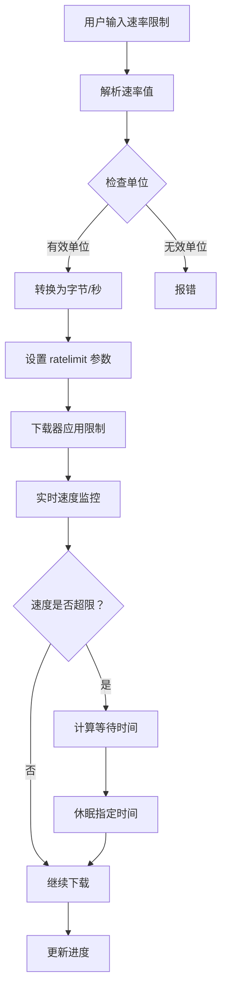
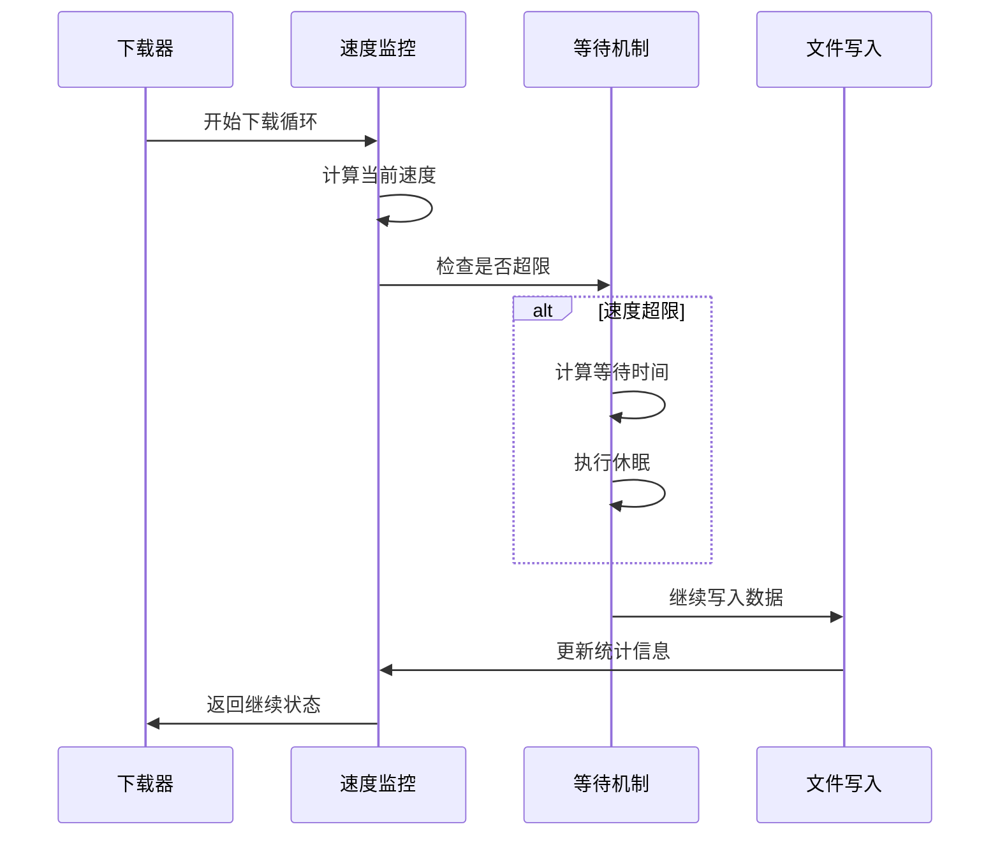
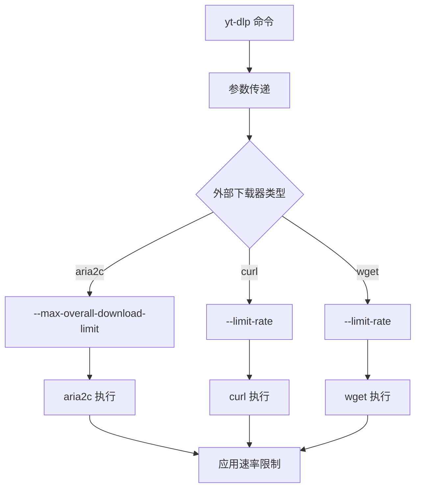
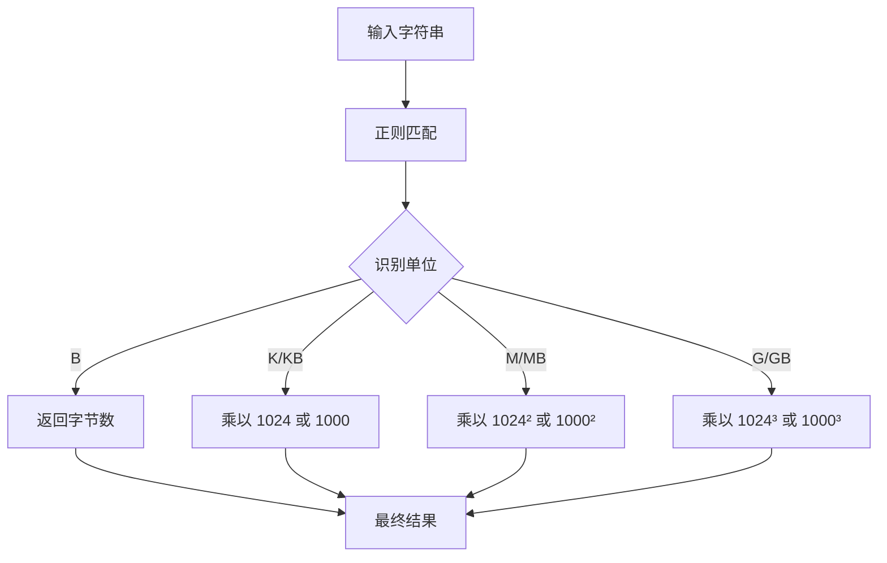
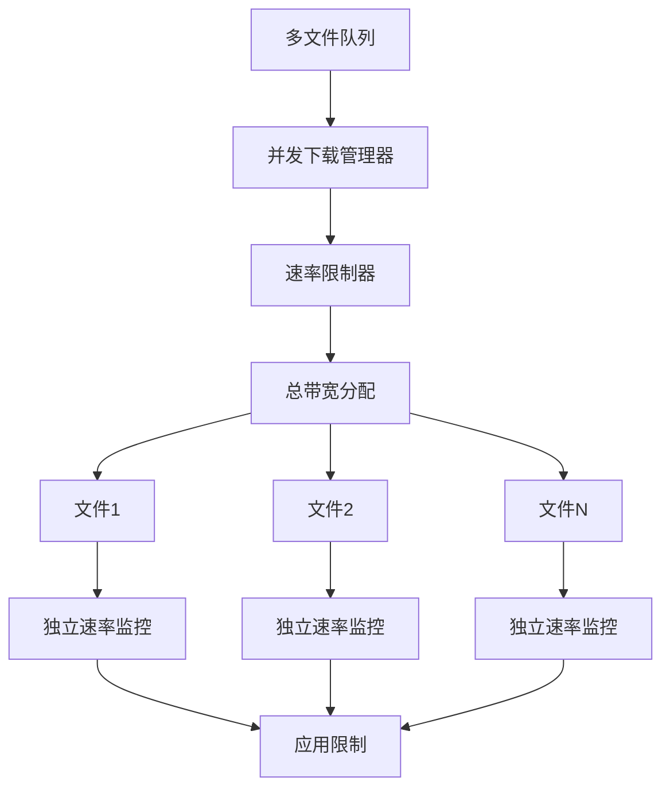
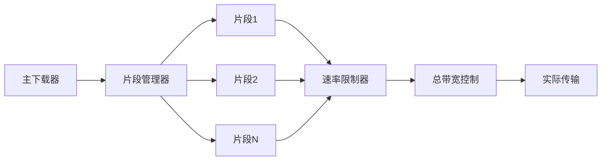
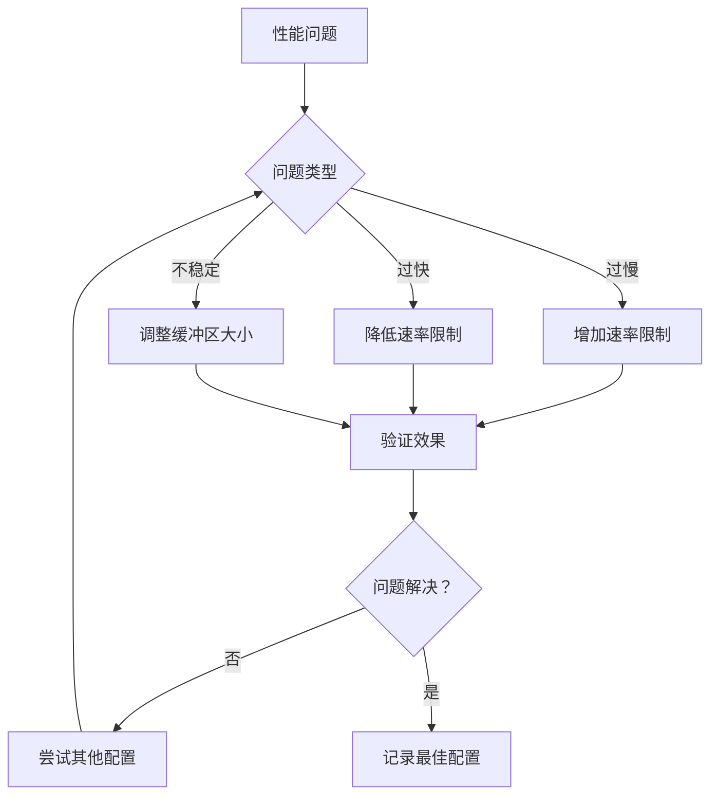

# 速率限制

<cite>
**本文档中引用的文件**
- [options.py](file://yt_dlp/options.py)
- [downloader/http.py](file://yt_dlp/downloader/http.py)
- [downloader/common.py](file://yt_dlp/downloader/common.py)
- [downloader/external.py](file://yt_dlp/downloader/external.py)
- [YoutubeDL.py](file://yt_dlp/YoutubeDL.py)
- [utils/_utils.py](file://yt_dlp/utils/_utils.py)
- [test/test_downloader_http.py](file://test/test_downloader_http.py)
- [README.md](file://README.md)
</cite>

## 目录
1. [简介](#简介)
2. [核心概念](#核心概念)
3. [命令行选项](#命令行选项)
4. [实现机制](#实现机制)
5. [单位支持](#单位支持)
6. [多文件下载场景](#多文件下载场景)
7. [与并行下载的关系](#与并行下载的关系)
8. [使用示例](#使用示例)
9. [常见问题](#常见问题)
10. [故障排除](#故障排除)
11. [总结](#总结)

## 简介

速率限制功能是 yt-dlp 中一个重要的网络控制特性，允许用户精确控制下载速度，防止网络拥塞，并在共享网络环境中优化带宽使用。该功能通过 `--limit-rate`（或 `-r`）选项实现，支持多种单位格式，并与外部下载器无缝集成。

## 核心概念

### 速率限制类型

yt-dlp 提供两种主要的速率控制机制：

1. **最大下载速率限制** (`--limit-rate`)
   - 设置下载速度的上限
   - 防止占用过多带宽
   - 支持动态调整

2. **节流检测阈值** (`--throttled-rate`)
   - 检测服务器端限速
   - 自动重新提取视频数据
   - 避免因服务器限速导致的下载失败

### 工作原理

速率限制通过以下步骤实现：
1. 实时监控下载速度
2. 计算当前传输速率
3. 根据设定的限制决定是否需要等待
4. 动态调整传输块大小

## 命令行选项

### 主要选项

```bash
-r, --limit-rate RATE
    最大下载速率，例如：50K、4.2M、100G
    单位可以是字节(B)、千字节(K)、兆字节(M)、吉字节(G)等

--throttled-rate RATE
    节流检测阈值，低于此速度时认为被限速
    默认值：100K
```

### 选项关系图



**图表来源**
- [options.py](file://yt_dlp/options.py#L961-L985)
- [downloader/common.py](file://yt_dlp/downloader/common.py#L200-L220)

**章节来源**
- [options.py](file://yt_dlp/options.py#L961-L985)
- [README.md](file://README.md#L522-L530)

## 实现机制

### 内部下载器实现

速率限制的核心实现在 `FileDownloader` 类的 `slow_down` 方法中：



**图表来源**
- [downloader/http.py](file://yt_dlp/downloader/http.py#L272-L297)
- [downloader/common.py](file://yt_dlp/downloader/common.py#L200-L220)

### 外部下载器集成

yt-dlp 的外部下载器（如 aria2c）也支持速率限制：



**图表来源**
- [downloader/external.py](file://yt_dlp/downloader/external.py#L294-L320)

**章节来源**
- [downloader/common.py](file://yt_dlp/downloader/common.py#L200-L220)
- [downloader/http.py](file://yt_dlp/downloader/http.py#L272-L297)

## 单位支持

### 支持的单位格式

yt-dlp 支持多种单位格式，包括二进制和十进制表示：

| 单位 | 数值 | 描述 |
|------|------|------|
| B | 1 | 字节 |
| K | 1024 | 千字节（二进制） |
| KB | 1000 | 千字节（十进制） |
| M | 1024² | 兆字节（二进制） |
| MB | 1000² | 兆字节（十进制） |
| G | 1024³ | 吉字节（二进制） |
| GB | 1000³ | 吉字节（十进制） |

### 解析机制



**图表来源**
- [utils/_utils.py](file://yt_dlp/utils/_utils.py#L1761-L1823)

**章节来源**
- [utils/_utils.py](file://yt_dlp/utils/_utils.py#L1761-L1823)

## 多文件下载场景

### 并发下载中的速率控制

在多文件下载场景中，速率限制的行为如下：



### 优先级处理

当多个文件同时下载时，yt-dlp 会：
1. 分配总带宽给所有活跃下载
2. 按需动态调整单个文件的传输速率
3. 确保总速率不超过设定限制

**章节来源**
- [YoutubeDL.py](file://yt_dlp/YoutubeDL.py#L3599-L3650)

## 与并行下载的关系

### 并发片段下载

对于支持分片的视频格式（DASH、HLS），速率限制与并发下载的关系：



### 性能考虑

- **单线程下载**：总速率等于限制值
- **多线程下载**：每个线程的平均速率小于限制值
- **自适应调整**：根据网络状况动态调整传输策略

**章节来源**
- [options.py](file://yt_dlp/options.py#L961-L985)

## 使用示例

### 基本用法

```bash
# 限制总下载速率为 50KB/s
yt-dlp -r 50K https://example.com/video

# 限制为 2MB/s
yt-dlp -r 2M https://example.com/video

# 限制为 100MB/s
yt-dlp -r 100M https://example.com/video
```

### 高级配置

```bash
# 在共享网络环境中使用
yt-dlp -r 10M --throttled-rate 5M https://example.com/video

# 与其他选项组合使用
yt-dlp -r 5M -N 4 --concurrent-fragments 2 https://example.com/video
```

### 外部下载器示例

```bash
# 使用 aria2c 并限制速率
yt-dlp -r 10M --downloader aria2c https://example.com/video

# 使用 curl 并限制速率
yt-dlp -r 5M --downloader curl https://example.com/video
```

### 批量下载示例

```bash
# 限制批量下载的总带宽
yt-dlp -r 20M -a urls.txt

# 在下载列表中应用速率限制
yt-dlp -r 15M --playlist-end 10 https://example.com/playlist
```

## 常见问题

### 速率限制不生效

**可能原因**：
1. 外部下载器未正确传递速率限制参数
2. 网络连接本身的速度限制
3. 服务器端的传输速率限制

**解决方案**：
```bash
# 检查外部下载器版本
yt-dlp --downloader aria2c --downloader-args aria2c:--version

# 尝试不同的外部下载器
yt-dlp -r 10M --downloader curl https://example.com/video
```

### 速率波动过大

**原因分析**：
- 网络不稳定
- 服务器响应时间变化
- 并发连接数过多

**解决策略**：
```bash
# 减少并发连接数
yt-dlp -r 5M -N 2 https://example.com/video

# 使用更保守的缓冲区大小
yt-dlp -r 10M --buffer-size 512K https://example.com/video
```

### 节流检测误报

**配置建议**：
```bash
# 增加节流检测阈值
yt-dlp -r 1M --throttled-rate 500K https://example.com/video

# 禁用节流检测
yt-dlp -r 1M --throttled-rate 0 https://example.com/video
```

## 故障排除

### 调试技巧

1. **启用详细日志**：
```bash
yt-dlp -v -r 10M https://example.com/video
```

2. **测试下载速度**：
```bash
# 测试不同速率设置的效果
yt-dlp -r 1M --test https://example.com/video
```

3. **监控网络使用**：
```bash
# 使用系统工具监控带宽使用
iftop -i eth0
```

### 性能优化



### 最佳实践

1. **渐进式测试**：从较低速率开始，逐步提高
2. **环境适配**：根据网络环境调整参数
3. **监控反馈**：持续监控下载性能和系统资源
4. **备份方案**：准备不同的配置以应对不同情况

## 总结

速率限制功能是 yt-dlp 中一个强大而灵活的特性，通过 `--limit-rate` 选项提供了精确的带宽控制能力。该功能不仅支持多种单位格式，还能与外部下载器无缝集成，在各种网络环境下都能发挥重要作用。

### 关键要点

- **精确控制**：支持从 KB 到 GB 的广泛速率范围
- **智能检测**：自动检测服务器限速并采取相应措施
- **兼容性好**：与所有主要外部下载器兼容
- **易于使用**：简单的命令行接口，无需复杂配置

### 应用场景

- **共享网络环境**：避免影响其他网络应用
- **移动设备**：节省流量和电池消耗
- **服务器下载**：防止带宽耗尽
- **批量下载**：合理分配网络资源

通过合理配置速率限制，用户可以在保证下载效率的同时，维护良好的网络环境，实现高效且负责任的媒体下载。