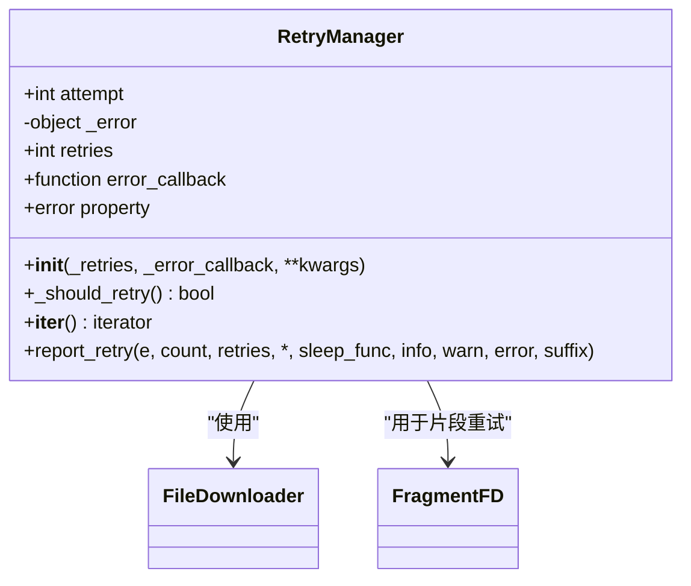
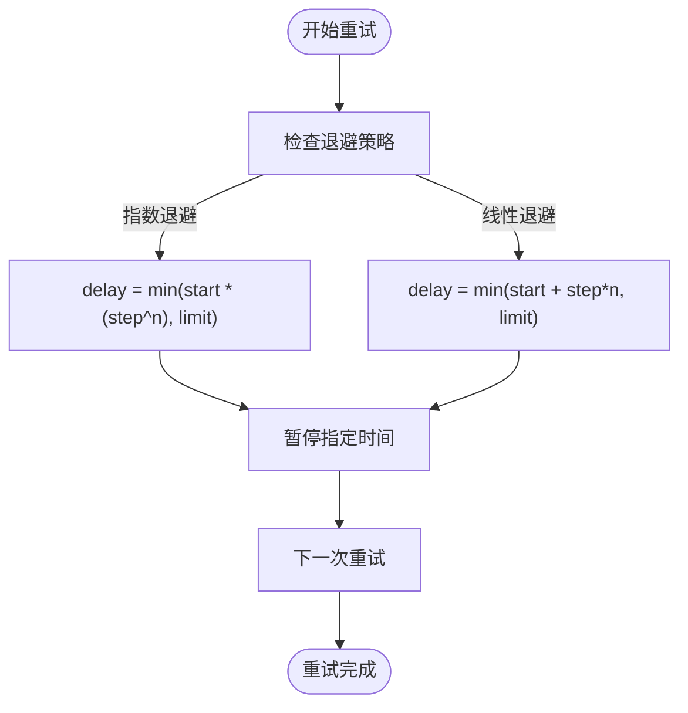

# 重试策略

<cite>
**本文档引用的文件**
- [fragment.py](file://yt_dlp/downloader/fragment.py)
- [common.py](file://yt_dlp/downloader/common.py)
- [__init__.py](file://yt_dlp/__init__.py)
- [_utils.py](file://yt_dlp/utils/_utils.py)
- [options.py](file://yt_dlp/options.py)
</cite>

## 目录
1. [简介](#简介)
2. [核心重试参数](#核心重试参数)
3. [重试机制实现](#重试机制实现)
4. [错误处理与重试触发](#错误处理与重试触发)
5. [重试间隔与退避策略](#重试间隔与退避策略)
6. [配置示例](#配置示例)
7. [日志与调试](#日志与调试)
8. [最佳实践](#最佳实践)

## 简介
yt-dlp 实现了一套复杂的重试机制，旨在提高在不稳定网络条件下下载大型视频的成功率。该系统通过多个层次的重试策略来应对不同类型的下载失败，包括整体下载重试、片段重试以及提取器重试。本文档深入分析 `--retries`、`--fragment-retries` 和 `--skip-unavailable-fragments` 等关键选项如何协同工作，以及背后的实现机制。

## 核心重试参数
yt-dlp 提供了多个重试相关的配置选项，这些选项在下载过程中扮演着关键角色：

- **--retries**: 控制整体下载的重试次数。当下载遇到网络错误时，此参数决定重试的次数。
- **--fragment-retries**: 专门针对分段下载（如 DASH 和 HLS 流）的片段重试次数。对于大型视频，此参数尤为重要。
- **--skip-unavailable-fragments**: 决定是否跳过无法下载的片段。当设置为 `True` 时，即使某些片段失败，下载仍可继续。

这些参数在初始化时通过 `parse_retries` 函数进行解析和设置，确保它们在下载过程中被正确应用。

**Section sources**
- [__init__.py](file://yt_dlp/__init__.py#L272-L297)
- [options.py](file://yt_dlp/options.py#L0-L799)

## 重试机制实现
yt-dlp 的重试机制基于 `RetryManager` 类实现，该类提供了一个迭代器接口，允许在发生异常时自动处理重试逻辑。



**Diagram sources**
- [_utils.py](file://yt_dlp/utils/_utils.py#L5225-L5278)
- [common.py](file://yt_dlp/downloader/common.py#L400-L519)

`RetryManager` 的核心工作流程如下：
1. 初始化时设置最大重试次数和错误回调函数
2. 在 `for` 循环中迭代，每次迭代代表一次重试机会
3. 当发生异常时，将异常赋值给 `retry.error` 并继续循环
4. 如果重试次数用尽，调用错误回调函数并终止

在片段下载器（`FragmentFD`）中，`RetryManager` 被用于处理单个片段的下载失败：

```mermaid
sequenceDiagram
participant Downloader as 分段下载器
participant RetryManager as 重试管理器
participant Network as 网络请求
Downloader->>RetryManager : 初始化(片段重试次数)
loop 每个重试尝试
RetryManager->>Downloader : 开始重试
Downloader->>Network : 下载片段
alt 下载成功
Network-->>Downloader : 返回成功
Downloader-->>RetryManager : 继续
break 下载完成
else 下载失败
Network-->>Downloader : 抛出异常
Downloader->>RetryManager : 设置错误并继续
end
end
alt 重试成功
RetryManager-->>Downloader : 返回成功
else 重试失败
RetryManager->>Downloader : 调用错误回调
end
```

**Diagram sources**
- [fragment.py](file://yt_dlp/downloader/fragment.py#L430-L490)
- [common.py](file://yt_dlp/downloader/common.py#L400-L519)

## 错误处理与重试触发
yt-dlp 的重试系统能够识别多种网络错误并相应地触发重试。主要的错误类型包括：

- **HTTPError**: HTTP 请求错误，如 5xx 服务器错误或 4xx 客户端错误
- **IncompleteRead**: 不完整的读取错误，通常发生在网络连接中断时
- **DownloadError**: 下载过程中的通用错误

当这些错误发生时，系统会根据配置的重试策略决定是否重试。例如，在 `download_and_append_fragments` 方法中，系统会捕获 `HTTPError` 和 `IncompleteRead` 异常，并通过 `RetryManager` 处理重试：

```python
for retry in RetryManager(self.params.get('fragment_retries'), error_callback):
    try:
        # 下载片段
        if not self._download_fragment(ctx, fragment['url'], info_dict, headers):
            return
    except (HTTPError, IncompleteRead) as err:
        retry.error = err
        continue
    except DownloadError:
        if fatal:
            raise
```

**Section sources**
- [fragment.py](file://yt_dlp/downloader/fragment.py#L458-L490)
- [_utils.py](file://yt_dlp/utils/_utils.py#L5225-L5278)

## 重试间隔与退避策略
yt-dlp 支持灵活的重试间隔配置，包括线性退避和指数退避两种模式。退避策略通过 `retry_sleep_functions` 参数进行配置：



**Diagram sources**
- [__init__.py](file://yt_dlp/__init__.py#L272-L297)
- [_utils.py](file://yt_dlp/utils/_utils.py#L5225-L5278)

退避表达式的格式为 `[linear|exp]=start[:limit][:step]`，例如：
- `exp=1:10:2` 表示指数退避，起始 1 秒，上限 10 秒，步长 2
- `linear=2:30` 表示线性退避，起始 2 秒，上限 30 秒

这种灵活的配置允许用户根据网络条件和服务器限制调整重试行为。

## 配置示例
以下是一些常见的重试配置示例，展示了如何平衡下载稳定性和时间成本：

### 高稳定性配置
```bash
yt-dlp --retries 20 --fragment-retries 15 --retry-sleep "exp=1:30:2" --skip-unavailable-fragments URL
```
此配置适用于极不稳定的网络环境，允许大量重试并使用指数退避减少服务器压力。

### 平衡配置
```bash
yt-dlp --retries 10 --fragment-retries 8 --retry-sleep "linear=2:15" URL
```
此配置在稳定性和效率之间取得平衡，适合大多数网络环境。

### 快速失败配置
```bash
yt-dlp --retries 3 --fragment-retries 2 --skip-unavailable-fragments URL
```
此配置适用于需要快速失败的场景，避免长时间等待。

**Section sources**
- [__init__.py](file://yt_dlp/__init__.py#L272-L297)
- [options.py](file://yt_dlp/options.py#L0-L799)

## 日志与调试
yt-dlp 提供了详细的日志信息来帮助用户识别重试行为。当重试发生时，系统会输出类似以下的信息：

```
[download] Got error: HTTP Error 503: Service Unavailable. Retrying fragment 5 (3/10)...
[download] Sleeping 4.00 seconds ...
```

这些日志信息包含了：
- 错误类型和消息
- 当前重试次数和总重试次数
- 片段编号（如果是片段重试）
- 睡眠时间

通过启用 `--verbose` 选项，用户可以获得更详细的调试信息，包括完整的堆栈跟踪。

**Section sources**
- [common.py](file://yt_dlp/downloader/common.py#L400-L519)
- [_utils.py](file://yt_dlp/utils/_utils.py#L5225-L5278)

## 最佳实践
基于对重试机制的分析，以下是使用 yt-dlp 重试功能的最佳实践：

1. **根据网络条件调整重试次数**: 在不稳定网络下增加 `--fragment-retries`，在稳定网络下减少以提高效率
2. **使用指数退避减轻服务器压力**: 避免使用过短的固定间隔，采用指数退避更友好
3. **合理使用 `--skip-unavailable-fragments`**: 对于大型视频，允许跳过少数片段可以显著提高下载成功率
4. **监控日志输出**: 通过日志了解重试模式，及时调整配置
5. **结合下载速度限制**: 使用 `--throttled-ratelimit` 避免因重试导致的带宽滥用

这些策略可以帮助用户在保证下载成功率的同时，优化下载时间和资源使用。

**Section sources**
- [fragment.py](file://yt_dlp/downloader/fragment.py)
- [common.py](file://yt_dlp/downloader/common.py)
- [__init__.py](file://yt_dlp/__init__.py)
- [_utils.py](file://yt_dlp/utils/_utils.py)