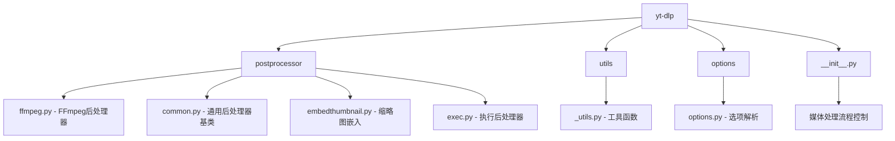
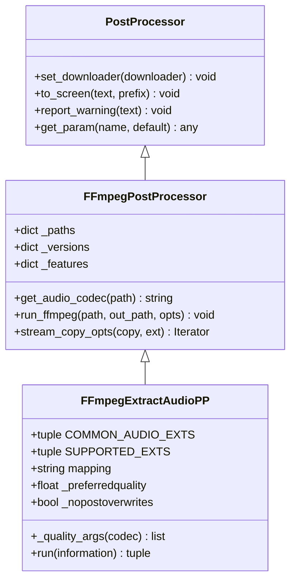
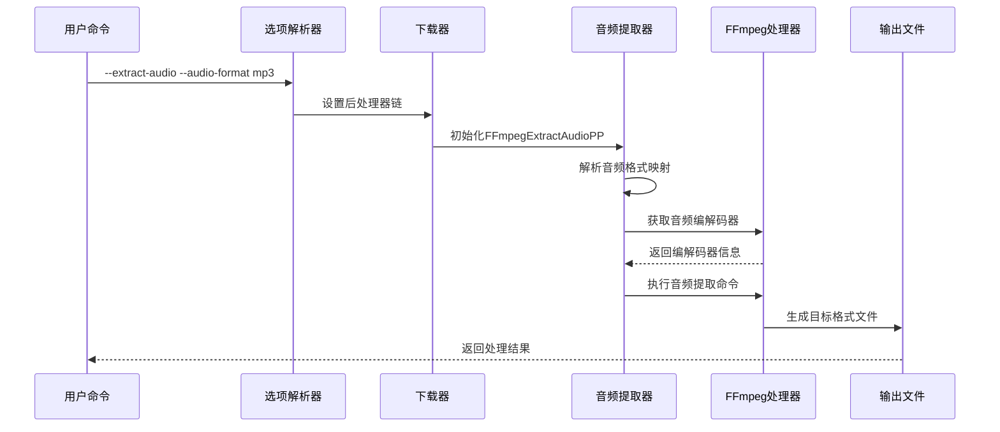
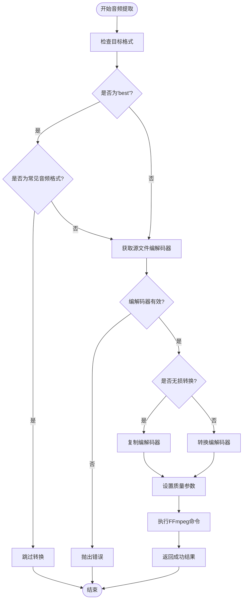
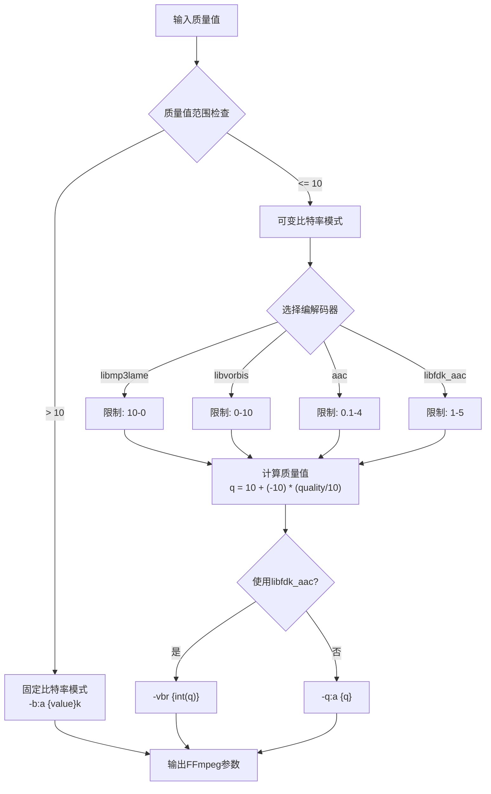
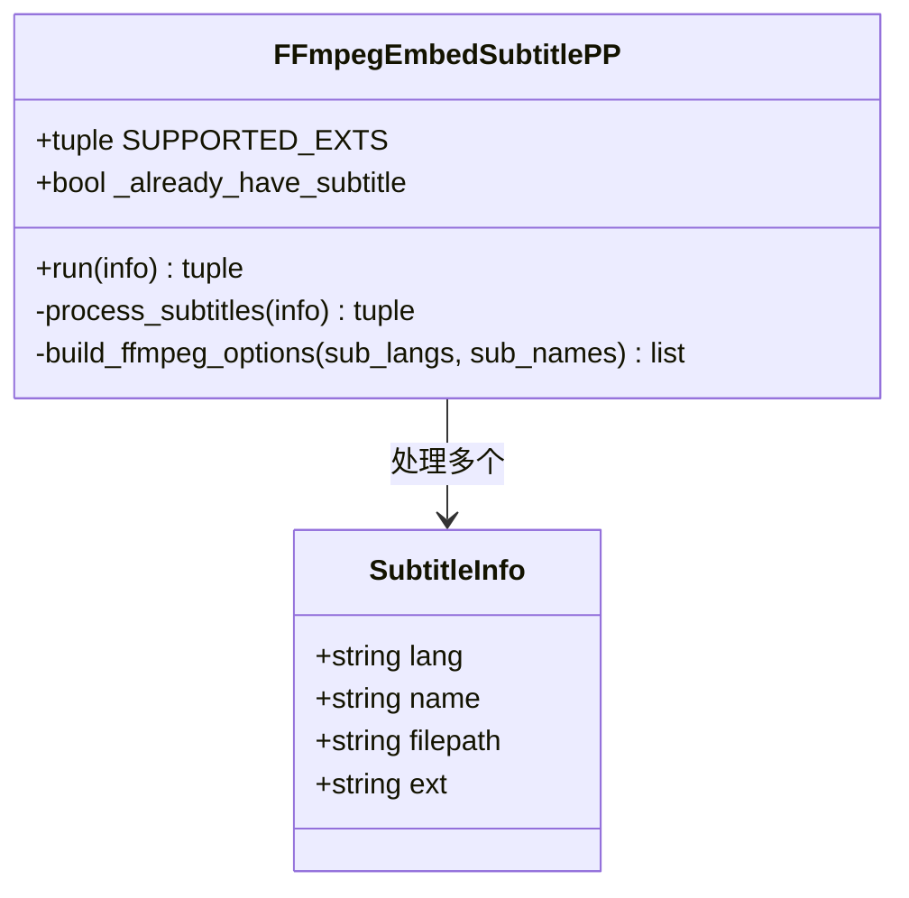
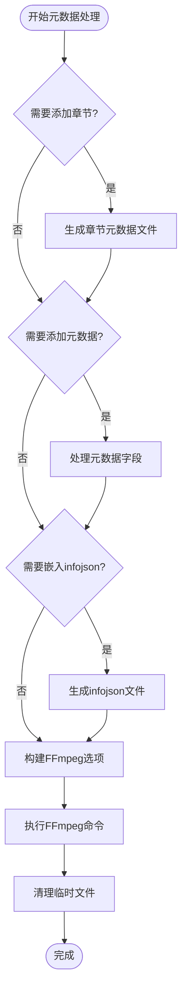
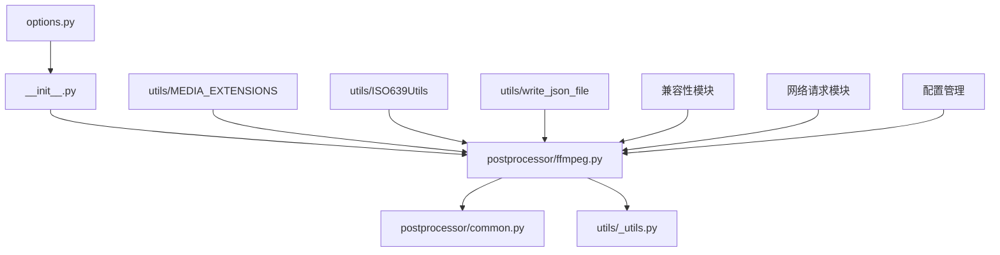
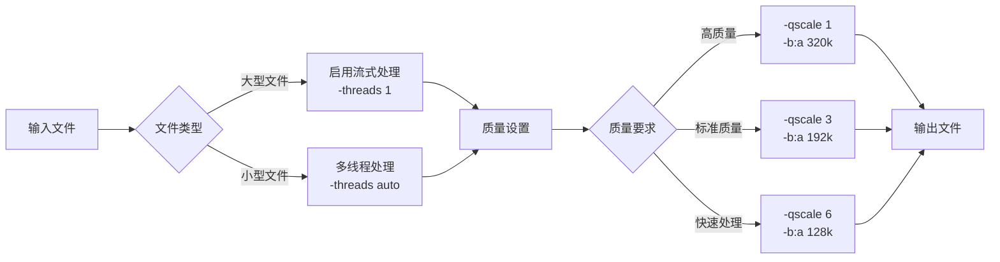

# 媒体处理功能详细文档

<cite>
**本文档中引用的文件**
- [yt_dlp/postprocessor/ffmpeg.py](file://yt_dlp/postprocessor/ffmpeg.py)
- [yt_dlp/postprocessor/common.py](file://yt_dlp/postprocessor/common.py)
- [yt_dlp/options.py](file://yt_dlp/options.py)
- [yt_dlp/__init__.py](file://yt_dlp/__init__.py)
- [yt_dlp/utils/_utils.py](file://yt_dlp/utils/_utils.py)
- [README.md](file://README.md)
</cite>

## 目录
1. [简介](#简介)
2. [项目结构概览](#项目结构概览)
3. [核心组件分析](#核心组件分析)
4. [架构概览](#架构概览)
5. [详细组件分析](#详细组件分析)
6. [依赖关系分析](#依赖关系分析)
7. [性能优化建议](#性能优化建议)
8. [故障排除指南](#故障排除指南)
9. [结论](#结论)

## 简介

yt-dlp是一个功能强大的媒体下载工具，其媒体处理功能涵盖了音频提取、视频转码和字幕嵌入等核心功能。本文档详细分析了这些功能的实现原理，重点解释了`--extract-audio`、`--audio-format`和`--audio-quality`等选项的工作机制，以及它们如何与FFmpeg后处理器协同工作。

## 项目结构概览

yt-dlp的媒体处理功能主要分布在以下关键目录中：

**图表来源**
- [yt_dlp/postprocessor/ffmpeg.py](file://yt_dlp/postprocessor/ffmpeg.py#L1-L50)
- [yt_dlp/postprocessor/common.py](file://yt_dlp/postprocessor/common.py#L1-L50)

**章节来源**
- [yt_dlp/postprocessor/ffmpeg.py](file://yt_dlp/postprocessor/ffmpeg.py#L1-L100)
- [yt_dlp/postprocessor/common.py](file://yt_dlp/postprocessor/common.py#L1-L100)

## 核心组件分析

### 音频提取核心类

yt-dlp的核心音频处理功能由`FFmpegExtractAudioPP`类实现，该类继承自`FFmpegPostProcessor`基类：

**图表来源**
- [yt_dlp/postprocessor/ffmpeg.py](file://yt_dlp/postprocessor/ffmpeg.py#L85-L425)
- [yt_dlp/postprocessor/ffmpeg.py](file://yt_dlp/postprocessor/ffmpeg.py#L428-L531)

### 支持的音频格式

系统支持多种音频格式，通过`ACODECS`常量定义：

| 格式 | 扩展名 | 编码器 | 特殊选项 |
|------|--------|--------|----------|
| MP3 | mp3 | libmp3lame | - |
| AAC | m4a | aac | adts格式 |
| M4A | m4a | aac | aac_adtstoasc |
| Opus | opus | libopus | - |
| Vorbis | ogg | libvorbis | - |
| FLAC | flac | flac | - |
| ALAC | m4a | alac | - |
| WAV | wav | - | wav格式 |

**章节来源**
- [yt_dlp/postprocessor/ffmpeg.py](file://yt_dlp/postprocessor/ffmpeg.py#L49-L59)

## 架构概览

媒体处理功能的整体架构采用管道模式，各个后处理器按顺序执行：

**图表来源**
- [yt_dlp/__init__.py](file://yt_dlp/__init__.py#L650-L670)
- [yt_dlp/postprocessor/ffmpeg.py](file://yt_dlp/postprocessor/ffmpeg.py#L472-L531)

**章节来源**
- [yt_dlp/__init__.py](file://yt_dlp/__init__.py#L650-L700)

## 详细组件分析

### 音频提取处理流程

音频提取的核心逻辑在`FFmpegExtractAudioPP.run`方法中实现：

**图表来源**
- [yt_dlp/postprocessor/ffmpeg.py](file://yt_dlp/postprocessor/ffmpeg.py#L472-L531)

### 音频质量控制系统

音频质量控制通过`_quality_args`方法实现，支持VBR和固定比特率两种模式：

**图表来源**
- [yt_dlp/postprocessor/ffmpeg.py](file://yt_dlp/postprocessor/ffmpeg.py#L445-L470)

### 字幕嵌入功能

字幕嵌入功能通过`FFmpegEmbedSubtitlePP`类实现，支持多种容器格式：

**图表来源**
- [yt_dlp/postprocessor/ffmpeg.py](file://yt_dlp/postprocessor/ffmpeg.py#L569-L664)

**章节来源**
- [yt_dlp/postprocessor/ffmpeg.py](file://yt_dlp/postprocessor/ffmpeg.py#L569-L664)

### 元数据处理功能

元数据处理通过`FFmpegMetadataPP`类实现，支持章节、缩略图和信息JSON的嵌入：

**图表来源**
- [yt_dlp/postprocessor/ffmpeg.py](file://yt_dlp/postprocessor/ffmpeg.py#L666-L800)

**章节来源**
- [yt_dlp/postprocessor/ffmpeg.py](file://yt_dlp/postprocessor/ffmpeg.py#L666-L800)

## 依赖关系分析

媒体处理功能的依赖关系复杂，涉及多个模块的协作：

**图表来源**
- [yt_dlp/options.py](file://yt_dlp/options.py#L1-L50)
- [yt_dlp/__init__.py](file://yt_dlp/__init__.py#L1-L50)

**章节来源**
- [yt_dlp/options.py](file://yt_dlp/options.py#L1-L100)
- [yt_dlp/__init__.py](file://yt_dlp/__init__.py#L1-L100)

## 性能优化建议

### 音频质量与文件大小平衡

根据不同的使用场景，推荐以下音频质量设置：

| 使用场景 | 推荐质量 | 比特率范围 | 文件大小影响 |
|----------|----------|------------|--------------|
| 高质量音乐收藏 | 0-3 | 128-320 kbps | 较大 |
| 日常播放 | 4-6 | 96-192 kbps | 中等 |
| 移动设备存储 | 7-9 | 64-128 kbps | 较小 |
| 节省带宽 | 10 | 固定32 kbps | 最小 |

### FFmpeg参数优化

针对不同场景的FFmpeg参数建议：

### 内存使用优化

对于内存受限的环境，建议：

1. **分块处理大文件**：使用`--split-chapters`选项
2. **降低并发度**：减少FFmpeg进程数量
3. **及时清理临时文件**：确保磁盘空间充足

## 故障排除指南

### 常见问题及解决方案

| 问题描述 | 可能原因 | 解决方案 |
|----------|----------|----------|
| 音频提取失败 | FFmpeg未安装或路径错误 | 检查`--ffmpeg-location`参数 |
| 质量设置无效 | 编解码器不支持指定质量 | 检查编解码器支持的质量范围 |
| 字幕嵌入失败 | 容器格式不支持字幕 | 使用支持字幕的格式（mp4, mkv） |
| 元数据丢失 | FFmpeg版本过旧 | 升级到最新版本的FFmpeg |

### 调试技巧

1. **启用详细日志**：使用`--verbose`参数
2. **检查FFmpeg版本**：确认支持的功能特性
3. **验证文件权限**：确保读写权限正常
4. **测试基本功能**：先尝试简单的转换操作

**章节来源**
- [yt_dlp/postprocessor/ffmpeg.py](file://yt_dlp/postprocessor/ffmpeg.py#L150-L200)

## 结论

yt-dlp的媒体处理功能通过精心设计的架构实现了高效、灵活的音频提取、视频转码和字幕嵌入功能。其基于FFmpeg的强大后处理器系统不仅提供了丰富的格式支持，还通过智能的质量控制和优化策略，在保证处理质量的同时最大化了效率。

通过深入理解这些核心组件的工作原理，用户可以更好地利用yt-dlp的各项功能，根据具体需求调整参数设置，获得最佳的媒体处理体验。随着FFmpeg功能的不断更新，这些后处理器也将持续演进，为用户提供更加完善的媒体处理解决方案。