# 字幕处理功能详细文档

<cite>
**本文档中引用的文件**
- [test/test_subtitles.py](file://test/test_subtitles.py)
- [yt_dlp/options.py](file://yt_dlp/options.py)
- [yt_dlp/YoutubeDL.py](file://yt_dlp/YoutubeDL.py)
- [yt_dlp/postprocessor/ffmpeg.py](file://yt_dlp/postprocessor/ffmpeg.py)
- [yt_dlp/webvtt.py](file://yt_dlp/webvtt.py)
- [yt_dlp/utils/_utils.py](file://yt_dlp/utils/_utils.py)
- [yt_dlp/utils/traversal.py](file://yt_dlp/utils/traversal.py)
- [yt_dlp/utils/_utils.py](file://yt_dlp/utils/_utils.py)
- [yt_dlp/extractor/bilibili.py](file://yt_dlp/extractor/bilibili.py)
- [yt_dlp/extractor/youtube/_video.py](file://yt_dlp/extractor/youtube/_video.py)
</cite>

## 目录
1. [简介](#简介)
2. [核心配置选项](#核心配置选项)
3. [字幕下载流程](#字幕下载流程)
4. [字幕格式支持](#字幕格式支持)
5. [FFmpeg字幕嵌入机制](#ffmpeg字幕嵌入机制)
6. [语言选择与过滤](#语言选择与过滤)
7. [字幕格式转换](#字幕格式转换)
8. [实际使用示例](#实际使用示例)
9. [常见问题与解决方案](#常见问题与解决方案)
10. [架构设计分析](#架构设计分析)

## 简介

yt-dlp的字幕处理功能是一个复杂而强大的系统，支持从多种在线平台下载字幕、转换格式、嵌入视频文件等多个环节。该系统通过多个组件协同工作，实现了完整的字幕生命周期管理。

主要功能包括：
- 多平台字幕数据提取
- 支持多种字幕格式（SRT、VTT、ASS、TTML等）
- 字幕格式自动转换
- FFmpeg驱动的字幕嵌入
- 智能语言选择和过滤
- 时间轴同步处理

## 核心配置选项

### 主要字幕选项

yt-dlp提供了丰富的字幕相关命令行选项：

| 选项 | 功能描述 | 默认值 |
|------|----------|--------|
| `--write-subs` / `--write-srt` | 下载指定语言的字幕 | false |
| `--write-auto-subs` / `--write-automatic-subs` | 下载自动生成的字幕 | false |
| `--all-subs` | 下载所有可用字幕 | false |
| `--list-subs` | 列出可用字幕而不下载 | false |
| `--sub-format` | 指定字幕格式优先级 | best |
| `--sub-langs` / `--srt-langs` | 指定下载的语言列表 | en |

### 高级字幕选项

| 选项 | 功能描述 | 使用场景 |
|------|----------|----------|
| `--embed-subs` | 将字幕嵌入视频文件 | 需要字幕轨道的视频格式 |
| `--no-keep-subs` | 删除已嵌入的字幕文件 | 减少磁盘空间占用 |
| `--sub-lang` regex模式 | 支持正则表达式匹配语言 | 复杂语言筛选需求 |

**节来源**
- [yt_dlp/options.py](file://yt_dlp/options.py#L950-L1000)

## 字幕下载流程

### 整体架构

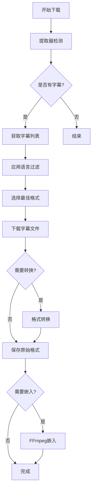

**图表来源**
- [yt_dlp/YoutubeDL.py](file://yt_dlp/YoutubeDL.py#L4333-L4387)
- [yt_dlp/postprocessor/ffmpeg.py](file://yt_dlp/postprocessor/ffmpeg.py#L577-L655)

### 字幕提取过程

字幕提取过程涉及多个步骤：

1. **平台特定处理**：不同平台有不同的字幕API和格式
2. **语言映射**：将平台语言代码转换为标准ISO代码
3. **格式协商**：根据用户偏好选择最佳格式
4. **质量评估**：评估字幕质量和完整性

**节来源**
- [yt_dlp/YoutubeDL.py](file://yt_dlp/YoutubeDL.py#L3078-L3096)
- [yt_dlp/extractor/bilibili.py](file://yt_dlp/extractor/bilibili.py#L2074-L2113)

## 字幕格式支持

### 支持的字幕格式

yt-dlp支持广泛的字幕格式：

| 格式 | 扩展名 | 特点 | 应用场景 |
|------|--------|------|----------|
| SRT | .srt | 简单文本格式，兼容性好 | 通用字幕 |
| VTT | .vtt | WebVTT格式，支持样式 | 现代Web应用 |
| ASS | .ass | 高级字幕格式，支持样式 | 专业字幕制作 |
| TTML | .ttml | XML格式，结构化数据 | 电视广播 |
| DFXP | .dfxp | XML格式，技术规范 | 数字出版 |
| JSON | .json | 结构化数据，机器友好 | 数据交换 |

### 格式特性对比

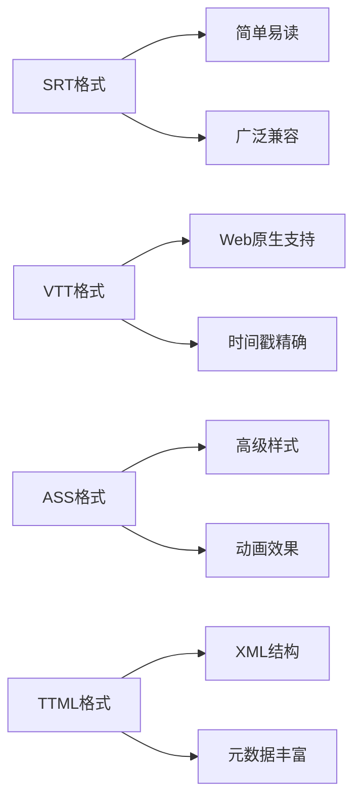

**图表来源**
- [yt_dlp/postprocessor/ffmpeg.py](file://yt_dlp/postprocessor/ffmpeg.py#L926-L999)

**节来源**
- [yt_dlp/postprocessor/ffmpeg.py](file://yt_dlp/postprocessor/ffmpeg.py#L926-L999)

## FFmpeg字幕嵌入机制

### 嵌入流程

FFmpeg字幕嵌入是一个精密的过程，确保字幕与视频完美同步：

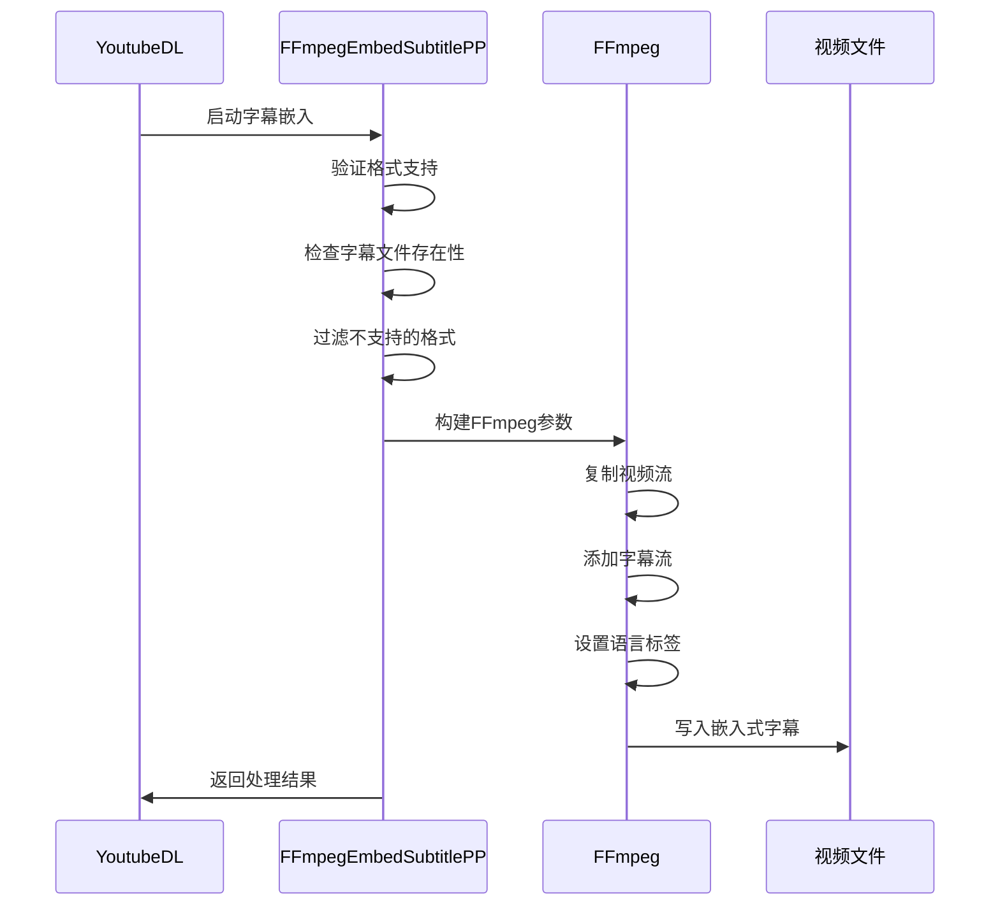

**图表来源**
- [yt_dlp/postprocessor/ffmpeg.py](file://yt_dlp/postprocessor/ffmpeg.py#L577-L655)

### 支持的容器格式

| 容器格式 | 字幕支持 | 注意事项 |
|----------|----------|----------|
| MP4 | VTT、SRT | ASS可能有问题 |
| MOV | VTT、SRT、ASS | 完全支持 |
| MKV | 所有格式 | 最佳兼容性 |
| WebM | VTT | 仅支持VTT格式 |
| MKA | 所有格式 | 音频容器 |

### 语言标签处理

FFmpeg嵌入器会正确设置字幕的语言标签：

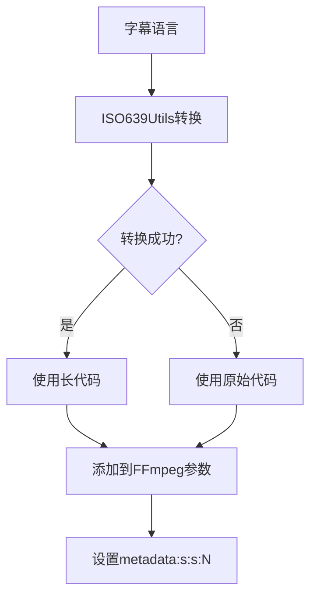

**图表来源**
- [yt_dlp/postprocessor/ffmpeg.py](file://yt_dlp/postprocessor/ffmpeg.py#L630-L664)

**节来源**
- [yt_dlp/postprocessor/ffmpeg.py](file://yt_dlp/postprocessor/ffmpeg.py#L577-L655)

## 语言选择与过滤

### 语言选择算法

yt-dlp采用智能的语言选择策略：

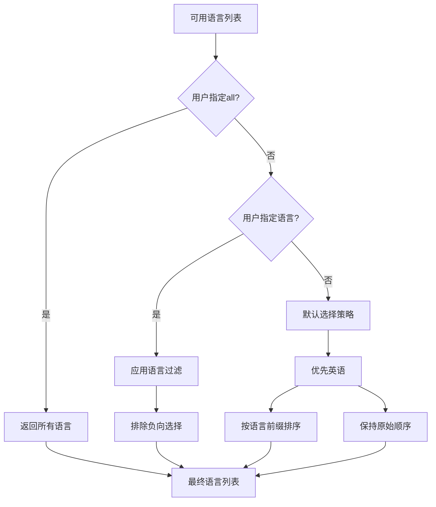

**图表来源**
- [yt_dlp/YoutubeDL.py](file://yt_dlp/YoutubeDL.py#L3078-L3096)

### 语言过滤语法

| 语法 | 示例 | 说明 |
|------|------|------|
| 具体语言 | `en,fr,de` | 下载指定语言 |
| 正则表达式 | `en.*,fr.*` | 匹配语言前缀 |
| 排除语言 | `-en,-fr` | 排除指定语言 |
| 组合使用 | `all,-live_chat` | 下载所有但排除某些 |

### 语言代码转换

系统使用ISO639Utils进行语言代码转换：

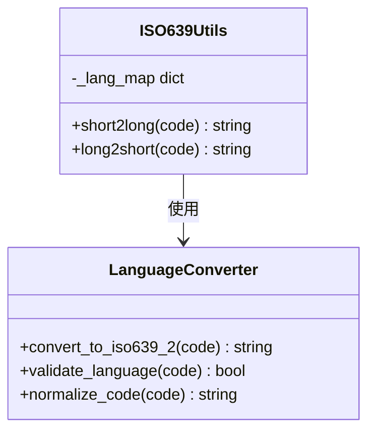

**图表来源**
- [yt_dlp/utils/_utils.py](file://yt_dlp/utils/_utils.py#L3611-L3814)

**节来源**
- [yt_dlp/YoutubeDL.py](file://yt_dlp/YoutubeDL.py#L3078-L3096)
- [yt_dlp/utils/_utils.py](file://yt_dlp/utils/_utils.py#L3611-L3814)

## 字幕格式转换

### 转换流程

字幕格式转换通过FFmpeg实现，支持多种格式间的转换：

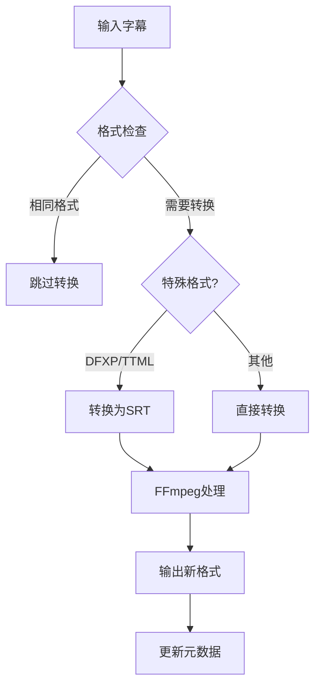

**图表来源**
- [yt_dlp/postprocessor/ffmpeg.py](file://yt_dlp/postprocessor/ffmpeg.py#L926-L999)

### 特殊格式处理

对于某些特殊格式，系统会进行额外处理：

| 格式 | 处理方式 | 注意事项 |
|------|----------|----------|
| DFXP/TTML | 转换为SRT | 样式信息丢失 |
| JSON | 不支持转换 | 需要手动处理 |
| ASS | 直接转换 | 可能需要额外参数 |

### WebVTT解析

系统内置了WebVTT解析器，用于处理WebVTT格式的字幕：

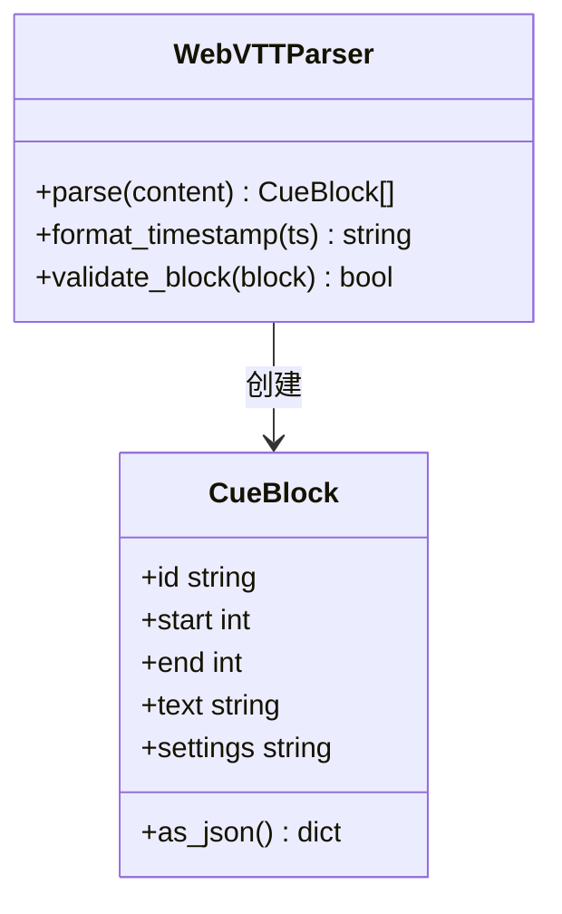

**图表来源**
- [yt_dlp/webvtt.py](file://yt_dlp/webvtt.py#L150-L398)

**节来源**
- [yt_dlp/postprocessor/ffmpeg.py](file://yt_dlp/postprocessor/ffmpeg.py#L926-L999)
- [yt_dlp/webvtt.py](file://yt_dlp/webvtt.py#L150-L398)

## 实际使用示例

### 基础字幕下载

```bash
# 下载英语字幕
yt-dlp --write-subs --sub-langs en URL

# 下载所有可用字幕
yt-dlp --write-subs --all-subs URL

# 下载自动字幕
yt-dlp --write-auto-subs URL
```

### 高级字幕处理

```bash
# 下载多种语言并转换格式
yt-dlp --write-subs --sub-langs "en,fr,de" \
       --sub-format "vtt/srt" \
       URL

# 嵌入字幕到视频文件
yt-dlp --write-subs --embed-subs \
       --sub-langs all \
       URL
```

### 批量处理示例

```bash
# 下载播放列表的所有字幕
yt-dlp --write-subs --all-subs \
       --sub-langs "en,ja,zh.*" \
       --output "%(title)s.%(ext)s.%(language)s.%(ext)s" \
       PLAYLIST_URL
```

### 字幕文件命名规则

字幕文件遵循以下命名规则：

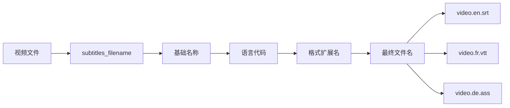

**图表来源**
- [yt_dlp/utils/_utils.py](file://yt_dlp/utils/_utils.py#L1305-L1306)

**节来源**
- [test/test_subtitles.py](file://test/test_subtitles.py#L88-L108)
- [yt_dlp/utils/_utils.py](file://yt_dlp/utils/_utils.py#L1305-L1306)

## 常见问题与解决方案

### 字幕乱码问题

**问题描述**：下载的字幕文件出现乱码或字符显示异常。

**解决方案**：
1. 确保系统编码设置正确
2. 使用UTF-8编码保存字幕文件
3. 检查源字幕是否使用正确的编码

### 时间轴错位问题

**问题描述**：字幕与视频播放不同步。

**解决方案**：
1. 检查视频时长是否准确
2. 验证字幕时间戳格式
3. 使用FFmpeg重新同步字幕

### 嵌入失败问题

**问题描述**：字幕无法成功嵌入视频文件。

**解决方案**：
1. 确认容器格式支持嵌入
2. 检查字幕文件是否存在且可访问
3. 验证FFmpeg版本和编译选项

### 多语言字幕处理

**问题描述**：需要处理多种语言的字幕。

**解决方案**：
1. 使用语言过滤器精确控制
2. 利用正则表达式匹配语言
3. 批量处理多个语言

### 性能优化建议

| 优化项 | 建议 | 效果 |
|--------|------|------|
| 并发下载 | 限制同时下载的字幕数量 | 减少网络压力 |
| 缓存机制 | 启用字幕缓存 | 避免重复下载 |
| 格式选择 | 优先选择轻量格式 | 提高处理速度 |

**节来源**
- [yt_dlp/YoutubeDL.py](file://yt_dlp/YoutubeDL.py#L4349-L4372)

## 架构设计分析

### 模块化设计

yt-dlp的字幕处理系统采用模块化设计，各组件职责明确：

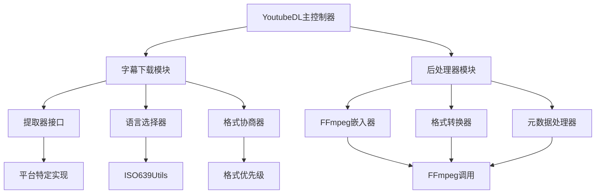

**图表来源**
- [yt_dlp/YoutubeDL.py](file://yt_dlp/YoutubeDL.py#L4333-L4387)
- [yt_dlp/postprocessor/ffmpeg.py](file://yt_dlp/postprocessor/ffmpeg.py#L577-L655)

### 扩展性设计

系统设计考虑了未来的扩展需求：

1. **插件化架构**：支持新的字幕格式和平台
2. **配置驱动**：通过配置文件定制行为
3. **错误恢复**：完善的错误处理和重试机制
4. **性能监控**：实时监控处理进度和性能指标

### 数据流设计

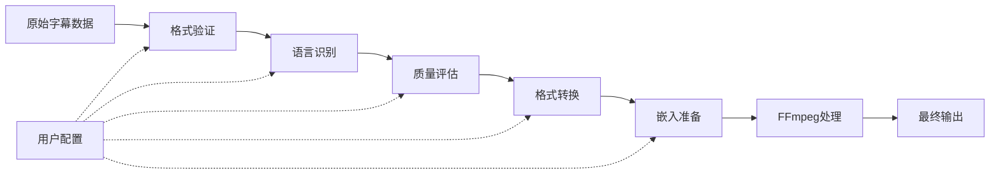

**图表来源**
- [yt_dlp/YoutubeDL.py](file://yt_dlp/YoutubeDL.py#L4333-L4387)

### 错误处理机制

系统实现了多层次的错误处理：

1. **提取层错误**：处理API调用失败
2. **转换层错误**：处理格式转换异常
3. **嵌入层错误**：处理FFmpeg执行错误
4. **文件层错误**：处理文件操作异常

**节来源**
- [yt_dlp/YoutubeDL.py](file://yt_dlp/YoutubeDL.py#L4333-L4387)
- [yt_dlp/postprocessor/ffmpeg.py](file://yt_dlp/postprocessor/ffmpeg.py#L577-L655)

## 总结

yt-dlp的字幕处理功能是一个功能完整、设计精良的系统。它不仅支持多种字幕格式和平台，还提供了灵活的配置选项和强大的处理能力。通过FFmpeg的强大功能，系统能够实现高质量的字幕嵌入和转换，满足各种使用场景的需求。

系统的模块化设计使其易于维护和扩展，而完善的错误处理机制确保了处理过程的稳定性。无论是简单的字幕下载还是复杂的批量处理任务，yt-dlp都能提供可靠高效的解决方案。