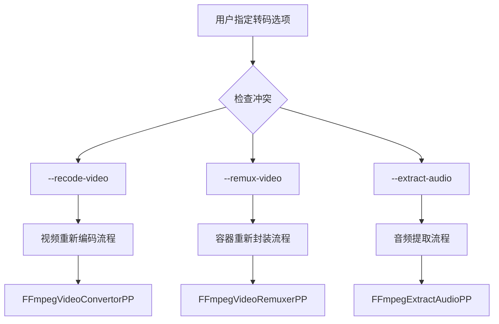
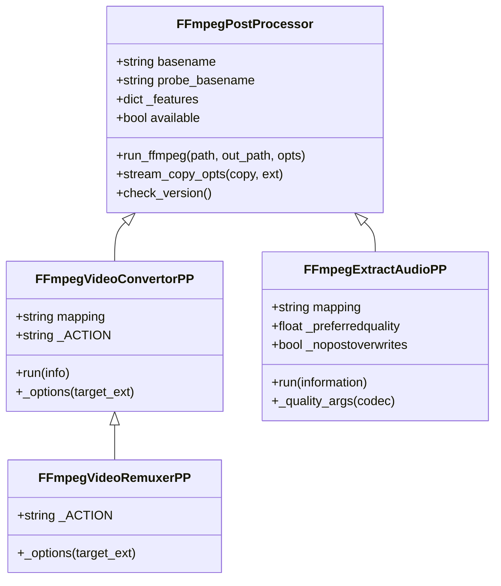
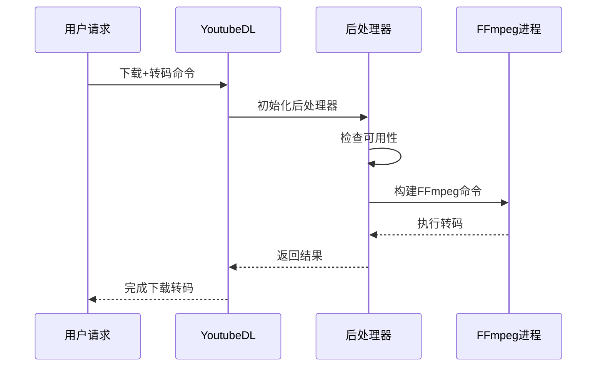
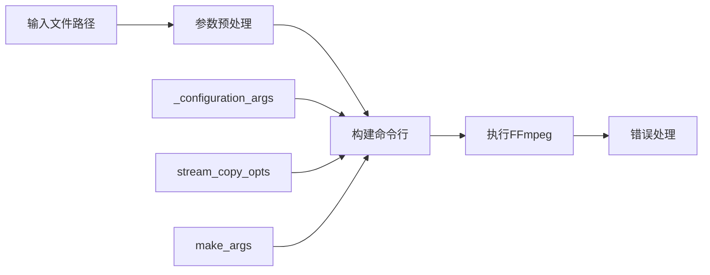
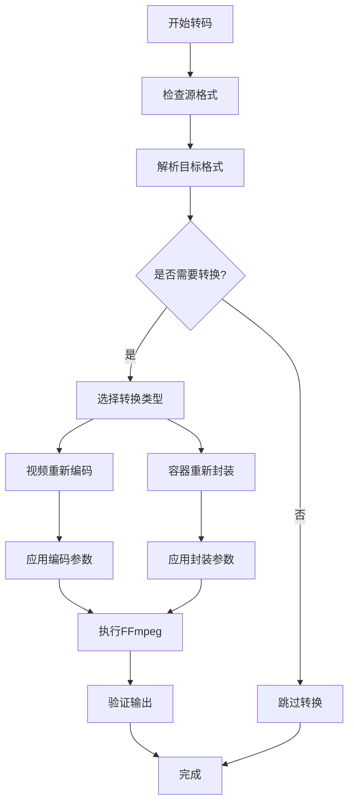
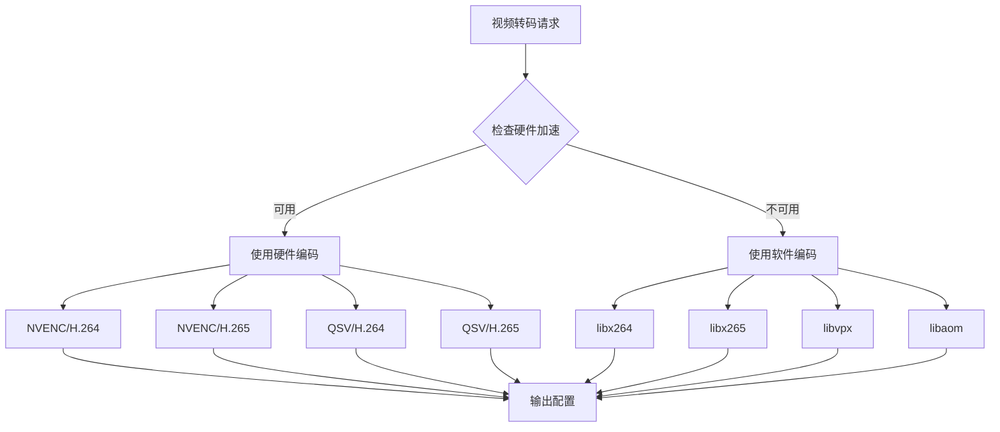
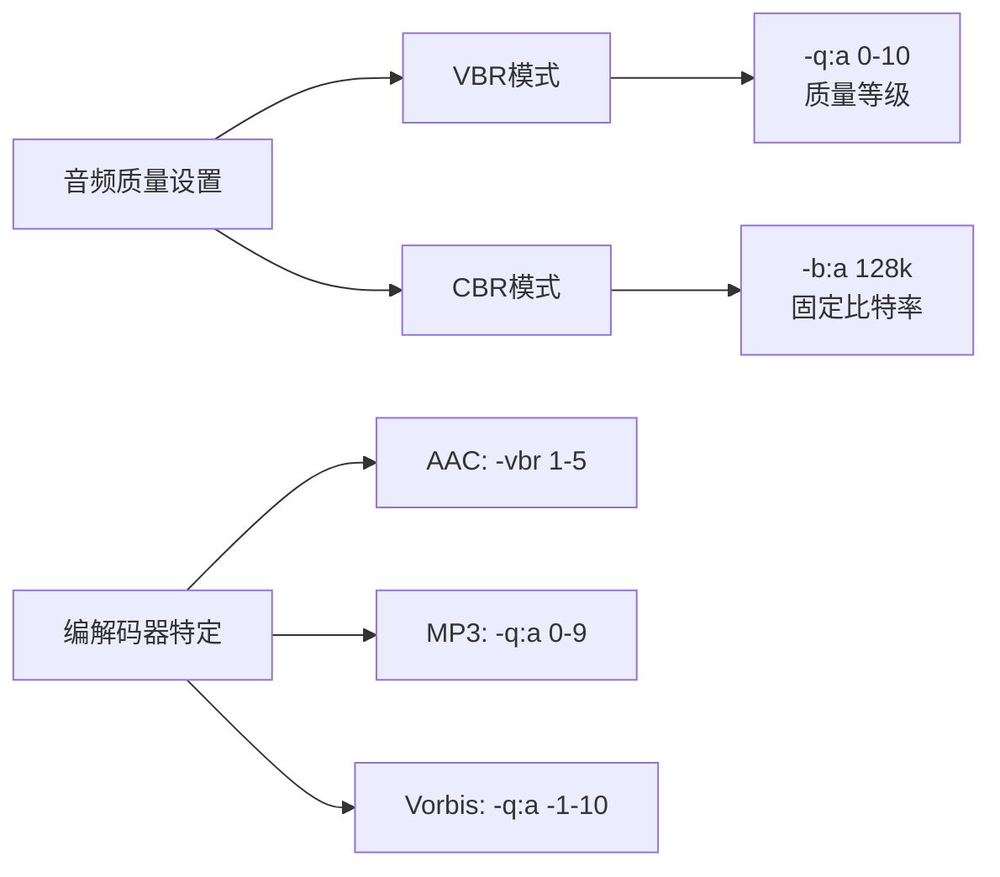
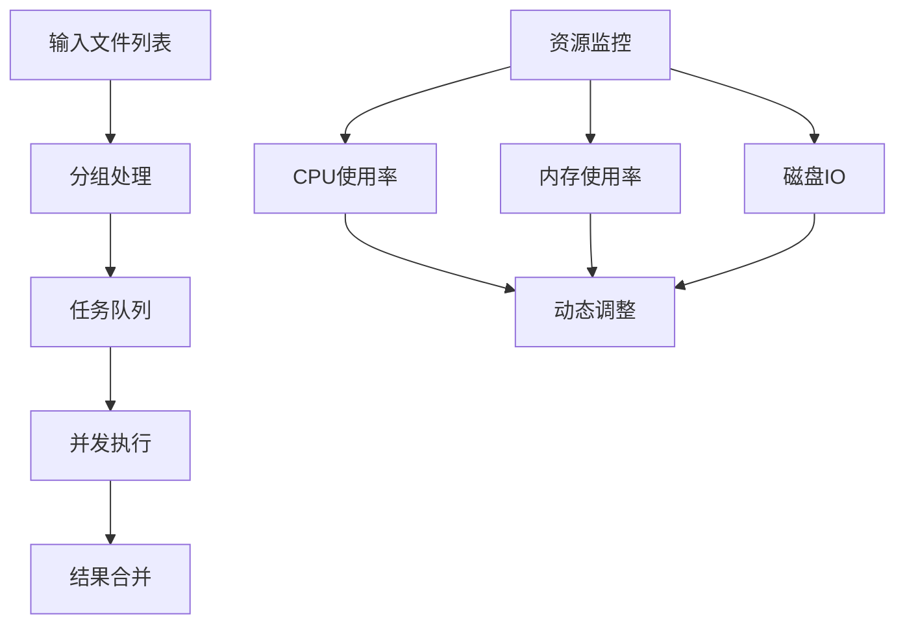
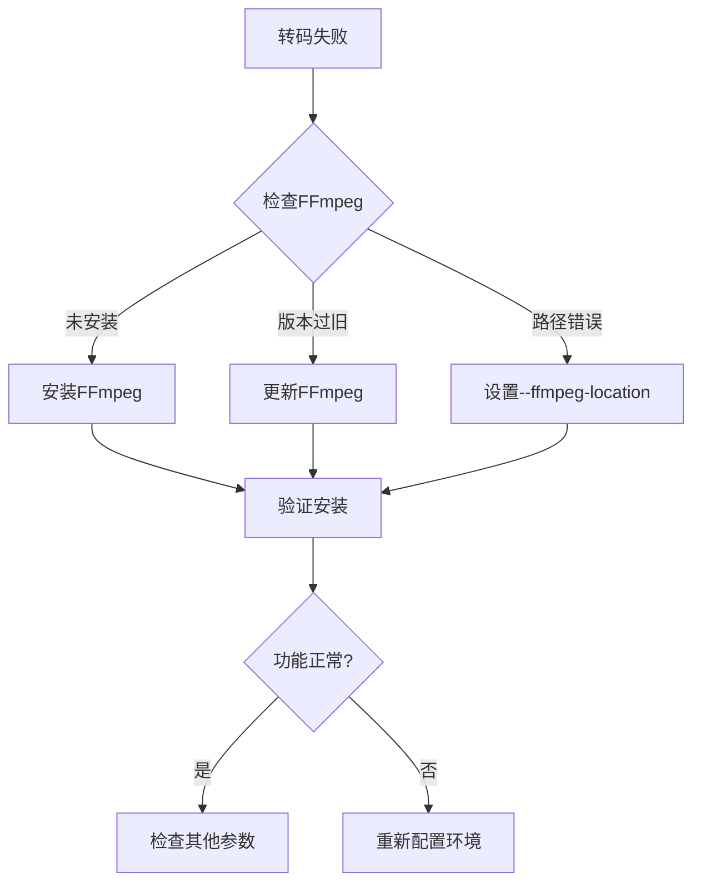

# 视频转码功能详细文档

<cite>
**本文档引用的文件**
- [yt_dlp/options.py](file://yt_dlp/options.py)
- [yt_dlp/postprocessor/ffmpeg.py](file://yt_dlp/postprocessor/ffmpeg.py)
- [yt_dlp/postprocessor/common.py](file://yt_dlp/postprocessor/common.py)
- [yt_dlp/YoutubeDL.py](file://yt_dlp/YoutubeDL.py)
- [yt_dlp/__init__.py](file://yt_dlp/__init__.py)
- [test/test_postprocessors.py](file://test/test_postprocessors.py)
- [yt_dlp/utils/_utils.py](file://yt_dlp/utils/_utils.py)
</cite>

## 目录
1. [简介](#简介)
2. [核心选项概述](#核心选项概述)
3. [视频重新编码架构](#视频重新编码架构)
4. [FFmpeg后处理器详解](#ffmpeg后处理器详解)
5. [视频格式转换流程](#视频格式转换流程)
6. [编解码器选择策略](#编解码器选择策略)
7. [参数配置与优化](#参数配置与优化)
8. [实用示例与最佳实践](#实用示例与最佳实践)
9. [性能优化建议](#性能优化建议)
10. [故障排除指南](#故障排除指南)

## 简介

yt-dlp提供了强大的视频转码功能，通过FFmpeg后处理器实现视频格式转换、编解码器重编码和容器重新封装。该系统支持多种视频格式之间的转换，包括从MP4到WebM、AV1到H.264等复杂格式转换场景。

## 核心选项概述

### 主要转码选项

| 选项 | 功能描述 | 支持格式 |
|------|----------|----------|
| `--recode-video` | 视频重新编码 | 所有支持的视频格式 |
| `--remux-video` | 容器重新封装 | avi, flv, gif, mkv, mov, mp4, webm |
| `--postprocessor-args` | 后处理器参数传递 | FFmpeg, FFprobe, AtomicParsley |

### 选项关系与冲突



**图表来源**
- [yt_dlp/__init__.py](file://yt_dlp/__init__.py#L546-L556)
- [yt_dlp/options.py](file://yt_dlp/options.py#L1588-L1609)

**章节来源**
- [yt_dlp/options.py](file://yt_dlp/options.py#L1588-L1632)

## 视频重新编码架构

### 整体架构设计



**图表来源**
- [yt_dlp/postprocessor/ffmpeg.py](file://yt_dlp/postprocessor/ffmpeg.py#L534-L574)
- [yt_dlp/postprocessor/ffmpeg.py](file://yt_dlp/postprocessor/ffmpeg.py#L428-L531)

### 处理器链式调用



**图表来源**
- [yt_dlp/postprocessor/common.py](file://yt_dlp/postprocessor/common.py#L25-L45)
- [yt_dlp/postprocessor/ffmpeg.py](file://yt_dlp/postprocessor/ffmpeg.py#L333-L363)

**章节来源**
- [yt_dlp/postprocessor/ffmpeg.py](file://yt_dlp/postprocessor/ffmpeg.py#L534-L574)
- [yt_dlp/postprocessor/ffmpeg.py](file://yt_dlp/postprocessor/ffmpeg.py#L428-L531)

## FFmpeg后处理器详解

### 基础架构

FFmpeg后处理器继承自通用后处理器基类，提供以下核心功能：

#### 版本检测与特性识别

处理器能够自动检测FFmpeg版本和可用特性：
- FFmpeg版本兼容性检查
- 编码器特性识别（如libfdk_aac支持）
- 流复制优化选项

#### 命令行构建机制



**图表来源**
- [yt_dlp/postprocessor/ffmpeg.py](file://yt_dlp/postprocessor/ffmpeg.py#L333-L363)

#### 流复制优化

系统提供智能流复制功能，避免不必要的重编码：

| 参数 | 功能 | 使用场景 |
|------|------|----------|
| `-c copy` | 完全复制流 | 容器重新封装 |
| `-map 0` | 映射所有流 | 保持原始结构 |
| `-dn` | 忽略数据流 | 清理元数据 |
| `-ignore_unknown` | 忽略未知流类型 | 兼容性处理 |

**章节来源**
- [yt_dlp/postprocessor/ffmpeg.py](file://yt_dlp/postprocessor/ffmpeg.py#L209-L225)

## 视频格式转换流程

### 转换决策流程



**图表来源**
- [yt_dlp/postprocessor/ffmpeg.py](file://yt_dlp/postprocessor/ffmpeg.py#L542-L562)

### 格式映射解析

系统使用灵活的格式映射语法：

```python
# 格式映射示例
mapping_rules = {
    'mp4': 'webm',      # MP4转WebM
    'avi': 'mkv',       # AVI转MKV
    'mov': 'mp4',       # MOV转MP4
    'webm': 'mp4'       # WebM转MP4
}
```

**章节来源**
- [yt_dlp/postprocessor/ffmpeg.py](file://yt_dlp/postprocessor/ffmpeg.py#L54-L70)

## 编解码器选择策略

### 音频编解码器映射

| 目标格式 | 编解码器 | 容器 | 特殊参数 |
|----------|----------|------|----------|
| mp3 | libmp3lame | MP3 | -q:a 5 (默认质量) |
| aac | aac | M4A | adts包装 |
| opus | libopus | OGG/OGG | 最佳压缩比 |
| flac | flac | FLAC | 无损压缩 |
| vorbis | libvorbis | OGG | 广泛兼容 |

### 视频编解码器策略

#### H.264/H.265编码器选择



**图表来源**
- [yt_dlp/postprocessor/ffmpeg.py](file://yt_dlp/postprocessor/ffmpeg.py#L54-L70)

#### 分辨率与帧率处理

系统支持动态分辨率调整和帧率控制：

```python
# 分辨率处理示例
resolution_map = {
    '1080p': {'width': 1920, 'height': 1080},
    '720p': {'width': 1280, 'height': 720},
    '480p': {'width': 854, 'height': 480}
}

# 帧率控制
framerate_control = {
    'keep': '不改变原帧率',
    'reduce': '降低到目标帧率',
    'increase': '提高到目标帧率'
}
```

**章节来源**
- [yt_dlp/postprocessor/ffmpeg.py](file://yt_dlp/postprocessor/ffmpeg.py#L428-L531)

## 参数配置与优化

### 后处理器参数传递

`--postprocessor-args`选项提供细粒度控制：

```bash
# 基本语法
yt-dlp --postprocessor-args "VideoConvertor:custom-args"
yt-dlp --ppa "Merger+ffmpeg:-v quiet"

# 输入/输出参数定位
yt-dlp --ppa "Merger+ffmpeg_i1:-v quiet"
yt-dlp --ppa "Merger+ffmpeg_o1:-movflags faststart"
```

### 编码质量控制

#### 音频质量参数



**图表来源**
- [yt_dlp/postprocessor/ffmpeg.py](file://yt_dlp/postprocessor/ffmpeg.py#L445-L470)

#### 视频质量参数

| 参数类别 | FFmpeg选项 | 描述 | 推荐值 |
|----------|------------|------|--------|
| 质量控制 | `-crf 18-28` | 恒定质量因子 | 23 (平衡) |
| 比特率控制 | `-b:v 1M` | 固定比特率 | 根据分辨率调整 |
| 预设编码 | `-preset medium` | 编码速度平衡 | ultrafast/fast/medium/slow |
| 参考帧 | `-refs 3` | 参考帧数量 | 3-6 |

**章节来源**
- [yt_dlp/postprocessor/ffmpeg.py](file://yt_dlp/postprocessor/ffmpeg.py#L445-L470)

## 实用示例与最佳实践

### 常见转码场景

#### MP4到WebM转换

```bash
# 基本转换
yt-dlp --recode-video webm --audio-format webm

# 高质量转换
yt-dlp --recode-video webm \
       --postprocessor-args "VideoConvertor:-crf 18 -preset medium" \
       --audio-format opus
```

#### 格式规则配置

```bash
# 多格式规则
yt-dlp --remux-video "aac>m4a/mov>mp4/mkv" \
       --recode-video "mp4>webm/mkv>mp4"
```

#### 批量处理示例

```bash
# 批量转换脚本
#!/bin/bash
for file in *.mp4; do
    yt-dlp --recode-video webm \
           --postprocessor-args "VideoConvertor:-crf 20 -preset slow" \
           "$file"
done
```

### 性能优化配置

#### 内存使用优化

```bash
# 减少内存使用
yt-dlp --postprocessor-args "VideoConvertor:-bufsize 5000k"

# 多线程编码
yt-dlp --postprocessor-args "VideoConvertor:-threads 4"
```

#### 存储空间优化

```bash
# 高压缩比设置
yt-dlp --recode-video mp4 \
       --postprocessor-args "VideoConvertor:-crf 28 -preset ultrafast"
```

**章节来源**
- [yt_dlp/options.py](file://yt_dlp/options.py#L1588-L1632)

## 性能优化建议

### 硬件加速配置

#### NVIDIA GPU加速

```bash
# NVENC H.264编码
yt-dlp --postprocessor-args "VideoConvertor:-c:v h264_nvenc -preset p4"

# NVENC H.265编码  
yt-dlp --postprocessor-args "VideoConvertor:-c:v hevc_nvenc -preset p4"
```

#### Intel QSV加速

```bash
# QSV H.264编码
yt-dlp --postprocessor-args "VideoConvertor:-c:v h264_qsv -preset fast"

# QSV H.265编码
yt-dlp --postprocessor-args "VideoConvertor:-c:v hevc_qsv -preset fast"
```

#### AMD VCE加速

```bash
# AMF H.264编码
yt-dlp --postprocessor-args "VideoConvertor:-c:v h264_amf -quality balanced"

# AMF H.265编码
yt-dlp --postprocessor-args "VideoConvertor:-c:v hevc_amf -quality balanced"
```

### 批量转码最佳实践

#### 并行处理策略



#### 错误恢复机制

```bash
# 自动重试配置
yt-dlp --retries 3 \
       --retry-sleep 5 \
       --postprocessor-args "VideoConvertor:-y"

# 进度保存
yt-dlp --postprocessor-args "VideoConvertor:-progress file:progress.log"
```

**章节来源**
- [yt_dlp/postprocessor/ffmpeg.py](file://yt_dlp/postprocessor/ffmpeg.py#L333-L363)

## 故障排除指南

### 常见问题诊断

#### FFmpeg可用性问题



#### 编码器不支持

常见编解码器支持检查：
- H.264: `libx264`, `h264_nvenc`, `h264_qsv`
- H.265: `libx265`, `hevc_nvenc`, `hevc_qsv`
- AV1: `libaom-av1`, `av1_nvenc`
- VP9: `libvpx-vp9`

#### 内存不足处理

```bash
# 减少内存使用
yt-dlp --postprocessor-args "VideoConvertor:-analyzeduration 100M -probesize 100M"

# 分段处理大文件
yt-dlp --split-chapters
```

### 调试与日志

#### 详细日志配置

```bash
# 启用调试模式
yt-dlp --verbose --postprocessor-args "VideoConvertor:-loglevel debug"

# 输出FFmpeg命令
yt-dlp --dump-single-json --postprocessor-args "VideoConvertor:-v quiet"
```

#### 性能监控

```bash
# 性能统计
yt-dlp --progress --postprocessor-args "VideoConvertor:-stats"

# 时间戳记录
yt-dlp --postprocessor-args "VideoConvertor:-report"
```

**章节来源**
- [yt_dlp/postprocessor/ffmpeg.py](file://yt_dlp/postprocessor/ffmpeg.py#L130-L180)

## 结论

yt-dlp的视频转码功能通过FFmpeg后处理器提供了强大而灵活的格式转换能力。通过合理配置`--recode-video`、`--remux-video`和`--postprocessor-args`选项，用户可以实现从简单格式转换到复杂编码参数定制的各种需求。

关键要点：
- 理解格式映射规则和转换逻辑
- 合理选择编解码器和质量参数
- 利用硬件加速提升性能
- 实施适当的错误处理和重试机制
- 监控资源使用情况确保稳定运行

通过遵循本文档提供的指导原则和最佳实践，用户可以充分发挥yt-dlp视频转码功能的潜力，满足各种专业和日常使用场景的需求。