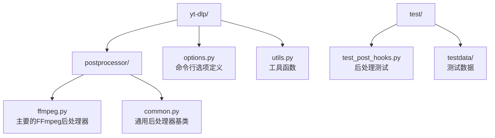
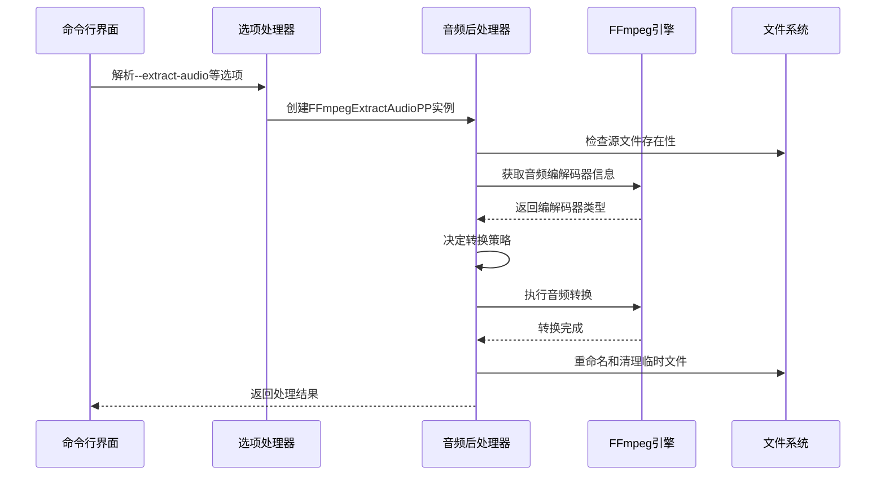
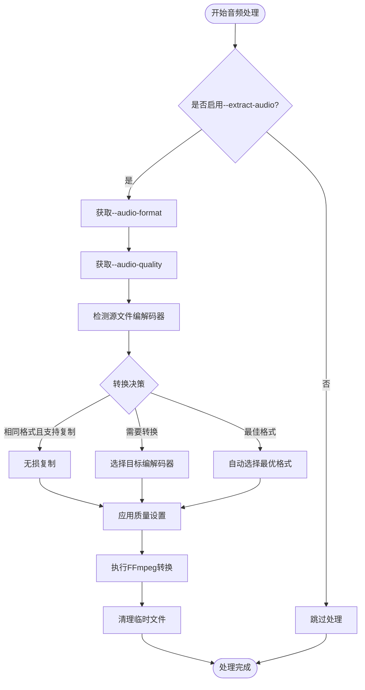
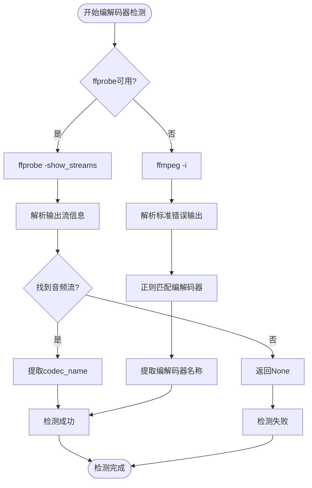
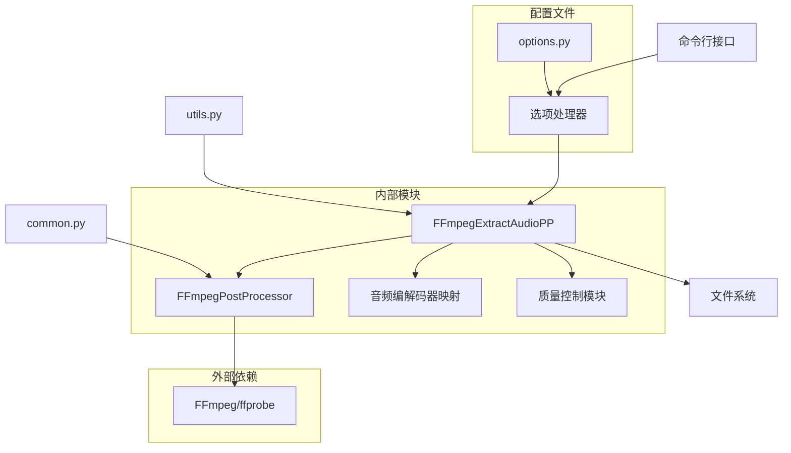

# 音频处理

<cite>
**本文档中引用的文件**
- [ffmpeg.py](file://yt_dlp/postprocessor/ffmpeg.py)
- [options.py](file://yt_dlp/options.py)
- [README.md](file://README.md)
- [test_post_hooks.py](file://test/test_post_hooks.py)
</cite>

## 目录
1. [简介](#简介)
2. [项目结构](#项目结构)
3. [核心组件](#核心组件)
4. [架构概览](#架构概览)
5. [详细组件分析](#详细组件分析)
6. [依赖关系分析](#依赖关系分析)
7. [性能考虑](#性能考虑)
8. [故障排除指南](#故障排除指南)
9. [结论](#结论)

## 简介

yt-dlp的音频处理功能是一个强大的音频提取和转换系统，主要通过FFmpeg后处理器实现。该系统支持多种音频格式转换，包括MP3、AAC、FLAC、OPUS等，并提供了灵活的质量控制和元数据保留机制。

音频处理的核心功能包括：
- 视频文件到纯音频格式的转换
- 多种音频编码格式的支持
- 可配置的音频质量设置
- 元数据和章节信息的保留
- 错误处理和恢复机制

## 项目结构

音频处理功能主要分布在以下目录结构中：

**图表来源**
- [ffmpeg.py](file://yt_dlp/postprocessor/ffmpeg.py#L1-L50)
- [options.py](file://yt_dlp/options.py#L1560-L1590)

**节来源**
- [ffmpeg.py](file://yt_dlp/postprocessor/ffmpeg.py#L1-L100)
- [options.py](file://yt_dlp/options.py#L1560-L1590)

## 核心组件

### FFmpegExtractAudioPP类

这是音频处理的核心类，继承自FFmpegPostProcessor，负责执行实际的音频提取和转换操作。

#### 主要属性和方法

| 属性/方法 | 类型 | 描述 |
|----------|------|------|
| COMMON_AUDIO_EXTS | tuple | 常见音频扩展名列表 |
| SUPPORTED_EXTS | tuple | 支持的音频格式列表 |
| mapping | str | 预期的音频格式映射 |
| _preferredquality | float | 用户指定的音频质量等级 |
| _nopostoverwrites | bool | 是否禁止覆盖已存在的文件 |

#### 音频编解码器映射表

系统维护了一个详细的音频编解码器映射表，定义了各种音频格式对应的编码器和输出格式：

| 格式 | 扩展名 | 编码器 | 特殊选项 |
|------|--------|--------|----------|
| mp3 | mp3 | libmp3lame | 标准MP3编码 |
| aac | m4a | aac | ADTS格式输出 |
| m4a | m4a | aac | AAC到ASC转换 |
| opus | opus | libopus | 标准Opus编码 |
| vorbis | ogg | libvorbis | 标准Vorbis编码 |
| flac | flac | flac | 无损压缩 |
| alac | m4a | alac | Apple无损编码 |
| wav | wav | None | WAV容器格式 |

**节来源**
- [ffmpeg.py](file://yt_dlp/postprocessor/ffmpeg.py#L49-L59)
- [ffmpeg.py](file://yt_dlp/postprocessor/ffmpeg.py#L428-L443)

## 架构概览

音频处理系统的整体架构采用分层设计，从命令行解析到最终的音频文件生成：

**图表来源**
- [ffmpeg.py](file://yt_dlp/postprocessor/ffmpeg.py#L472-L531)
- [options.py](file://yt_dlp/options.py#L1565-L1588)

## 详细组件分析

### 命令行选项处理

音频处理功能通过三个主要的命令行选项进行控制：

#### --extract-audio (-x)
启用音频提取模式，将视频文件转换为纯音频格式。

#### --audio-format
指定目标音频格式，支持以下值：
- `best`: 自动选择最佳格式
- `mp3`: MP3格式
- `aac`: AAC格式  
- `flac`: FLAC无损格式
- `opus`: Opus格式
- `vorbis`: Vorbis格式
- `alac`: Apple无损格式
- `wav`: WAV格式

#### --audio-quality
设置音频质量参数，支持两种模式：
- 数值范围：0（最佳）到10（最差），使用可变比特率(VBR)
- 具体值：如128K、192K、320K等固定比特率

**图表来源**
- [ffmpeg.py](file://yt_dlp/postprocessor/ffmpeg.py#L472-L531)
- [options.py](file://yt_dlp/options.py#L1565-L1588)

**节来源**
- [options.py](file://yt_dlp/options.py#L1565-L1588)
- [ffmpeg.py](file://yt_dlp/postprocessor/ffmpeg.py#L428-L531)

### 音频编解码器质量控制

系统实现了智能的质量控制机制，根据不同编解码器的特点调整参数：

#### VBR质量计算算法

对于不同的音频编解码器，系统使用特定的限制范围来计算VBR质量参数：

| 编解码器 | 上限 | 下限 | 计算公式 |
|----------|------|------|----------|
| libmp3lame | 10 | 0 | `q = 10 - (quality * 10)` |
| libvorbis | 0 | 10 | `q = quality * 10` |
| aac | 0.1 | 4 | `q = 0.1 + (4 - 0.1) * (quality / 10)` |
| libfdk_aac | 1 | 5 | `q = 1 + (5 - 1) * (quality / 10)` |

#### 固定比特率支持

当用户指定超过10的数值时，系统会自动切换到固定比特率模式，使用`-b:a`参数设置具体比特率。

**节来源**
- [ffmpeg.py](file://yt_dlp/postprocessor/ffmpeg.py#L435-L455)

### 音频编解码器检测

系统通过ffprobe或ffmpeg的-i选项检测源文件的音频编解码器：

**图表来源**
- [ffmpeg.py](file://yt_dlp/postprocessor/ffmpeg.py#L228-L256)

**节来源**
- [ffmpeg.py](file://yt_dlp/postprocessor/ffmpeg.py#L228-L256)

### 文件处理流程

音频处理的完整文件处理流程包括多个阶段：

#### 1. 初始检查和准备
- 验证FFmpeg可用性
- 检查目标格式映射
- 确定源文件编解码器

#### 2. 转换策略决定
- 如果源格式已经是目标格式，直接复制
- 如果源格式支持无损转换，优先无损路径
- 否则执行有损转换

#### 3. 临时文件管理
- 创建临时输出文件
- 在必要时备份原始文件
- 实现原子性操作避免数据丢失

#### 4. FFmpeg调用
- 构建FFmpeg命令行参数
- 设置音频流复制或编码参数
- 处理质量参数和特殊选项

#### 5. 后处理和清理
- 更新文件时间戳
- 清理临时文件
- 更新文件信息字典

**节来源**
- [ffmpeg.py](file://yt_dlp/postprocessor/ffmpeg.py#L472-L531)

## 依赖关系分析

音频处理系统的依赖关系图展示了各组件之间的交互：

**图表来源**
- [ffmpeg.py](file://yt_dlp/postprocessor/ffmpeg.py#L1-L30)
- [options.py](file://yt_dlp/options.py#L1560-L1590)

### 关键依赖项

| 组件 | 依赖 | 用途 |
|------|------|------|
| FFmpegExtractAudioPP | FFmpegPostProcessor | 继承基础功能 |
| FFmpegPostProcessor | FFmpeg/ffprobe | 执行实际转换 |
| ACODECS | 音频格式映射 | 定义编解码器配置 |
| PostProcessingError | 异常处理 | 错误报告和处理 |
| MEDIA_EXTENSIONS | 文件扩展名 | 支持的媒体格式 |

**节来源**
- [ffmpeg.py](file://yt_dlp/postprocessor/ffmpeg.py#L1-L50)
- [options.py](file://yt_dlp/options.py#L1560-L1590)

## 性能考虑

### 转换效率优化

1. **编解码器选择优化**
   - 优先使用硬件加速编解码器
   - 支持libfdk_aac以获得更好的压缩效率
   - 实现智能格式检测避免不必要的转换

2. **内存使用优化**
   - 流式处理大文件
   - 及时释放临时资源
   - 最小化内存中的数据缓存

3. **并发处理支持**
   - 支持多线程下载和处理
   - 异步执行FFmpeg进程
   - 实现进度报告机制

### 存储空间优化

- 使用无损复制减少CPU使用
- 智能质量设置平衡音质和文件大小
- 支持断点续传避免重复处理

## 故障排除指南

### 常见问题及解决方案

#### 1. FFmpeg不可用
**症状**: 报告"ffmpeg not found"错误
**解决方案**:
- 安装FFmpeg并确保在PATH中
- 使用`--ffmpeg-location`指定路径
- 验证FFmpeg版本符合最低要求(1.0+)

#### 2. 音频编解码器检测失败
**症状**: 报告"unable to obtain file audio codec"错误
**解决方案**:
- 确保ffprobe可用
- 检查源文件完整性
- 尝试使用ffmpeg的-i选项替代

#### 3. 转换质量不理想
**症状**: 输出音频质量不符合预期
**解决方案**:
- 调整`--audio-quality`参数
- 检查目标格式的编解码器特性
- 考虑使用固定比特率而非VBR

#### 4. 元数据丢失
**症状**: 转换后的音频缺少标题、艺术家等信息
**解决方案**:
- 确保源文件包含元数据
- 检查FFmpeg版本支持元数据复制
- 验证目标格式支持的元数据类型

#### 5. 文件覆盖冲突
**症状**: 报告"Post-process file exists"警告
**解决方案**:
- 使用`--no-post-overwrites`避免覆盖
- 检查文件时间戳差异
- 手动清理冲突文件

### 调试技巧

1. **启用详细输出**: 使用`--verbose`选项获取详细日志
2. **检查FFmpeg命令**: 查看生成的FFmpeg命令行参数
3. **验证文件格式**: 使用ffprobe检查源文件格式
4. **测试单个转换**: 单独测试音频提取功能

**节来源**
- [ffmpeg.py](file://yt_dlp/postprocessor/ffmpeg.py#L228-L256)
- [ffmpeg.py](file://yt_dlp/postprocessor/ffmpeg.py#L472-L499)

## 结论

yt-dlp的音频处理功能提供了一个强大而灵活的音频提取和转换系统。通过FFmpeg后处理器，系统能够处理多种音频格式，提供精细的质量控制，并保持良好的性能和可靠性。

### 主要优势

1. **广泛的格式支持**: 支持主流音频格式和专业无损格式
2. **智能转换策略**: 根据源文件特点选择最优转换路径
3. **灵活的质量控制**: 支持VBR和固定比特率两种模式
4. **健壮的错误处理**: 提供完善的错误检测和恢复机制
5. **高效的性能**: 优化的转换流程和资源管理

### 最佳实践建议

1. **格式选择**: 根据用途选择合适的音频格式
2. **质量设置**: 平衡音质需求和文件大小
3. **批量处理**: 利用命令行参数进行批量音频提取
4. **监控和调试**: 使用详细输出监控处理过程
5. **备份策略**: 在重要转换前备份原始文件

通过合理使用这些功能，用户可以高效地从视频文件中提取高质量的音频内容，并根据具体需求进行格式转换和质量优化。