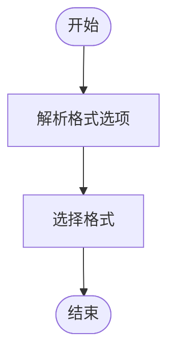

# 字幕下载

<cite>
**本文档引用的文件**
- [YoutubeDL.py](file://yt_dlp/YoutubeDL.py#L3078-L3096)
- [options.py](file://yt_dlp/options.py#L922-L949)
- [utils/_utils.py](file://yt_dlp/utils/_utils.py#L1305-L1306)
- [extractor/youtube/_video.py](file://yt_dlp/extractor/youtube/_video.py#L4012-L4024)
- [postprocessor/ffmpeg.py](file://yt_dlp/postprocessor/ffmpeg.py#L569-L633)
- [webvtt.py](file://yt_dlp/webvtt.py#L0-L398)
- [test/test_subtitles.py](file://test/test_subtitles.py#L0-L418)
</cite>

## 目录
1. [简介](#简介)
2. [核心选项配置](#核心选项配置)
3. [字幕处理工作流程](#字幕处理工作流程)
4. [自动字幕与手动字幕](#自动字幕与手动字幕)
5. [多语言字幕处理](#多语言字幕处理)
6. [实用示例](#实用示例)
7. [常见问题解答](#常见问题解答)

## 简介
yt-dlp 提供了强大的字幕下载功能，允许用户下载和处理视频的字幕文件。该功能支持多种字幕格式和语言选择，并能处理自动字幕和手动字幕。本文档将详细介绍 `--write-sub`、`--write-auto-sub`、`--sub-lang` 等选项的配置和使用，深入分析字幕处理的工作流程，包括字幕格式识别、语言选择和文件生成机制。

## 核心选项配置
yt-dlp 提供了多个选项来控制字幕的下载和处理。这些选项允许用户指定是否下载字幕、选择字幕语言和格式。


**Diagram sources**
- [options.py](file://yt_dlp/options.py#L922-L949)

**本节来源**
- [options.py](file://yt_dlp/options.py#L922-L949)

## 字幕处理工作流程
字幕处理工作流程包括字幕格式识别、语言选择和文件生成机制。yt-dlp 首先从视频信息中提取可用的字幕，然后根据用户配置选择和下载字幕。


**Diagram sources**
- [YoutubeDL.py](file://yt_dlp/YoutubeDL.py#L3078-L3096)
- [YoutubeDL.py](file://yt_dlp/YoutubeDL.py#L4333-L4387)

**本节来源**
- [YoutubeDL.py](file://yt_dlp/YoutubeDL.py#L3078-L3096)
- [YoutubeDL.py](file://yt_dlp/YoutubeDL.py#L4333-L4387)

## 自动字幕与手动字幕
yt-dlp 支持下载自动字幕和手动字幕。自动字幕是由平台自动生成的，而手动字幕是由视频上传者提供的。

### 自动字幕
自动字幕是通过语音识别技术生成的，可能包含一些错误。使用 `--write-auto-subs` 选项可以下载自动字幕。


**Diagram sources**
- [extractor/common.py](file://yt_dlp/extractor/common.py#L3916-L3945)
- [extractor/youtube/_video.py](file://yt_dlp/extractor/youtube/_video.py#L4106-L4114)

### 手动字幕
手动字幕是由视频上传者提供的，通常质量较高。使用 `--write-subs` 选项可以下载手动字幕。


**Diagram sources**
- [extractor/youtube/_video.py](file://yt_dlp/extractor/youtube/_video.py#L4083-L4106)
- [extractor/youtube/_video.py](file://yt_dlp/extractor/youtube/_video.py#L4116-L4139)

**本节来源**
- [extractor/common.py](file://yt_dlp/extractor/common.py#L3916-L3945)
- [extractor/youtube/_video.py](file://yt_dlp/extractor/youtube/_video.py#L4083-L4106)
- [extractor/youtube/_video.py](file://yt_dlp/extractor/youtube/_video.py#L4106-L4114)
- [extractor/youtube/_video.py](file://yt_dlp/extractor/youtube/_video.py#L4116-L4139)

## 多语言字幕处理
yt-dlp 支持处理多语言字幕，允许用户下载多种语言的字幕文件。

### 语言选择
使用 `--sub-langs` 选项可以指定要下载的字幕语言。支持正则表达式和排除语言。


**Diagram sources**
- [YoutubeDL.py](file://yt_dlp/YoutubeDL.py#L3078-L3096)
- [options.py](file://yt_dlp/options.py#L947-L959)

### 字幕格式
使用 `--sub-format` 选项可以指定字幕格式。支持多种格式，如 srt、vtt、ass 等。



**Diagram sources**
- [test/test_subtitles.py](file://test/test_subtitles.py#L384-L417)
- [utils/_utils.py](file://yt_dlp/utils/_utils.py#L3477-L3510)

**本节来源**
- [YoutubeDL.py](file://yt_dlp/YoutubeDL.py#L3078-L3096)
- [options.py](file://yt_dlp/options.py#L947-L959)
- [test/test_subtitles.py](file://test/test_subtitles.py#L384-L417)
- [utils/_utils.py](file://yt_dlp/utils/_utils.py#L3477-L3510)

## 实用示例
以下是一些实用的字幕下载示例。

### 下载特定语言的字幕
```bash
yt-dlp --write-subs --sub-langs en,fr,de video_url
```

### 合并字幕到视频文件
```bash
yt-dlp --embed-subs --sub-langs en video_url
```

### 处理特殊字符编码问题
```bash
yt-dlp --write-subs --sub-format srt video_url
```

**本节来源**
- [test/test_subtitles.py](file://test/test_subtitles.py#L0-L418)
- [postprocessor/ffmpeg.py](file://yt_dlp/postprocessor/ffmpeg.py#L569-L633)

## 常见问题解答
### 为什么某些视频无法下载字幕？
某些视频可能没有提供字幕，或者字幕被平台限制。可以使用 `--list-subs` 选项检查可用的字幕。

### 如何解决字幕同步问题？
字幕同步问题通常由视频和字幕的时间戳不匹配引起。可以使用 `--download-sections` 选项下载特定时间段的字幕。

**本节来源**
- [test/test_subtitles.py](file://test/test_subtitles.py#L0-L418)
- [postprocessor/ffmpeg.py](file://yt_dlp/postprocessor/ffmpeg.py#L569-L633)
- [webvtt.py](file://yt_dlp/webvtt.py#L0-L398)