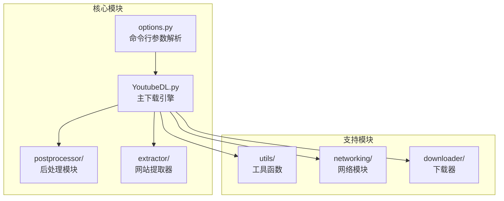
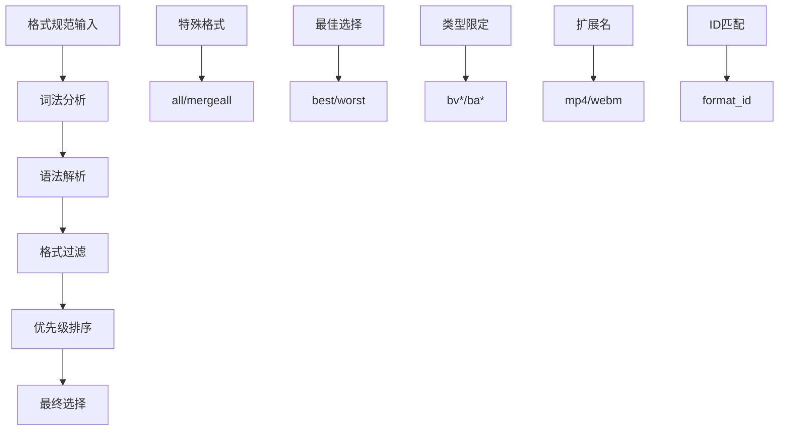
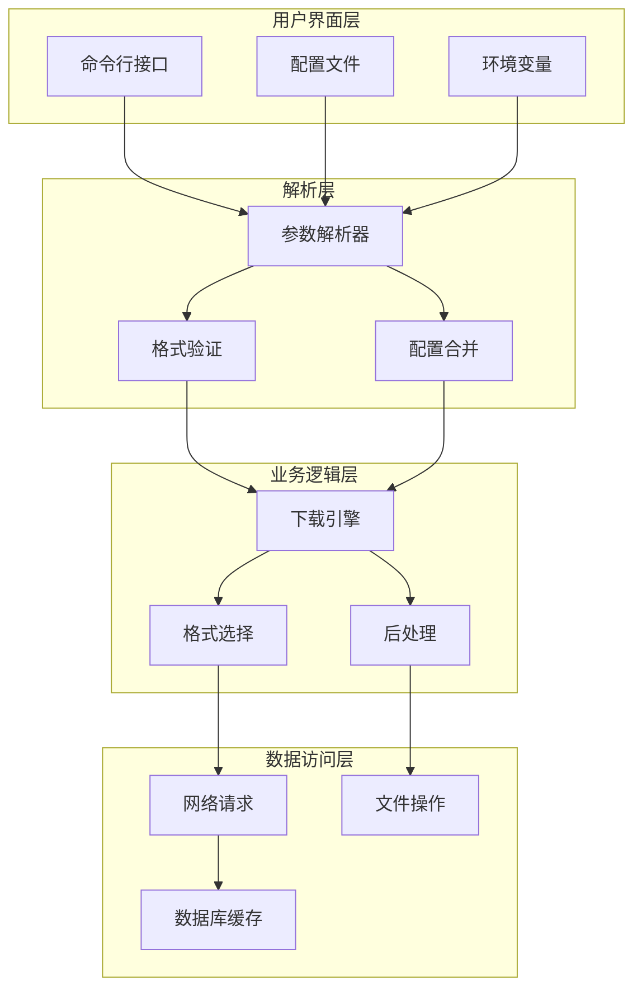
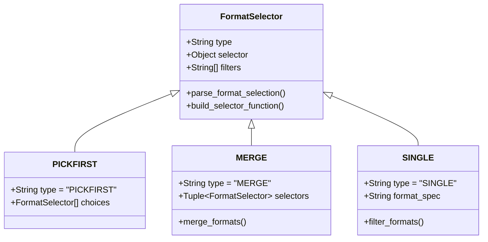
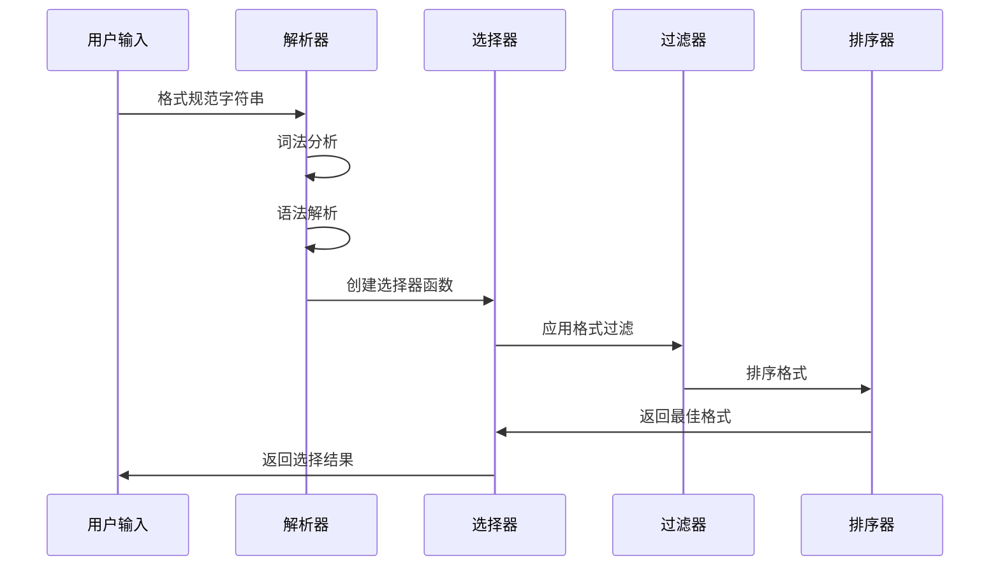
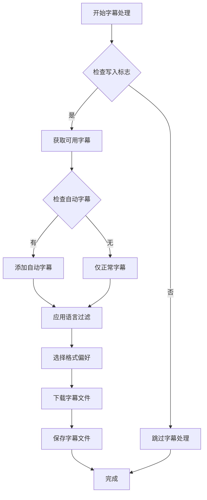
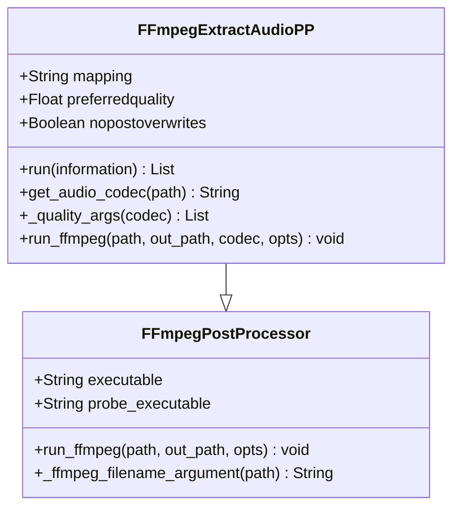
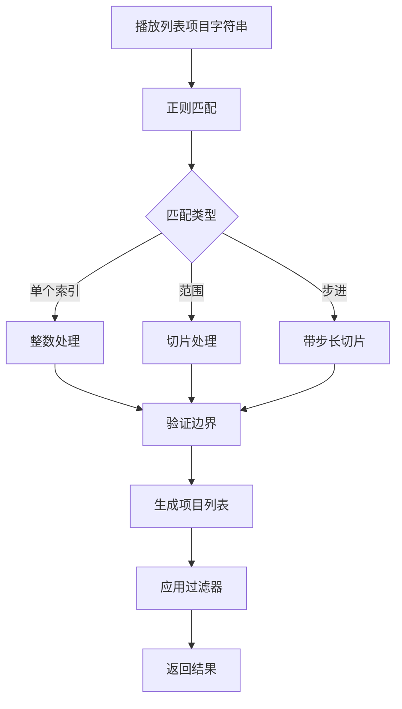
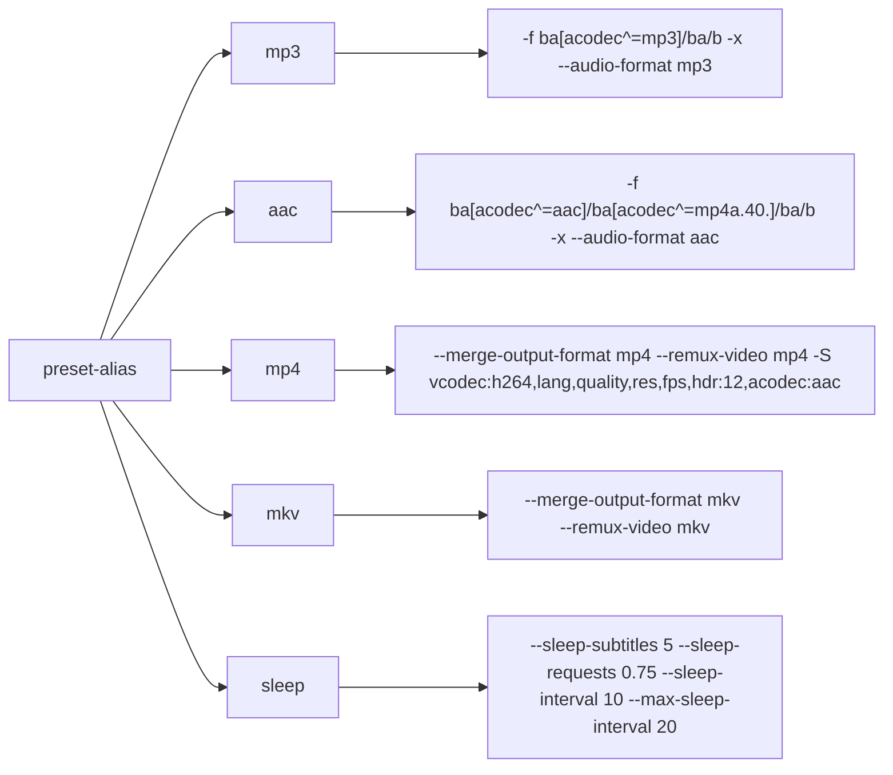
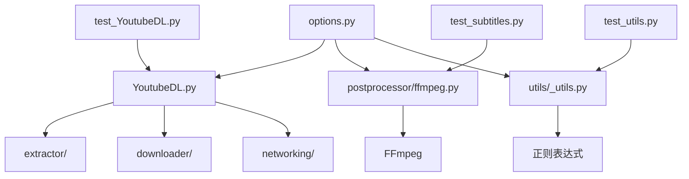

# 常用命令

<cite>
**本文档中引用的文件**
- [options.py](file://yt_dlp/options.py)
- [YoutubeDL.py](file://yt_dlp/YoutubeDL.py)
- [ffmpeg.py](file://yt_dlp/postprocessor/ffmpeg.py)
- [test_YoutubeDL.py](file://test/test_YoutubeDL.py)
- [test_subtitles.py](file://test/test_subtitles.py)
- [test_utils.py](file://yt_dlp/utils/_utils.py)
</cite>

## 目录
1. [简介](#简介)
2. [项目结构概览](#项目结构概览)
3. [核心组件分析](#核心组件分析)
4. [架构总览](#架构总览)
5. [详细组件分析](#详细组件分析)
6. [依赖关系分析](#依赖关系分析)
7. [性能考虑](#性能考虑)
8. [故障排除指南](#故障排除指南)
9. [结论](#结论)

## 简介

本文档基于yt-dlp项目的options.py文件，系统性地介绍了常用命令的功能性和实现细节。yt-dlp是一个功能强大的视频下载工具，提供了丰富的命令行选项来满足各种下载需求。本指南重点关注格式选择（-f/--format）、字幕下载（--write-sub）、音频提取（--extract-audio）、播放列表处理（--playlist-start/--playlist-end）等高频使用功能。

## 项目结构概览

yt-dlp项目采用模块化架构设计，主要包含以下核心模块：

**图表来源**
- [options.py](file://yt_dlp/options.py#L1-L50)
- [YoutubeDL.py](file://yt_dlp/YoutubeDL.py#L1-L50)

**章节来源**
- [options.py](file://yt_dlp/options.py#L1-L100)
- [YoutubeDL.py](file://yt_dlp/YoutubeDL.py#L1-L100)

## 核心组件分析

### 命令行参数解析器

yt-dlp使用自定义的命令行解析器来处理复杂的选项组合。核心解析器包括：

- **_YoutubeDLOptionParser**: 扩展标准optparse模块，提供更好的帮助信息和错误处理
- **_YoutubeDLHelpFormatter**: 自定义帮助格式化器，优化显示效果
- **_PRESET_ALIASES**: 预定义的快捷别名集合

### 格式选择系统

格式选择是yt-dlp的核心功能之一，通过build_format_selector方法实现复杂的格式匹配逻辑：

**图表来源**
- [YoutubeDL.py](file://yt_dlp/YoutubeDL.py#L2243-L2600)

**章节来源**
- [options.py](file://yt_dlp/options.py#L800-L1200)
- [YoutubeDL.py](file://yt_dlp/YoutubeDL.py#L2200-L2600)

## 架构总览

yt-dlp采用分层架构设计，从命令行接口到底层网络请求形成清晰的层次结构：

**图表来源**
- [options.py](file://yt_dlp/options.py#L1-L100)
- [YoutubeDL.py](file://yt_dlp/YoutubeDL.py#L1-L100)

## 详细组件分析

### 格式选择功能

#### 基本格式选择

格式选择通过`-f/--format`参数实现，支持多种格式规格：

| 格式规格 | 描述 | 示例 |
|---------|------|------|
| `best` | 最佳质量 | `-f best` |
| `worst` | 最差质量 | `-f worst` |
| `bestvideo` | 最佳视频质量 | `-f bestvideo` |
| `bestaudio` | 最佳音频质量 | `-f bestaudio` |
| `mp4` | 特定容器格式 | `-f mp4` |
| `bv+ba` | 视频+音频合并 | `-f bv+ba` |

#### 高级格式选择语法

格式选择器支持复杂的表达式语法：

**图表来源**
- [YoutubeDL.py](file://yt_dlp/YoutubeDL.py#L2243-L2300)

#### 格式选择算法实现

格式选择的核心算法在build_format_selector方法中实现：

**图表来源**
- [YoutubeDL.py](file://yt_dlp/YoutubeDL.py#L2446-L2531)

**章节来源**
- [YoutubeDL.py](file://yt_dlp/YoutubeDL.py#L2243-L2600)

### 字幕下载功能

#### 字幕处理工作流程

字幕下载功能通过process_subtitles方法实现：

**图表来源**
- [YoutubeDL.py](file://yt_dlp/YoutubeDL.py#L3080-L3150)

#### 字幕格式支持

| 格式 | 扩展名 | 描述 |
|------|--------|------|
| WebVTT | .vtt | Web视频文本轨道格式 |
| SRT | .srt | 子标题格式 |
| ASS/SSA | .ass/.ssa | 高级样式子标题 |
| TTML | .ttml | 时间标记语言 |
| JSON3 | .json | JSON格式字幕 |

**章节来源**
- [YoutubeDL.py](file://yt_dlp/YoutubeDL.py#L3080-L3150)
- [test_subtitles.py](file://test/test_subtitles.py#L88-L108)

### 音频提取功能

#### 音频提取后处理器

音频提取通过FFmpegExtractAudioPP类实现：

**图表来源**
- [ffmpeg.py](file://yt_dlp/postprocessor/ffmpeg.py#L415-L531)

#### 支持的音频格式

| 源格式 | 目标格式 | 质量设置 | 编码器 |
|--------|----------|----------|--------|
| MP3 | MP3 | -b:a | libmp3lame |
| AAC | M4A | -q:a/-vbr | aac/libfdk_aac |
| Vorbis | OGG | -q:a | libvorbis |
| Opus | OPUS | -b:a | libopus |

**章节来源**
- [ffmpeg.py](file://yt_dlp/postprocessor/ffmpeg.py#L415-L531)

### 播放列表处理功能

#### 播放列表项目选择

播放列表处理通过parse_playlist_items方法实现灵活的项目选择：

**图表来源**
- [test_utils.py](file://yt_dlp/utils/_utils.py#L2412-L2467)

#### 播放列表控制选项

| 选项 | 功能 | 示例 |
|------|------|------|
| `--playlist-start N` | 从第N个视频开始 | `--playlist-start 5` |
| `--playlist-end N` | 到第N个视频结束 | `--playlist-end 10` |
| `--playlist-items SPEC` | 指定具体项目 | `--playlist-items "1,3,5-10"` |
| `--playlist-reverse` | 反向下载 | `--playlist-reverse` |

**章节来源**
- [test_YoutubeDL.py](file://test/test_YoutubeDL.py#L1045-L1086)
- [test_utils.py](file://yt_dlp/utils/_utils.py#L2412-L2467)

### 预设别名系统

#### 内置预设别名

yt-dlp提供了五个内置预设别名简化常用操作：

**图表来源**
- [options.py](file://yt_dlp/options.py#L112-L149)

**章节来源**
- [options.py](file://yt_dlp/options.py#L112-L149)

## 依赖关系分析

### 核心依赖图

**图表来源**
- [options.py](file://yt_dlp/options.py#L1-L50)
- [YoutubeDL.py](file://yt_dlp/YoutubeDL.py#L1-L50)

### 外部依赖

| 依赖项 | 用途 | 必需性 |
|--------|------|--------|
| FFmpeg | 音视频处理 | 可选（部分功能需要） |
| Python正则表达式 | 格式匹配 | 必需 |
| 标准库 | 基础功能 | 必需 |
| 第三方提取器 | 网站支持 | 可选 |

**章节来源**
- [options.py](file://yt_dlp/options.py#L1-L100)
- [YoutubeDL.py](file://yt_dlp/YoutubeDL.py#L1-L100)

## 性能考虑

### 格式选择优化

格式选择算法采用了多项优化策略：

1. **延迟计算**: 使用LazyList避免不必要的格式验证
2. **早期终止**: 在找到合适格式时立即返回
3. **缓存机制**: 对重复查询进行缓存
4. **并行处理**: 支持多线程格式验证

### 内存管理

- **流式处理**: 大文件采用流式下载
- **内存映射**: 大型字幕文件使用内存映射
- **垃圾回收**: 及时释放临时对象

### 网络优化

- **连接复用**: HTTP连接池
- **断点续传**: 支持大文件断点续传
- **并发下载**: 多片段并发下载

## 故障排除指南

### 常见问题及解决方案

#### 格式选择失败

**问题**: 请求的格式不可用
**原因**: 目标网站不提供指定格式
**解决方案**: 使用`--list-formats`查看可用格式

#### 音频提取失败

**问题**: FFmpeg未安装或路径错误
**原因**: 缺少必要的编解码器
**解决方案**: 安装FFmpeg并设置正确路径

#### 字幕下载失败

**问题**: 字幕格式不支持
**原因**: 目标网站不提供所需格式
**解决方案**: 使用`--list-subs`查看可用字幕

#### 播放列表处理错误

**问题**: 索引超出范围
**原因**: 项目编号无效
**解决方案**: 检查播放列表大小并调整索引

**章节来源**
- [YoutubeDL.py](file://yt_dlp/YoutubeDL.py#L3080-L3150)
- [ffmpeg.py](file://yt_dlp/postprocessor/ffmpeg.py#L415-L531)

## 结论

yt-dlp通过精心设计的命令行接口和强大的内部架构，为用户提供了灵活而高效的视频下载解决方案。其核心功能包括：

1. **智能格式选择**: 支持复杂的格式匹配和优先级排序
2. **全面的字幕支持**: 多种格式和语言的字幕下载
3. **高质量音频提取**: 多种编码格式和质量设置
4. **灵活的播放列表处理**: 灵活的项目选择和过滤
5. **便捷的预设别名**: 简化常用操作的复杂性

这些功能的实现体现了良好的软件工程实践，包括模块化设计、清晰的职责分离、完善的错误处理和优秀的用户体验。对于开发者而言，这些组件为构建更复杂的视频处理工具提供了坚实的基础。