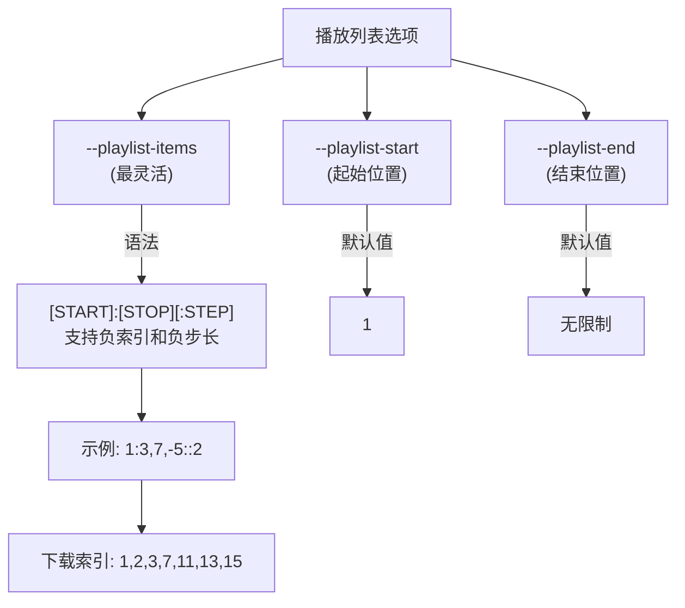
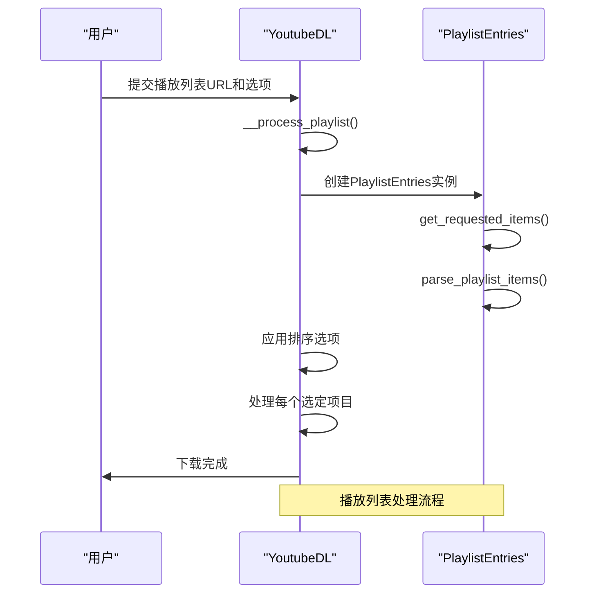
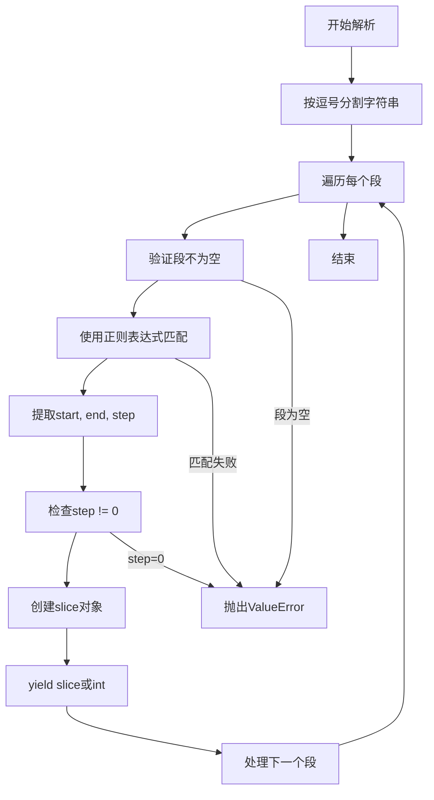
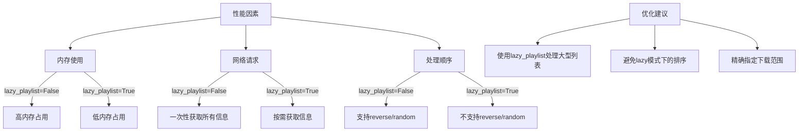

# 播放列表控制

<cite>
**本文档中引用的文件**
- [YoutubeDL.py](file://yt_dlp/YoutubeDL.py)
- [options.py](file://yt_dlp/options.py)
- [utils/_utils.py](file://yt_dlp/utils/_utils.py)
- [test/test_YoutubeDL.py](file://test/test_YoutubeDL.py)
</cite>

## 目录
1. [简介](#简介)
2. [播放列表选项详解](#播放列表选项详解)
3. [播放列表处理实现逻辑](#播放列表处理实现逻辑)
4. [播放列表项解析与过滤算法](#播放列表项解析与过滤算法)
5. [性能影响分析](#性能影响分析)
6. [实用示例](#实用示例)
7. [最佳实践](#最佳实践)
8. [结论](#结论)

## 简介
本文档详细介绍了yt-dlp中的播放列表控制功能，重点分析`--playlist-start`、`--playlist-end`和`--playlist-items`等选项的使用方法。文档深入探讨了YoutubeDL类中播放列表处理的实现逻辑，包括播放列表项的解析、过滤和排序算法。同时，文档解释了这些选项如何影响下载范围和顺序，以及它们在处理大型播放列表时的性能影响，并提供实用示例和最佳实践建议。

**Section sources**
- [YoutubeDL.py](file://yt_dlp/YoutubeDL.py#L1900-L2099)
- [options.py](file://yt_dlp/options.py#L630-L829)

## 播放列表选项详解
yt-dlp提供了多种选项来控制播放列表的下载行为，主要包括`--playlist-start`、`--playlist-end`和`--playlist-items`。

`--playlist-items`（或`-I`）是最灵活的选项，允许用户通过逗号分隔的索引或范围来指定要下载的项目。其语法支持`[START]:[STOP][:STEP]`格式，其中可以使用负索引来从右侧计数，使用负STEP值来反向下载。例如，`-I 1:3,7,-5::2`将下载索引为1、2、3、7、11、13、15的项目。

`--playlist-start`和`--playlist-end`是较旧的选项，用于指定播放列表的起始和结束位置。当同时使用`--playlist-items`时，这两个选项将被忽略。



**Diagram sources**
- [options.py](file://yt_dlp/options.py#L636-L665)

**Section sources**
- [options.py](file://yt_dlp/options.py#L636-L665)
- [test/test_YoutubeDL.py](file://test/test_YoutubeDL.py#L1045-L1066)

## 播放列表处理实现逻辑
播放列表处理的核心逻辑在`YoutubeDL`类的`__process_playlist`方法中实现。该方法首先创建`PlaylistEntries`对象来管理播放列表条目，然后根据用户指定的选项确定要下载的项目。

处理流程如下：
1. 创建`PlaylistEntries`实例，封装播放列表条目
2. 调用`get_requested_items`方法获取用户请求的项目
3. 根据`lazy_playlist`参数决定是否延迟处理
4. 应用`playlistreverse`或`playlistrandom`等排序选项
5. 逐个处理选定的项目



**Diagram sources**
- [YoutubeDL.py](file://yt_dlp/YoutubeDL.py#L1989-L2015)
- [utils/_utils.py](file://yt_dlp/utils/_utils.py#L2444-L2467)

**Section sources**
- [YoutubeDL.py](file://yt_dlp/YoutubeDL.py#L1989-L2015)
- [utils/_utils.py](file://yt_dlp/utils/_utils.py#L2444-L2467)

## 播放列表项解析与过滤算法
播放列表项的解析主要通过`PlaylistEntries`类的`parse_playlist_items`方法实现。该方法使用正则表达式解析`--playlist-items`参数，并将其转换为Python的slice对象。

解析算法的关键步骤：
1. 使用正则表达式`PLAYLIST_ITEMS_RE`匹配输入字符串
2. 将逗号分隔的每个段解析为起始、结束和步长值
3. 验证步长不为零
4. 返回slice对象或整数索引



**Diagram sources**
- [utils/_utils.py](file://yt_dlp/utils/_utils.py#L2432-L2442)

**Section sources**
- [utils/_utils.py](file://yt_dlp/utils/_utils.py#L2432-L2442)
- [test/test_YoutubeDL.py](file://test/test_YoutubeDL.py#L1068-L1086)

## 性能影响分析
播放列表控制选项对性能有显著影响，特别是在处理大型播放列表时。主要性能考虑因素包括：

1. **内存使用**：当`lazy_playlist`为False时，所有选定的条目信息将被加载到内存中
2. **网络请求**：`lazy_playlist`为True时，条目信息按需获取，减少初始加载时间
3. **处理顺序**：`playlistreverse`和`playlistrandom`在`lazy_playlist`模式下不支持

性能优化建议：
- 对于大型播放列表，使用`lazy_playlist`以减少内存占用
- 避免在`lazy_playlist`模式下使用`playlistreverse`或`playlistrandom`
- 使用精确的`--playlist-items`范围来减少不必要的处理



**Diagram sources**
- [YoutubeDL.py](file://yt_dlp/YoutubeDL.py#L2014-L2038)
- [utils/_utils.py](file://yt_dlp/utils/_utils.py#L2444-L2467)

**Section sources**
- [YoutubeDL.py](file://yt_dlp/YoutubeDL.py#L2014-L2038)
- [utils/_utils.py](file://yt_dlp/utils/_utils.py#L2444-L2467)

## 实用示例
以下是一些常用的播放列表控制示例：

### 下载播放列表的特定片段
```bash
# 下载前5个项目
yt-dlp -I :5 "playlist_url"

# 下载第3到第7个项目
yt-dlp -I 3:8 "playlist_url"

# 下载最后3个项目
yt-dlp -I -3: "playlist_url"
```

### 跳过某些项目
```bash
# 下载除第1个和第5个项目外的所有项目
yt-dlp -I 2:4,6: "playlist_url"

# 下载奇数位置的项目
yt-dlp -I ::2 "playlist_url"
```

### 重新排列下载顺序
```bash
# 反向下载播放列表
yt-dlp -I ::-1 "playlist_url"

# 下载并随机排序
yt-dlp --playlistrandom "playlist_url"
```

**Section sources**
- [test/test_YoutubeDL.py](file://test/test_YoutubeDL.py#L1080-L1086)
- [YoutubeDL.py](file://yt_dlp/YoutubeDL.py#L2014-L2038)

## 最佳实践
结合使用播放列表控制选项可以实现高效的增量下载和其他高级功能。

### 增量下载
使用`--download-archive`与`--playlist-items`结合，可以实现智能的增量下载：

```bash
# 第一次下载前10个项目并记录到档案
yt-dlp -I :10 --download-archive archive.txt "playlist_url"

# 后续下载第11-20个项目，跳过已下载的
yt-dlp -I 11:21 --download-archive archive.txt "playlist_url"
```

### 处理大型播放列表
对于包含数千个项目的大型播放列表，建议：

```bash
# 使用lazy模式减少内存使用
yt-dlp --lazy_playlist -I :100 "large_playlist_url"

# 分批下载，避免超时
yt-dlp -I 1:100 --sleep-interval 5 "large_playlist_url"
```

### 错误处理
使用`--skip-playlist-after-errors`来控制错误处理行为：

```bash
# 允许最多3个错误，然后跳过剩余项目
yt-dlp --skip-playlist-after-errors 3 -I ::2 "playlist_url"
```

**Section sources**
- [YoutubeDL.py](file://yt_dlp/YoutubeDL.py#L1989-L2015)
- [test/test_YoutubeDL.py](file://test/test_YoutubeDL.py#L1095-L1097)

## 结论
yt-dlp的播放列表控制功能提供了强大的灵活性，允许用户精确控制下载范围和顺序。通过理解`--playlist-items`、`--playlist-start`和`--playlist-end`等选项的工作原理，以及它们在`YoutubeDL`类中的实现逻辑，用户可以更有效地管理播放列表下载任务。结合`lazy_playlist`等性能优化选项，可以高效处理大型播放列表，实现增量下载等高级功能。