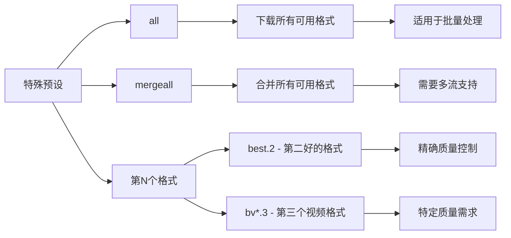
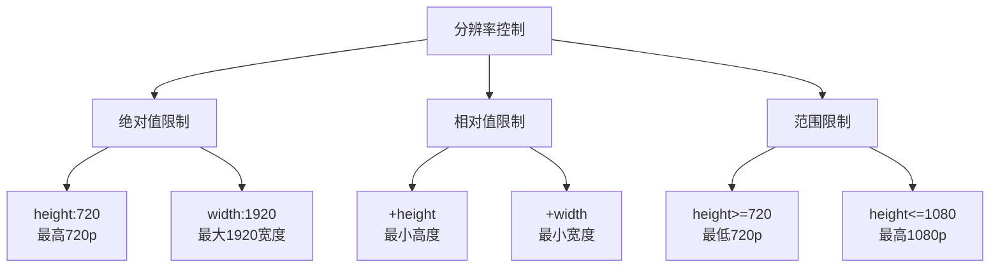
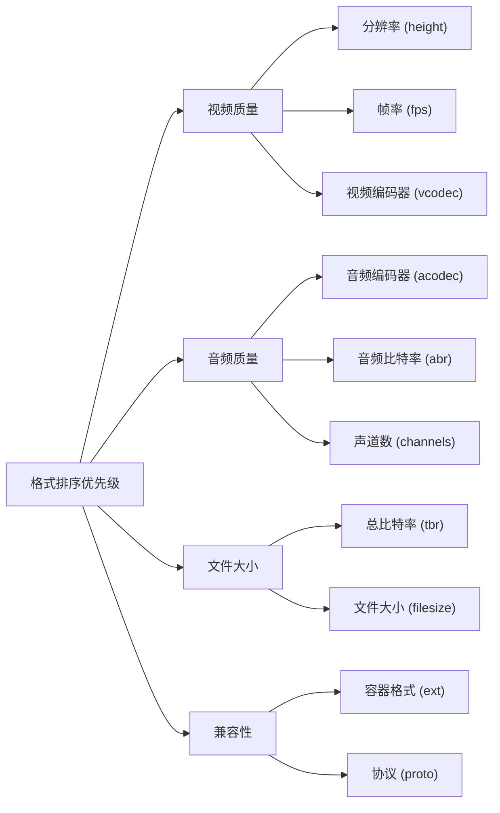
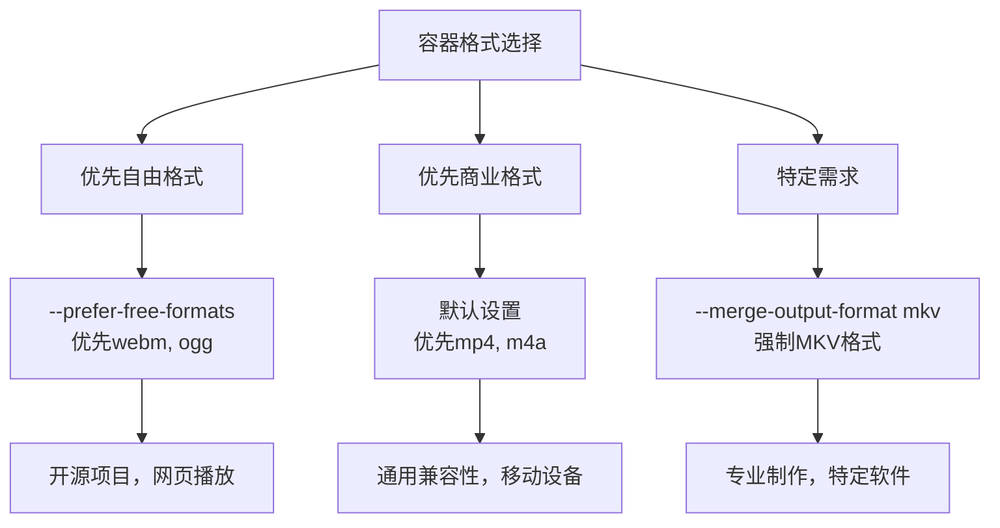
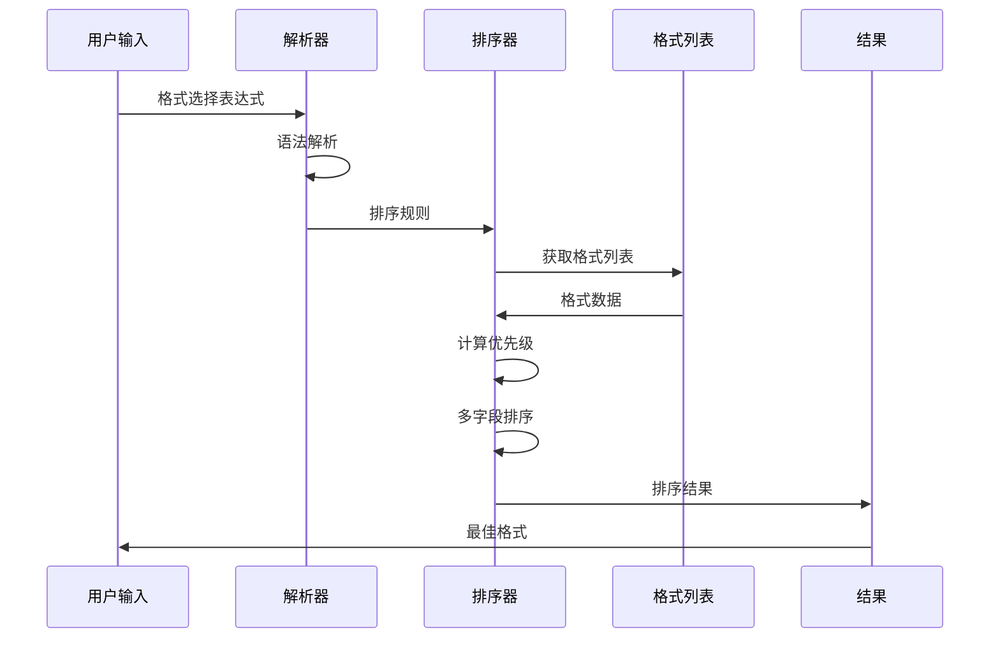

# 常用格式代码参考文档

<cite>
**本文档中引用的文件**
- [YoutubeDL.py](file://yt_dlp/YoutubeDL.py)
- [options.py](file://yt_dlp/options.py)
- [_utils.py](file://yt_dlp/utils/_utils.py)
- [test_YoutubeDL.py](file://test/test_YoutubeDL.py)
- [README.md](file://README.md)
</cite>

## 目录
1. [简介](#简介)
2. [核心格式选择概念](#核心格式选择概念)
3. [预设格式代码详解](#预设格式代码详解)
4. [格式选择语法](#格式选择语法)
5. [分辨率和质量控制](#分辨率和质量控制)
6. [音频和视频分离](#音频和视频分离)
7. [容器格式选择](#容器格式选择)
8. [格式优先级算法](#格式优先级算法)
9. [实用选择指南](#实用选择指南)
10. [故障排除](#故障排除)

## 简介

yt-dlp提供了强大而灵活的格式选择系统，允许用户精确控制下载内容的质量、类型和格式。本参考文档系统性地介绍了最常用的格式代码及其工作原理，帮助用户根据不同的使用场景选择最佳配置。

## 核心格式选择概念

### 格式选择器类型

yt-dlp支持多种格式选择器类型，每种都有特定的用途：

```mermaid
flowchart TD
A["格式选择器"] --> B["单个格式选择"]
A --> C["多格式组合"]
A --> D["格式过滤"]
A --> E["格式合并"]
B --> B1["数字格式ID<br/>-f 22"]
B --> B2["预设名称<br/>-f best"]
B --> B3["扩展名<br/>-f mp4"]
C --> C1["逗号分隔<br/>-f 22,17,18"]
C --> C2["优先级选择<br/>-f 22/17/18"]
D --> D1["基础过滤<br/>-f \"best[height=720]\""]
D --> D2["复合过滤<br/>-f \"bv[height<=?720][tbr>500]\""]
E --> E1["视频+音频<br/>-f \"bv+ba\""]
E --> E2["多流合并<br/>-f \"mergeall\""]
```

**图表来源**
- [YoutubeDL.py](file://yt_dlp/YoutubeDL.py#L2243-L2509)

### 格式字段分类

格式信息按以下分类组织：

| 字段类别 | 主要字段 | 描述 |
|---------|---------|------|
| **视频属性** | `height`, `width`, `fps`, `vcodec`, `vbr`, `resolution` | 视频尺寸、帧率、编码器、比特率等 |
| **音频属性** | `acodec`, `abr`, `asr`, `audio_channels` | 音频编码器、比特率、采样率、声道数 |
| **通用属性** | `tbr`, `filesize`, `ext`, `protocol` | 总体比特率、文件大小、扩展名、协议 |
| **质量指标** | `quality`, `hasvid`, `hasaud`, `ie_pref` | 质量评分、是否包含视频/音频、提取器偏好 |

**节来源**
- [YoutubeDL.py](file://yt_dlp/YoutubeDL.py#L190-L200)

## 预设格式代码详解

### 基础预设代码

#### 最佳质量选择

| 代码 | 含义 | 等价表达式 | 适用场景 |
|------|------|-----------|----------|
| `best` | 最佳综合格式 | `best*[vcodec!=none][acodec!=none]` | 需要视频和音频的完整内容 |
| `best*` | 包含视频或音频的最佳 | `best*[vcodec!=none or acodec!=none]` | 可接受单独音视频流 |
| `bestvideo` | 最佳视频格式 | `best*[acodec=none]` | 仅需要视频内容 |
| `bestvideo*` | 包含视频的最佳格式 | `best*[vcodec!=none]` | 可接受带音频的视频 |
| `bestaudio` | 最佳音频格式 | `best*[vcodec=none]` | 仅需要音频内容 |
| `bestaudio*` | 包含音频的最佳格式 | `best*[acodec!=none]` | 可接受带视频的音频 |

#### 最差质量选择

| 代码 | 含义 | 推荐替代方案 | 注意事项 |
|------|------|-------------|----------|
| `worst` | 最差综合格式 | `best -S +size,+br,+res,+fps` | 通常不推荐使用 |
| `worst*` | 包含视频或音频的最差 | `best -S +size` | 更合理的最小化选择 |
| `worstvideo` | 最差视频格式 | `best -S +size` | 文件大小优先 |
| `worstaudio` | 最差音频格式 | `best -S +size` | 文件大小优先 |

**节来源**
- [README.md](file://README.md#L1493-L1506)

### 高级预设代码

#### 特殊用途代码



**图表来源**
- [YoutubeDL.py](file://yt_dlp/YoutubeDL.py#L2481-L2509)

## 格式选择语法

### 基础语法结构

格式选择器采用表达式语法，支持以下操作符：

| 操作符 | 语法 | 描述 | 示例 |
|--------|------|------|------|
| **合并** | `+` | 将多个格式合并为单个文件 | `-f "bv+ba"` |
| **选择** | `/` | 按优先级选择第一个可用格式 | `-f "22/17/18"` |
| **分组** | `()` | 组合多个选择条件 | `-f "(mp4,webm)"` |
| **过滤** | `[]` | 应用格式过滤条件 | `-f "best[height=720]"` |
| **逗号** | `,` | 下载多个独立格式 | `-f "22,17,18"` |

### 过滤条件语法

#### 数值比较操作符

| 操作符 | 含义 | 示例 | 说明 |
|--------|------|------|------|
| `=` | 等于 | `[height=720]` | 精确匹配指定高度 |
| `!=` | 不等于 | `[height!=720]` | 排除指定高度 |
| `<` | 小于 | `[filesize<50M]` | 文件大小小于50MB |
| `<=` | 小于等于 | `[height<=480]` | 分辨率不超过480p |
| `>` | 大于 | `[tbr>500]` | 总比特率大于500kbps |
| `>=` | 大于等于 | `[fps>=30]` | 帧率不低于30fps |

#### 字符串比较操作符

| 操作符 | 含义 | 示例 | 说明 |
|--------|------|------|------|
| `=` | 完全匹配 | `[ext=mp4]` | 扩展名完全匹配 |
| `^=` | 以...开头 | `[format_id^=dash]` | 格式ID以dash开头 |
| `$=` | 以...结尾 | `[url$=.mp4]` | URL以.mp4结尾 |
| `*=` | 包含 | `[format*=720p]` | 格式描述包含720p |
| `~=` | 正则匹配 | `[vcodec~=h26[45]]` | 视频编码器匹配正则 |
| `!` | 否定 | `![ext=flv]` | 排除FLV格式 |

**节来源**
- [YoutubeDL.py](file://yt_dlp/YoutubeDL.py#L2305-L2361)

## 分辨率和质量控制

### 分辨率相关参数

#### 基础分辨率控制



#### 高级质量控制

| 控制参数 | 语法 | 效果 | 使用场景 |
|---------|------|------|----------|
| **分辨率** | `-S res:1080` | 优先1080p分辨率 | 高清内容下载 |
| **文件大小** | `-S size~50M` | 文件大小接近50MB | 存储空间优化 |
| **比特率** | `-S br:2000` | 平均比特率约2000kbps | 带宽优化 |
| **帧率** | `-S fps:60` | 优先60fps内容 | 动画和游戏内容 |

### 质量层次结构

格式排序遵循以下优先级层次：



**图表来源**
- [_utils.py](file://yt_dlp/utils/_utils.py#L5325-L5337)

**节来源**
- [README.md](file://README.md#L1570-L1604)

## 音频和视频分离

### 单一流体下载

#### 视频流下载

```bash
# 下载最佳视频质量
yt-dlp -f bestvideo -o "%(title)s.%(ext)s"

# 下载720p视频
yt-dlp -f "bestvideo[height=720]" -o "%(title)s.%(ext)s"

# 下载最小文件大小的视频
yt-dlp -f bestvideo -S +size -o "%(title)s.%(ext)s"
```

#### 音频流下载

```bash
# 下载最佳音频质量
yt-dlp -f bestaudio -o "%(title)s.%(ext)s"

# 下载MP3格式音频
yt-dlp -f "bestaudio[ext=mp3]" -o "%(title)s.%(ext)s"

# 下载高质量音频（128kbps以上）
yt-dlp -f "bestaudio[abr>=128]" -o "%(title)s.%(ext)s"
```

### 多流支持配置

#### 允许多音频流

```bash
# 允许下载多个音频流
yt-dlp -f "mergeall[vcodec=none]" --audio-multistreams

# 下载前两个音频流
yt-dlp -f "ba+ba.2" --audio-multistreams
```

#### 允许多视频流

```bash
# 允许下载多个视频流
yt-dlp -f "mergeall[acodec=none]" --video-multistreams

# 下载不同分辨率的视频流
yt-dlp -f "bv*.1+bv*.2" --video-multistreams
```

**节来源**
- [test_YoutubeDL.py](file://test/test_YoutubeDL.py#L147-L231)

## 容器格式选择

### 支持的容器格式

#### 视频容器格式优先级

| 格式 | 优先级 | 特点 | 适用场景 |
|------|--------|------|----------|
| `mp4` | 最高 | 广泛兼容，大文件 | 通用存储和分享 |
| `webm` | 高 | 开源标准，小文件 | 网页播放和开源项目 |
| `mov` | 中 | Apple生态，高质量 | 专业视频制作 |
| `flv` | 低 | Flash兼容，较大 | 旧版兼容性 |

#### 音频容器格式优先级

| 格式 | 优先级 | 特点 | 适用场景 |
|------|--------|------|----------|
| `m4a` | 最高 | AAC编码，压缩比高 | 音乐和播客 |
| `aac` | 高 | 标准编码，广泛支持 | 通用音频 |
| `mp3` | 中 | 经典格式，兼容性好 | 传统音频 |
| `ogg` | 中 | 开源格式，质量优秀 | 开源项目 |
| `opus` | 高 | 现代编码，效率高 | 实时通信 |

### 容器格式选择策略



**图表来源**
- [_utils.py](file://yt_dlp/utils/_utils.py#L5338-L5350)

**节来源**
- [_utils.py](file://yt_dlp/utils/_utils.py#L5080-L5120)

## 格式优先级算法

### 格式排序机制

yt-dlp使用复杂的排序算法来确定最佳格式：



**图表来源**
- [_utils.py](file://yt_dlp/utils/_utils.py#L5417-L5600)

### 默认排序字段

格式排序按照以下优先级进行：

| 优先级 | 字段 | 类型 | 描述 |
|--------|------|------|------|
| **最高** | `hasvid`, `ie_pref` | 强制 | 必须包含视频或音频，提取器偏好 |
| **高** | `lang`, `quality` | 数值 | 语言偏好，格式质量 |
| **中** | `res`, `fps`, `hdr` | 数值 | 分辨率，帧率，动态范围 |
| **中** | `vcodec`, `acodec` | 有序 | 视频/音频编码器优先级 |
| **低** | `size`, `br`, `asr` | 数值 | 文件大小，比特率，采样率 |
| **低** | `proto`, `ext` | 有序 | 协议，容器格式 |
| **最低** | `hasaud`, `source`, `id` | 布尔 | 是否有音频，来源，格式ID |

### 自定义排序规则

```bash
# 按分辨率降序，文件大小升序
yt-dlp -S "res,-size" -f best

# 按视频编码器优先级排序
yt-dlp -S "vcodec" -f best

# 按音频质量排序，最后按文件大小
yt-dlp -S "abr,-size" -f best
```

**节来源**
- [_utils.py](file://yt_dlp/utils/_utils.py#L5325-L5337)

## 实用选择指南

### 网络条件优化

#### 高带宽环境

```bash
# 最高质量，不限制大小
yt-dlp -f "bestvideo[height>=1080]+bestaudio" \
       -S "vcodec,abr,res,fps"

# 多流备份
yt-dlp -f "299+251,298+251,137+140" \
       --audio-multistreams --video-multistreams
```

#### 移动网络优化

```bash
# 适中质量，小文件
yt-dlp -f "bestvideo[height<=480]+bestaudio[abr<=128]" \
       -S "+size,+br"

# 限制总大小
yt-dlp -f "best[filesize<50M]" -S "size~50M"
```

#### 电池电量有限

```bash
# 最小文件大小
yt-dlp -f best -S "+size,+br" -o "%(title)s.%(ext)s"

# 低质量音频
yt-dlp -f "bestaudio[abr<=64]" -o "%(title)s.%(ext)s"
```

### 设备兼容性指南

#### 传统设备

```bash
# MP4容器，H.264视频，AAC音频
yt-dlp -f "bestvideo[ext=mp4][vcodec=h264]+bestaudio[ext=aac]" \
       --merge-output-format mp4

# 720p分辨率，适合老旧设备
yt-dlp -f "bestvideo[height<=720][ext=mp4]+bestaudio[ext=aac]" \
       --merge-output-format mp4
```

#### 现代设备

```bash
# 支持HDR和高帧率
yt-dlp -f "bestvideo[vcodec^=av01]+bestaudio" \
       -S "hdr:12,fps:60"

# WebM格式，现代浏览器优化
yt-dlp -f "best[ext=webm]" -S "ext"
```

### 存储空间管理

#### 有限存储

```bash
# 最小文件大小
yt-dlp -f best -S "+size,+br,+res"

# 限制总大小
yt-dlp -f "best[filesize<100M]" -S "size~100M"
```

#### 大容量存储

```bash
# 最高质量
yt-dlp -f "bestvideo[height>=1080]+bestaudio" \
       -S "vcodec,abr,res,fps"

# 多质量备份
yt-dlp -f "137+140,136+140,18" \
       --audio-multistreams
```

## 故障排除

### 常见问题解决

#### 格式不可用

```bash
# 尝试备用格式
yt-dlp -f "22/18/137/best"

# 检查可用格式
yt-dlp -F URL

# 交互式选择
yt-dlp -f -
```

#### 合并失败

```bash
# 检查FFmpeg可用性
yt-dlp --version

# 单独下载音视频
yt-dlp -f "bv*+ba" -o "%(title)s.%(ext)s"

# 使用外部工具合并
yt-dlp -f "bv* ba" && ffmpeg -i video.mp4 -i audio.m4a -c:v copy -c:a aac output.mp4
```

#### 质量不符合预期

```bash
# 查看详细排序信息
yt-dlp -v -F URL

# 明确指定质量
yt-dlp -f "bestvideo[height>=720][fps>=30]+bestaudio"

# 调整排序规则
yt-dlp -S "res:1080,fps:60" -f best
```

### 性能优化建议

#### 大批量下载

```bash
# 缓存格式信息
yt-dlp --no-check-certificates URL1 URL2 URL3

# 并行下载多个格式
yt-dlp -f "22,18,137" URL

# 使用格式缓存
yt-dlp --format-cache-dir ./cache URL
```

#### 内存使用优化

```bash
# 限制并发下载
yt-dlp --concurrent-fragments 1 URL

# 使用外部下载器
yt-dlp --external-downloader aria2c URL

# 减少内存缓冲
yt-dlp --buffersize 1024K URL
```

**节来源**
- [YoutubeDL.py](file://yt_dlp/YoutubeDL.py#L2446-L2482)

## 结论

yt-dlp的格式选择系统提供了从简单到复杂的全方位控制能力。通过理解预设代码的工作原理、掌握语法结构、合理应用排序规则，用户可以根据自己的具体需求选择最适合的格式配置。在实际使用中，建议从简单的预设开始，逐步学习高级功能，并根据具体的网络环境、设备能力和存储条件调整参数。

记住，格式选择的核心在于平衡质量、兼容性和资源消耗，在满足需求的前提下选择最优配置。