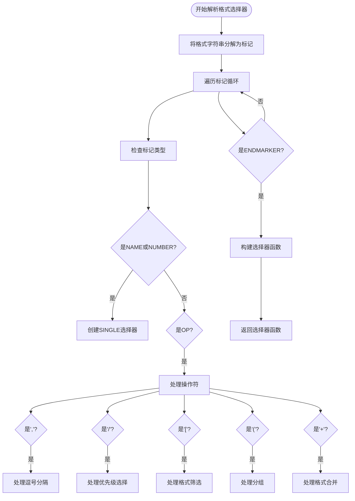

# 格式选择

<cite>
**本文档引用的文件**   
- [YoutubeDL.py](file://yt_dlp/YoutubeDL.py)
- [options.py](file://yt_dlp/options.py)
- [test_YoutubeDL.py](file://test/test_YoutubeDL.py)
- [README.md](file://README.md)
</cite>

## 目录
1. [简介](#简介)
2. [格式选择器语法](#格式选择器语法)
3. [格式选择处理逻辑](#格式选择处理逻辑)
4. [实用示例](#实用示例)
5. [常见问题解答](#常见问题解答)

## 简介
yt-dlp的格式选择功能通过`-f/--format`选项实现，允许用户精确控制要下载的视频格式。该功能支持复杂的格式选择语法，包括基本格式代码、格式筛选表达式和多格式合并规则。系统会自动解析格式选择器并根据优先级排序算法选择最佳格式。

**Section sources**
- [README.md](file://README.md#L1490-L1689)

## 格式选择器语法

### 基本格式代码
格式选择器支持多种特殊名称来选择特定的格式：

- `all`: 分别选择**所有格式**
- `mergeall`: 选择并**合并所有格式**（必须与`--audio-multistreams`、`--video-multistreams`或两者一起使用）
- `b*`, `best*`: 选择**包含视频或音频或两者**的最佳质量格式（即`vcodec!=none or acodec!=none`）
- `b`, `best`: 选择**同时包含视频和音频**的最佳质量格式。等同于`best*[vcodec!=none][acodec!=none]`
- `bv`, `bestvideo`: 选择**仅视频**的最佳质量格式。等同于`best*[acodec=none]`
- `bv*`, `bestvideo*`: 选择**包含视频**的最佳质量格式。可能也包含音频。等同于`best*[vcodec!=none]`
- `ba`, `bestaudio`: 选择**仅音频**的最佳质量格式。等同于`best*[vcodec=none]`
- `ba*`, `bestaudio*`: 选择**包含音频**的最佳质量格式。可能也包含视频。等同于`best*[acodec!=none]`
- `w*`, `worst*`: 选择包含视频或音频的最差质量格式
- `w`, `worst`: 选择同时包含视频和音频的最差质量格式。等同于`worst*[vcodec!=none][acodec!=none]`
- `wv`, `worstvideo`: 选择仅视频的最差质量格式。等同于`worst*[acodec=none]`
- `wv*`, `worstvideo*`: 选择包含视频的最差质量格式。可能也包含音频。等同于`worst*[vcodec!=none]`
- `wa`, `worstaudio`: 选择仅音频的最差质量格式。等同于`worst*[vcodec=none]`
- `wa*`, `worstaudio*`: 选择包含音频的最差质量格式。可能也包含视频。等同于`worst*[acodec!=none]`

### 格式筛选表达式
可以通过在方括号中放置条件来筛选视频格式，如`-f "best[height=720]"`（或`-f "[filesize>10M]"`，因为没有选择器的筛选器被解释为`best`）。

支持的数值元字段可用于比较`<`、`<=`、`>`、`>=`、`=`（等于）、`!=`（不等于）：
- `filesize`: 如果提前知道，字节数
- `filesize_approx`: 字节数的估计值
- `width`: 视频宽度（如果已知）
- `height`: 视频高度（如果已知）
- `aspect_ratio`: 视频的宽高比（如果已知）
- `tbr`: 音频和视频的平均比特率（kbps）
- `abr`: 音频平均比特率（kbps）
- `vbr`: 视频平均比特率（kbps）
- `asr`: 音频采样率（赫兹）
- `fps`: 帧率
- `audio_channels`: 音频通道数
- `stretched_ratio`: 视频像素的`width:height`（如果不是方形）

字符串比较支持`=`（等于）、`^=`（以...开头）、`$=`（以...结尾）、`*=`（包含）、`~=`（匹配正则表达式）以及以下字符串元字段：
- `url`: 视频URL
- `ext`: 文件扩展名
- `acodec`: 使用的音频编解码器名称
- `vcodec`: 使用的视频编解码器名称
- `container`: 容器格式名称
- `protocol`: 实际下载将使用的协议，小写（`http`、`https`、`rtsp`、`rtmp`、`rtmpe`、`mms`、`f4m`、`ism`、`http_dash_segments`、`m3u8`或`m3u8_native`）
- `language`: 语言代码
- `dynamic_range`: 视频的动态范围
- `format_id`: 格式的简短描述
- `format`: 格式的人类可读描述
- `format_note`: 格式的附加信息
- `resolution`: 宽度和高度的文本描述

任何字符串比较都可以用否定`!`作为前缀以产生相反的比较，例如`!*=`（不包含）。如果比较对象包含空格或除`._-`之外的特殊字符，则需要用双引号或单引号引起来。

**Section sources**
- [README.md](file://README.md#L1526-L1589)

### 多格式合并规则
可以使用`-f <format1>+<format2>+...`将多个格式的视频和音频合并到单个文件中（需要安装ffmpeg）；例如`-f bestvideo+bestaudio`将下载最佳的仅视频格式、最佳的仅音频格式并使用ffmpeg将它们复用在一起。

除非使用`--video-multistreams`，否则除第一个外所有包含视频流的格式都会被忽略。同样，除非使用`--audio-multistreams`，否则除第一个外所有包含音频流的格式都会被忽略。

**Section sources**
- [README.md](file://README.md#L1520-L1525)

## 格式选择处理逻辑

### 格式自动解析
`build_format_selector`方法负责解析格式规范字符串并构建相应的选择器函数。该方法使用tokenize模块将格式字符串分解为标记，然后根据操作符构建选择器树。



**Diagram sources **
- [YoutubeDL.py](file://yt_dlp/YoutubeDL.py#L2250-L2600)

### 优先级排序算法
格式选择器支持使用`-S`（`--format-sort`）更改被视为"最佳"的标准。通用格式为`--format-sort field1,field2...`。

可用字段包括：
- `hasvid`: 优先考虑包含视频流的格式
- `hasaud`: 优先考虑包含音频流的格式
- `ie_pref`: 格式偏好
- `lang`: 提取器确定的语言偏好（例如，原始语言优先于音频描述）
- `quality`: 格式质量
- `source`: 源的偏好
- `proto`: 下载使用的协议（`https`/`ftps` > `http`/`ftp` > `m3u8_native`/`m3u8` > `http_dash_segments`> `websocket_frag` > `mms`/`rtsp` > `f4f`/`f4m`）
- `vcodec`: 视频编解码器（`av01` > `vp9.2` > `vp9` > `h265` > `h264` > `vp8` > `h263` > `theora` > 其他）
- `acodec`: 音频编解码器（`flac`/`alac` > `wav`/`aiff` > `opus` > `vorbis` > `aac` > `mp4a` > `mp3` > `ac4` > `eac3` > `ac3` > `dts` > 其他）
- `codec`: 等同于`vcodec,acodec`
- `vext`: 视频扩展名（`mp4` > `mov` > `webm` > `flv` > 其他）。如果使用`--prefer-free-formats`，则优先选择`webm`
- `aext`: 音频扩展名（`m4a` > `aac` > `mp3` > `ogg` > `opus` > `webm` > 其他）。如果使用`--prefer-free-formats`，顺序变为`ogg` > `opus` > `webm` > `mp3` > `m4a` > `aac`
- `ext`: 等同于`vext,aext`
- `filesize`: 如果提前知道，确切的文件大小
- `fs_approx`: 近似文件大小
- `size`: 如果可用则为确切文件大小，否则为近似文件大小
- `height`: 视频高度
- `width`: 视频宽度
- `res`: 视频分辨率，计算为最小维度
- `fps`: 视频帧率
- `hdr`: 视频的动态范围（`DV` > `HDR12` > `HDR10+` > `HDR10` > `HLG` > `SDR`）
- `channels`: 音频通道数
- `tbr`: [kbps](## "1000 bits/sec")中的总平均比特率
- `vbr`: [kbps](## "1000 bits/sec")中的视频平均比特率
- `abr`: [kbps](## "1000 bits/sec")中的音频平均比特率
- `br`: [kbps](## "1000 bits/sec")中的平均比特率，`tbr`/`vbr`/`abr`
- `asr`: 音频采样率（Hz）

所有字段（除非另有说明）都按降序排序。要反转此顺序，请在字段前加`+`。例如`+res`优先选择分辨率最小的格式。此外，您可以用`:`分隔的首选值作为后缀。例如`res:720`优先选择较大的视频，但不超过720p，如果没有小于720p的视频，则选择最小的视频。

**Section sources**
- [README.md](file://README.md#L1590-L1604)

## 实用示例

### 下载特定分辨率的视频
```bash
# 下载720p分辨率的视频
yt-dlp -f "best[height=720]" URL

# 下载不超过480p的视频
yt-dlp -f "best[height<=480]" URL

# 下载480p或更低分辨率的最佳视频，如果没有则下载最差的视频
yt-dlp -f "bv*[height<=480]+ba/b[height<=480] / wv*+ba/w" URL
```

### 下载特定比特率的视频
```bash
# 下载比特率至少为500kbps的视频
yt-dlp -f "bv[tbr>500]+ba" URL

# 下载文件大小不超过50MB的视频
yt-dlp -f "b[filesize<50M]" URL
```

### 下载特定容器类型的视频
```bash
# 下载MP4格式的视频
yt-dlp -f "best[ext=mp4]" URL

# 下载WebM格式的视频
yt-dlp -f "best[ext=webm]" URL
```

### 组合多个格式进行智能选择
```bash
# 下载并合并最佳视频格式和最佳音频格式，
# 或者如果不可用则下载最佳合并格式
yt-dlp -f "bv+ba/b" URL

# 下载最佳视频格式（包含视频），
# 如果还没有音频流，则与最佳仅音频格式合并
yt-dlp -f "bv*+ba/b" URL

# 下载最佳视频格式和最佳音频格式而不合并它们
yt-dlp -f "bv,ba" -o "%(title)s.f%(format_id)s.%(ext)s" URL

# 下载并合并最佳视频格式和所有仅音频格式到一个文件中
yt-dlp -f "bv*+mergeall[vcodec=none]" --audio-multistreams URL

# 下载并合并最佳视频格式和最佳2个仅音频格式到一个文件中
yt-dlp -f "bv*+ba+ba.2" --audio-multistreams URL
```

**Section sources**
- [README.md](file://README.md#L1635-L1689)

## 常见问题解答

### 'best'和'bestvideo'的区别是什么？
`best`选择同时包含视频和音频的最佳质量格式，而`bestvideo`选择仅视频的最佳质量格式。`best`等同于`best*[vcodec!=none][acodec!=none]`，而`bestvideo`等同于`best*[acodec=none]`。

### 如何避免格式不兼容问题？
为了避免格式不兼容问题，建议使用格式筛选和排序功能。例如，使用`-S ext`可以优先选择兼容性更好的扩展名。同时，可以使用`[vcodec=...]`和`[acodec=...]`筛选器来指定特定的编解码器。

### 为什么有时下载的不是最高质量的格式？
yt-dlp默认优先考虑协议安全性（https > http）和容器格式兼容性。如果需要绝对最高质量的格式，可以使用`-S +size,+br,+res,+fps`来按文件大小、比特率、分辨率和帧率排序。

### 如何下载直播流的完整视频？
对于直播流，可以使用`--live-from-start`选项来从开始下载直播视频。注意这目前是实验性的，仅支持YouTube和Twitch。

### 如何同时下载多个格式？
可以使用逗号分隔符来下载多个格式，例如`-f "bv,ba"`将同时下载最佳视频格式和最佳音频格式。如果需要合并多个格式，可以使用`+`操作符，如`-f "bv+ba"`。

**Section sources**
- [README.md](file://README.md#L1490-L1689)
- [YoutubeDL.py](file://yt_dlp/YoutubeDL.py#L2250-L2600)