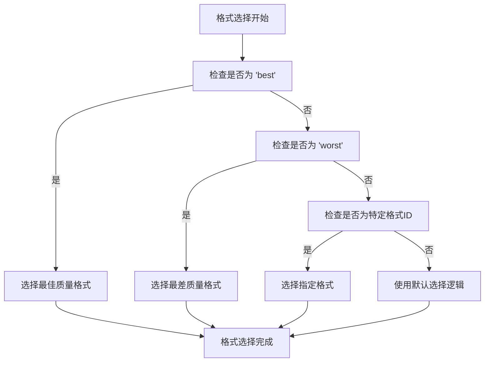
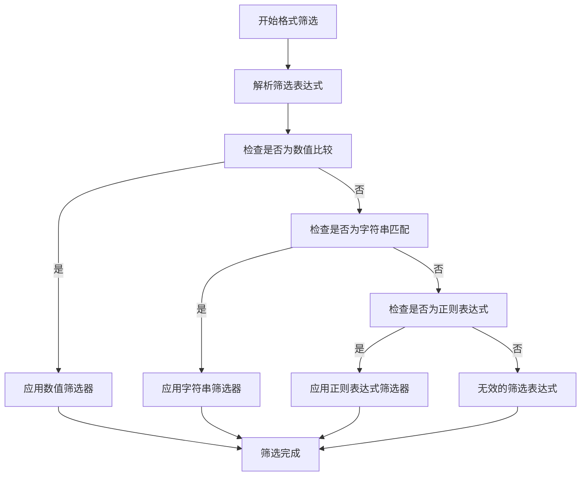
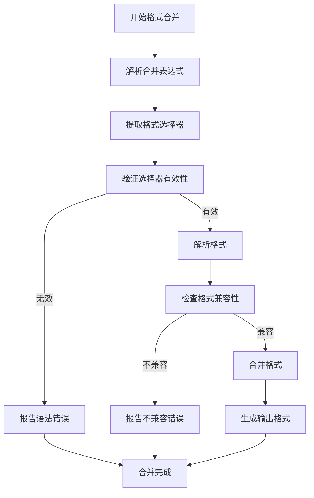
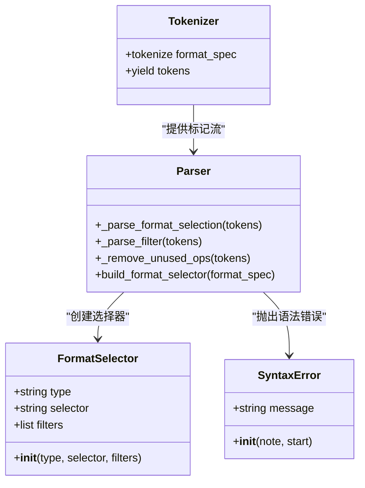
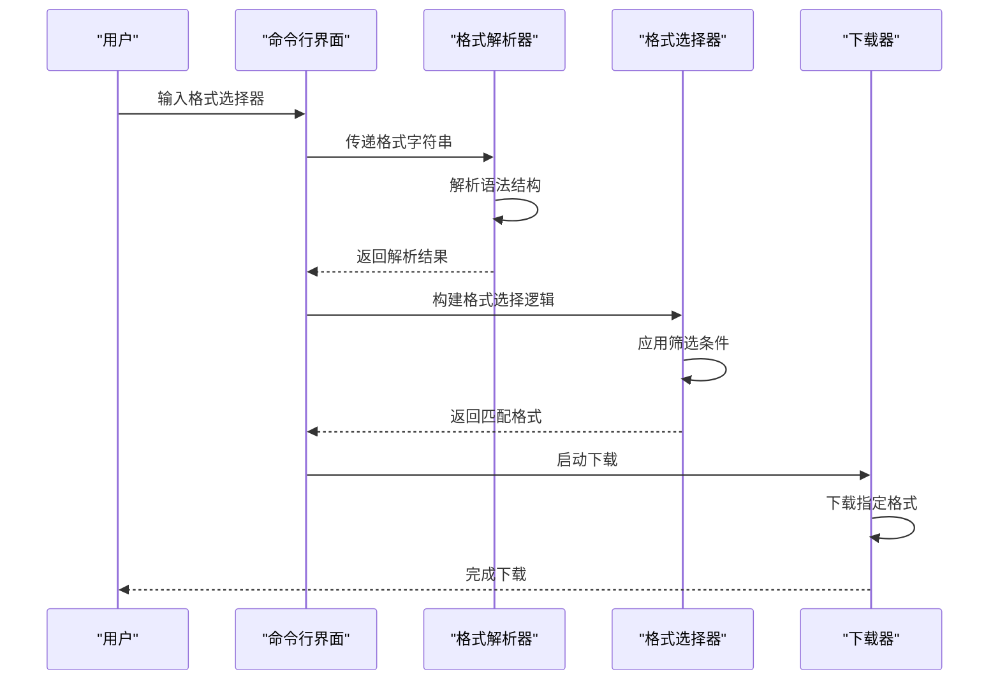
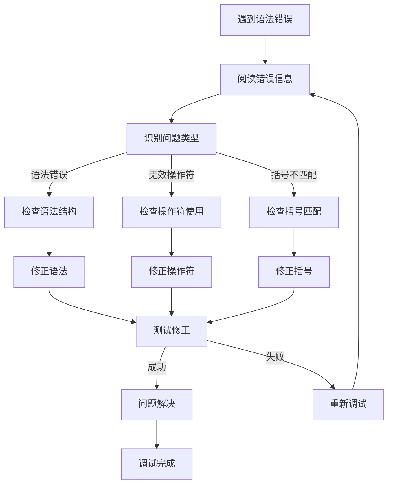
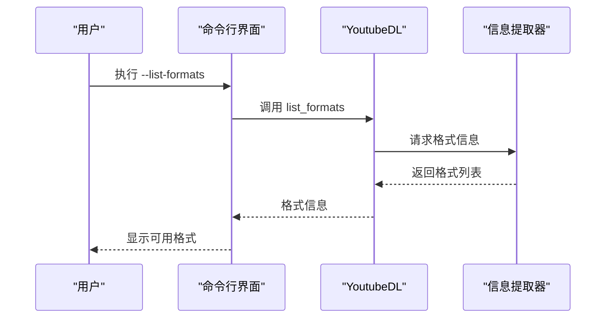

# 格式选择语法详解

<cite>
**本文档引用的文件**
- [YoutubeDL.py](file://yt_dlp/YoutubeDL.py)
- [options.py](file://yt_dlp/options.py)
- [README.md](file://README.md)
</cite>

## 目录
1. [简介](#简介)
2. [基本格式代码](#基本格式代码)
3. [格式筛选表达式](#格式筛选表达式)
4. [多格式合并规则](#多格式合并规则)
5. [格式解析器实现机制](#格式解析器实现机制)
6. [实际应用示例](#实际应用示例)
7. [语法错误与调试](#语法错误与调试)
8. [查看可用格式](#查看可用格式)

## 简介
yt-dlp的格式选择系统提供了一套强大而灵活的语法，用于精确控制视频和音频格式的选择。通过`-f/--format`选项，用户可以指定下载的最佳或最差质量格式，应用复杂的筛选条件，以及合并多个格式流。该系统支持基本格式代码、格式筛选表达式和多格式合并等多种功能，满足不同用户的下载需求。

**Section sources**
- [YoutubeDL.py](file://yt_dlp/YoutubeDL.py#L448)
- [README.md](file://README.md#L1528-L1556)

## 基本格式代码
基本格式代码是格式选择语法中最简单的形式，用于指定特定的格式或预定义的质量等级。系统支持多种基本格式代码，包括`best`（最佳质量）和`worst`（最差质量）等。

**Diagram sources**
- [YoutubeDL.py](file://yt_dlp/YoutubeDL.py#L2243-L2272)
- [YoutubeDL.py](file://yt_dlp/YoutubeDL.py#L2305-L2331)

**Section sources**
- [YoutubeDL.py](file://yt_dlp/YoutubeDL.py#L2243-L2272)
- [test_YoutubeDL.py](file://test/test_YoutubeDL.py#L100-L150)

## 格式筛选表达式
格式筛选表达式允许用户根据特定条件筛选可用的格式。这些条件可以基于数值比较（如`height>720`）或字符串匹配（如`ext=mp4`）。系统支持多种比较操作符，包括`<`、`<=`、`>`、`>=`、`=`和`!=`。

**Diagram sources**
- [YoutubeDL.py](file://yt_dlp/YoutubeDL.py#L2100-L2177)
- [YoutubeDL.py](file://yt_dlp/YoutubeDL.py#L2243-L2272)

**Section sources**
- [YoutubeDL.py](file://yt_dlp/YoutubeDL.py#L2100-L2177)
- [README.md](file://README.md#L1528-L1556)

## 多格式合并规则
多格式合并规则允许用户将多个格式流合并成一个完整的视频文件。这在处理分离的视频和音频流时特别有用。系统使用`+`分隔符来指定需要合并的格式，例如`bestvideo+bestaudio`表示将最佳视频流与最佳音频流合并。

**Diagram sources**
- [YoutubeDL.py](file://yt_dlp/YoutubeDL.py#L2329-L2350)
- [YoutubeDL.py](file://yt_dlp/YoutubeDL.py#L2349-L2361)

**Section sources**
- [YoutubeDL.py](file://yt_dlp/YoutubeDL.py#L2329-L2361)
- [test_YoutubeDL.py](file://test/test_YoutubeDL.py#L150-L200)

## 格式解析器实现机制
格式解析器的实现机制基于递归下降解析技术，使用Python的`tokenize`模块对格式选择字符串进行词法分析。解析器首先将输入字符串分解为标记流，然后根据语法规则构建抽象语法树（AST），最后遍历AST执行相应的格式选择逻辑。

**Diagram sources**
- [YoutubeDL.py](file://yt_dlp/YoutubeDL.py#L2243-L2439)
- [YoutubeDL.py](file://yt_dlp/YoutubeDL.py#L2305-L2331)

**Section sources**
- [YoutubeDL.py](file://yt_dlp/YoutubeDL.py#L2243-L2439)
- [YoutubeDL.py](file://yt_dlp/YoutubeDL.py#L2100-L2177)

## 实际应用示例
以下是一些实际应用示例，展示如何构造复杂的格式选择器来满足特定需求：

**Diagram sources**
- [YoutubeDL.py](file://yt_dlp/YoutubeDL.py#L2243-L2439)
- [test_YoutubeDL.py](file://test/test_YoutubeDL.py#L100-L200)

**Section sources**
- [test_YoutubeDL.py](file://test/test_YoutubeDL.py#L100-L200)
- [README.md](file://README.md#L1528-L1556)

## 语法错误与调试
格式选择语法的常见错误原因包括语法结构错误、无效的操作符使用和不匹配的括号等。调试方法包括检查语法错误提示、验证格式ID的有效性以及测试筛选表达式的正确性。

**Diagram sources**
- [YoutubeDL.py](file://yt_dlp/YoutubeDL.py#L2243-L2272)
- [YoutubeDL.py](file://yt_dlp/YoutubeDL.py#L2329-L2350)

**Section sources**
- [YoutubeDL.py](file://yt_dlp/YoutubeDL.py#L2243-L2272)
- [YoutubeDL.py](file://yt_dlp/YoutubeDL.py#L2329-L2350)

## 查看可用格式
通过`--list-formats`选项可以查看指定视频的所有可用格式。这个功能对于了解视频的格式选项和构建合适的格式选择器非常有用。

**Diagram sources**
- [options.py](file://yt_dlp/options.py#L895-L899)
- [YoutubeDL.py](file://yt_dlp/YoutubeDL.py#L2967)

**Section sources**
- [options.py](file://yt_dlp/options.py#L895-L899)
- [YoutubeDL.py](file://yt_dlp/YoutubeDL.py#L2967)
- [YoutubeDL.py](file://yt_dlp/YoutubeDL.py#L448)