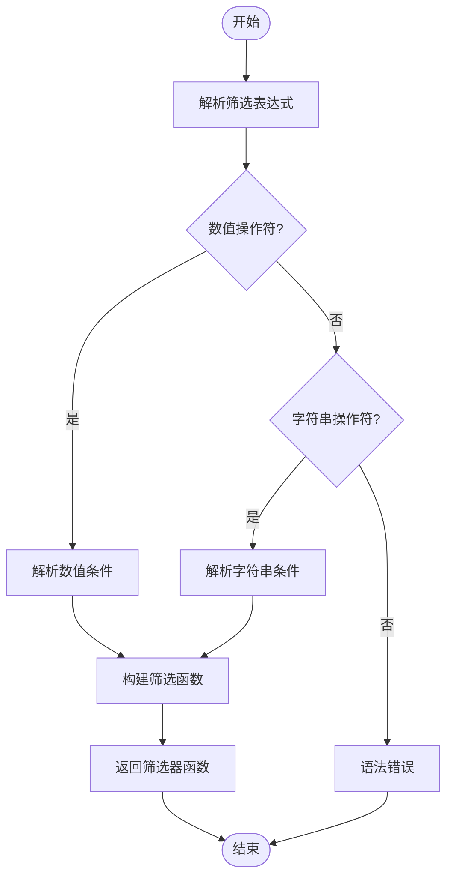
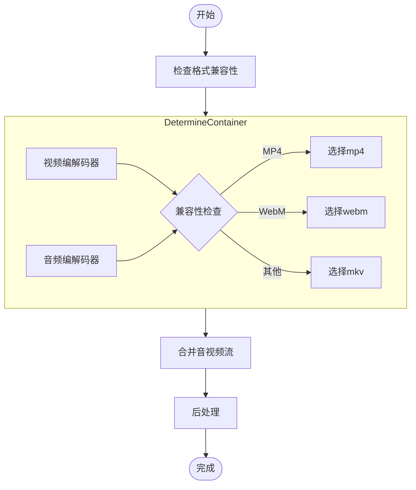
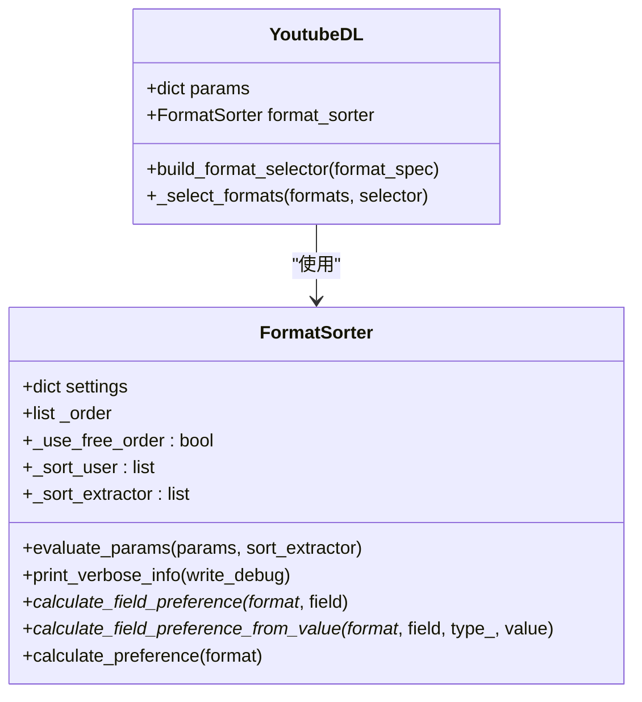
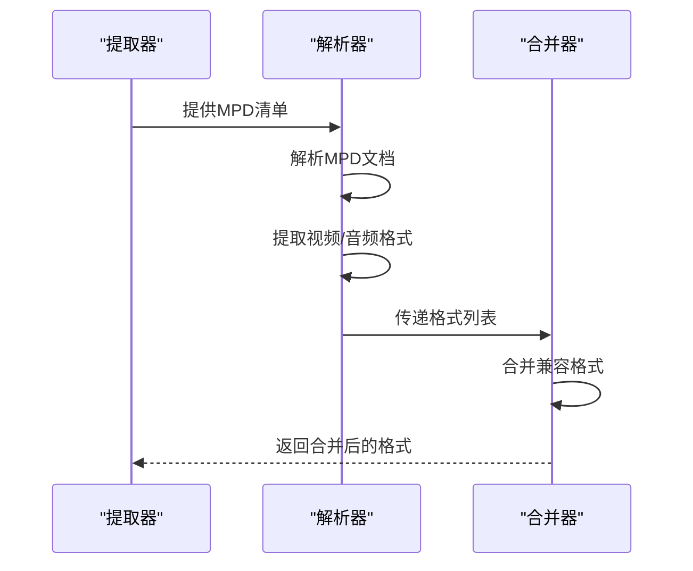
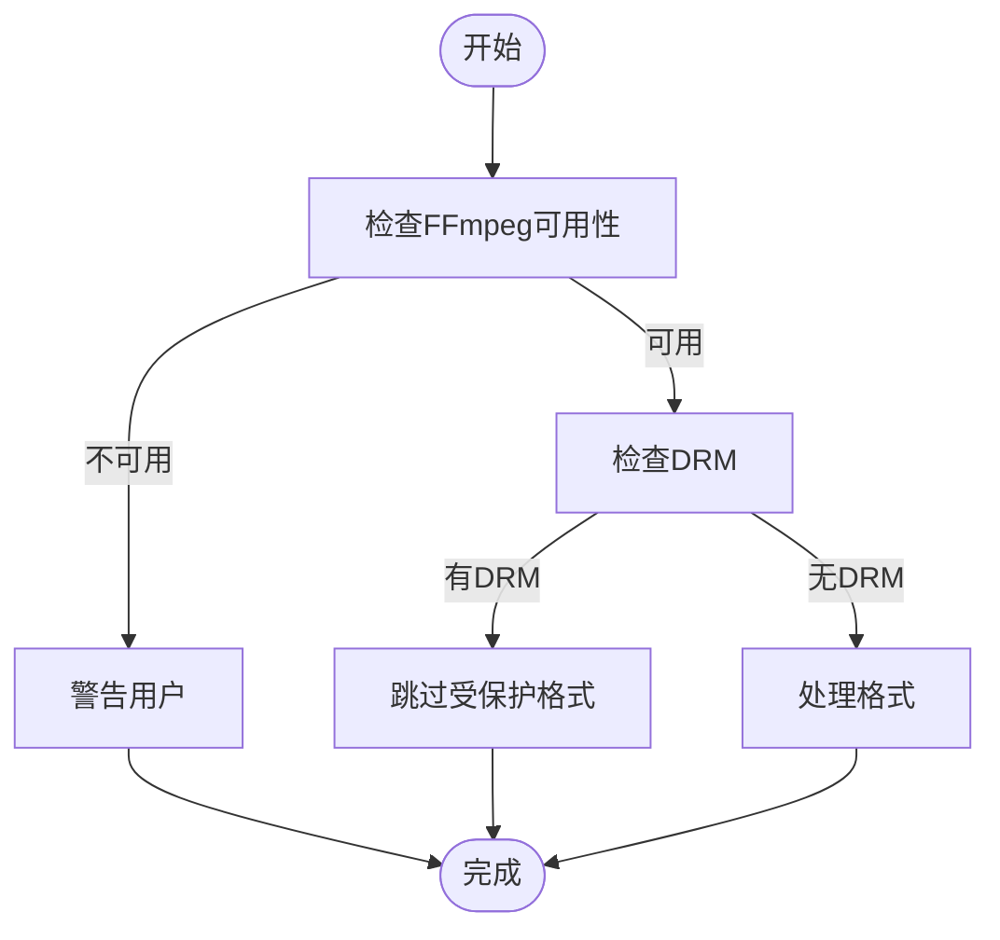

# 高级格式用法

<cite>
**本文档中引用的文件**  
- [YoutubeDL.py](file://yt_dlp/YoutubeDL.py)
- [utils/_utils.py](file://yt_dlp/utils/_utils.py)
- [test/test_YoutubeDL.py](file://test/test_YoutubeDL.py)
- [postprocessor/ffmpeg.py](file://yt_dlp/postprocessor/ffmpeg.py)
</cite>

## 目录
1. [简介](#简介)
2. [格式筛选表达式](#格式筛选表达式)
3. [视频和音频流合并](#视频和音频流合并)
4. [格式匹配与优先级计算](#格式匹配与优先级计算)
5. [高级用例](#高级用例)
6. [DASH流处理](#dash流处理)
7. [性能优化与常见陷阱](#性能优化与常见陷阱)

## 简介
yt-dlp 提供了强大的格式选择功能，允许用户根据复杂的条件筛选和组合视频格式。本文档深入探讨了格式选择器的内部工作机制，包括格式筛选表达式、流合并算法、优先级计算以及DASH流处理等高级特性。

## 格式筛选表达式
yt-dlp 支持使用复杂的筛选表达式来选择视频格式。这些表达式可以组合多个条件，使用逻辑运算符进行过滤。

### 筛选语法
格式筛选表达式支持多种操作符，包括数值比较和字符串匹配：

- **数值比较**: `>`, `>=`, `<`, `<=`, `=`, `!=`
- **字符串匹配**: `=`, `^=` (前缀), `$=` (后缀), `*=` (包含), `~=` (正则表达式)

```python
# 数值条件示例
height>=1080 & vbr>256
filesize<1M & width>=1920

# 字符串条件示例
ext=mp4 & vcodec=h264
format_note~='(?i)hd'
```

### 筛选器实现
筛选器的实现基于正则表达式解析，将筛选条件转换为可执行的函数：



**Diagram sources**
- [YoutubeDL.py](file://yt_dlp/YoutubeDL.py#L2112-L2177)

**Section sources**
- [YoutubeDL.py](file://yt_dlp/YoutubeDL.py#L2100-L2200)

## 视频和音频流合并
yt-dlp 支持通过 `+` 操作符将视频和音频流合并，以获得最佳质量的组合。

### 合并机制
合并操作符 `+` 允许用户指定多个格式进行合并：

```python
# 合并最佳视频和音频
bestvideo+bestaudio

# 特定格式合并
137+141  # 1080p视频 + 高质量音频
```

### 合并算法
合并算法处理视频和音频格式的兼容性检查和容器选择：



**Diagram sources**
- [YoutubeDL.py](file://yt_dlp/YoutubeDL.py#L2363-L2390)
- [postprocessor/ffmpeg.py](file://yt_dlp/postprocessor/ffmpeg.py#L809-L844)

**Section sources**
- [YoutubeDL.py](file://yt_dlp/YoutubeDL.py#L2350-L2400)
- [postprocessor/ffmpeg.py](file://yt_dlp/postprocessor/ffmpeg.py#L800-L850)

## 格式匹配与优先级计算
yt-dlp 使用复杂的算法来匹配和计算格式优先级，确保选择最佳的视频格式。

### 优先级排序
格式优先级基于多个字段进行排序，包括分辨率、比特率、编解码器等：

```python
# 默认排序字段
default_sort_fields = [
    'quality',      # 质量
    'height',       # 分辨率高度
    'width',        # 分辨率宽度
    'tbr',          # 总比特率
    'vbr',          # 视频比特率
    'abr',          # 音频比特率
    'ext',          # 文件扩展名
    'filesize',     # 文件大小
]
```

### 优先级计算
优先级计算算法考虑了用户偏好和格式特性：



**Diagram sources**
- [utils/_utils.py](file://yt_dlp/utils/_utils.py#L5477-L5591)
- [YoutubeDL.py](file://yt_dlp/YoutubeDL.py#L2100-L2200)

**Section sources**
- [utils/_utils.py](file://yt_dlp/utils/_utils.py#L5400-L5700)
- [YoutubeDL.py](file://yt_dlp/YoutubeDL.py#L2100-L2200)

## 高级用例
### 设备预设配置
为不同设备创建格式预设：

```python
# 手机预设
mobile_preset = 'best[height<=720][vbr<2000]'

# 平板预设  
tablet_preset = 'best[height<=1080][vbr<5000]'

# 电视预设
tv_preset = 'bestvideo+bestaudio'
```

### 批量下载策略
批量下载时的格式策略：

```python
# 批量下载最佳可用格式
batch_format = 'bestvideo[height<=1080]+bestaudio/best'

# 优先选择免费容器格式
free_format = 'bestvideo*+bestaudio/best'
```

**Section sources**
- [YoutubeDL.py](file://yt_dlp/YoutubeDL.py#L2200-L2300)

## DASH流处理
yt-dlp 对DASH流的处理包括格式解析和合并：

### DASH格式解析
DASH流的格式解析过程：



**Diagram sources**
- [YoutubeDL.py](file://yt_dlp/YoutubeDL.py#L2446-L2482)
- [extractor/common.py](file://yt_dlp/extractor/common.py#L2820-L2851)

**Section sources**
- [YoutubeDL.py](file://yt_dlp/YoutubeDL.py#L2400-L2500)
- [extractor/common.py](file://yt_dlp/extractor/common.py#L2800-L2900)

## 性能优化与常见陷阱
### 性能优化建议
- 使用 `--format-sort` 优化格式选择
- 启用 `--prefer-free-formats` 优先选择开放格式
- 配置 `--merge-output-format` 指定合并容器

### 常见陷阱规避
- 避免在没有ffmpeg的情况下尝试合并格式
- 注意DASH流的DRM保护
- 处理不完整的格式信息



**Diagram sources**
- [YoutubeDL.py](file://yt_dlp/YoutubeDL.py#L3420-L3465)
- [postprocessor/ffmpeg.py](file://yt_dlp/postprocessor/ffmpeg.py#L809-L844)

**Section sources**
- [YoutubeDL.py](file://yt_dlp/YoutubeDL.py#L3400-L3500)
- [postprocessor/ffmpeg.py](file://yt_dlp/postprocessor/ffmpeg.py#L800-L850)