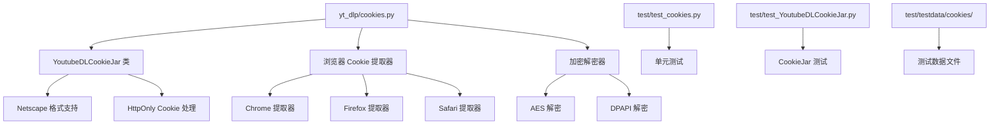
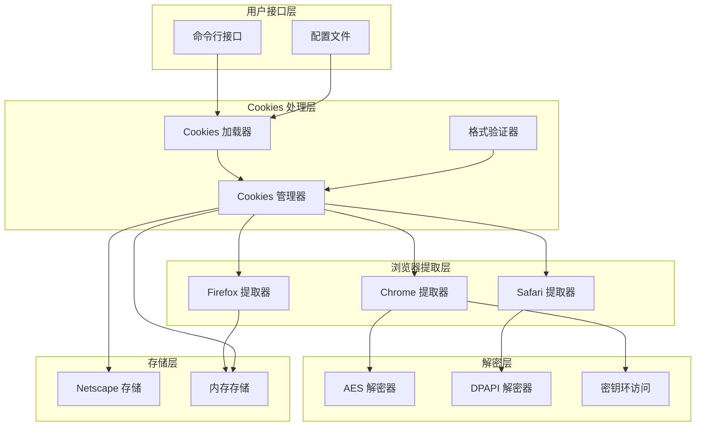
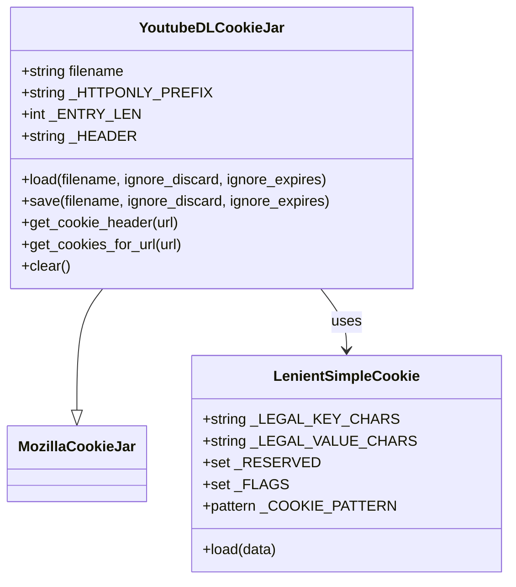
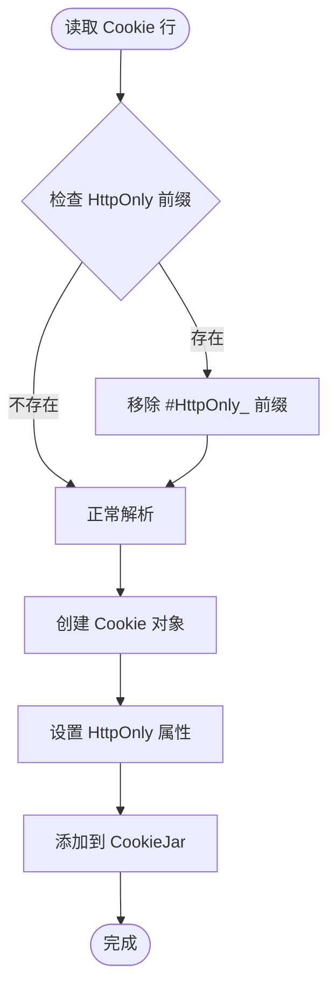
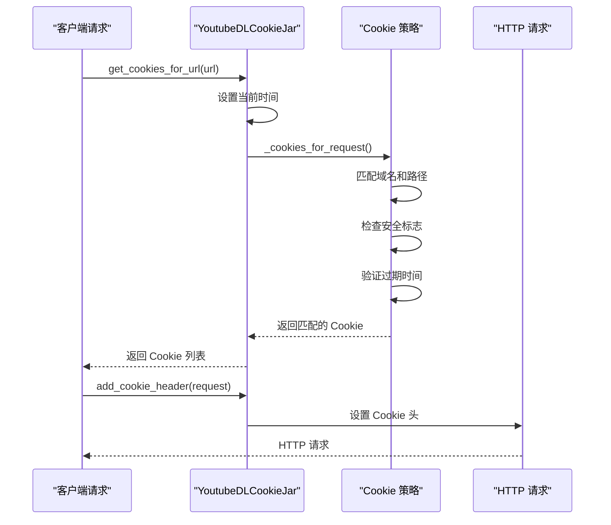
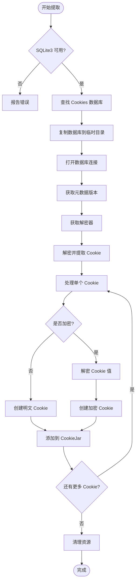
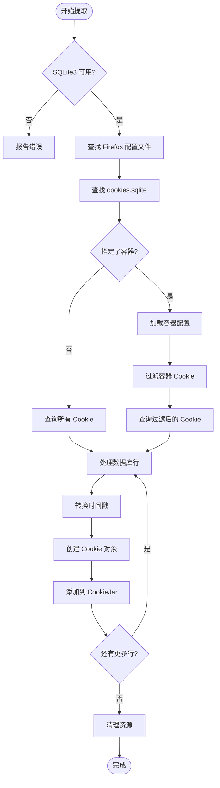
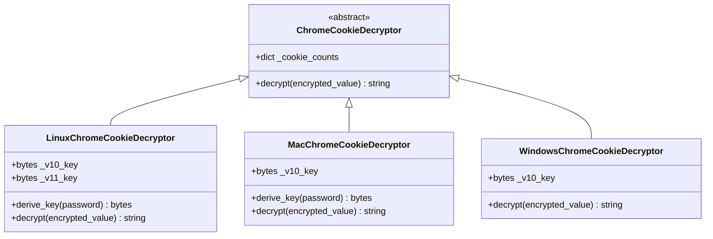

# Cookies 管理

<cite>
**本文档中引用的文件**
- [yt_dlp/cookies.py](file://yt_dlp/cookies.py)
- [test/test_cookies.py](file://test/test_cookies.py)
- [test/test_YoutubeDLCookieJar.py](file://test/test_YoutubeDLCookieJar.py)
- [test/testdata/cookies/session_cookies.txt](file://test/testdata/cookies/session_cookies.txt)
- [test/testdata/cookies/httponly_cookies.txt](file://test/testdata/cookies/httponly_cookies.txt)
- [yt_dlp/options.py](file://yt_dlp/options.py)
- [README.md](file://README.md)
</cite>

## 目录
1. [简介](#简介)
2. [项目结构](#项目结构)
3. [核心组件](#核心组件)
4. [架构概览](#架构概览)
5. [详细组件分析](#详细组件分析)
6. [依赖关系分析](#依赖关系分析)
7. [性能考虑](#性能考虑)
8. [故障排除指南](#故障排除指南)
9. [结论](#结论)

## 简介

yt-dlp 的 Cookies 管理系统是一个功能强大且全面的解决方案，专门设计用于处理各种来源的 Cookie 数据。该系统支持通过 `--cookiefile` 选项读取和保存 Netscape 格式的 Cookie 文件，同时能够从主流浏览器（Chrome、Firefox、Safari 等）中提取加密的 Cookie 数据。

该系统的核心优势在于其对不同平台和浏览器的广泛兼容性，包括对 HttpOnly 和安全 Cookie 的特殊处理，以及跨域 Cookie 注入的技术实现。通过 YoutubeDLCookieJar 类，系统提供了对传统 Netscape Cookie 格式的完全支持，同时扩展了对现代浏览器加密存储的处理能力。

## 项目结构

yt-dlp 的 Cookies 管理模块主要集中在以下几个关键文件中：

**图表来源**
- [yt_dlp/cookies.py](file://yt_dlp/cookies.py#L1246-L1392)
- [test/test_cookies.py](file://test/test_cookies.py#L1-L332)
- [test/test_YoutubeDLCookieJar.py](file://test/test_YoutubeDLCookieJar.py#L1-L67)

**章节来源**
- [yt_dlp/cookies.py](file://yt_dlp/cookies.py#L1-L50)
- [test/test_cookies.py](file://test/test_cookies.py#L1-L30)

## 核心组件

### YoutubeDLCookieJar 类

YoutubeDLCookieJar 是整个 Cookies 系统的核心类，继承自 `http.cookiejar.MozillaCookieJar`，提供了对 Netscape Cookie 格式的完整支持。

#### 主要特性：
- **Netscape 格式兼容**：完全支持标准的 Netscape HTTP Cookie 文件格式
- **HttpOnly Cookie 支持**：自动识别和处理 HttpOnly 前缀的 Cookie
- **会话 Cookie 管理**：正确处理过期时间为空或为 0 的会话 Cookie
- **灵活的加载/保存机制**：支持从文件或内存对象加载和保存 Cookie

#### 关键方法：
- `load()`：从文件或字符串加载 Cookie 数据
- `save()`：将 Cookie 保存到指定文件
- `get_cookie_header()`：生成 HTTP 请求头格式的 Cookie 字符串
- `get_cookies_for_url()`：获取适用于特定 URL 的 Cookie 列表

### 浏览器 Cookie 提取器

系统支持从多种主流浏览器中提取 Cookie 数据，每种浏览器都有专门的提取器：

#### Chrome 系列浏览器提取器
- **支持的浏览器**：Chrome、Chromium、Edge、Brave、Opera、Vivaldi、Whale
- **加密处理**：支持 v10 和 v11 版本的 AES-CBC 加密
- **跨平台支持**：Windows、macOS、Linux 平台的特定处理

#### Firefox 提取器
- **容器支持**：支持 Firefox 容器功能
- **数据库解析**：直接解析 Firefox 的 SQLite 数据库
- **版本兼容**：支持多个数据库版本（最高到 v16）

#### Safari 提取器
- **二进制格式解析**：解析 Safari 的二进制 Cookie 数据库
- **时间戳转换**：处理 macOS 绝对时间戳到 Unix 时间戳的转换

**章节来源**
- [yt_dlp/cookies.py](file://yt_dlp/cookies.py#L1246-L1392)
- [yt_dlp/cookies.py](file://yt_dlp/cookies.py#L100-L200)

## 架构概览

Cookies 管理系统采用分层架构设计，确保了良好的可扩展性和维护性：

**图表来源**
- [yt_dlp/cookies.py](file://yt_dlp/cookies.py#L100-L200)
- [yt_dlp/cookies.py](file://yt_dlp/cookies.py#L1246-L1392)

## 详细组件分析

### Netscape Cookie 格式解析

YoutubeDLCookieJar 实现了一个强大的 Netscape Cookie 格式解析器，支持标准的 7 字段格式：

**图表来源**
- [yt_dlp/cookies.py](file://yt_dlp/cookies.py#L1246-L1392)
- [yt_dlp/cookies.py](file://yt_dlp/cookies.py#L1180-L1245)

#### 格式字段说明：
1. **域名**：Cookie 所属的域名
2. **包含子域名**：布尔值，指示是否适用于子域名
3. **路径**：Cookie 有效的路径
4. **仅 HTTPS**：布尔值，指示是否仅通过 HTTPS 发送
5. **过期时间**：Cookie 过期的时间戳
6. **名称**：Cookie 名称
7. **值**：Cookie 值

### HttpOnly Cookie 处理机制

系统对 HttpOnly Cookie 有特殊的处理逻辑：

**图表来源**
- [yt_dlp/cookies.py](file://yt_dlp/cookies.py#L1280-L1320)

### 跨域 Cookie 注入技术

YoutubeDLCookieJar 实现了智能的跨域 Cookie 注入机制：

**图表来源**
- [yt_dlp/cookies.py](file://yt_dlp/cookies.py#L1370-L1392)

**章节来源**
- [yt_dlp/cookies.py](file://yt_dlp/cookies.py#L1246-L1392)

### 浏览器 Cookie 提取流程

不同浏览器的 Cookie 提取流程各有特点：

#### Chrome 系列浏览器提取流程

**图表来源**
- [yt_dlp/cookies.py](file://yt_dlp/cookies.py#L292-L380)

#### Firefox 提取流程

Firefox 提取器直接解析 SQLite 数据库，支持容器功能：

**图表来源**
- [yt_dlp/cookies.py](file://yt_dlp/cookies.py#L150-L250)

**章节来源**
- [yt_dlp/cookies.py](file://yt_dlp/cookies.py#L292-L380)
- [yt_dlp/cookies.py](file://yt_dlp/cookies.py#L150-L250)

### 加密解密机制

系统实现了针对不同浏览器的加密解密算法：

#### Chrome Cookie 解密器层次结构

**图表来源**
- [yt_dlp/cookies.py](file://yt_dlp/cookies.py#L400-L600)

#### 解密算法对比

| 平台 | 版本 | 加密算法 | 密钥来源 |
|------|------|----------|----------|
| Linux | v10 | AES-CBC | 固定密钥 'peanuts' |
| Linux | v11 | AES-CBC | 系统密钥环 |
| macOS | v10 | AES-CBC | Keychain 访问 |
| Windows | v10 | AES-GCM | DPAPI 加密 |
| Windows | 其他 | DPAPI | 系统保护 |

**章节来源**
- [yt_dlp/cookies.py](file://yt_dlp/cookies.py#L400-L600)

## 依赖关系分析

Cookies 管理系统的依赖关系复杂但结构清晰：

```mermaid
graph TD
subgraph "外部依赖"
SQLite3[sqlite3]
SecretStorage[secretstorage]
Cryptodome[CryptoDome]
DBus[dbus-python]
end
subgraph "Python 标准库"
HttpCookiejar[http.cookiejar]
HttpCookies[http.cookies]
Os[os]
Tempfile[tempfile]
Json[json]
Base64[base64]
Hashlib[hashlib]
Struct[struct]
Re[re]
end
subgraph "内部模块"
AES[aes.py]
Utils[utils.py]
Networking[networking.py]
end
YoutubeDLCookieJar --> HttpCookiejar
YoutubeDLCookieJar --> HttpCookies
YoutubeDLCookieJar --> Os
YoutubeDLCookieJar --> Tempfile
YoutubeDLCookieJar --> Json
YoutubeDLCookieJar --> Base64
YoutubeDLCookieJar --> Hashlib
YoutubeDLCookieJar --> Struct
YoutubeDLCookieJar --> Re
ChromeCookieDecryptor --> Cryptodome
ChromeCookieDecryptor --> Hashlib
LinuxChromeCookieDecryptor --> SecretStorage
LinuxChromeCookieDecryptor --> DBus
WindowsChromeCookieDecryptor --> AES
```

**图表来源**
- [yt_dlp/cookies.py](file://yt_dlp/cookies.py#L1-L50)

### 关键依赖说明

#### 必需依赖
- **sqlite3**：用于解析浏览器的 SQLite 数据库
- **CryptoDome**：提供 AES 加密解密功能
- **base64**：用于 Base64 编码解码

#### 可选依赖
- **secretstorage**：Linux 上的 GNOME 密钥环支持
- **dbus-python**：KDE 桌面环境的密钥环支持

**章节来源**
- [yt_dlp/cookies.py](file://yt_dlp/cookies.py#L1-L50)

## 性能考虑

### 内存使用优化

Cookies 系统在处理大量 Cookie 时采用了多种优化策略：

1. **延迟加载**：只有在需要时才加载和解析 Cookie 数据
2. **临时文件管理**：使用 `tempfile.TemporaryDirectory` 自动清理临时数据库文件
3. **进度条控制**：在非交互环境中自动禁用进度显示

### 解密性能优化

- **多密钥尝试**：解密失败时自动尝试空密码作为后备方案
- **缓存机制**：密钥派生结果会被缓存以避免重复计算
- **版本统计**：记录不同版本 Cookie 的数量以便性能分析

### 并发处理

虽然系统本身不是线程安全的，但在处理多个浏览器时会：
- 使用独立的临时目录避免冲突
- 在每个浏览器提取过程中保持独立的状态
- 正确合并来自不同源的 Cookie

## 故障排除指南

### 常见问题及解决方案

#### 1. 浏览器 Cookie 提取失败

**症状**：无法从指定浏览器提取 Cookie
**可能原因**：
- 浏览器未安装或路径不正确
- 数据库文件被浏览器锁定
- 权限不足访问数据库文件

**解决方案**：
- 确保浏览器已关闭后再运行 yt-dlp
- 检查数据库文件权限
- 使用 `--cookies-from-browser` 的完整语法

#### 2. Chrome Cookie 解密失败

**症状**：v10 或 v11 Cookie 无法解密
**可能原因**：
- 密钥环访问失败
- 数据库版本不兼容
- 系统环境不支持

**解决方案**：
- 检查密钥环服务是否运行
- 尝试指定不同的 keyring 参数
- 更新到最新版本的 yt-dlp

#### 3. Netscape 格式 Cookie 文件错误

**症状**：Cookie 文件格式错误或无法加载
**可能原因**：
- 文件格式不符合 Netscape 标准
- 字段数量不正确
- 时间戳格式错误

**解决方案**：
- 使用标准的 Cookie 导出工具
- 检查文件头部注释
- 验证字段分隔符使用正确的制表符

#### 4. HttpOnly Cookie 处理问题

**症状**：某些网站无法登录或功能受限
**可能原因**：
- HttpOnly Cookie 被错误处理
- 跨域 Cookie 注入失败

**解决方案**：
- 确保正确设置了目标域名的 Cookie
- 检查 Cookie 的路径和安全标志
- 使用 `--verbose` 查看详细的 Cookie 处理日志

**章节来源**
- [yt_dlp/cookies.py](file://yt_dlp/cookies.py#L100-L200)
- [yt_dlp/cookies.py](file://yt_dlp/cookies.py#L400-L600)

## 结论

yt-dlp 的 Cookies 管理系统是一个功能完善、架构合理的解决方案，成功地解决了现代 Web 应用中复杂的 Cookie 管理需求。该系统的主要优势包括：

### 技术优势
1. **广泛的浏览器支持**：覆盖了主流的桌面浏览器
2. **强大的加密处理**：支持多种加密算法和平台特定的解密方案
3. **灵活的格式支持**：完全兼容 Netscape Cookie 格式并扩展了现代浏览器的功能
4. **智能的跨域处理**：能够正确处理 HttpOnly 和安全 Cookie

### 设计亮点
- **模块化架构**：清晰的分层设计便于维护和扩展
- **错误处理机制**：完善的异常处理和降级策略
- **性能优化**：针对大数据量场景的优化措施
- **跨平台兼容**：统一的接口在不同操作系统上表现一致

### 应用价值
该系统不仅满足了 yt-dlp 本身的需要，也为其他需要处理复杂 Cookie 场景的应用程序提供了宝贵的参考。其对现代浏览器加密存储的深入理解和实现，展示了在隐私保护日益重要的时代背景下，如何在功能性和安全性之间找到平衡。

通过深入分析 `--cookiefile` 选项的实现，我们可以看到 yt-dlp 如何优雅地处理从简单文本文件到复杂加密数据库的各种 Cookie 数据源，为用户提供了一致且可靠的体验。