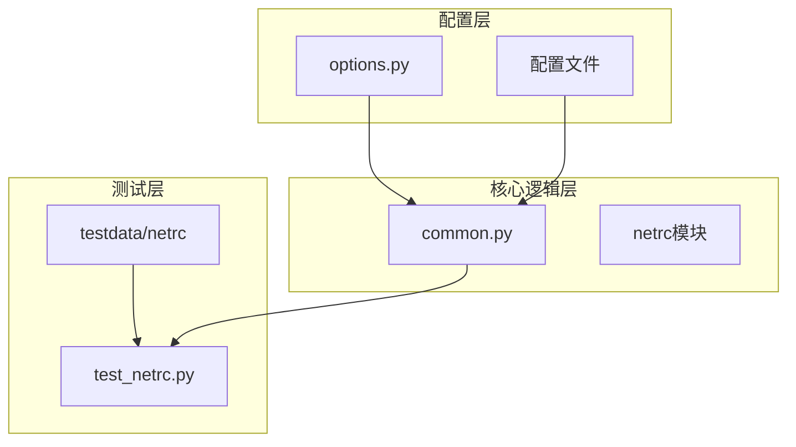
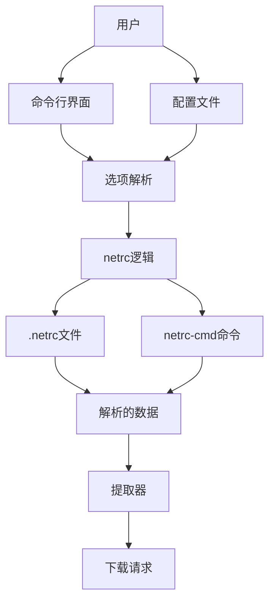
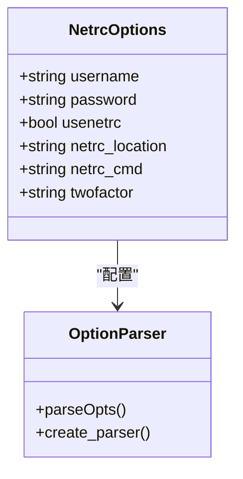
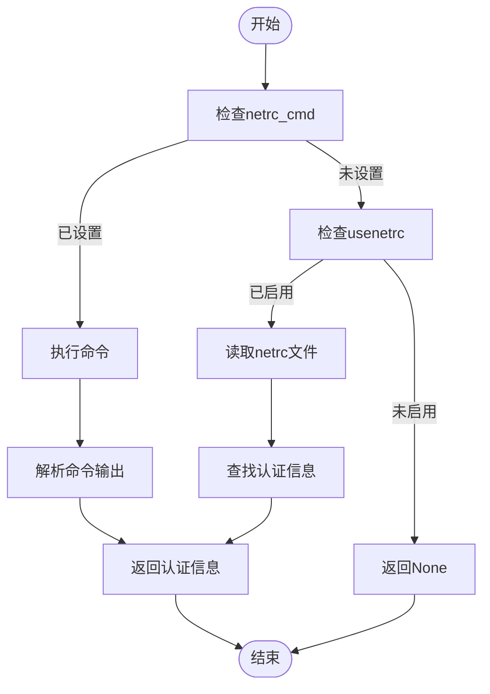
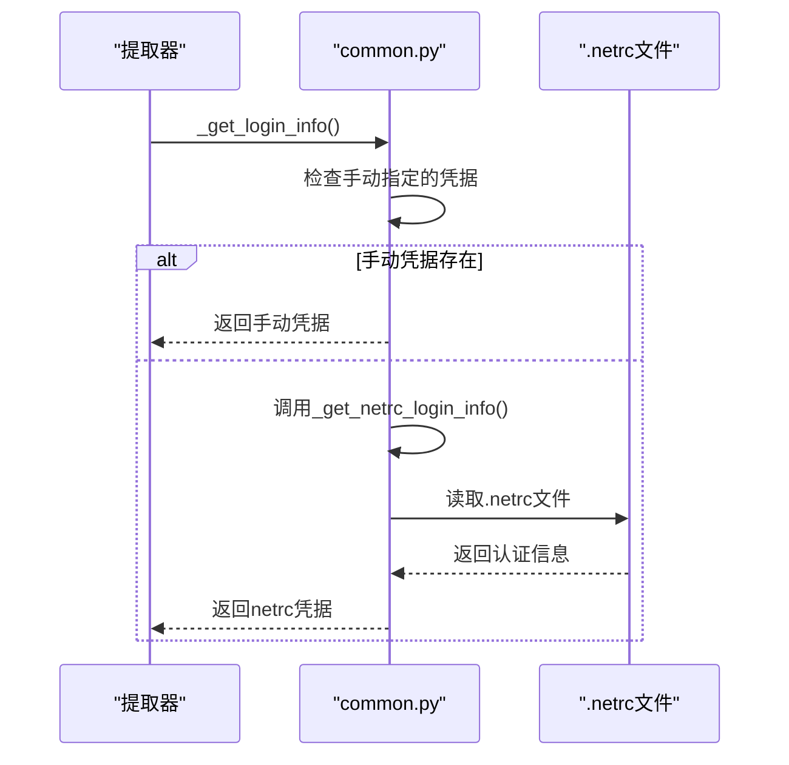
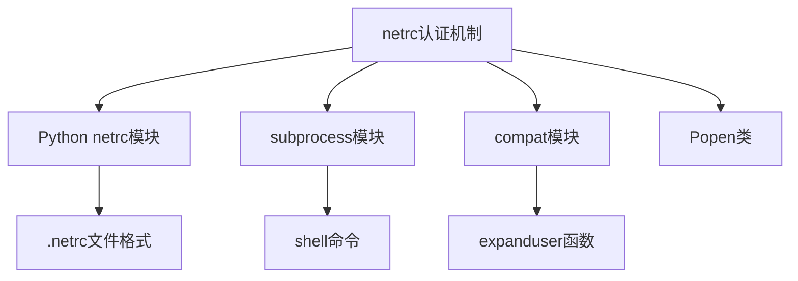
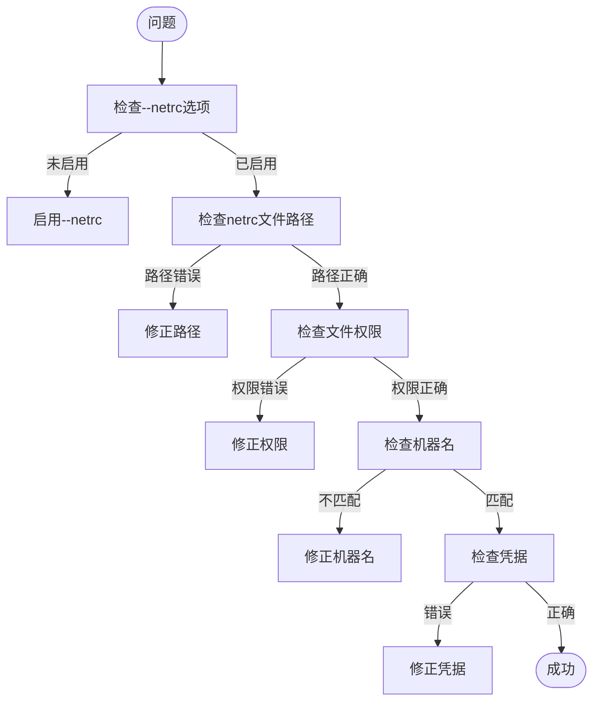

# netrc 认证机制

<cite>
**本文档引用的文件**   
- [options.py](file://yt_dlp/options.py#L280-L285)
- [common.py](file://yt_dlp/extractor/common.py#L1384-L1449)
- [test_netrc.py](file://test/test_netrc.py)
- [README.md](file://README.md#L1202-L1212)
- [netrc](file://test/testdata/netrc/netrc)
</cite>

## 目录
1. [简介](#简介)
2. [项目结构](#项目结构)
3. [核心组件](#核心组件)
4. [架构概述](#架构概述)
5. [详细组件分析](#详细组件分析)
6. [依赖分析](#依赖分析)
7. [性能考虑](#性能考虑)
8. [故障排除指南](#故障排除指南)
9. [结论](#结论)
10. [附录](#附录)（如有必要）

## 简介
本文档深入探讨了yt-dlp项目中netrc认证机制的实现原理，重点分析了`--netrc`选项的工作机制。文档详细解释了如何通过`~/.netrc`文件存储和读取认证凭据，说明了机器名(machinename)的匹配规则，以及如何在下载请求中自动注入认证信息。结合`options.py`中的netrc参数定义，展示了企业级自动化场景下的配置示例，并提供了安全存储凭据的最佳实践。

## 项目结构
yt-dlp项目的netrc认证功能主要分布在以下几个关键目录和文件中：
- `yt_dlp/extractor/`: 包含所有提取器的实现，每个支持认证的提取器都定义了`_NETRC_MACHINE`属性
- `yt_dlp/options.py`: 定义了`--netrc`、`--netrc-location`和`--netrc-cmd`等命令行选项
- `test/testdata/netrc/`: 包含用于测试的netrc文件示例
- `test/test_netrc.py`: 包含对netrc功能的单元测试

netrc认证机制的核心逻辑位于`yt_dlp/extractor/common.py`中的`_get_netrc_login_info`和`_get_login_info`方法，这些方法为所有提取器提供了统一的认证信息获取接口。



**图源**
- [options.py](file://yt_dlp/options.py#L280-L285)
- [common.py](file://yt_dlp/extractor/common.py#L1384-L1449)
- [test_netrc.py](file://test/test_netrc.py)
- [netrc](file://test/testdata/netrc/netrc)

**本节来源**
- [options.py](file://yt_dlp/options.py#L1-L100)
- [project_structure](file://#L1-L50)

## 核心组件
netrc认证机制的核心组件包括命令行选项解析、认证信息获取逻辑和提取器集成。`options.py`文件中定义了`--netrc`、`--netrc-location`和`--netrc-cmd`三个关键选项，这些选项控制着netrc功能的行为。`common.py`中的`_get_netrc_login_info`方法实现了从netrc文件或命令行获取认证信息的核心逻辑。每个支持认证的提取器通过定义`_NETRC_MACHINE`属性来指定其在netrc文件中的机器名。

**本节来源**
- [options.py](file://yt_dlp/options.py#L280-L285)
- [common.py](file://yt_dlp/extractor/common.py#L1384-L1449)

## 架构概述
netrc认证机制的架构设计遵循分层原则，将配置、逻辑和数据分离。用户通过命令行或配置文件启用netrc功能，系统根据配置确定netrc文件的位置或获取认证信息的命令。核心逻辑层负责解析netrc文件或执行命令来获取认证信息，并将其提供给具体的提取器使用。测试层确保了功能的正确性和安全性。



**图源**
- [options.py](file://yt_dlp/options.py#L280-L285)
- [common.py](file://yt_dlp/extractor/common.py#L1384-L1449)

## 详细组件分析

### 认证选项分析
`options.py`文件中定义了三个与netrc相关的命令行选项：`--netrc`用于启用netrc认证，`--netrc-location`用于指定netrc文件的位置，`--netrc-cmd`用于指定获取认证信息的命令。这些选项的定义采用了optparse库的回调机制，确保了参数的正确解析和验证。



**图源**
- [options.py](file://yt_dlp/options.py#L280-L285)

### 认证逻辑分析
`_get_netrc_login_info`方法是netrc认证的核心，它首先检查是否指定了`netrc_cmd`，如果有则执行该命令获取认证信息；否则检查是否启用了`usenetrc`，如果启用则从指定位置的netrc文件中读取认证信息。方法还处理了Python版本兼容性问题，确保在不同版本的Python中都能正确解析空字符串。



**图源**
- [common.py](file://yt_dlp/extractor/common.py#L1384-L1414)

### 提取器集成分析
每个支持认证的提取器都继承自`InfoExtractor`类，并通过定义`_NETRC_MACHINE`属性来指定其在netrc文件中的机器名。`_get_login_info`方法首先检查是否手动指定了用户名和密码，如果没有则调用`_get_netrc_login_info`方法从netrc文件中获取认证信息。



**图源**
- [common.py](file://yt_dlp/extractor/common.py#L1416-L1449)
- [vimeo.py](file://yt_dlp/extractor/vimeo.py#L1-L20)

**本节来源**
- [common.py](file://yt_dlp/extractor/common.py#L1384-L1449)
- [vimeo.py](file://yt_dlp/extractor/vimeo.py#L1-L20)

## 依赖分析
netrc认证机制依赖于Python标准库中的`netrc`模块来解析netrc文件，依赖`subprocess`模块来执行`netrc_cmd`命令。在yt-dlp内部，该机制依赖`compat_expanduser`函数来处理路径扩展，依赖`Popen.run`来执行外部命令。测试层依赖`unittest`框架来验证功能的正确性。



**图源**
- [common.py](file://yt_dlp/extractor/common.py#L1384-L1414)
- [options.py](file://yt_dlp/options.py#L1-L20)

**本节来源**
- [common.py](file://yt_dlp/extractor/common.py#L1384-L1449)
- [options.py](file://yt_dlp/options.py#L1-L100)

## 性能考虑
netrc认证机制在性能方面的主要考虑是文件I/O和命令执行的开销。读取netrc文件是一次性的操作，通常不会成为性能瓶颈。使用`netrc_cmd`时，命令执行的性能取决于命令本身的复杂度。为了最小化性能影响，建议将认证信息缓存起来，避免重复读取文件或执行命令。此外，netrc文件的权限检查也是必要的，以确保认证信息的安全性。

## 故障排除指南
当netrc认证出现问题时，可以按照以下步骤进行排查：
1. 检查`--netrc`选项是否已正确启用
2. 验证netrc文件的路径和权限设置
3. 确认netrc文件中的机器名与提取器的`_NETRC_MACHINE`属性匹配
4. 检查用户名和密码是否正确
5. 如果使用`netrc_cmd`，验证命令是否能正确执行并输出预期格式



**本节来源**
- [common.py](file://yt_dlp/extractor/common.py#L1384-L1449)
- [README.md](file://README.md#L1202-L1212)

## 结论
yt-dlp的netrc认证机制提供了一种安全、灵活的认证信息管理方式。通过`--netrc`选项，用户可以避免在命令行中明文传递敏感信息，提高了安全性。机制的设计考虑了多种使用场景，既支持标准的netrc文件，也支持通过命令动态获取认证信息。企业级用户可以通过配置netrc文件来实现自动化认证，提高工作效率。未来可以考虑增加对更多认证方式的支持，如OAuth令牌的netrc存储。

## 附录

### netrc文件示例
```
machine normal_use login user password pass
machine empty_user login "" password pass
machine empty_pass login user password ""
machine both_empty login "" password ""
```

### 企业级配置示例
```bash
# 创建安全的netrc文件
touch ${HOME}/.netrc
chmod a-rwx,u+rw ${HOME}/.netrc

# 添加多个服务的认证信息
echo 'machine youtube login my_youtube_user password my_youtube_pass' >> ${HOME}/.netrc
echo 'machine vimeo login my_vimeo_user password my_vimeo_pass' >> ${HOME}/.netrc

# 使用netrc进行下载
yt-dlp --netrc https://www.youtube.com/watch?v=dQw4w9WgXcQ
```

### 安全最佳实践
1. 将netrc文件权限设置为仅用户可读写
2. 避免在共享环境中使用netrc
3. 定期轮换认证凭据
4. 使用`netrc_cmd`从安全的密钥管理服务获取凭据
5. 在生产环境中使用专用的服务账户