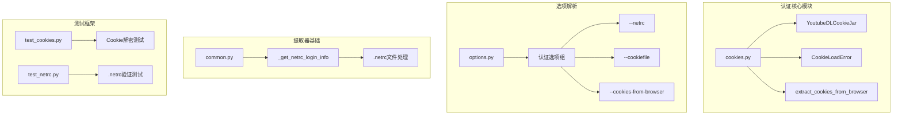
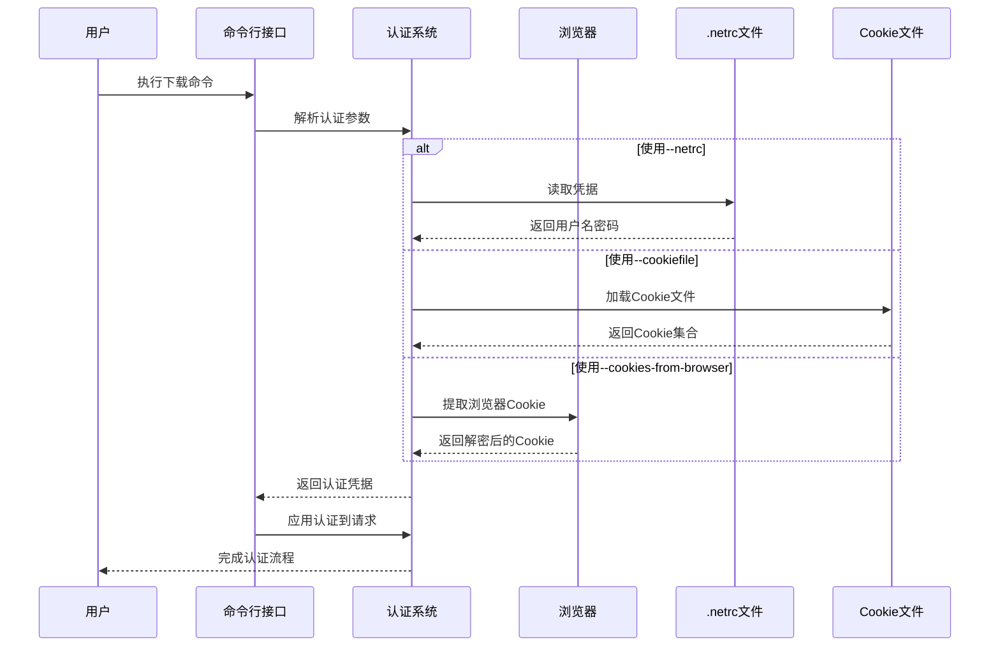
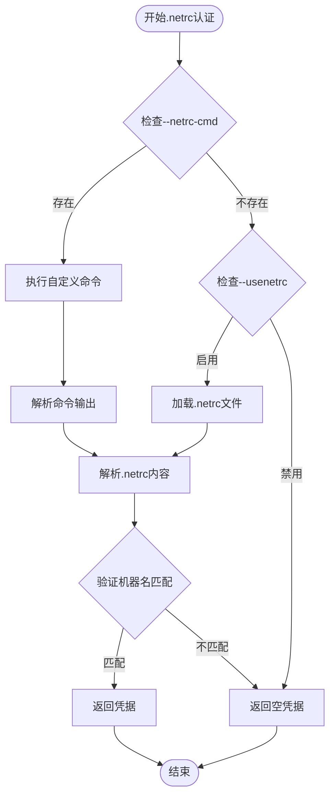
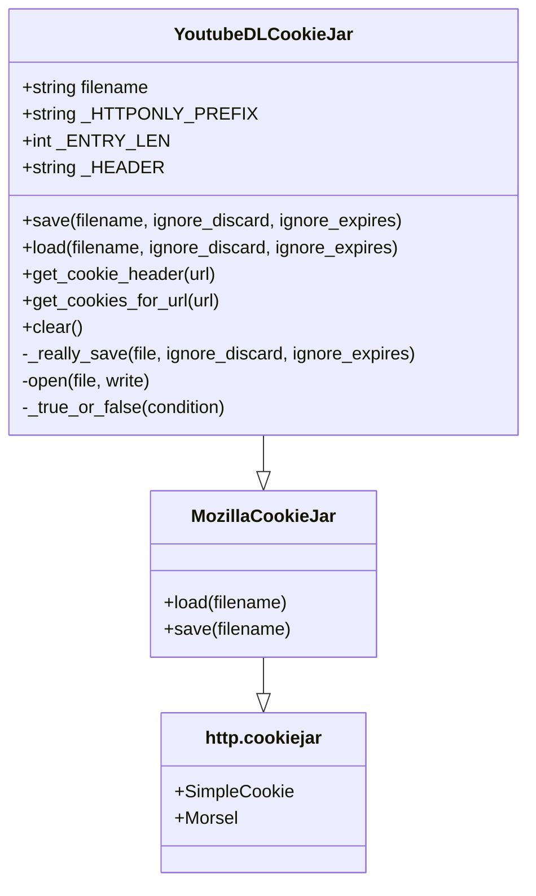
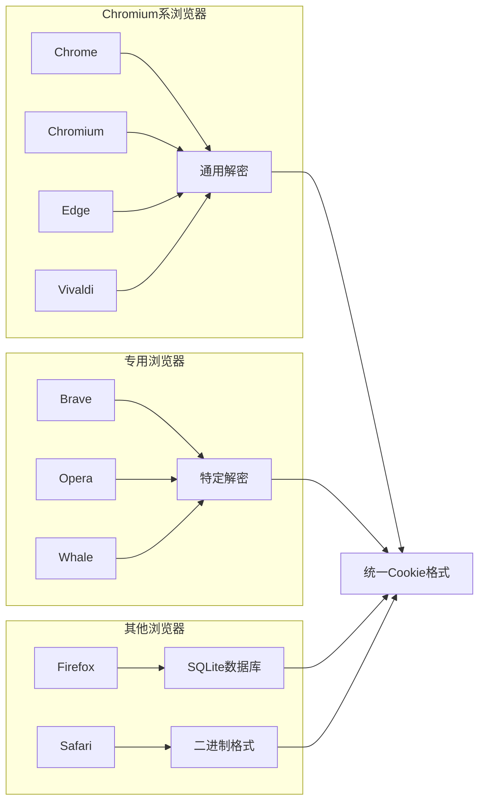
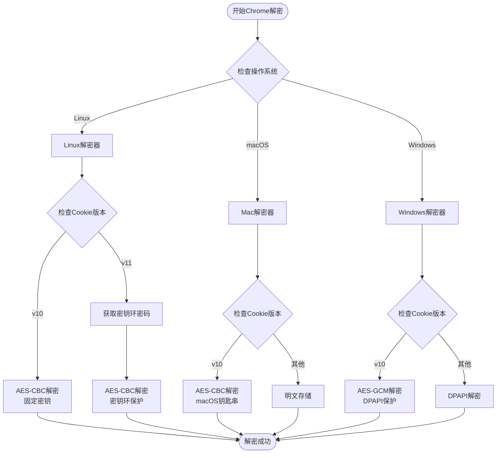
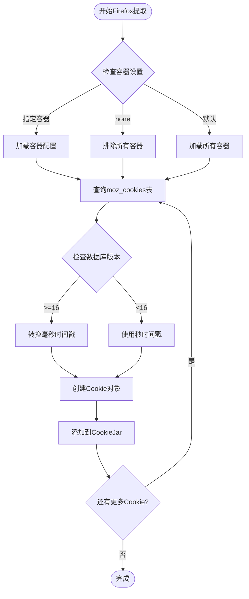
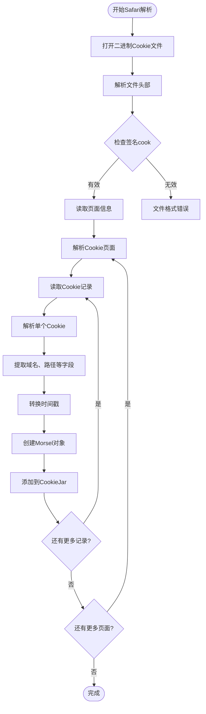
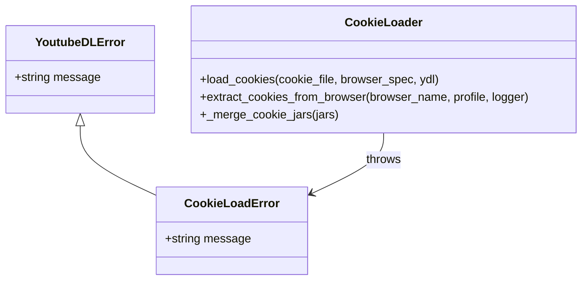
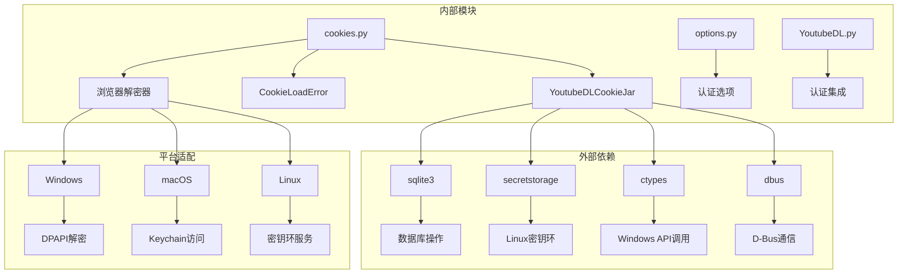

# 安全认证

<cite>
**本文档中引用的文件**
- [cookies.py](file://yt_dlp/cookies.py)
- [options.py](file://yt_dlp/options.py)
- [YoutubeDL.py](file://yt_dlp/YoutubeDL.py)
- [test_cookies.py](file://test/test_cookies.py)
- [test_netrc.py](file://test/test_netrc.py)
- [test_YoutubeDLCookieJar.py](file://test/testdata/cookies/test_YoutubeDLCookieJar.py)
- [common.py](file://yt_dlp/extractor/common.py)
- [README.md](file://README.md)
</cite>

## 目录
1. [简介](#简介)
2. [项目结构](#项目结构)
3. [核心组件](#核心组件)
4. [架构概览](#架构概览)
5. [详细组件分析](#详细组件分析)
6. [依赖关系分析](#依赖关系分析)
7. [性能考虑](#性能考虑)
8. [故障排除指南](#故障排除指南)
9. [结论](#结论)

## 简介

yt-dlp是一个功能强大的视频下载工具，提供了多层次的安全认证机制来处理各种网站的登录需求。本文档深入探讨了三个主要的认证方式：`.netrc`文件认证、Cookie文件认证和浏览器Cookie提取，特别关注cookies.py中的CookieLoadError异常处理和extract_cookies_from_browser函数实现。

该系统支持多种浏览器（Chrome、Firefox、Safari）的Cookie提取，并实现了复杂的加密解密机制来处理不同平台上的浏览器Cookie保护。

## 项目结构

yt-dlp的安全认证系统主要由以下核心模块组成：



**图表来源**
- [cookies.py](file://yt_dlp/cookies.py#L1-L50)
- [options.py](file://yt_dlp/options.py#L780-L820)
- [common.py](file://yt_dlp/extractor/common.py#L1384-L1414)

**章节来源**
- [cookies.py](file://yt_dlp/cookies.py#L1-L100)
- [options.py](file://yt_dlp/options.py#L1-L50)

## 核心组件

### Cookie管理系统

yt-dlp的核心认证能力基于YoutubeDLCookieJar类，这是一个扩展自http.cookiejar.MozillaCookieJar的强大Cookie管理器。

#### 主要特性：
- **多格式支持**：支持Netscape格式的Cookie文件
- **会话Cookie处理**：正确识别和处理会话级别的Cookie
- **HTTPOnly前缀处理**：自动处理HTTPOnly Cookie标记
- **跨平台兼容**：在不同操作系统上保持一致的行为

### 认证选项系统

认证选项组提供了三种主要的认证方式：

1. **.netrc认证**：使用标准的`.netrc`文件存储凭据
2. **Cookie文件认证**：直接加载预导出的Cookie文件
3. **浏览器Cookie提取**：从主流浏览器中提取已登录状态

**章节来源**
- [cookies.py](file://yt_dlp/cookies.py#L1246-L1392)
- [options.py](file://yt_dlp/options.py#L780-L820)

## 架构概览



**图表来源**
- [options.py](file://yt_dlp/options.py#L1489-L1513)
- [cookies.py](file://yt_dlp/cookies.py#L105-L133)

## 详细组件分析

### .netrc认证机制

#### 实现原理

`.netrc`认证通过_info_extractor/common.py中的_get_netrc_login_info方法实现：



**图表来源**
- [common.py](file://yt_dlp/extractor/common.py#L1384-L1414)

#### 配置示例

标准`.netrc`文件格式：
```
machine youtube login myaccount@gmail.com password my_youtube_password
machine twitch login my_twitch_account_name password my_twitch_password
```

高级配置（使用加密文件）：
```bash
yt-dlp --netrc-cmd 'gpg --decrypt ~/.authinfo.gpg' 'https://www.youtube.com/watch?v=BaW_jenozKc'
```

**章节来源**
- [common.py](file://yt_dlp/extractor/common.py#L1384-L1414)
- [README.md](file://README.md#L1202-L1212)

### Cookie文件认证系统

#### YoutubeDLCookieJar类详解

YoutubeDLCookieJar是认证系统的核心组件，提供了完整的Cookie管理功能：



**图表来源**
- [cookies.py](file://yt_dlp/cookies.py#L1246-L1392)

#### Cookie文件格式

支持的标准Netscape格式：
```
# Netscape HTTP Cookie File
# This file is generated by yt-dlp.  Do not edit.

domain_name	include_subdomains	path	https_only	expires_at	name	value
```

特殊处理：
- HTTPOnly前缀自动移除
- 会话Cookie正确识别（expires=0）
- 多种编码格式支持

**章节来源**
- [cookies.py](file://yt_dlp/cookies.py#L1246-L1392)

### 浏览器Cookie提取系统

#### 支持的浏览器

系统支持以下浏览器的Cookie提取：



**图表来源**
- [cookies.py](file://yt_dlp/cookies.py#L48-L49)

#### Chrome/Chromium Cookie解密

Chrome Cookie解密采用多层加密策略：



**图表来源**
- [cookies.py](file://yt_dlp/cookies.py#L398-L425)
- [cookies.py](file://yt_dlp/cookies.py#L426-L585)

#### Firefox Cookie提取

Firefox支持容器化Cookie管理：



**图表来源**
- [cookies.py](file://yt_dlp/cookies.py#L134-L220)

#### Safari Cookie解析

Safari使用二进制Cookie格式：



**图表来源**
- [cookies.py](file://yt_dlp/cookies.py#L586-L660)

**章节来源**
- [cookies.py](file://yt_dlp/cookies.py#L105-L133)
- [cookies.py](file://yt_dlp/cookies.py#L134-L220)
- [cookies.py](file://yt_dlp/cookies.py#L586-L660)

### CookieLoadError异常处理

系统提供了专门的异常处理机制来处理Cookie加载过程中的错误：



**图表来源**
- [cookies.py](file://yt_dlp/cookies.py#L75-L78)

**章节来源**
- [cookies.py](file://yt_dlp/cookies.py#L75-L78)

## 依赖关系分析



**图表来源**
- [cookies.py](file://yt_dlp/cookies.py#L1-L50)
- [options.py](file://yt_dlp/options.py#L1-L50)

**章节来源**
- [cookies.py](file://yt_dlp/cookies.py#L1-L50)
- [options.py](file://yt_dlp/options.py#L1-L50)

## 性能考虑

### Cookie提取优化

1. **临时文件管理**：使用临时目录复制数据库避免锁定冲突
2. **进度监控**：大型Cookie文件提取时显示进度条
3. **内存管理**：分批处理大量Cookie避免内存溢出
4. **并发控制**：合理控制同时进行的浏览器进程数量

### 解密性能

1. **多密钥尝试**：解密失败时自动尝试空密码
2. **缓存机制**：密钥环密码结果适当缓存
3. **平台优化**：针对不同平台选择最优解密算法

## 故障排除指南

### 常见问题及解决方案

#### .netrc认证问题

| 问题类型 | 症状 | 解决方案 |
|---------|------|----------|
| 权限错误 | 文件权限不足 | chmod a-rwx,u+rw ~/.netrc |
| 格式错误 | 语法解析失败 | 检查machine、login、password格式 |
| 机器名不匹配 | 凭据未找到 | 确认extractor名称与machine一致 |

#### 浏览器Cookie提取问题

| 平台 | 常见问题 | 解决方案 |
|------|----------|----------|
| Linux | 密钥环访问失败 | 检查keyring服务状态，安装secretstorage |
| macOS | Keychain访问被拒绝 | 允许终端应用访问Keychain |
| Windows | DPAPI解密失败 | 检查用户权限，确保账户可访问DPAPI |

#### Cookie文件问题

| 问题 | 可能原因 | 修复方法 |
|------|----------|----------|
| 格式错误 | 非标准Netscape格式 | 使用浏览器导出标准格式 |
| 编码问题 | 字符编码不匹配 | 确保UTF-8编码 |
| 过期Cookie | 时间戳过期 | 清理过期Cookie或更新时间戳 |

**章节来源**
- [test_cookies.py](file://test/test_cookies.py#L1-L50)
- [cookies.py](file://yt_dlp/cookies.py#L105-L133)

## 结论

yt-dlp的安全认证系统展现了现代软件工程中复杂认证需求的优雅解决方案。通过精心设计的模块化架构，系统成功地统一了多种不同的认证机制，为用户提供了一致且可靠的体验。

### 主要优势

1. **多层级认证支持**：从简单的用户名密码到复杂的浏览器Cookie提取
2. **跨平台兼容性**：在Windows、macOS和Linux上提供一致的功能
3. **安全性保障**：采用平台原生的安全机制保护敏感信息
4. **可扩展性**：模块化设计便于添加新的认证方式

### 技术亮点

- **智能解密算法**：根据不同浏览器和平台采用相应的解密策略
- **容错机制**：多密钥尝试和优雅降级
- **性能优化**：临时文件管理和进度监控
- **错误处理**：详细的日志记录和用户友好的错误消息

该系统不仅满足了当前的认证需求，其灵活的架构也为未来的功能扩展奠定了坚实的基础。对于需要处理复杂认证场景的企业级应用，yt-dlp的认证系统提供了宝贵的参考价值。