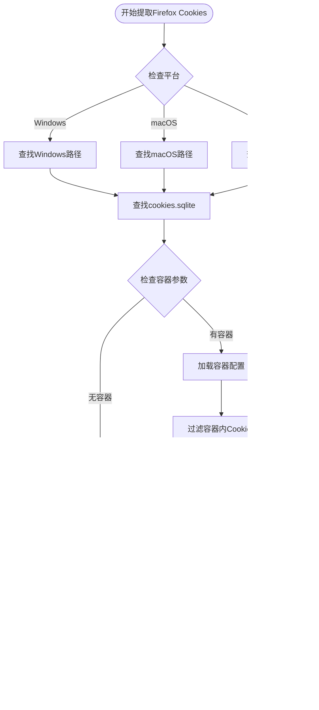

# 浏览器集成

<cite>
**本文档中引用的文件**
- [yt_dlp/cookies.py](file://yt_dlp/cookies.py)
- [yt_dlp/aes.py](file://yt_dlp/aes.py)
- [test/test_cookies.py](file://test/test_cookies.py)
</cite>

## 目录
1. [简介](#简介)
2. [项目结构](#项目结构)
3. [核心组件](#核心组件)
4. [架构概览](#架构概览)
5. [详细组件分析](#详细组件分析)
6. [依赖关系分析](#依赖关系分析)
7. [性能考虑](#性能考虑)
8. [故障排除指南](#故障排除指南)
9. [结论](#结论)

## 简介

本文档深入分析了yt-dlp项目中的浏览器集成功能，重点关注从本地浏览器提取Cookies的核心机制。该系统能够从Chrome、Firefox、Safari等主流浏览器中安全地提取加密的Cookies，并支持不同操作系统下的各种加密保护机制。

主要功能包括：
- 支持Chrome、Firefox、Safari等主流浏览器
- 处理不同操作系统的存储路径差异
- 解密Windows的DPAPI、macOS的Keychain和Linux的Keyring加密
- 提供完整的错误处理和权限解决方案

## 项目结构

浏览器集成功能主要集中在`yt_dlp/cookies.py`文件中，该文件包含了完整的浏览器Cookies提取和解密逻辑：


**图表来源**
- [yt_dlp/cookies.py](file://yt_dlp/cookies.py#L1-L100)

**章节来源**
- [yt_dlp/cookies.py](file://yt_dlp/cookies.py#L1-L1392)

## 核心组件

### extract_cookies_from_browser函数

这是整个浏览器集成系统的核心入口点，负责根据指定的浏览器类型调用相应的提取函数：


**图表来源**
- [yt_dlp/cookies.py](file://yt_dlp/cookies.py#L115-L125)

### Chrome Cookie解密器架构

系统为每个平台实现了专门的Chrome Cookie解密器，每个都针对特定的加密机制进行了优化：


**图表来源**
- [yt_dlp/cookies.py](file://yt_dlp/cookies.py#L380-L585)

**章节来源**
- [yt_dlp/cookies.py](file://yt_dlp/cookies.py#L115-L125)
- [yt_dlp/cookies.py](file://yt_dlp/cookies.py#L380-L585)

## 架构概览

浏览器集成系统采用分层架构设计，确保跨平台兼容性和安全性：


**图表来源**
- [yt_dlp/cookies.py](file://yt_dlp/cookies.py#L115-L125)
- [yt_dlp/cookies.py](file://yt_dlp/cookies.py#L410-L425)

## 详细组件分析

### Chrome浏览器Cookies提取

Chrome浏览器的Cookies提取过程涉及多个步骤，包括数据库定位、版本检测和解密处理：


**图表来源**
- [yt_dlp/cookies.py](file://yt_dlp/cookies.py#L293-L380)
- [yt_dlp/cookies.py](file://yt_dlp/cookies.py#L410-L425)

#### 平台特定的存储路径

不同操作系统下Chrome浏览器的Cookies存储位置存在显著差异：

| 操作系统 | 存储路径 | 特殊说明 |
|---------|---------|---------|
| Windows | `%LOCALAPPDATA%\Google\Chrome\User Data` | 支持多用户配置文件 |
| macOS | `~/Library/Application Support/Google/Chrome` | 使用Keychain保护密钥 |
| Linux | `~/.config/google-chrome` | 可能有多种桌面环境 |

**章节来源**
- [yt_dlp/cookies.py](file://yt_dlp/cookies.py#L237-L292)

### Firefox浏览器Cookies提取

Firefox使用SQLite数据库存储Cookies，支持容器化隔离：



**图表来源**
- [yt_dlp/cookies.py](file://yt_dlp/cookies.py#L135-L237)

**章节来源**
- [yt_dlp/cookies.py](file://yt_dlp/cookies.py#L135-L237)

### Safari浏览器Cookies提取

Safari使用专有的二进制格式存储Cookies，需要特殊的解析器：


**图表来源**
- [yt_dlp/cookies.py](file://yt_dlp/cookies.py#L557-L585)

**章节来源**
- [yt_dlp/cookies.py](file://yt_dlp/cookies.py#L557-L585)

### 加密机制详解

#### Windows DPAPI解密

Windows平台使用Data Protection API (DPAPI) 来保护敏感数据：


**图表来源**
- [yt_dlp/cookies.py](file://yt_dlp/cookies.py#L1033-L1080)

#### macOS Keychain访问

macOS使用Keychain Services API来管理加密密钥：


**图表来源**
- [yt_dlp/cookies.py](file://yt_dlp/cookies.py#L984-L1000)

#### Linux Keyring系统

Linux平台支持多种密钥管理系统：

| 密钥管理系统 | 支持版本 | 命令工具 | 描述 |
|-------------|---------|---------|------|
| GNOME Keyring | 所有版本 | `secretstorage` | GNOME桌面环境默认密钥管理 |
| KDE Wallet | KDE4/KDE5/KDE6 | `kwallet-query` | KDE桌面环境密钥管理 |
| Basic Text | 所有版本 | 无 | 明文存储（不推荐） |

**章节来源**
- [yt_dlp/cookies.py](file://yt_dlp/cookies.py#L948-L1000)

### AES解密实现

系统实现了完整的AES解密功能，支持CBC和GCM模式：


**图表来源**
- [yt_dlp/aes.py](file://yt_dlp/aes.py#L1-L50)

**章节来源**
- [yt_dlp/aes.py](file://yt_dlp/aes.py#L1-L50)

## 依赖关系分析

浏览器集成系统的依赖关系复杂，涉及多个外部库和系统服务：


**图表来源**
- [yt_dlp/cookies.py](file://yt_dlp/cookies.py#L1-L30)

**章节来源**
- [yt_dlp/cookies.py](file://yt_dlp/cookies.py#L1-L30)

## 性能考虑

### 数据库访问优化

系统采用临时数据库副本的方式避免直接访问正在使用的数据库，这提高了稳定性和并发性：

- **内存使用**：临时数据库复制会增加内存消耗，但避免了数据库锁定
- **I/O性能**：SQLite的内存映射文件机制提供了良好的性能
- **并发控制**：通过复制避免了与其他浏览器实例的竞争

### 解密性能优化

不同平台的解密策略经过精心优化：

- **缓存机制**：Linux解密器使用`@functools.cached_property`缓存v11密钥
- **多重尝试**：解密失败时自动尝试空密码作为后备方案
- **版本检测**：快速识别Cookie版本以选择最优解密路径

### 内存管理

系统实现了智能的内存管理策略：

- **流式处理**：Cookie解析采用生成器模式减少内存占用
- **进度跟踪**：大型数据库的处理包含详细的进度报告
- **资源清理**：确保数据库连接和临时文件的正确释放

## 故障排除指南

### 常见问题及解决方案

#### 权限问题

**问题描述**：无法访问浏览器数据库文件
**解决方案**：
1. 确保浏览器已关闭
2. 检查文件权限设置
3. 在Linux上确认密钥环服务正常运行

#### 解密失败

**问题描述**：Cookie解密返回None或错误
**解决方案**：
1. 验证平台检测是否正确
2. 检查密钥环密码是否正确
3. 尝试不同的密钥环后端

#### 数据库损坏

**问题描述**：SQLite数据库读取失败
**解决方案**：
1. 备份并修复数据库文件
2. 使用浏览器自带的修复工具
3. 重新安装浏览器

### 调试技巧

系统提供了丰富的调试信息：

```python
# 启用详细日志
logger = YDLLogger(ydl)
logger.setLevel(logging.DEBUG)

# 检查平台检测
print(f"当前平台: {sys.platform}")
print(f"浏览器目录: {browser_dir}")

# 验证密钥获取
decryptor = get_cookie_decryptor(browser_root, keyring_name, logger)
print(f"解密器类型: {type(decryptor).__name__}")
```

**章节来源**
- [yt_dlp/cookies.py](file://yt_dlp/cookies.py#L115-L125)

## 结论

yt-dlp的浏览器集成系统是一个高度专业化的解决方案，成功地解决了跨平台、跨浏览器的Cookies提取挑战。该系统的主要优势包括：

1. **全面的平台支持**：覆盖Windows、macOS和Linux三大主流操作系统
2. **强大的加密处理能力**：支持DPAPI、Keychain和各种Linux密钥管理系统
3. **优雅的错误处理**：提供详细的诊断信息和回退机制
4. **高性能设计**：采用缓存、流式处理等优化技术

该系统不仅为yt-dlp提供了可靠的Cookies提取功能，也为其他需要类似功能的应用程序提供了宝贵的参考实现。随着浏览器技术的不断发展，该系统也具备良好的扩展性和维护性，能够适应新的加密技术和平台变化。