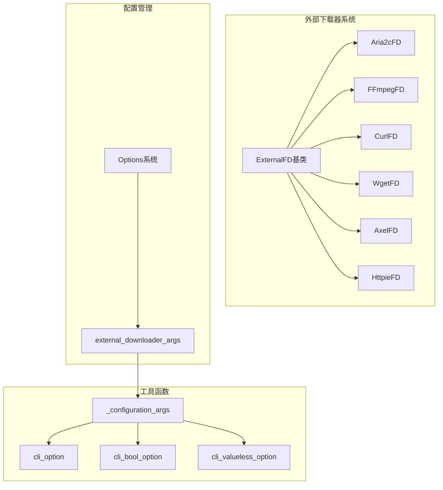
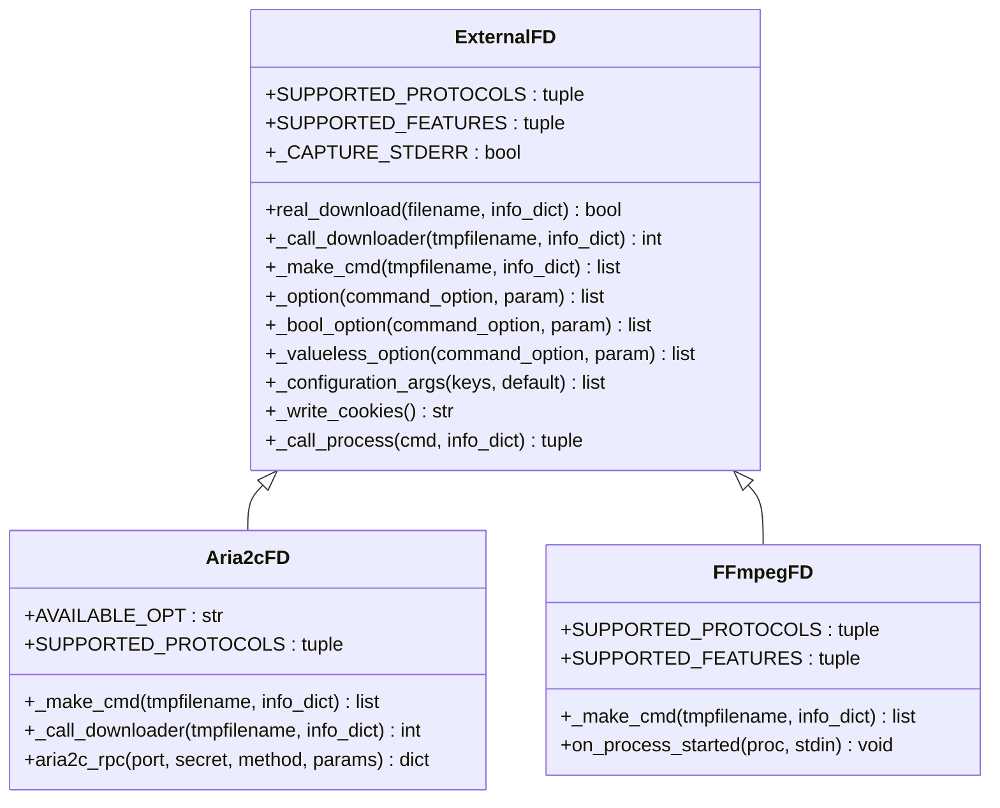
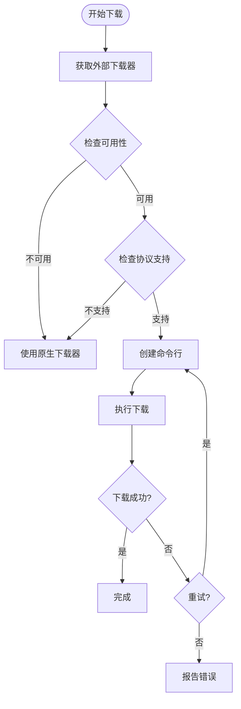
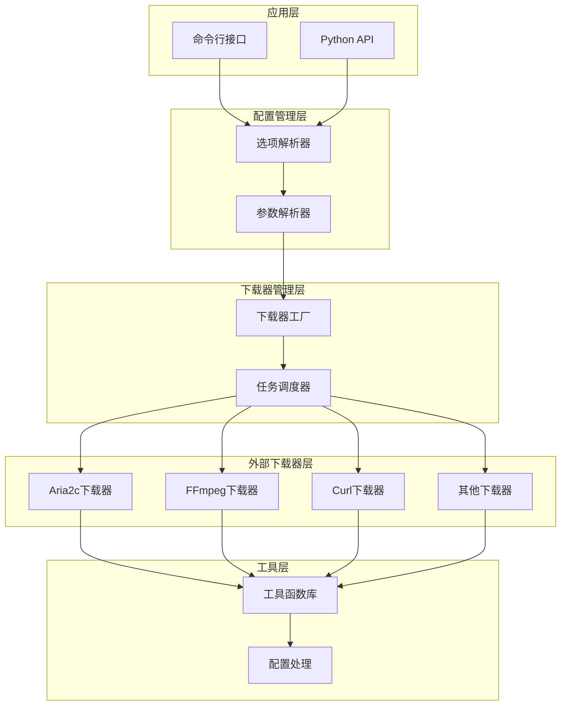
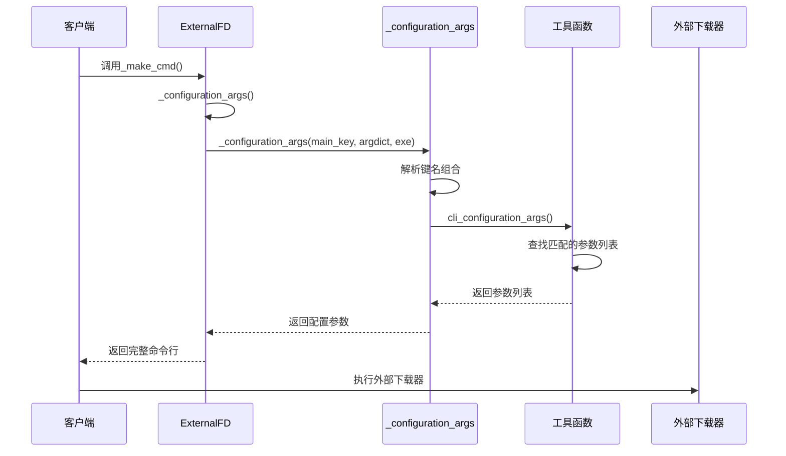
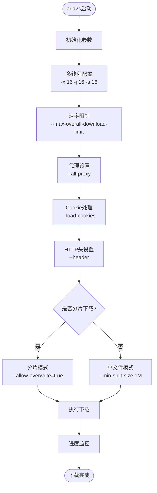
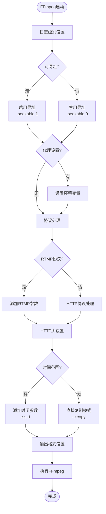
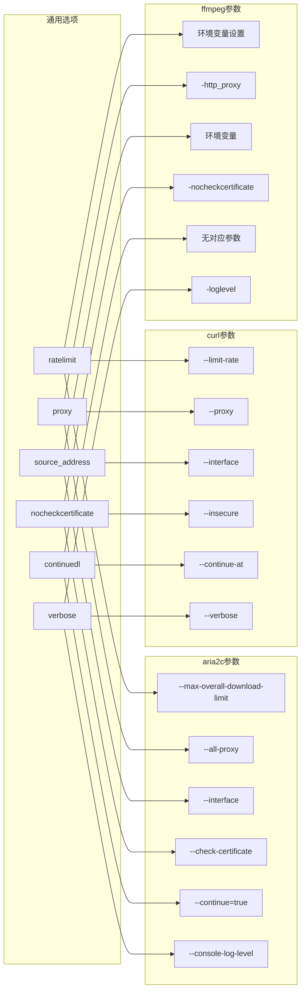
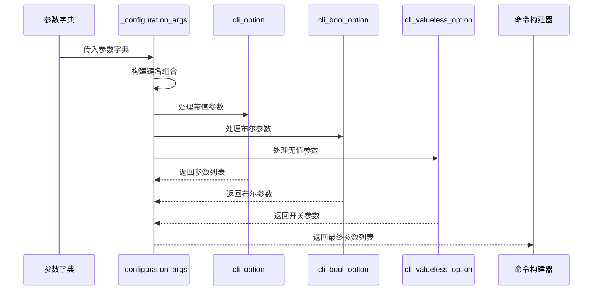

# 外部下载器性能优化

<cite>
**本文档中引用的文件**
- [yt_dlp/downloader/external.py](file://yt_dlp/downloader/external.py)
- [yt_dlp/utils/_utils.py](file://yt_dlp/utils/_utils.py)
- [yt_dlp/options.py](file://yt_dlp/options.py)
- [yt_dlp/downloader/common.py](file://yt_dlp/downloader/common.py)
- [test/test_downloader_external.py](file://test/test_downloader_external.py)
- [README.md](file://README.md)
</cite>

## 目录
1. [简介](#简介)
2. [项目结构概览](#项目结构概览)
3. [核心组件分析](#核心组件分析)
4. [架构概览](#架构概览)
5. [详细组件分析](#详细组件分析)
6. [参数传递机制](#参数传递机制)
7. [外部下载器配置示例](#外部下载器配置示例)
8. [性能优化策略](#性能优化策略)
9. [故障排除指南](#故障排除指南)
10. [结论](#结论)

## 简介

yt-dlp是一个功能丰富的命令行音视频下载器，支持数千个网站。其外部下载器性能优化系统是项目的核心特性之一，通过与aria2c、ffmpeg、curl、wget等外部工具的深度集成，实现了卓越的下载性能和灵活性。

本文档深入分析了yt-dlp中外部下载器的性能优化机制，重点关注`_external_downloader_args`函数的实现，以及如何将yt-dlp的通用选项（如速率限制、超时）转换为特定下载器的原生命令行参数。

## 项目结构概览

yt-dlp的外部下载器系统采用模块化设计，主要包含以下核心组件：



**图表来源**
- [yt_dlp/downloader/external.py](file://yt_dlp/downloader/external.py#L32-L674)

**章节来源**
- [yt_dlp/downloader/external.py](file://yt_dlp/downloader/external.py#L1-L50)

## 核心组件分析

### ExternalFD基类

ExternalFD是所有外部下载器的基础类，提供了统一的接口和通用功能：



**图表来源**
- [yt_dlp/downloader/external.py](file://yt_dlp/downloader/external.py#L32-L151)

### 下载器工厂系统

系统通过工厂模式动态选择合适的下载器：



**图表来源**
- [yt_dlp/downloader/external.py](file://yt_dlp/downloader/external.py#L152-L200)

**章节来源**
- [yt_dlp/downloader/external.py](file://yt_dlp/downloader/external.py#L32-L200)

## 架构概览

外部下载器系统采用分层架构设计，确保了高度的可扩展性和维护性：



**图表来源**
- [yt_dlp/downloader/external.py](file://yt_dlp/downloader/external.py#L663-L674)
- [yt_dlp/options.py](file://yt_dlp/options.py#L1103-L1117)

## 详细组件分析

### _external_downloader_args函数实现

`_external_downloader_args`函数是外部下载器性能优化的核心，位于`yt_dlp/downloader/external.py`中：



**图表来源**
- [yt_dlp/downloader/external.py](file://yt_dlp/downloader/external.py#L126-L129)
- [yt_dlp/utils/_utils.py](file://yt_dlp/utils/_utils.py#L3598-L3608)

### aria2c下载器优化

aria2c是yt-dlp最常用的外部下载器，具有强大的多线程下载能力：



**图表来源**
- [yt_dlp/downloader/external.py](file://yt_dlp/downloader/external.py#L294-L350)

### FFmpeg下载器优化

FFmpeg主要用于处理流媒体内容，具有灵活的格式转换能力：



**图表来源**
- [yt_dlp/downloader/external.py](file://yt_dlp/downloader/external.py#L400-L550)

**章节来源**
- [yt_dlp/downloader/external.py](file://yt_dlp/downloader/external.py#L294-L550)

## 参数传递机制

### 配置参数映射系统

yt-dlp通过一套完整的参数映射系统，将通用选项转换为特定下载器的原生命令行参数：



**图表来源**
- [yt_dlp/downloader/external.py](file://yt_dlp/downloader/external.py#L126-L129)
- [yt_dlp/utils/_utils.py](file://yt_dlp/utils/_utils.py#L3598-L3608)

### 参数解析流程



**图表来源**
- [yt_dlp/utils/_utils.py](file://yt_dlp/utils/_utils.py#L3578-L3608)

**章节来源**
- [yt_dlp/utils/_utils.py](file://yt_dlp/utils/_utils.py#L3578-L3608)

## 外部下载器配置示例

### aria2c多线程优化配置

aria2c是最常用的外部下载器，通过合理的参数配置可以显著提升下载速度：

| 配置项 | 默认值 | 推荐值 | 说明 |
|--------|--------|--------|------|
| 连接数 (-x) | 5 | 16 | 最大并发连接数 |
| 分片数 (-j) | 5 | 16 | 同一文件的最大分片数 |
| 每连接分片数 (-s) | 5 | 16 | 每个连接的分片数 |
| 最小分片大小 | 1M | 1M | 小于该大小的文件不进行分片 |
| 文件分配方式 | prealloc | none | 禁用预分配避免磁盘空间浪费 |
| HTTP压缩 | true | true | 启用gzip压缩减少传输数据量 |

推荐配置命令：
```bash
yt-dlp --external-downloader aria2c --external-downloader-args "aria2c:-x 16 -j 16 -s 16 -k 1M --file-allocation=none"
```

### ffmpeg缓冲设置优化

对于流媒体下载，ffmpeg的缓冲设置对性能至关重要：

| 配置项 | 推荐值 | 说明 |
|--------|--------|------|
| 缓冲区大小 | 32KB | 减少内存占用同时保证性能 |
| 协议白名单 | file,crypto,data,http,https,tcp,tls | 允许本地和网络协议 |
| 寻址模式 | seekable 1 | 启用服务器端寻址支持 |
| 日志级别 | quiet | 减少输出干扰 |
| 输出格式 | mpegts | 实时播放优化 |

推荐配置命令：
```bash
yt-dlp --external-downloader ffmpeg --external-downloader-args "ffmpeg:-bufsize 32K -protocol_whitelist file,crypto,data,http,https,tcp,tls -seekable 1 -loglevel quiet -f mpegts"
```

### 综合性能优化配置

结合多种下载器的优势，实现最佳性能：

```bash
# aria2c用于大文件下载
yt-dlp --downloader aria2c \
       --downloader-args "default:--max-overall-download-limit=10M -x 16 -j 16 -s 16" \
       --external-downloader-args "aria2c:-x 16 -j 16 -s 16 -k 1M --file-allocation=none"

# ffmpeg用于流媒体处理
yt-dlp --downloader ffmpeg \
       --downloader-args "m3u8:ffmpeg" \
       --external-downloader-args "ffmpeg:-bufsize 32K -protocol_whitelist file,crypto,data,http,https,tcp,tls -seekable 1 -loglevel quiet -f mpegts"

# curl用于简单HTTP下载
yt-dlp --downloader curl \
       --downloader-args "http:curl" \
       --external-downloader-args "curl:--limit-rate 5M --max-filesize 100M"
```

**章节来源**
- [yt_dlp/options.py](file://yt_dlp/options.py#L1103-L1117)
- [README.md](file://README.md#L522-L613)

## 性能优化策略

### 网络层面优化

1. **连接池管理**：合理设置并发连接数，避免过多连接导致服务器拒绝
2. **带宽控制**：通过速率限制避免影响其他网络应用
3. **代理支持**：支持HTTP/HTTPS/SOCKS代理，适应复杂网络环境
4. **重试机制**：智能重试策略，提高下载成功率

### 存储层面优化

1. **分片下载**：大文件自动分片，提高下载效率
2. **断点续传**：支持断点续传，避免重复下载
3. **临时文件管理**：合理管理临时文件，避免磁盘空间浪费
4. **格式转换**：实时格式转换，减少中间文件

### 内存层面优化

1. **缓冲区大小**：根据系统内存调整缓冲区大小
2. **垃圾回收**：及时释放不需要的资源
3. **并发控制**：避免过多并发导致内存不足
4. **资源监控**：实时监控内存使用情况

## 故障排除指南

### 常见问题及解决方案

| 问题类型 | 症状 | 可能原因 | 解决方案 |
|----------|------|----------|----------|
| 下载速度慢 | 实际速度远低于预期 | 参数配置不当 | 调整并发参数，检查网络状况 |
| 连接失败 | 无法建立连接 | 代理设置错误 | 检查代理配置，尝试直连 |
| 文件损坏 | 下载文件无法播放 | 断点续传失败 | 清除临时文件重新下载 |
| 内存占用高 | 系统响应缓慢 | 缓冲区过大 | 减小缓冲区大小 |
| CPU占用高 | 系统负载过高 | 并发度过高 | 降低并发参数 |

### 调试技巧

1. **启用详细日志**：使用`--verbose`选项查看详细信息
2. **测试下载**：使用`--test`选项测试下载器功能
3. **参数验证**：检查外部下载器参数语法
4. **版本兼容**：确认外部工具版本兼容性

**章节来源**
- [yt_dlp/downloader/external.py](file://yt_dlp/downloader/external.py#L152-L200)

## 结论

yt-dlp的外部下载器性能优化系统通过精心设计的架构和完善的参数映射机制，实现了与多种外部工具的深度集成。`_external_downloader_args`函数作为核心组件，成功地将yt-dlp的通用选项转换为特定下载器的原生命令行参数，为用户提供了强大而灵活的下载能力。

通过合理配置aria2c的多线程参数、ffmpeg的缓冲设置等，用户可以显著提升下载性能。系统的模块化设计和工厂模式使得添加新的外部下载器变得简单，而完善的错误处理和重试机制则确保了下载的可靠性。

未来的发展方向包括：
1. 更多外部下载器的支持
2. 智能参数调优算法
3. 实时性能监控和自适应调整
4. 更好的跨平台兼容性

这些改进将进一步提升yt-dlp的下载性能和用户体验。