# 性能调优

<cite>
**本文档中引用的文件**
- [yt_dlp/downloader/external.py](file://yt_dlp/downloader/external.py)
- [yt_dlp/downloader/common.py](file://yt_dlp/downloader/common.py)
- [yt_dlp/downloader/http.py](file://yt_dlp/downloader/http.py)
- [yt_dlp/options.py](file://yt_dlp/options.py)
- [yt_dlp/__init__.py](file://yt_dlp/__init__.py)
- [test/test_downloader_external.py](file://test/test_downloader_external.py)
</cite>

## 目录
1. [简介](#简介)
2. [核心性能参数](#核心性能参数)
3. [下载速率控制](#下载速率控制)
4. [重试机制优化](#重试机制优化)
5. [请求间隔管理](#请求间隔管理)
6. [外部下载器性能配置](#外部下载器性能配置)
7. [高并发下载优化](#高并发下载优化)
8. [性能监控与调试](#性能监控与调试)
9. [最佳实践指南](#最佳实践指南)
10. [故障排除](#故障排除)

## 简介

yt-dlp 提供了丰富的性能调优选项，通过精确控制下载速率、重试策略和请求间隔，可以在各种网络环境下实现最优的下载性能。本文档深入解析 `--throttled-rate`、`--retries`、`--sleep-interval` 等关键参数的工作原理，并提供针对不同使用场景的优化配置示例。

## 核心性能参数

### 主要性能控制参数

yt-dlp 的性能调优主要围绕以下几个核心参数展开：

| 参数名称 | 类型 | 默认值 | 描述 |
|---------|------|--------|------|
| `--limit-rate` / `-r` | 字节/秒 | 无限制 | 下载速度上限限制 |
| `--throttled-rate` | 字节/秒 | 无限制 | 假设被限速的最小速度阈值 |
| `--retries` / `-R` | 整数 | 10 | 网络错误重试次数 |
| `--sleep-interval` | 秒 | 0 | 请求间最小等待时间 |
| `--max-sleep-interval` | 秒 | 0 | 请求间最大等待时间 |
| `--fragment-retries` | 整数 | 10 | 片段下载重试次数 |

### 参数关系图

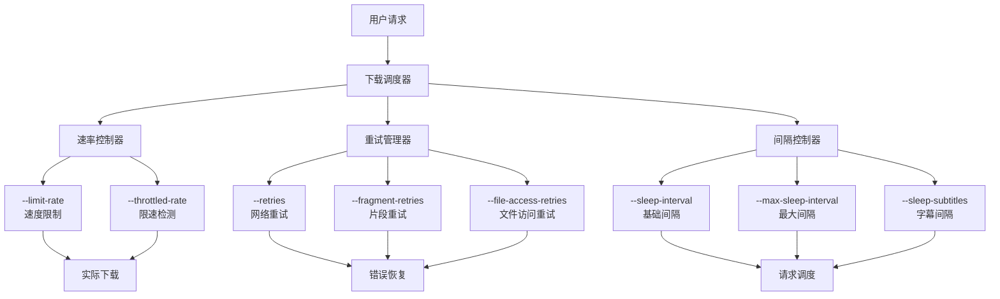

**图表来源**
- [yt_dlp/options.py](file://yt_dlp/options.py#L961-L985)
- [yt_dlp/downloader/common.py](file://yt_dlp/downloader/common.py#L48-L67)

## 下载速率控制

### 速率限制机制

yt-dlp 实现了多层次的下载速率控制机制，确保在不同网络环境下的稳定性能。

#### 1. 速度限制 (`--limit-rate`)

速度限制通过 `slow_down()` 方法实现，该方法在每次数据块下载后检查当前下载速度是否超过设定的限制。

**工作原理：**
- 计算实际下载速度：`speed = byte_counter / elapsed_time`
- 如果速度超过限制：`sleep_time = byte_counter / rate_limit - elapsed_time`
- 调用 `time.sleep(sleep_time)` 进行延迟

#### 2. 限速检测 (`--throttled-rate`)

限速检测用于识别服务器主动限速的情况，当检测到速度持续低于阈值时，会触发重新提取视频数据。

**检测逻辑：**
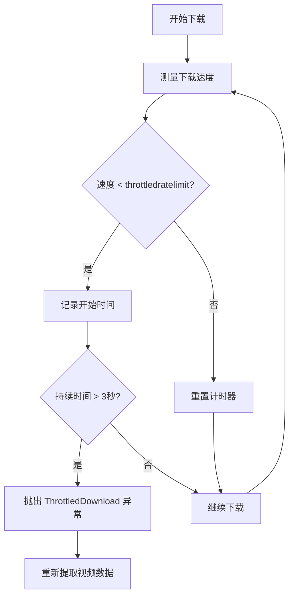

**图表来源**
- [yt_dlp/downloader/http.py](file://yt_dlp/downloader/http.py#L308-L320)

#### 3. 速率控制实现

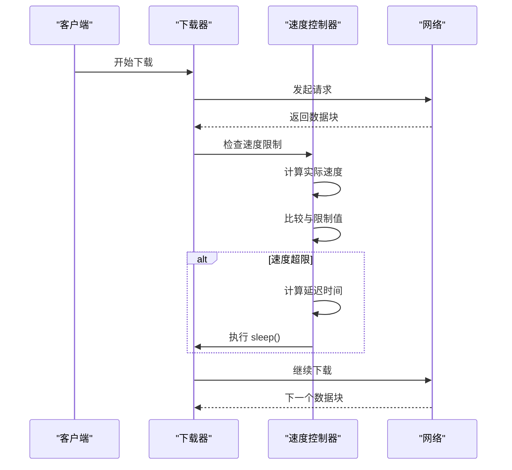

**图表来源**
- [yt_dlp/downloader/common.py](file://yt_dlp/downloader/common.py#L195-L205)

**章节来源**
- [yt_dlp/downloader/common.py](file://yt_dlp/downloader/common.py#L195-L205)
- [yt_dlp/downloader/http.py](file://yt_dlp/downloader/http.py#L308-L320)

## 重试机制优化

### 重试系统架构

yt-dlp 实现了分层的重试机制，针对不同类型的错误采用不同的重试策略。

#### 1. 重试类型分类

| 重试类型 | 默认次数 | 配置参数 | 适用场景 |
|---------|----------|----------|----------|
| 下载重试 | 10 | `--retries` | 网络连接错误 |
| 片段重试 | 10 | `--fragment-retries` | DASH/HLS 片段下载失败 |
| 提取器重试 | 0 | `--extractor-retries` | 数据提取失败 |
| 文件访问重试 | 3 | `--file-access-retries` | 文件系统操作错误 |

#### 2. 重试睡眠函数

yt-dlp 支持线性和指数两种重试睡眠模式：

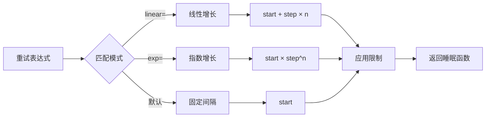

**图表来源**
- [yt_dlp/__init__.py](file://yt_dlp/__init__.py#L272-L297)

#### 3. 重试管理器实现

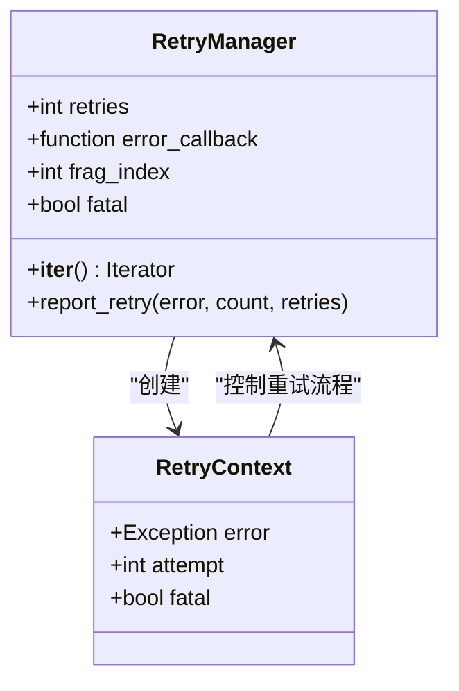

**图表来源**
- [yt_dlp/downloader/common.py](file://yt_dlp/downloader/common.py#L400-L420)

**章节来源**
- [yt_dlp/__init__.py](file://yt_dlp/__init__.py#L272-L297)
- [yt_dlp/downloader/common.py](file://yt_dlp/downloader/common.py#L400-L420)

## 请求间隔管理

### 间隔控制机制

请求间隔管理通过随机化间隔时间来避免对服务器造成过大压力，同时提高下载成功率。

#### 1. 基础间隔配置

| 参数 | 描述 | 默认值 |
|------|------|--------|
| `--sleep-interval` | 基础等待时间 | 0秒 |
| `--max-sleep-interval` | 最大等待时间 | 0秒（等于基础间隔） |
| `--sleep-subtitles` | 字幕下载间隔 | 0秒 |

#### 2. 动态间隔计算

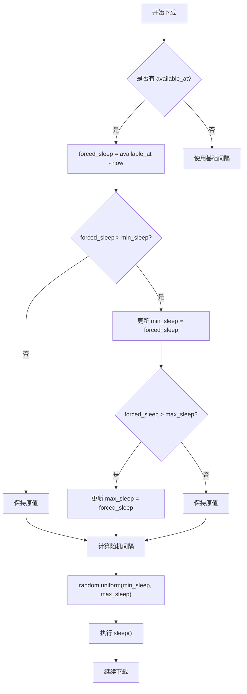

**图表来源**
- [yt_dlp/downloader/common.py](file://yt_dlp/downloader/common.py#L450-L470)

#### 3. 字幕下载间隔

字幕下载通常需要更长的间隔，以避免触发反爬虫机制：

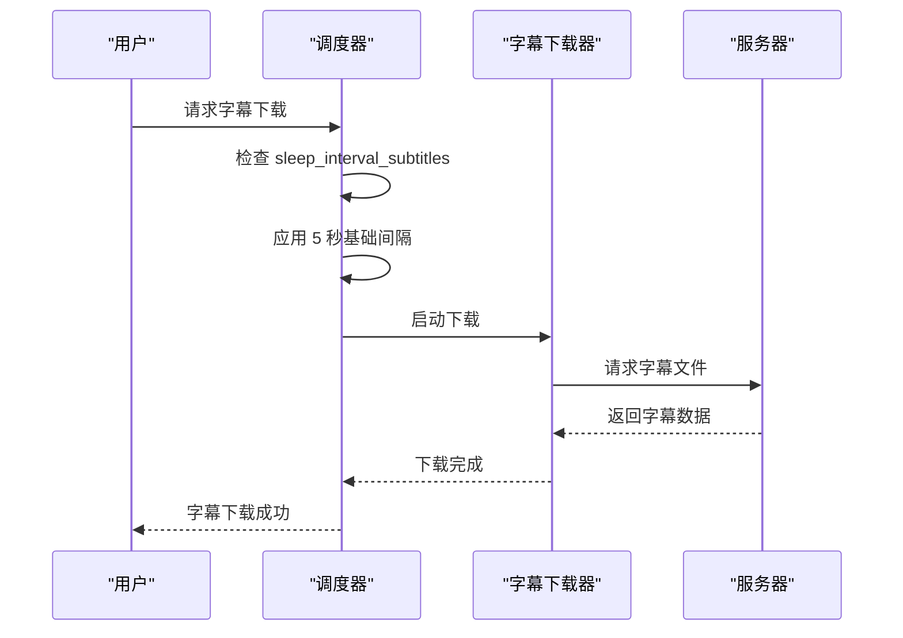

**图表来源**
- [yt_dlp/downloader/common.py](file://yt_dlp/downloader/common.py#L440-L450)

**章节来源**
- [yt_dlp/downloader/common.py](file://yt_dlp/downloader/common.py#L440-L470)

## 外部下载器性能配置

### 外部下载器参数传递机制

yt-dlp 通过 `_external_downloader_args` 处理外部下载器的性能参数传递，支持多种外部工具的优化配置。

#### 1. 参数配置格式

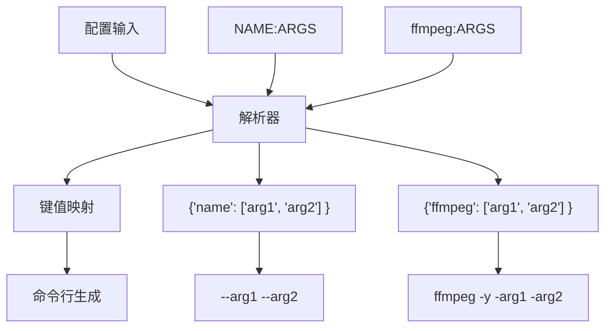

**图表来源**
- [yt_dlp/options.py](file://yt_dlp/options.py#L1103-L1117)

#### 2. 外部下载器性能参数

##### Aria2c 性能优化

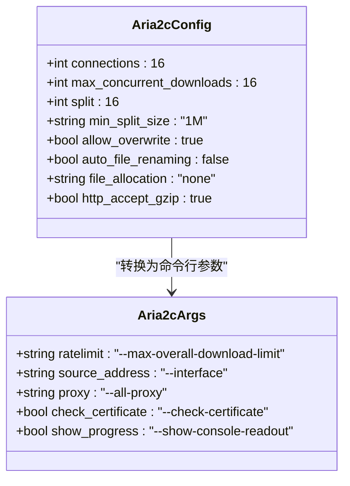

**图表来源**
- [yt_dlp/downloader/external.py](file://yt_dlp/downloader/external.py#L294-L350)

##### Curl 性能优化

| 参数 | 功能 | 推荐值 |
|------|------|--------|
| `--limit-rate` | 速度限制 | `--limit-rate 1M` |
| `--retry` | 重试次数 | `--retry 5` |
| `--max-filesize` | 最大文件大小 | `--max-filesize 1G` |
| `--continue-at` | 断点续传 | `--continue-at -` |

##### Wget 性能优化

| 参数 | 功能 | 推荐值 |
|------|------|--------|
| `--limit-rate` | 速度限制 | `--limit-rate 2M` |
| `--tries` | 重试次数 | `--tries 3` |
| `--bind-address` | 源地址绑定 | `--bind-address 192.168.1.100` |
| `--proxy` | 代理设置 | `--proxy http://proxy:8080` |

**章节来源**
- [yt_dlp/downloader/external.py](file://yt_dlp/downloader/external.py#L194-L226)
- [yt_dlp/downloader/external.py](file://yt_dlp/downloader/external.py#L241-L270)
- [yt_dlp/downloader/external.py](file://yt_dlp/downloader/external.py#L294-L350)

## 高并发下载优化

### 并发下载策略

yt-dlp 支持多种并发下载策略，通过合理配置可以显著提升大批量下载任务的效率。

#### 1. 片段并发下载

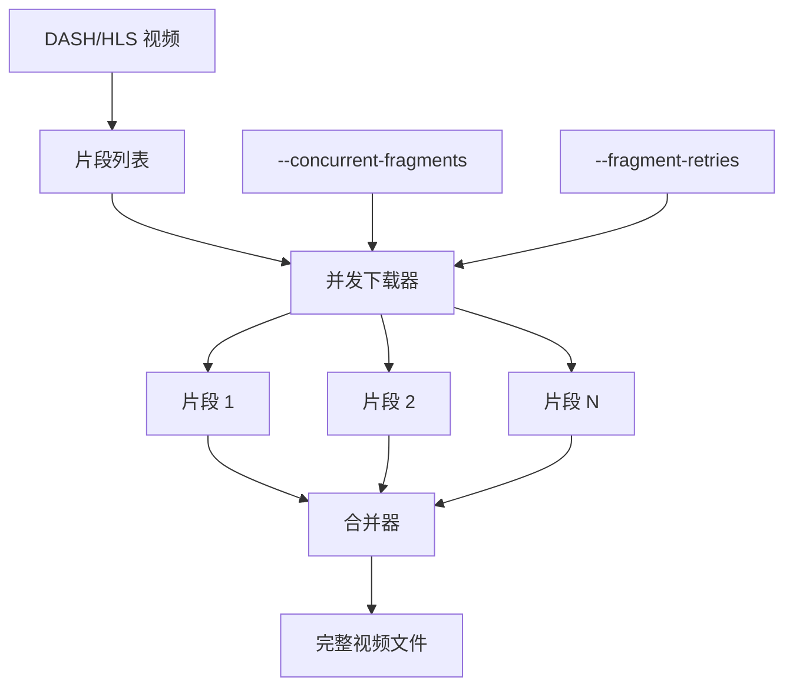

**图表来源**
- [yt_dlp/options.py](file://yt_dlp/options.py#L961-L985)

#### 2. 并发配置建议

| 场景 | 并发数量 | 重试次数 | 间隔时间 |
|------|----------|----------|----------|
| 局域网下载 | 8-16 | 3-5 | 0.5-1秒 |
| 公网下载 | 2-4 | 5-10 | 1-3秒 |
| 受限网络 | 1-2 | 10-20 | 3-10秒 |
| 批量任务 | 4-8 | 3-5 | 0.5-2秒 |

#### 3. 内存使用优化

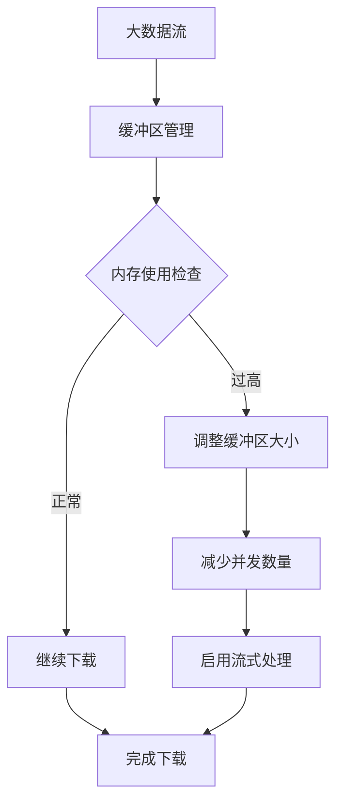

**章节来源**
- [yt_dlp/options.py](file://yt_dlp/options.py#L961-L985)
- [yt_dlp/downloader/common.py](file://yt_dlp/downloader/common.py#L150-L170)

## 性能监控与调试

### 性能指标监控

yt-dlp 提供了详细的性能监控功能，帮助用户了解下载过程中的各项指标。

#### 1. 进度报告结构

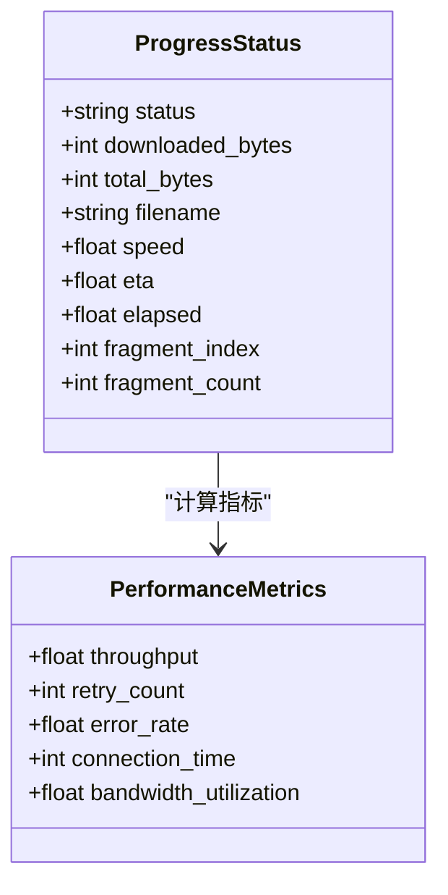

#### 2. 调试输出格式

| 输出级别 | 内容 | 示例 |
|----------|------|------|
| 详细模式 | 完整命令行 | `[download] curl command line: curl --limit-rate 1M ...` |
| 性能统计 | 速度和时间 | `[download] 1.2MB at 500KB/s ETA 00:02:30` |
| 错误诊断 | 重试信息 | `[download] Got error: Connection timeout` |

**章节来源**
- [yt_dlp/downloader/common.py](file://yt_dlp/downloader/common.py#L350-L400)

## 最佳实践指南

### 不同场景的配置推荐

#### 1. 日常批量下载

```bash
# 基础批量下载配置
yt-dlp --limit-rate 2M --retries 5 \
       --sleep-interval 1 --max-sleep-interval 5 \
       --concurrent-fragments 4 \
       --downloader-args "aria2c:--max-connection-per-server=4"
```

#### 2. 高速网络环境

```bash
# 高速网络优化配置
yt-dlp --limit-rate 10M --throttled-rate 1M \
       --retries 3 --fragment-retries 5 \
       --concurrent-fragments 8 \
       --downloader-args "aria2c:--max-connection-per-server=8"
```

#### 3. 受限网络环境

```bash
# 受限网络保护配置
yt-dlp --limit-rate 500K --throttled-rate 100K \
       --retries 15 --fragment-retries 10 \
       --sleep-interval 5 --max-sleep-interval 30 \
       --downloader-args "wget:--tries=3 --wait=10"
```

#### 4. 移动设备下载

```bash
# 移动设备优化配置
yt-dlp --limit-rate 1M --retries 3 \
       --sleep-interval 2 --max-sleep-interval 10 \
       --buffersize 1024K --no-resize-buffer
```

### 性能调优检查清单

- [ ] **网络环境评估**：测试带宽和稳定性
- [ ] **服务器负载测试**：避免对目标服务器造成过大压力
- [ ] **本地资源监控**：CPU、内存、磁盘使用情况
- [ ] **并发度验证**：逐步增加并发数量观察性能变化
- [ ] **重试策略平衡**：避免过多重试影响整体效率
- [ ] **缓存机制利用**：合理使用下载缓存减少重复请求

## 故障排除

### 常见性能问题及解决方案

#### 1. 下载速度过慢

**症状**：实际下载速度远低于预期

**排查步骤**：
1. 检查 `--limit-rate` 设置
2. 验证网络带宽限制
3. 检查服务器限速检测 (`--throttled-rate`)
4. 分析重试频率对速度的影响

**解决方案**：
```bash
# 调整速率限制
yt-dlp --limit-rate 5M --throttled-rate 1M

# 优化重试策略
yt-dlp --retries 3 --retry-sleep linear=1:30:5
```

#### 2. 频繁重试导致效率低下

**症状**：大量重试但下载进度缓慢

**排查步骤**：
1. 检查网络连接稳定性
2. 分析重试原因（超时、错误码等）
3. 调整重试参数

**解决方案**：
```bash
# 减少重试次数
yt-dlp --retries 3 --fragment-retries 3

# 使用指数退避
yt-dlp --retry-sleep exp=1:60:2
```

#### 3. 内存使用过高

**症状**：下载过程中内存占用持续上升

**解决方案**：
```bash
# 减少缓冲区大小
yt-dlp --buffersize 512K --no-resize-buffer

# 控制并发数量
yt-dlp --concurrent-fragments 2
```

#### 4. 外部下载器性能问题

**常见问题**：
- Aria2c 连接数不足
- Wget 重试策略过于激进
- Curl 缓冲区设置不当

**优化配置**：
```bash
# Aria2c 优化
yt-dlp --downloader-args "aria2c:--max-connection-per-server=8 --split=8"

# Wget 优化  
yt-dlp --downloader-args "wget:--tries=3 --wait=2 --timeout=30"

# Curl 优化
yt-dlp --downloader-args "curl:--max-time=30 --connect-timeout=10"
```

### 性能调优工具

#### 1. 性能测试脚本

```bash
#!/bin/bash
# 性能测试脚本模板
echo "开始性能测试..."

# 测试不同并发设置
for concurrency in 1 2 4 8 16; do
    echo "测试并发数: $concurrency"
    yt-dlp --concurrent-fragments $concurrency \
           --test --quiet "$URL" 2>&1 | grep "speed"
done
```

#### 2. 网络环境检测

```bash
#!/bin/bash
# 网络环境检测脚本
echo "检测网络环境..."

# 测试带宽
yt-dlp --limit-rate 10M --test "$TEST_URL"

# 检查服务器响应时间
curl -w "@curl-format.txt" -o /dev/null -s "$TEST_URL"

# 测试连接稳定性
ping -c 10 "$SERVER_HOST"
```

通过合理的性能调优配置，yt-dlp 可以在各种网络环境下实现最优的下载性能，无论是日常批量下载还是特殊场景的高要求任务，都能找到合适的配置方案。