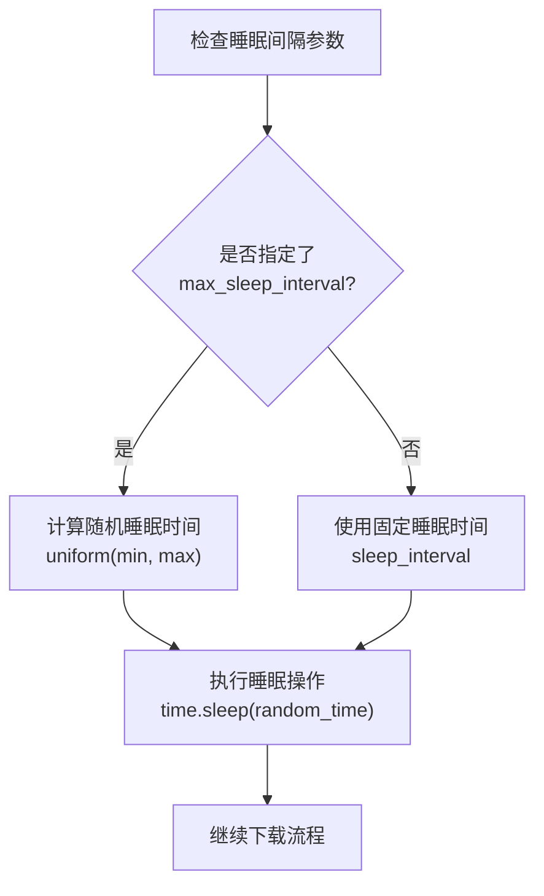
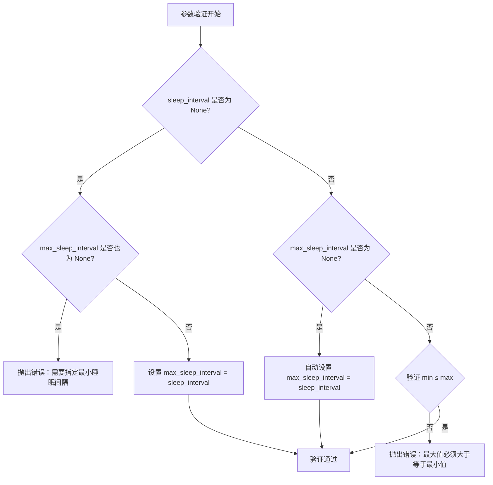
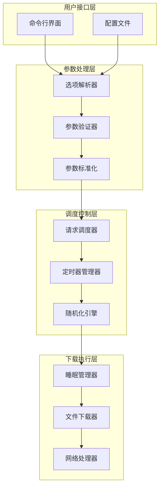
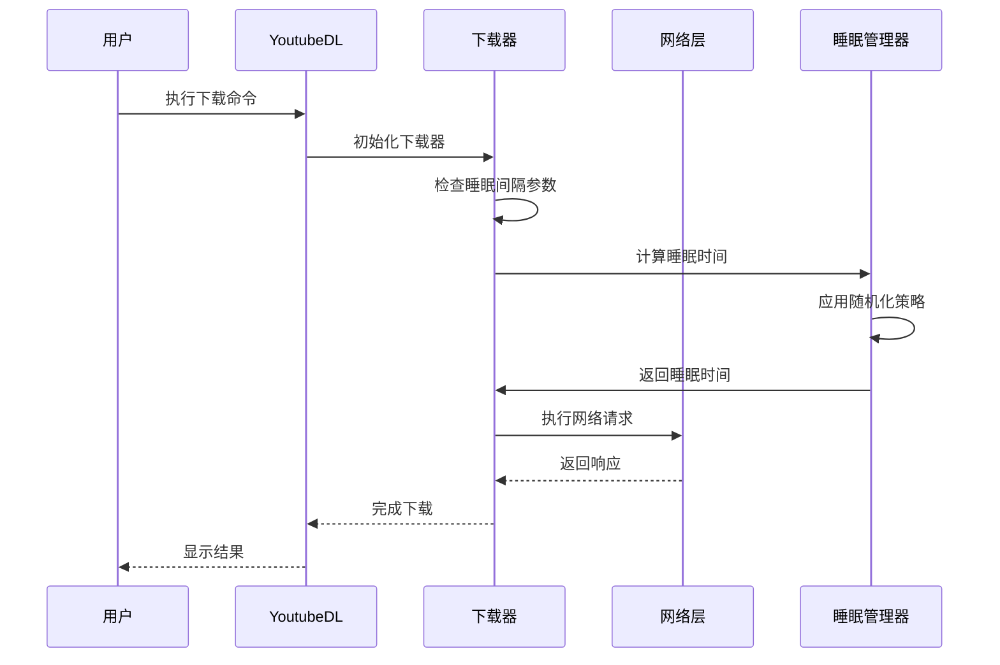
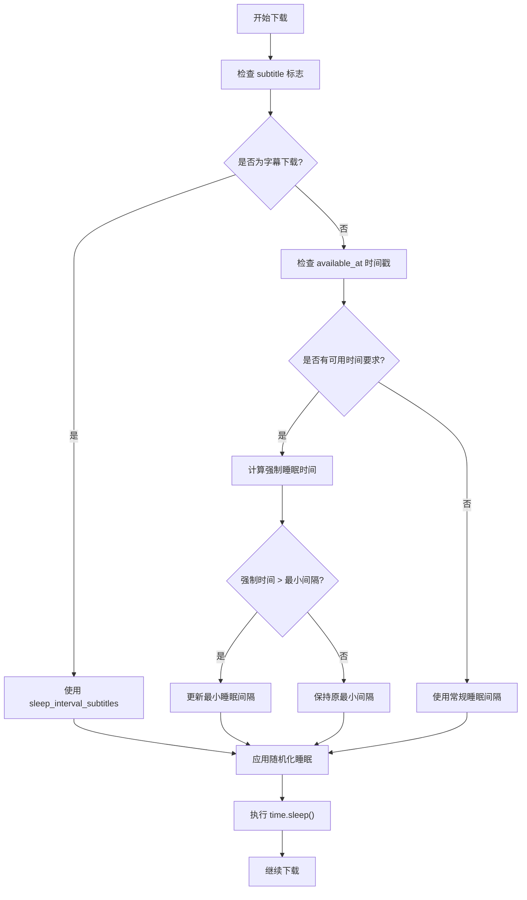
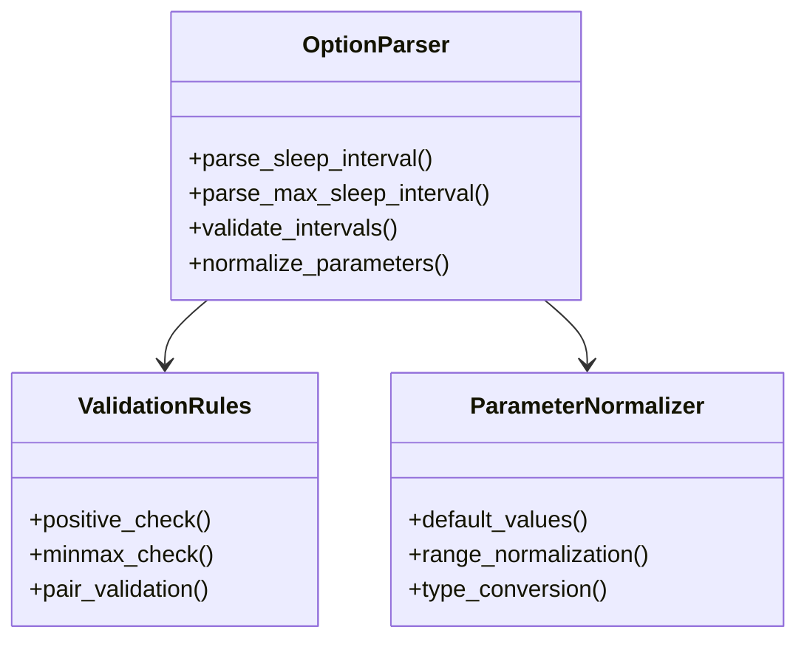
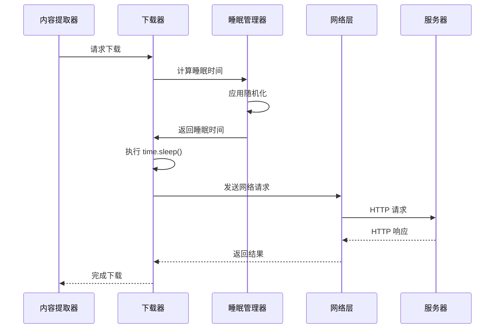
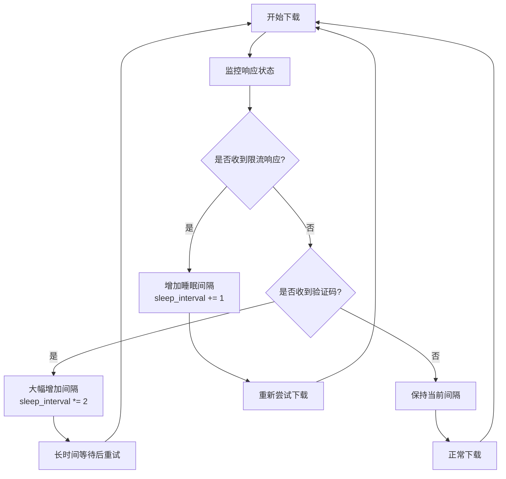
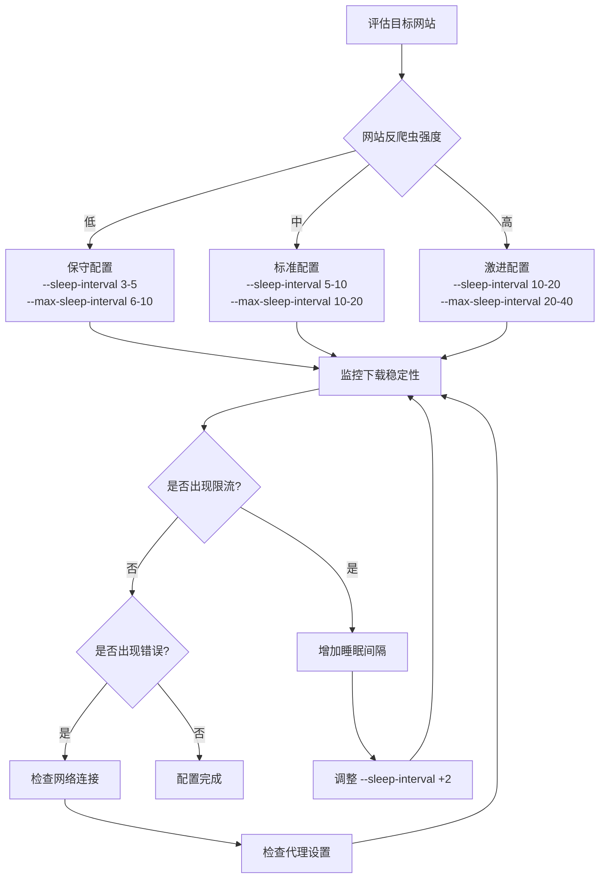

# 请求调度与间隔机制

<cite>
**本文档中引用的文件**
- [YoutubeDL.py](file://yt_dlp/YoutubeDL.py)
- [options.py](file://yt_dlp/options.py)
- [common.py](file://yt_dlp/downloader/common.py)
- [__init__.py](file://yt_dlp/__init__.py)
- [README.md](file://README.md)
- [test_networking.py](file://test/test_networking.py)
</cite>

## 目录
1. [简介](#简介)
2. [核心概念](#核心概念)
3. [参数配置](#参数配置)
4. [架构设计](#架构设计)
5. [详细组件分析](#详细组件分析)
6. [应用场景](#应用场景)
7. [最佳实践](#最佳实践)
8. [故障排除](#故障排除)
9. [总结](#总结)

## 简介

请求调度与间隔机制是 yt-dlp 中用于控制下载请求频率的重要功能模块。该机制通过设置请求间的时间间隔来降低服务器压力，避免触发反爬虫机制，并实现稳定、隐蔽的批量下载任务。主要包含两个核心参数：`--sleep-interval`（最小睡眠间隔）和 `--max-sleep-interval`（最大睡眠间隔），它们共同工作以实现随机化的请求调度策略。

## 核心概念

### 睡眠间隔类型

yt-dlp 提供了三种不同类型的睡眠间隔配置：

1. **下载前睡眠间隔 (`--sleep-interval`)**
   - 在每次视频下载开始前应用的固定或随机间隔
   - 默认值为 0 秒（无延迟）
   - 用于避免频繁访问服务器导致的反爬虫检测

2. **请求间睡眠间隔 (`--sleep-requests`)**
   - 在数据提取过程中的请求之间应用的间隔
   - 主要用于处理元数据获取和页面解析
   - 默认值为 0 秒

3. **字幕下载睡眠间隔 (`--sleep-subtitles`)**
   - 在单独的字幕下载过程中应用的间隔
   - 避免字幕服务的过度请求
   - 默认值为 0 秒

### 随机化策略

当同时指定 `--sleep-interval` 和 `--max-sleep-interval` 时，系统会采用均匀分布的随机化策略：



**图表来源**
- [common.py](file://yt_dlp/downloader/common.py#L458-L470)

## 参数配置

### 命令行参数详解

| 参数名称 | 别名 | 类型 | 默认值 | 描述 |
|---------|------|------|--------|------|
| `--sleep-interval` | `--min-sleep-interval` | 浮点数 | 0 | 每次下载前的最小睡眠时间（秒） |
| `--max-sleep-interval` | - | 浮点数 | 0 | 最大睡眠时间（秒），必须与 `--sleep-interval` 同时使用 |
| `--sleep-requests` | - | 浮点数 | 0 | 数据提取过程中的请求间隔 |
| `--sleep-subtitles` | - | 浮点数 | 0 | 字幕下载前的睡眠时间 |

### 配置验证规则

系统对睡眠间隔参数实施严格的验证规则：



**图表来源**
- [__init__.py](file://yt_dlp/__init__.py#L216-L230)

**章节来源**
- [options.py](file://yt_dlp/options.py#L1147-L1173)
- [__init__.py](file://yt_dlp/__init__.py#L216-L230)

## 架构设计

### 整体架构图



**图表来源**
- [YoutubeDL.py](file://yt_dlp/YoutubeDL.py#L1-L100)
- [common.py](file://yt_dlp/downloader/common.py#L1-L50)

### 组件交互流程



**图表来源**
- [common.py](file://yt_dlp/downloader/common.py#L458-L470)

## 详细组件分析

### 文件下载器组件

文件下载器是睡眠间隔机制的核心执行单元，负责在每次下载前应用适当的延迟：

#### 睡眠时间计算逻辑



**图表来源**
- [common.py](file://yt_dlp/downloader/common.py#L458-L470)

#### 随机化算法实现

系统使用 Python 的 `random.uniform()` 函数实现均匀分布的随机化：

```python
# 随机睡眠时间计算示例
sleep_interval = random.uniform(
    min_sleep_interval, 
    max_sleep_interval or min_sleep_interval
)
```

这种策略确保：
- 总体平均请求频率符合预期
- 单次请求的时间分布更加自然
- 难以被简单的模式识别算法检测到

**章节来源**
- [common.py](file://yt_dlp/downloader/common.py#L458-L470)

### 参数处理组件

#### 选项解析器

选项解析器负责从命令行参数中提取睡眠间隔配置：



**图表来源**
- [options.py](file://yt_dlp/options.py#L1147-L1173)

#### 参数验证机制

系统实现了多层次的参数验证：

1. **类型验证**：确保所有睡眠间隔都是正数
2. **范围验证**：验证 `min_sleep_interval ≤ max_sleep_interval`
3. **组合验证**：确保 `max_sleep_interval` 只能在 `min_sleep_interval` 存在时使用

**章节来源**
- [__init__.py](file://yt_dlp/__init__.py#L216-L230)

### 网络层集成

#### 请求拦截机制

睡眠间隔机制与网络层深度集成，在每个网络请求前插入适当的延迟：



**图表来源**
- [common.py](file://yt_dlp/downloader/common.py#L458-L470)

## 应用场景

### 连续下载多个视频

在批量下载视频时，合理的睡眠间隔可以显著降低服务器压力：

#### 场景一：单个播放列表下载

```bash
# 基础配置：每10秒下载一个视频
yt-dlp --sleep-interval 10 --max-sleep-interval 20 <playlist_url>

# 高级配置：带请求间隔和字幕间隔
yt-dlp --sleep-interval 5 --max-sleep-interval 15 \
       --sleep-requests 0.5 \
       --sleep-subtitles 2 \
       <playlist_url>
```

#### 场景二：大规模内容采集

对于需要下载大量内容的场景，建议采用渐进式策略：

```bash
# 渐进式睡眠间隔配置
yt-dlp --sleep-interval 1 --max-sleep-interval 5 \
       --sleep-requests 0.1 \
       --sleep-subtitles 0.5 \
       --retries 5 \
       <large_collection_url>
```

### 避免反爬虫检测

#### 动态调整策略

根据目标网站的反爬虫策略动态调整睡眠间隔：



#### 实际案例分析

以下是一个典型的配置示例，展示了如何平衡下载效率和反爬虫规避：

```bash
# 推荐配置：适用于大多数网站
yt-dlp --sleep-interval 3 --max-sleep-interval 8 \
       --sleep-requests 0.3 \
       --sleep-subtitles 1 \
       --retries 3 \
       --retry-sleep linear=1:5:2 \
       <target_url>
```

**章节来源**
- [README.md](file://README.md#L792-L818)

## 最佳实践

### 参数配置指南

#### 基础配置原则

1. **起始值选择**
   - 新用户建议从 `--sleep-interval 5` 开始
   - 对于高负载网站可适当增加到 `--sleep-interval 10`
   - 对于低负载网站可设置为 `--sleep-interval 1-3`

2. **随机化范围**
   - 建议设置 `--max-sleep-interval` 为 `--sleep-interval` 的 1.5-2 倍
   - 例如：`--sleep-interval 5 --max-sleep-interval 10`

3. **特殊用途配置**
   - 字幕下载：通常需要较短的间隔 `--sleep-subtitles 1-2`
   - 数据提取：建议设置较短的间隔 `--sleep-requests 0.1-0.5`

#### 高级配置策略



### 性能优化建议

#### 批量下载优化

1. **并发控制**：虽然睡眠间隔不能直接控制并发，但可以通过合理的时间间隔减少服务器压力
2. **重试策略**：结合睡眠间隔使用指数退避重试策略
3. **资源监控**：监控 CPU、内存和网络使用情况，避免系统过载

#### 网络环境适配

```bash
# 宽带环境（推荐较低间隔）
yt-dlp --sleep-interval 2 --max-sleep-interval 5 \
       --sleep-requests 0.1 \
       --sleep-subtitles 0.5

# 宽带受限环境（推荐较高间隔）
yt-dlp --sleep-interval 10 --max-sleep-interval 20 \
       --sleep-requests 0.5 \
       --sleep-subtitles 2
```

### 调试和监控

#### 日志分析

启用详细日志记录来监控睡眠间隔的效果：

```bash
# 启用调试模式查看睡眠时间
yt-dlp --verbose --sleep-interval 5 --max-sleep-interval 10 \
       --output "debug_%(id)s.log" \
       <url>
```

#### 性能指标监控

关键性能指标包括：
- 实际下载速度 vs 理论最大速度
- 错误率 vs 正常率
- 服务器响应时间和成功率

## 故障排除

### 常见问题及解决方案

#### 问题一：下载速度过慢

**症状**：下载速度明显低于预期

**可能原因**：
1. 睡眠间隔设置过大
2. 网络连接不稳定
3. 服务器响应缓慢

**解决方案**：
```bash
# 调整睡眠间隔
yt-dlp --sleep-interval 2 --max-sleep-interval 5 \
       --sleep-requests 0.1 \
       --sleep-subtitles 0.5 \
       <url>
```

#### 问题二：频繁遇到限流

**症状**：下载过程中经常收到 429 或 503 错误

**可能原因**：
1. 睡眠间隔不足以避免限流
2. 随机化范围太小
3. 并发请求过多

**解决方案**：
```bash
# 增加睡眠间隔和随机化范围
yt-dlp --sleep-interval 10 --max-sleep-interval 30 \
       --sleep-requests 0.5 \
       --sleep-subtitles 2 \
       --retries 5 \
       <url>
```

#### 问题三：某些视频无法下载

**症状**：特定视频总是失败

**可能原因**：
1. 视频有特殊的访问限制
2. 睡眠间隔不足以绕过临时限制
3. 网络连接质量差

**解决方案**：
```bash
# 针对性增加睡眠时间
yt-dlp --sleep-interval 15 --max-sleep-interval 45 \
       --sleep-requests 1 \
       --sleep-subtitles 3 \
       --wait-for-video 30-60 \
       <problematic_video_url>
```

### 调试工具和技术

#### 网络抓包分析

使用网络抓包工具分析请求模式：

```bash
# 使用 tcpdump 抓包
sudo tcpdump -i any -w yt-dlp-debug.pcap host <target_host>

# 使用 wireshark 分析
wireshark yt-dlp-debug.pcap
```

#### 日志分析脚本

```python
# 睡眠时间分析脚本
import re
import sys

def analyze_sleep_times(log_file):
    sleep_pattern = r"\[download\] Sleeping (\d+(\.\d+)?) seconds"
    sleep_times = []
    
    with open(log_file, 'r') as f:
        for line in f:
            match = re.search(sleep_pattern, line)
            if match:
                sleep_times.append(float(match.group(1)))
    
    if sleep_times:
        avg = sum(sleep_times) / len(sleep_times)
        min_val = min(sleep_times)
        max_val = max(sleep_times)
        print(f"平均睡眠时间: {avg:.2f}s")
        print(f"最小睡眠时间: {min_val:.2f}s")
        print(f"最大睡眠时间: {max_val:.2f}s")
        print(f"总睡眠次数: {len(sleep_times)}")

if __name__ == "__main__":
    analyze_sleep_times(sys.argv[1])
```

**章节来源**
- [test_networking.py](file://test/test_networking.py#L573-L601)

## 总结

请求调度与间隔机制是 yt-dlp 中实现稳定、隐蔽下载的关键技术。通过合理配置 `--sleep-interval` 和 `--max-sleep-interval` 参数，用户可以在下载效率和反爬虫规避之间找到最佳平衡点。

### 关键要点

1. **参数组合**：必须同时使用 `--sleep-interval` 和 `--max-sleep-interval` 才能启用随机化策略
2. **随机化效果**：均匀分布的随机化使请求模式更加自然，难以被检测
3. **应用场景**：特别适用于批量下载、大规模内容采集和反爬虫规避
4. **性能权衡**：较长的睡眠间隔提高稳定性但降低下载速度，需要根据具体需求调整
5. **监控重要性**：持续监控下载性能和错误率，及时调整参数配置

### 未来发展方向

随着反爬虫技术的不断演进，请求调度机制可能会进一步发展，包括：
- 自适应睡眠间隔算法
- 基于机器学习的请求模式优化
- 更智能的错误恢复和重试策略
- 多维度的流量控制和负载均衡

通过深入理解和正确使用这些机制，用户可以构建更加稳定、高效的批量下载解决方案。