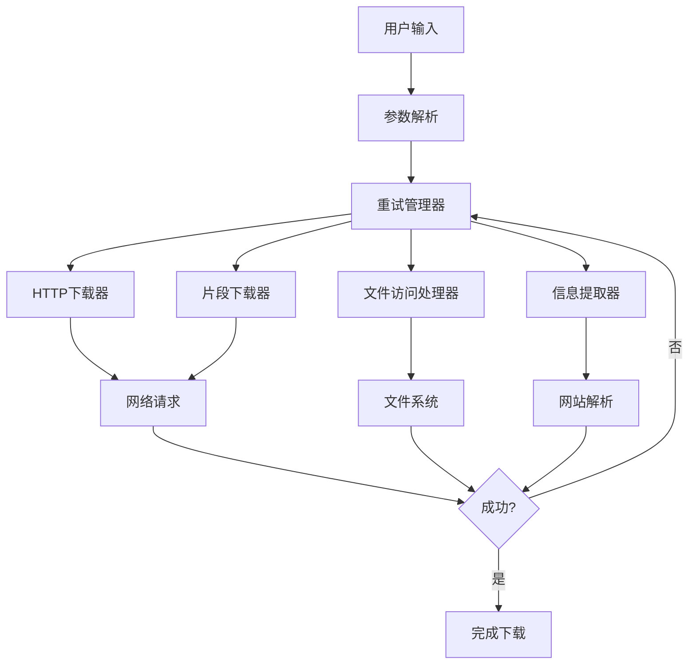
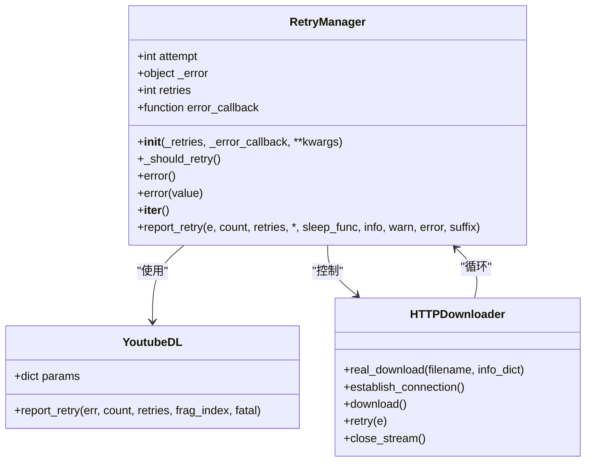
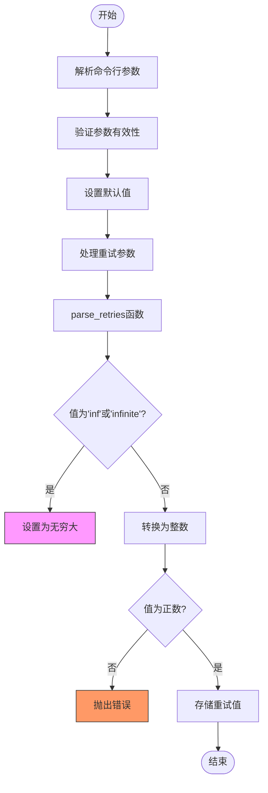
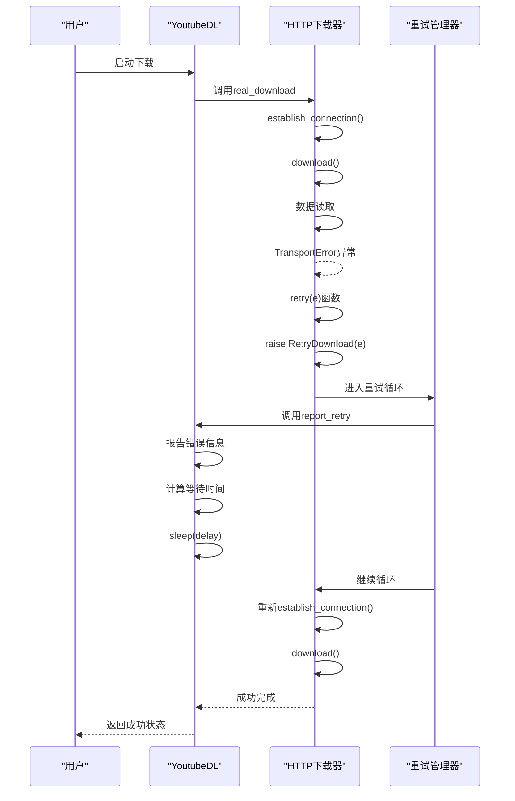
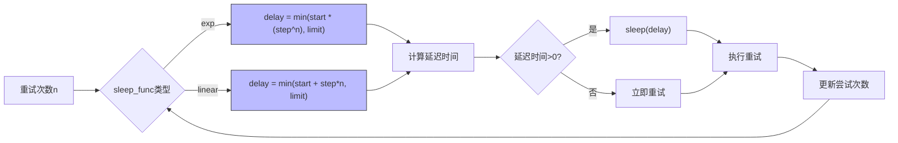
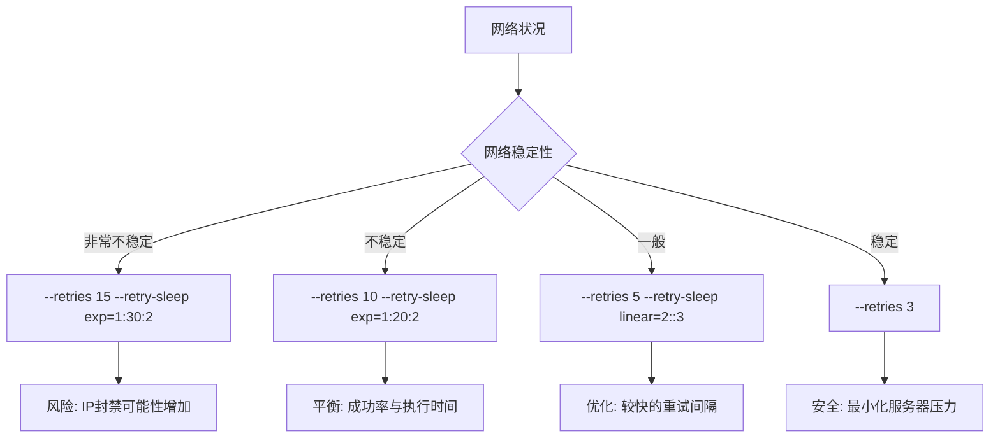

# 重试机制

<cite>
**本文档引用的文件**
- [YoutubeDL.py](file://yt_dlp/YoutubeDL.py)
- [common.py](file://yt_dlp/downloader/common.py)
- [http.py](file://yt_dlp/downloader/http.py)
- [__init__.py](file://yt_dlp/__init__.py)
- [options.py](file://yt_dlp/options.py)
</cite>

## 目录
1. [简介](#简介)
2. [重试机制架构](#重试机制架构)
3. [核心组件分析](#核心组件分析)
4. [重试参数处理逻辑](#重试参数处理逻辑)
5. [异常处理流程](#异常处理流程)
6. [指数退避策略](#指数退避策略)
7. [最佳实践](#最佳实践)
8. [结论](#结论)

## 简介
yt-dlp的重试机制是一个复杂的系统，旨在处理下载过程中的各种网络和服务器错误。该机制通过多层次的重试策略，确保在不稳定网络环境下仍能成功下载媒体文件。系统提供了灵活的配置选项，允许用户根据具体需求调整重试次数和间隔策略。

## 重试机制架构

**图表来源**
- [YoutubeDL.py](file://yt_dlp/YoutubeDL.py#L0-L500)
- [common.py](file://yt_dlp/downloader/common.py#L0-L500)

## 核心组件分析

### 重试管理器分析

**图表来源**
- [common.py](file://yt_dlp/utils/_utils.py#L5225-L5278)
- [YoutubeDL.py](file://yt_dlp/YoutubeDL.py#L409-L413)
- [http.py](file://yt_dlp/downloader/http.py#L331-L375)

**章节来源**
- [common.py](file://yt_dlp/utils/_utils.py#L5225-L5278)
- [YoutubeDL.py](file://yt_dlp/YoutubeDL.py#L409-L413)
- [http.py](file://yt_dlp/downloader/http.py#L331-L375)

## 重试参数处理逻辑

yt-dlp的重试机制通过`--retries`参数控制下载过程中的重试次数。系统在初始化时会解析这些参数，并将其应用于相应的下载组件。

**图表来源**
- [__init__.py](file://yt_dlp/__init__.py#L260-L270)
- [options.py](file://yt_dlp/options.py#L975-L984)

**章节来源**
- [__init__.py](file://yt_dlp/__init__.py#L260-L270)
- [options.py](file://yt_dlp/options.py#L975-L984)

## 异常处理流程

当下载失败时，系统会捕获各种异常并根据配置进行重试。主要处理的异常类型包括HTTP错误、传输错误和证书验证错误。

**图表来源**
- [http.py](file://yt_dlp/downloader/http.py#L170-L191)
- [http.py](file://yt_dlp/downloader/http.py#L236-L270)
- [YoutubeDL.py](file://yt_dlp/YoutubeDL.py#L409-L413)

**章节来源**
- [http.py](file://yt_dlp/downloader/http.py#L170-L191)
- [http.py](file://yt_dlp/downloader/http.py#L236-L270)

## 指数退避策略

yt-dlp实现了灵活的指数退避策略，通过`retry_sleep_functions`参数配置重试间隔。系统支持线性和指数增长模式，有效避免对服务器造成过大压力。

**图表来源**
- [__init__.py](file://yt_dlp/__init__.py#L272-L297)
- [common.py](file://yt_dlp/utils/_utils.py#L5225-L5278)

**章节来源**
- [__init__.py](file://yt_dlp/__init__.py#L272-L297)

## 最佳实践

### 参数配置建议

| 参数 | 默认值 | 建议值 | 说明 |
|------|-------|-------|------|
| --retries | 10 | 5-15 | 下载重试次数 |
| --fragment-retries | 10 | 5-15 | 片段下载重试次数 |
| --file-access-retries | 3 | 3-5 | 文件访问重试次数 |
| --extractor-retries | 3 | 3-5 | 信息提取重试次数 |

### 不稳定网络环境下的配置

对于不稳定网络环境，建议采用以下配置策略：

**章节来源**
- [options.py](file://yt_dlp/options.py#L975-L984)
- [__init__.py](file://yt_dlp/__init__.py#L272-L297)

## 结论

yt-dlp的重试机制是一个精心设计的系统，通过`RetryManager`类统一管理各种重试场景。系统提供了`--retries`参数来控制下载重试次数，默认值为10次，允许用户根据网络状况进行调整。在下载失败时，系统会捕获HTTP错误、传输错误等异常，并根据配置进行重试。

指数退避策略通过`retry_sleep_functions`参数实现，支持线性和指数增长模式，有效平衡了重试成功率与服务器压力。对于不稳定网络环境，建议将重试次数设置为5-15次，并采用指数退避策略（如`exp=1:20:2`）来逐步增加重试间隔。

需要注意的是，过度重试可能会导致IP被服务器封禁，因此需要在成功率和执行时间之间找到平衡点。合理的配置应该考虑网络状况、服务器限制和下载优先级等因素，避免对服务器造成过大压力的同时确保下载任务的完成率。