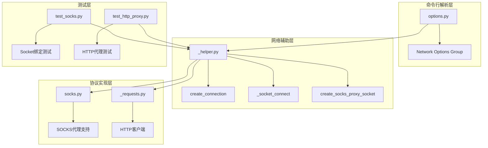
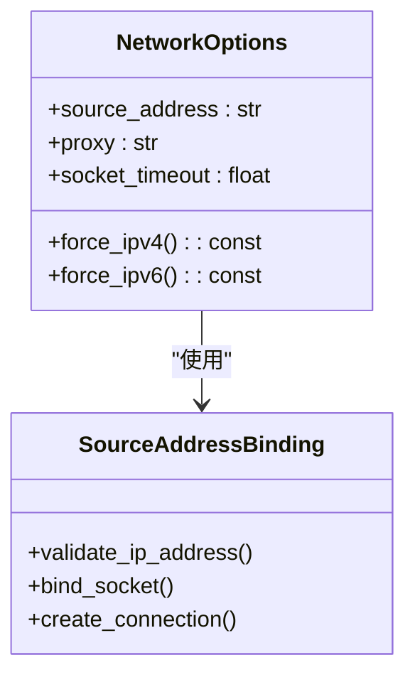
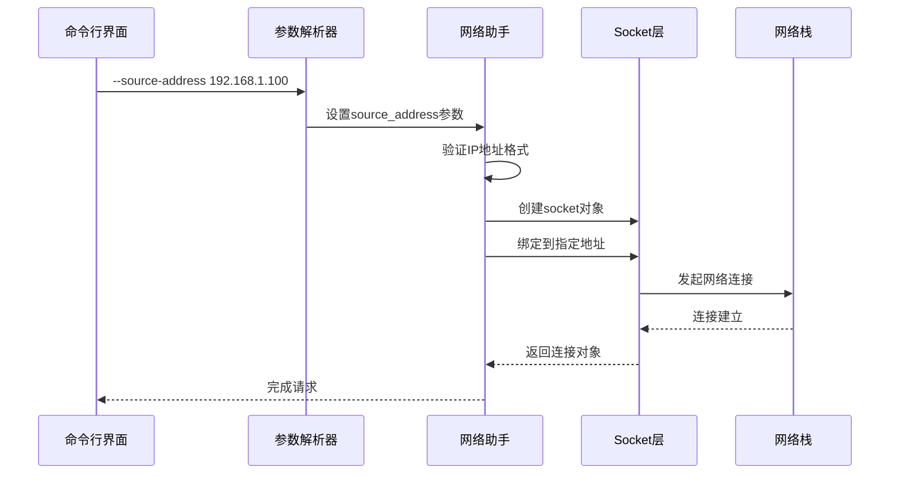
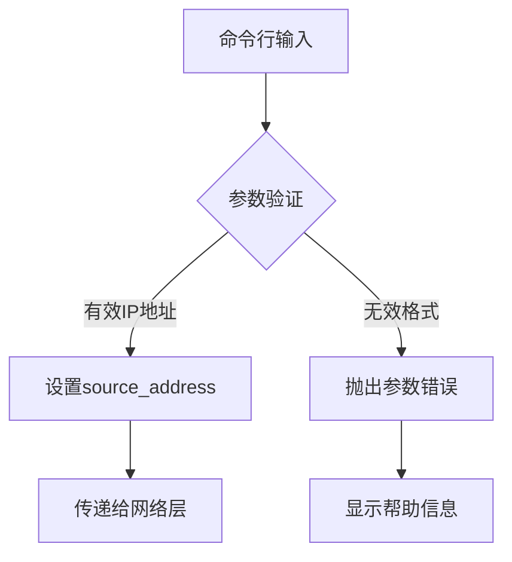
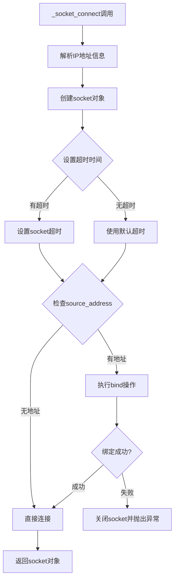
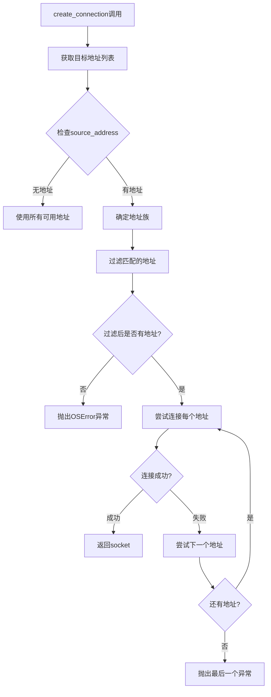
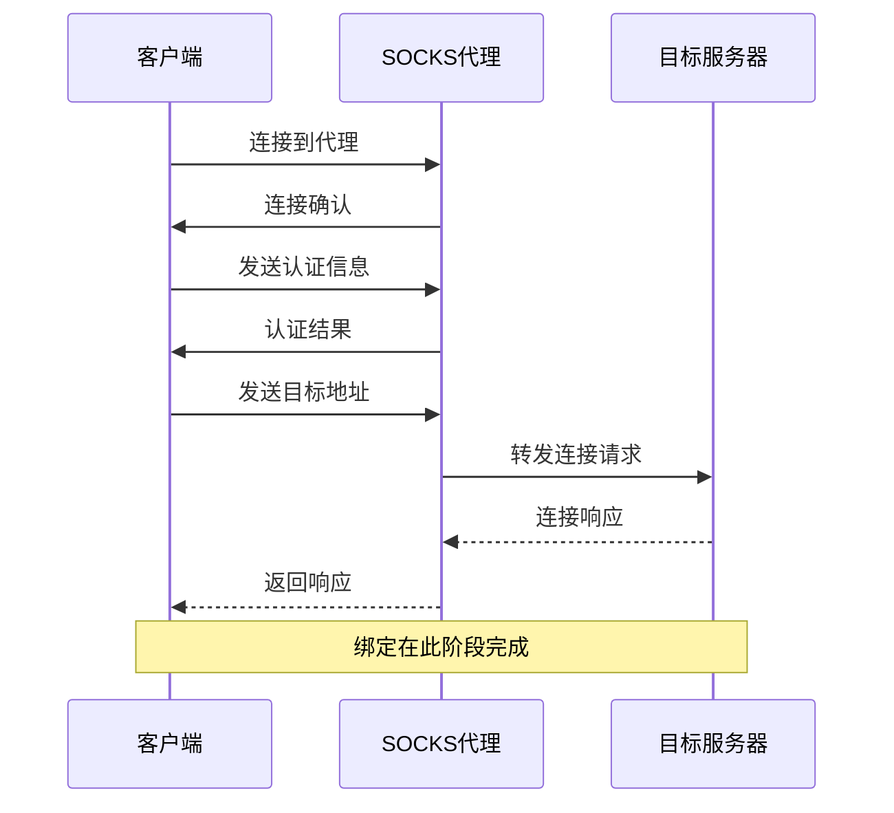
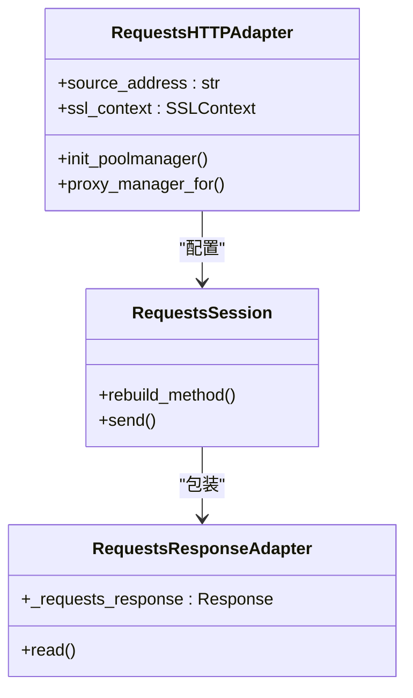
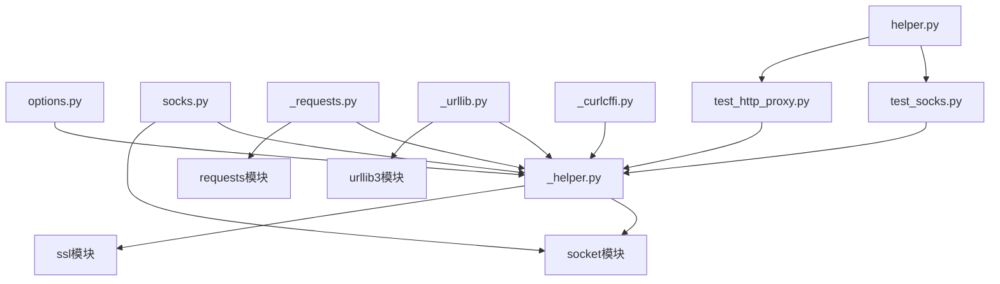
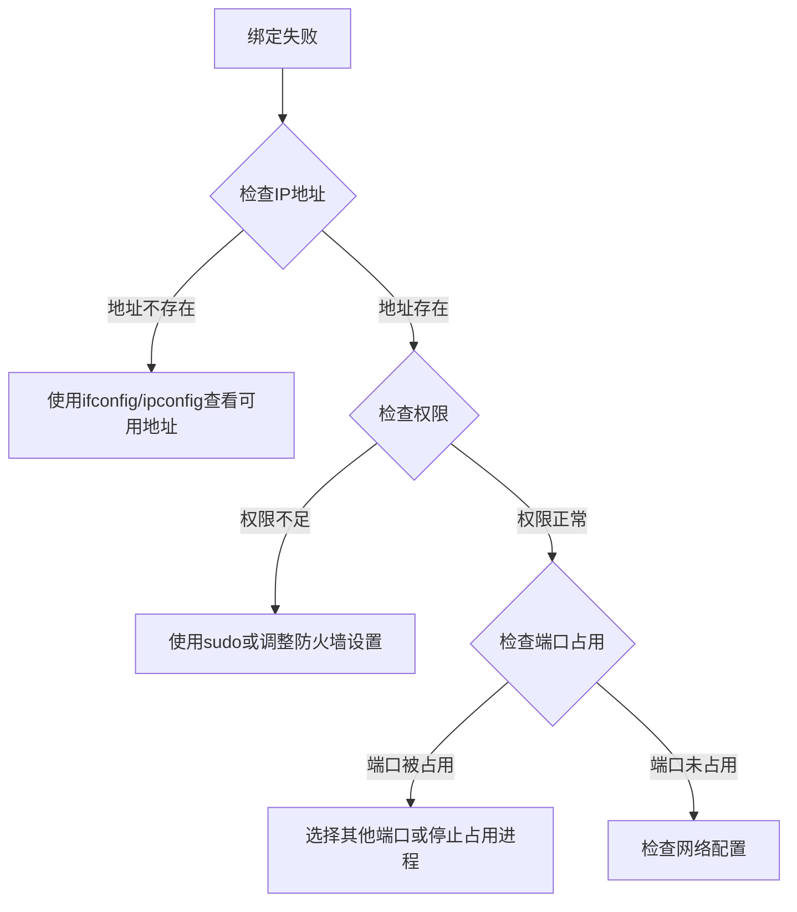

# IP地址绑定技术文档

<cite>
**本文档中引用的文件**
- [options.py](file://yt_dlp/options.py)
- [_helper.py](file://yt_dlp/networking/_helper.py)
- [socks.py](file://yt_dlp/socks.py)
- [_requests.py](file://yt_dlp/networking/_requests.py)
- [test_socks.py](file://test/test_socks.py)
- [test_http_proxy.py](file://test/test_http_proxy.py)
- [helper.py](file://test/helper.py)
</cite>

## 目录
1. [简介](#简介)
2. [项目结构概览](#项目结构概览)
3. [核心组件分析](#核心组件分析)
4. [架构概览](#架构概览)
5. [详细组件分析](#详细组件分析)
6. [依赖关系分析](#依赖关系分析)
7. [性能考虑](#性能考虑)
8. [故障排除指南](#故障排除指南)
9. [结论](#结论)

## 简介

本文档深入讲解yt-dlp项目中`--source-address`参数的实现机制，该参数允许用户指定发起网络请求时使用的本地网络接口IP地址。这一功能对于多网卡主机环境、需要强制使用IPv4/IPv6的场景以及绕过多线路出口限制等应用场景至关重要。

`--source-address`参数通过在socket层进行绑定操作，直接影响网络栈的行为，确保所有网络连接都从指定的本地IP地址发出。这种实现方式提供了细粒度的网络控制能力，支持多种网络配置需求。

## 项目结构概览

yt-dlp的网络功能主要分布在以下模块中：

**图表来源**
- [options.py](file://yt_dlp/options.py#L589-L605)
- [_helper.py](file://yt_dlp/networking/_helper.py#L234-L272)
- [socks.py](file://yt_dlp/socks.py#L0-L274)

**章节来源**
- [options.py](file://yt_dlp/options.py#L589-L605)
- [_helper.py](file://yt_dlp/networking/_helper.py#L189-L272)

## 核心组件分析

### 命令行参数定义

`--source-address`参数在命令行解析器中被定义为网络选项组的一部分，支持直接指定IP地址或通过其他选项间接设置：

**图表来源**
- [options.py](file://yt_dlp/options.py#L589-L605)

### Socket绑定机制

核心的socket绑定逻辑实现在`_helper.py`模块中，包含三个关键函数：

1. **_socket_connect**: 直接socket连接的绑定实现
2. **create_socks_proxy_socket**: SOCKS代理连接的绑定实现  
3. **create_connection**: 高级连接创建函数，支持地址族过滤

**章节来源**
- [_helper.py](file://yt_dlp/networking/_helper.py#L189-L272)

## 架构概览

IP地址绑定功能在整个网络架构中的位置如下：

**图表来源**
- [_helper.py](file://yt_dlp/networking/_helper.py#L189-L231)
- [options.py](file://yt_dlp/options.py#L589-L605)

## 详细组件分析

### 命令行参数处理

#### 参数定义与默认值

`--source-address`参数在选项组中被定义为可选参数，默认值为`None`：

**图表来源**
- [options.py](file://yt_dlp/options.py#L589-L605)

#### 特殊选项处理

系统还提供了两个特殊选项来简化IPv4/IPv6绑定：

- `-4` 或 `--force-ipv4`: 强制使用IPv4，内部设置`source_address='0.0.0.0'`
- `-6` 或 `--force-ipv6`: 强制使用IPv6，内部设置`source_address='::'`

**章节来源**
- [options.py](file://yt_dlp/options.py#L589-L605)

### Socket层绑定实现

#### _socket_connect函数

这是最基础的socket绑定实现，负责创建和绑定socket：

**图表来源**
- [_helper.py](file://yt_dlp/networking/_helper.py#L189-L205)

#### create_connection函数

这个高级函数提供了智能的地址族过滤功能：

**图表来源**
- [_helper.py](file://yt_dlp/networking/_helper.py#L234-L272)

### SOCKS代理支持

#### SOCKS代理绑定流程

当使用SOCKS代理时，绑定操作发生在代理握手之后：

**图表来源**
- [socks.py](file://yt_dlp/socks.py#L136-L173)

**章节来源**
- [_helper.py](file://yt_dlp/networking/_helper.py#L206-L231)
- [socks.py](file://yt_dlp/socks.py#L136-L173)

### HTTP客户端集成

#### Requests库适配器

在使用Requests库作为HTTP客户端时，source_address参数通过适配器传递：

**图表来源**
- [_requests.py](file://yt_dlp/networking/_requests.py#L140-L199)

**章节来源**
- [_requests.py](file://yt_dlp/networking/_requests.py#L140-L199)

## 依赖关系分析

### 模块间依赖关系

**图表来源**
- [options.py](file://yt_dlp/options.py#L1-L50)
- [_helper.py](file://yt_dlp/networking/_helper.py#L1-L20)

### 外部依赖

系统依赖以下外部库：
- `socket`: Python标准库，提供底层网络通信
- `ssl`: Python标准库，提供SSL/TLS支持
- `requests`: 第三方HTTP客户端库
- `urllib3`: Requests库的底层HTTP实现
- `socks`: SOCKS代理支持库

**章节来源**
- [_helper.py](file://yt_dlp/networking/_helper.py#L1-L20)

## 性能考虑

### 连接建立优化

1. **地址族过滤**: `create_connection`函数通过预先过滤地址族来减少不必要的连接尝试
2. **超时管理**: 支持自定义连接超时，避免长时间阻塞
3. **连接池复用**: 在HTTP客户端中使用连接池来重用TCP连接

### 内存使用优化

1. **延迟初始化**: 只在需要时才创建socket对象
2. **资源清理**: 使用上下文管理器确保socket正确关闭
3. **循环引用避免**: 显式断开异常链引用

## 故障排除指南

### 常见错误及解决方案

#### 绑定失败错误

**错误类型**: `OSError: [Errno 99] Cannot assign requested address`

**原因分析**:
1. 指定的IP地址不存在于本地网络接口
2. 权限不足无法绑定到指定地址
3. 地址已被其他进程占用

**诊断步骤**:

#### 地址族不匹配错误

**错误类型**: `OSError: No remote IPv4 addresses available for connect`

**解决方案**:
1. 确保目标服务器支持相同的地址族
2. 使用正确的`--force-ipv4`或`--force-ipv6`选项
3. 检查DNS解析是否返回了预期的地址族

#### SOCKS代理绑定问题

**常见问题**:
1. 代理服务器不支持指定的源地址
2. 代理认证失败
3. 网络路由配置问题

**调试建议**:
- 使用`--verbose`选项查看详细的连接过程
- 检查代理服务器日志
- 验证网络连通性

**章节来源**
- [_helper.py](file://yt_dlp/networking/_helper.py#L245-L255)
- [helper.py](file://test/helper.py#L364-L383)

### 测试用例分析

系统提供了全面的测试用例来验证IP绑定功能：

#### SOCKS代理测试

测试覆盖了IPv4和IPv6源地址绑定的各种场景：
- 不同SOCKS版本（4/4a/5）的支持
- 代理认证机制
- 地址解析和绑定验证

#### HTTP代理测试

验证HTTP代理环境下的源地址绑定：
- 基本代理连接
- 认证代理支持
- 源地址验证

**章节来源**
- [test_socks.py](file://test/test_socks.py#L314-L337)
- [test_http_proxy.py](file://test/test_http_proxy.py#L266-L282)

## 结论

yt-dlp的IP地址绑定功能通过精心设计的分层架构实现了灵活而强大的网络控制能力。该功能的核心优势包括：

1. **统一的接口设计**: 通过单一的`--source-address`参数支持各种网络场景
2. **完善的错误处理**: 提供详细的错误信息和诊断建议
3. **广泛的协议支持**: 支持HTTP、HTTPS、SOCKS等多种代理协议
4. **高性能实现**: 通过地址族过滤和连接池优化提升性能
5. **全面的测试覆盖**: 包含各种边界情况和错误场景的测试用例

这一实现不仅满足了当前的功能需求，还为未来的扩展提供了良好的架构基础。开发者可以通过理解这些核心组件的工作原理，更好地利用和扩展yt-dlp的网络功能。