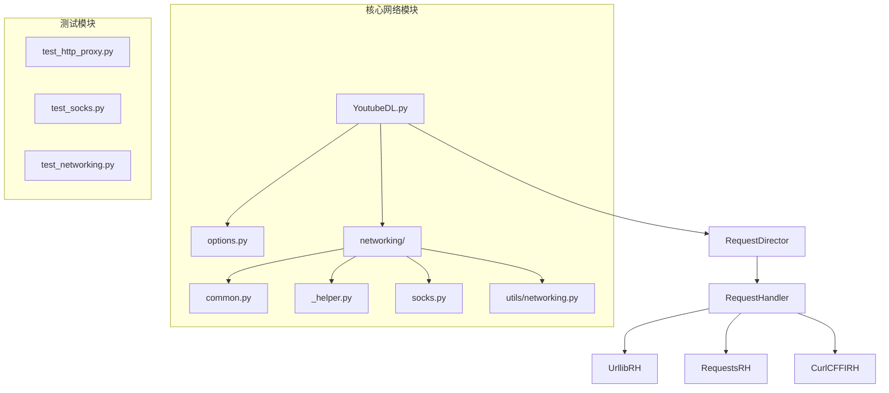
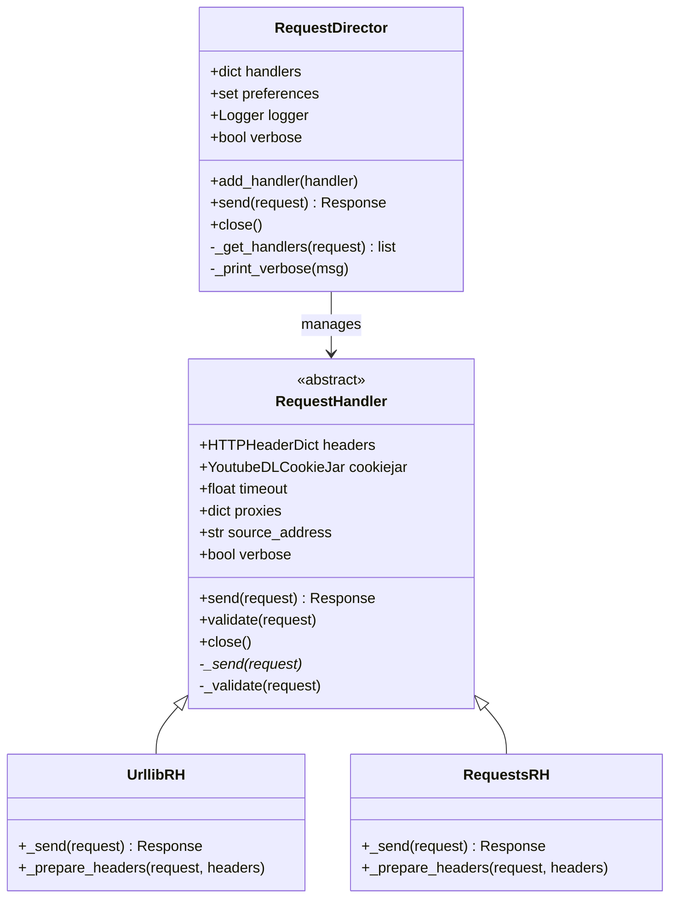
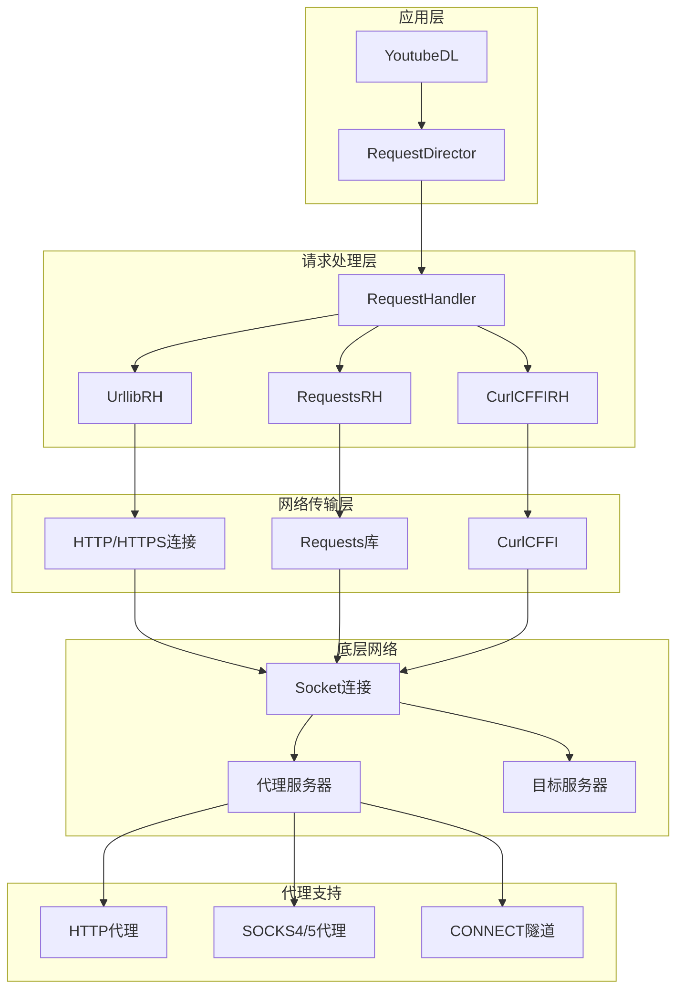
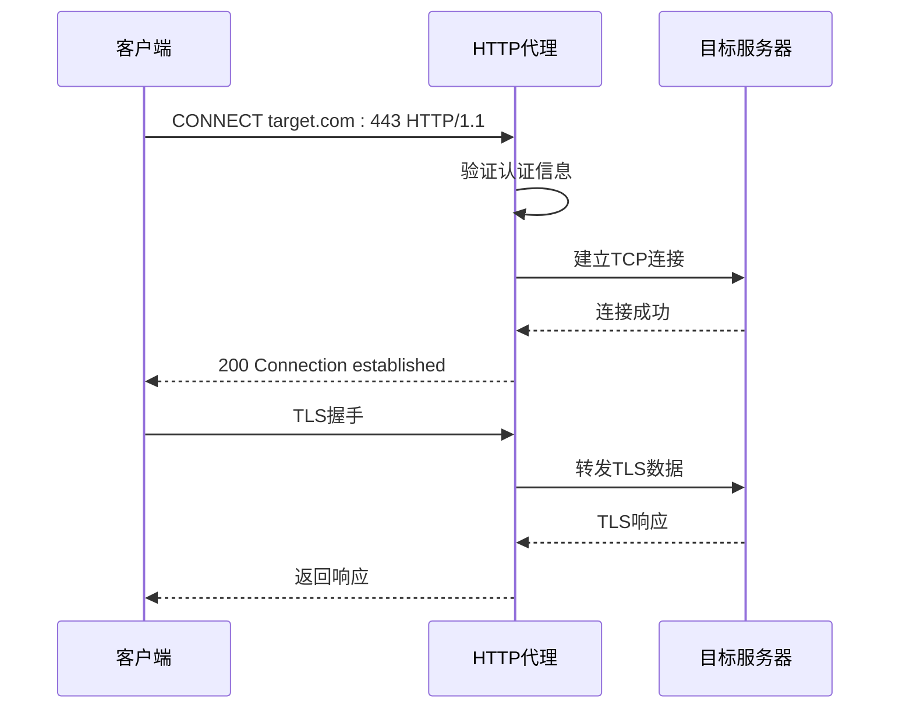
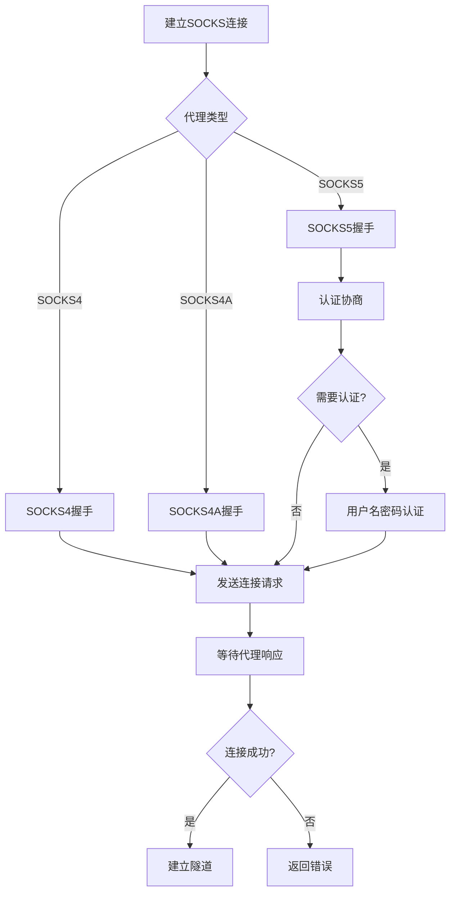
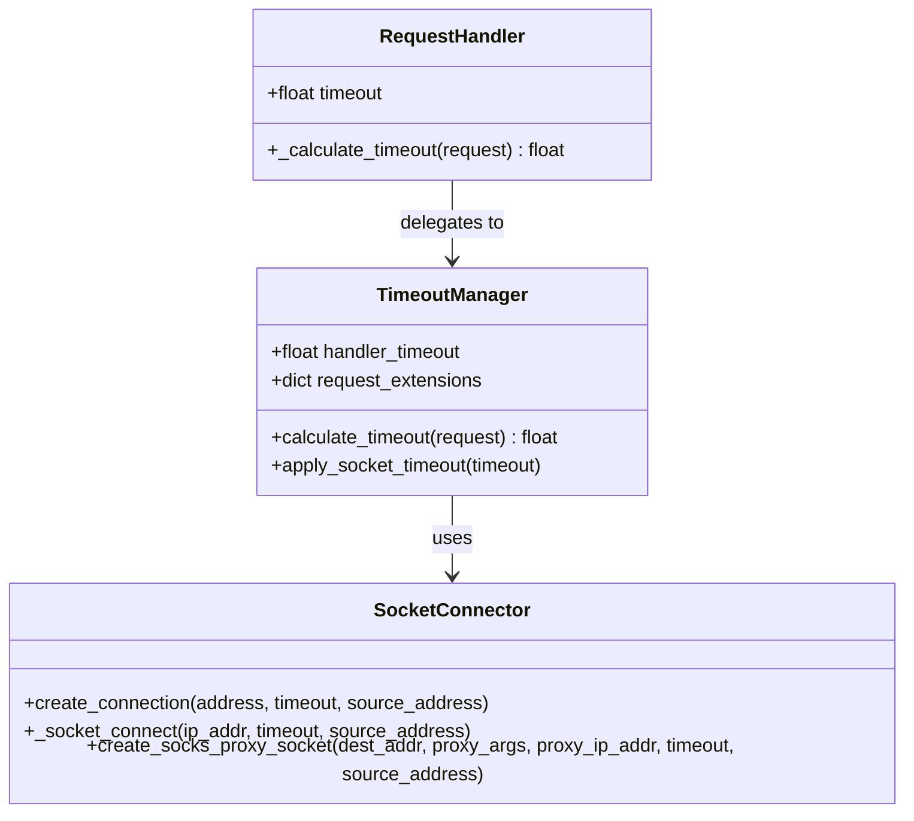
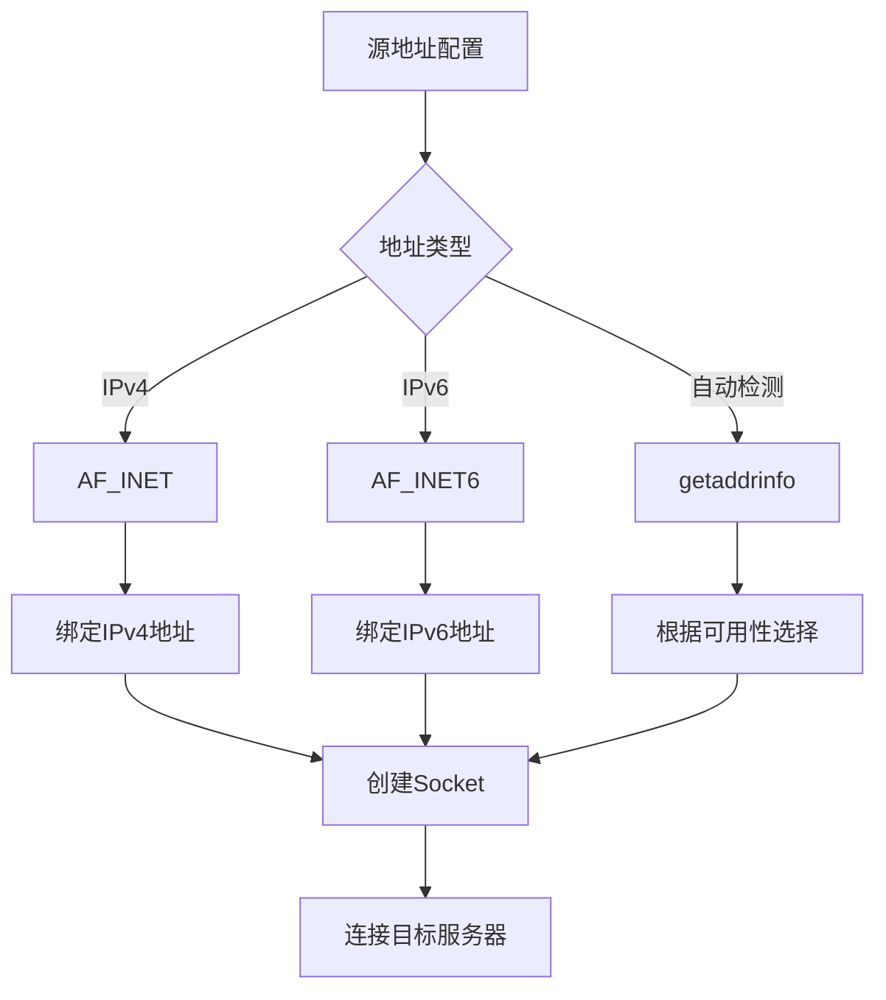
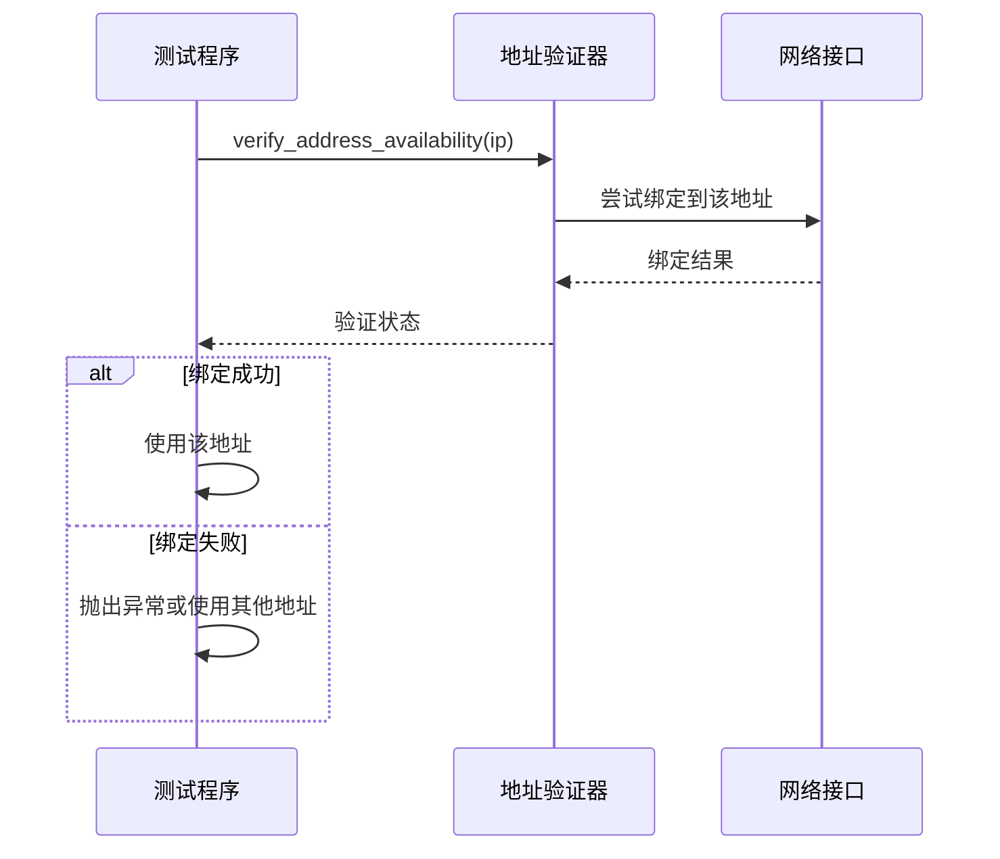
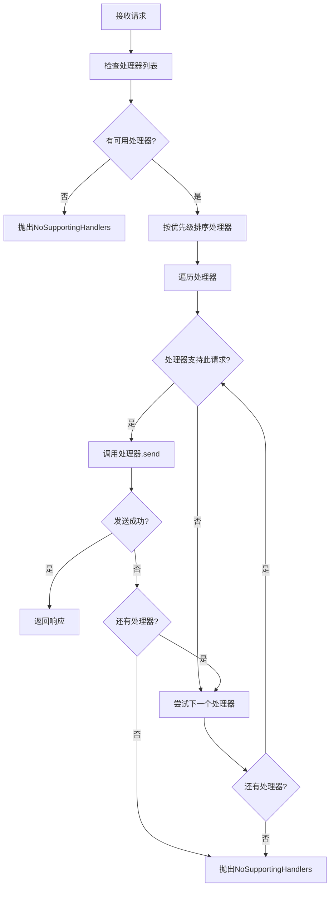
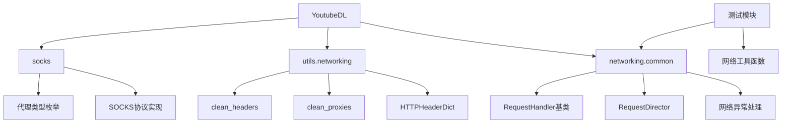

# 网络配置

<cite>
**本文档中引用的文件**
- [YoutubeDL.py](file://yt_dlp/YoutubeDL.py)
- [options.py](file://yt_dlp/options.py)
- [common.py](file://yt_dlp/networking/common.py)
- [_helper.py](file://yt_dlp/networking/_helper.py)
- [networking.py](file://yt_dlp/utils/networking.py)
- [socks.py](file://yt_dlp/socks.py)
- [test_http_proxy.py](file://test/test_http_proxy.py)
- [test_socks.py](file://test/test_socks.py)
- [test_networking.py](file://test/test_networking.py)
</cite>

## 目录
1. [简介](#简介)
2. [项目结构概览](#项目结构概览)
3. [核心组件分析](#核心组件分析)
4. [架构概览](#架构概览)
5. [详细组件分析](#详细组件分析)
6. [依赖关系分析](#依赖关系分析)
7. [性能考虑](#性能考虑)
8. [故障排除指南](#故障排除指南)
9. [结论](#结论)

## 简介

yt-dlp是一个功能丰富的命令行音频/视频下载器，支持数千个网站。其网络配置系统提供了强大的代理设置、超时控制和源地址绑定功能，使用户能够在复杂的网络环境中灵活地管理网络请求。

本文档深入探讨了yt-dlp的网络配置机制，重点关注proxy（代理）、socket-timeout（套接字超时）和source-address（源地址）等关键选项的实现原理和使用方法。

## 项目结构概览

yt-dlp的网络配置系统主要分布在以下模块中：



**图表来源**
- [YoutubeDL.py](file://yt_dlp/YoutubeDL.py#L1-L50)
- [options.py](file://yt_dlp/options.py#L1-L50)
- [common.py](file://yt_dlp/networking/common.py#L1-L50)

**章节来源**
- [YoutubeDL.py](file://yt_dlp/YoutubeDL.py#L1-L100)
- [options.py](file://yt_dlp/options.py#L1-L100)

## 核心组件分析

### RequestDirector - 网络请求调度器

RequestDirector是yt-dlp网络架构的核心组件，负责协调各种RequestHandler的执行：



**图表来源**
- [common.py](file://yt_dlp/networking/common.py#L50-L150)
- [common.py](file://yt_dlp/networking/common.py#L150-L300)

### 网络配置参数解析

网络配置参数在options.py中定义，支持多种网络选项：

| 参数名称 | 类型 | 默认值 | 描述 |
|---------|------|--------|------|
| `proxy` | str | None | HTTP/HTTPS/SOCKS代理服务器URL |
| `socket_timeout` | float | None | 套接字连接超时时间（秒） |
| `source_address` | str | None | 客户端绑定的本地IP地址 |
| `geo_verification_proxy` | str | None | 地理验证代理服务器URL |

**章节来源**
- [options.py](file://yt_dlp/options.py#L600-L700)
- [YoutubeDL.py](file://yt_dlp/YoutubeDL.py#L200-L300)

## 架构概览

yt-dlp的网络架构采用分层设计，从高层的RequestDirector到底层的Socket连接：



**图表来源**
- [common.py](file://yt_dlp/networking/common.py#L50-L100)
- [_helper.py](file://yt_dlp/networking/_helper.py#L1-L50)

## 详细组件分析

### 代理配置实现

#### HTTP/HTTPS代理支持

HTTP代理通过标准的HTTP CONNECT方法实现：



**图表来源**
- [test_http_proxy.py](file://test/test_http_proxy.py#L100-L150)
- [common.py](file://yt_dlp/networking/common.py#L250-L300)

#### SOCKS代理支持

SOCKS代理支持多种版本和认证方式：



**图表来源**
- [socks.py](file://yt_dlp/socks.py#L100-L200)
- [test_socks.py](file://test/test_socks.py#L50-L150)

**章节来源**
- [socks.py](file://yt_dlp/socks.py#L1-L100)
- [test_socks.py](file://test/test_socks.py#L1-L100)

### 超时控制机制

#### 套接字超时配置

超时控制通过多层机制实现：



**图表来源**
- [_helper.py](file://yt_dlp/networking/_helper.py#L180-L220)
- [common.py](file://yt_dlp/networking/common.py#L350-L400)

#### 超时优先级规则

1. **请求级别超时**：通过`request.extensions['timeout']`指定
2. **处理器级别超时**：通过`RequestHandler.timeout`设置  
3. **默认超时**：20秒（`DEFAULT_TIMEOUT`）

**章节来源**
- [_helper.py](file://yt_dlp/networking/_helper.py#L180-L274)
- [common.py](file://yt_dlp/networking/common.py#L350-L450)

### 源地址绑定

#### IPv4/IPv6强制切换

源地址绑定支持IPv4和IPv6的强制切换：



**图表来源**
- [_helper.py](file://yt_dlp/networking/_helper.py#L220-L274)

#### 源地址验证

系统会验证源地址的可用性：



**图表来源**
- [test_http_proxy.py](file://test/test_http_proxy.py#L260-L280)

**章节来源**
- [_helper.py](file://yt_dlp/networking/_helper.py#L220-L274)
- [test_http_proxy.py](file://test/test_http_proxy.py#L260-L280)

### 网络请求处理流程

#### RequestDirector工作流程



**图表来源**
- [common.py](file://yt_dlp/networking/common.py#L80-L150)

**章节来源**
- [common.py](file://yt_dlp/networking/common.py#L50-L200)

## 依赖关系分析

### 网络模块依赖图



**图表来源**
- [YoutubeDL.py](file://yt_dlp/YoutubeDL.py#L1-L50)
- [common.py](file://yt_dlp/networking/common.py#L1-L50)
- [networking.py](file://yt_dlp/utils/networking.py#L1-L50)

### 外部依赖

| 依赖库 | 用途 | 必需性 |
|--------|------|--------|
| `requests` | HTTP请求库 | 可选 |
| `pycurl` | CurlCFFI后端 | 可选 |
| `certifi` | SSL证书 | 推荐 |
| `urllib3` | HTTP连接池 | 可选 |

**章节来源**
- [common.py](file://yt_dlp/networking/common.py#L1-L100)
- [YoutubeDL.py](file://yt_dlp/YoutubeDL.py#L1-L50)

## 性能考虑

### 连接复用策略

- **HTTP Keep-Alive**：支持持久连接
- **连接池**：Requests和urllib3库提供连接池支持
- **并发限制**：通过外部配置控制并发请求数量

### 代理性能优化

- **连接缓存**：避免重复建立代理连接
- **DNS缓存**：减少域名解析开销
- **协议选择**：优先使用更高效的协议

### 内存使用优化

- **流式处理**：大文件下载使用流式读取
- **缓冲区管理**：合理设置缓冲区大小
- **垃圾回收**：及时释放不再使用的资源

## 故障排除指南

### 常见网络问题

#### 代理连接失败

**症状**：无法通过代理服务器访问目标网站

**排查步骤**：
1. 验证代理服务器地址和端口
2. 检查代理认证信息
3. 确认代理服务器状态
4. 检查防火墙设置

**解决方案**：
```bash
# 测试HTTP代理
yt-dlp --proxy http://proxy.example.com:8080 --socket-timeout 10 URL

# 测试SOCKS5代理
yt-dlp --proxy socks5://proxy.example.com:1080 --socket-timeout 10 URL
```

#### 超时问题

**症状**：网络请求经常超时

**排查步骤**：
1. 增加超时时间
2. 检查网络连接质量
3. 考虑使用更快的代理

**解决方案**：
```bash
# 设置较长的超时时间
yt-dlp --socket-timeout 30 URL

# 为特定请求设置超时
yt-dlp --socket-timeout 20 --source-address 192.168.1.100 URL
```

#### 源地址绑定问题

**症状**：无法绑定到指定的源IP地址

**排查步骤**：
1. 验证IP地址的有效性
2. 检查网络接口配置
3. 确认权限设置

**解决方案**：
```bash
# 强制使用IPv4
yt-dlp -4 --source-address 192.168.1.100 URL

# 强制使用IPv6
yt-dlp -6 --source-address ::1 URL
```

**章节来源**
- [test_http_proxy.py](file://test/test_http_proxy.py#L260-L300)
- [test_socks.py](file://test/test_socks.py#L400-L475)

## 结论

yt-dlp的网络配置系统提供了全面而灵活的网络管理能力，通过RequestDirector架构实现了统一的请求处理接口，支持多种代理协议和超时控制机制。

### 主要特性总结

1. **多代理支持**：HTTP、HTTPS、SOCKS4、SOCKS5代理
2. **灵活超时控制**：支持全局和请求级别的超时设置
3. **源地址绑定**：支持IPv4/IPv6强制切换和自定义源地址
4. **高性能架构**：基于分层设计的高效网络处理
5. **完善的错误处理**：全面的异常捕获和错误恢复机制

### 最佳实践建议

1. **代理配置**：根据网络环境选择合适的代理类型
2. **超时设置**：根据网络状况调整合理的超时时间
3. **源地址选择**：在多网卡环境中明确指定源地址
4. **性能监控**：定期检查网络连接质量和性能指标
5. **安全考虑**：确保代理服务器的安全性和可靠性

通过深入理解和正确配置这些网络选项，用户可以在各种复杂的网络环境中稳定可靠地使用yt-dlp进行媒体下载。