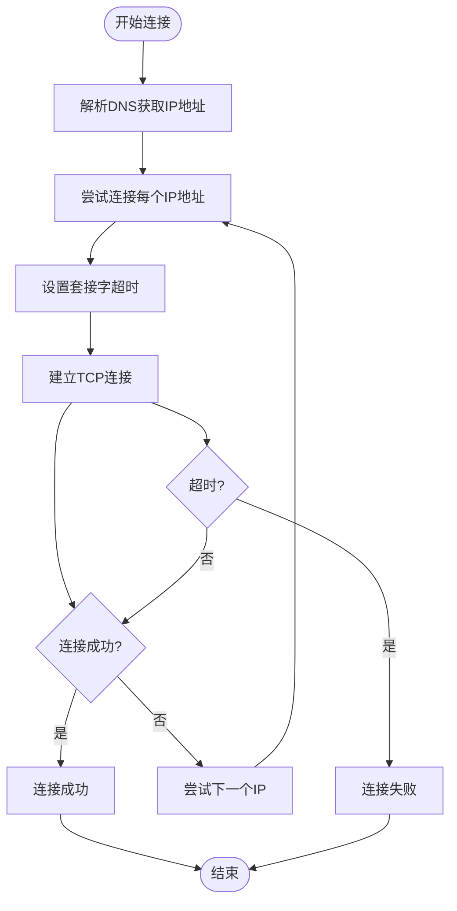
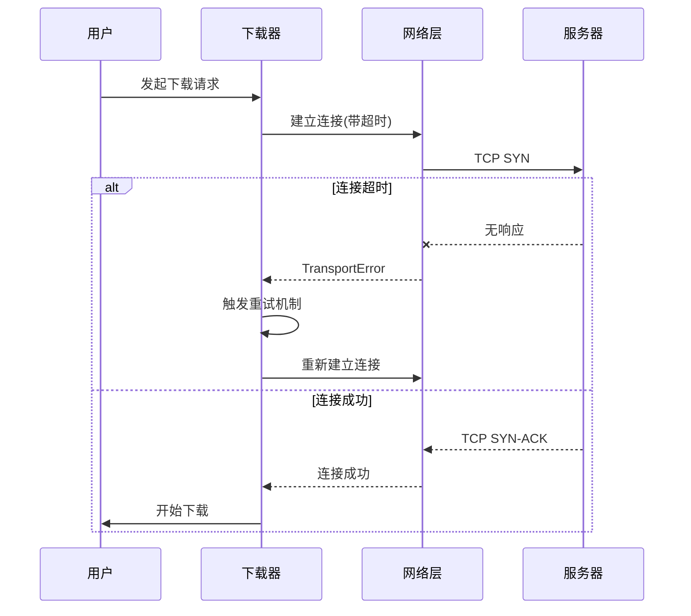

# 连接超时

<cite>
**本文档中引用的文件**   
- [options.py](file://yt_dlp/options.py#L571-L572)
- [YoutubeDL.py](file://yt_dlp/YoutubeDL.py#L365)
- [common.py](file://yt_dlp/networking/common.py#L206)
- [_helper.py](file://yt_dlp/networking/_helper.py#L205-L223)
- [test_networking.py](file://test/test_networking.py#L573-L601)
</cite>

## 目录
1. [连接超时配置详解](#连接超时配置详解)
2. [底层网络模块实现机制](#底层网络模块实现机制)
3. [超时异常捕获与重试逻辑](#超时异常捕获与重试逻辑)
4. [高延迟网络环境调优建议](#高延迟网络环境调优建议)

## 连接超时配置详解

`--socket-timeout` 参数用于控制建立TCP连接和读取数据的最长等待时间。该参数定义了在放弃连接前等待无响应主机的时间（以秒为单位）。当网络状况不稳定或目标服务器响应缓慢时，合理配置此参数可以有效平衡下载稳定性与响应速度。

默认情况下，连接超时时间为20秒。用户可以通过命令行参数 `--socket-timeout` 来覆盖默认值。该参数不仅影响连接建立阶段，还作用于数据读取过程。对于特定请求，可以通过请求扩展（extensions）中的 `timeout` 字段来覆盖全局超时设置，实现更精细的控制。

**Section sources**
- [options.py](file://yt_dlp/options.py#L571-L572)
- [YoutubeDL.py](file://yt_dlp/YoutubeDL.py#L365)

## 底层网络模块实现机制

连接超时机制在 `yt_dlp/networking` 模块中实现。核心功能由 `_socket_connect` 函数提供，该函数在创建套接字连接时会根据配置的超时值调用 `sock.settimeout(timeout)` 方法。如果超时值不是默认的全局超时值，则会应用自定义超时设置。

`create_connection` 函数负责处理地址解析和连接建立过程，它会遍历所有解析出的IP地址，尝试建立连接直到成功或全部失败。在SOCKS代理场景下，`create_socks_proxy_socket` 函数同样实现了超时控制机制。

请求处理框架通过 `RequestHandler` 类的 `_calculate_timeout` 方法计算实际使用的超时值，该方法优先使用请求扩展中的超时设置，若不存在则回退到处理器的默认超时值。

**Diagram sources **
- [_helper.py](file://yt_dlp/networking/_helper.py#L205-L223)
- [common.py](file://yt_dlp/networking/common.py#L206)

**Section sources**
- [_helper.py](file://yt_dlp/networking/_helper.py#L189-L231)
- [common.py](file://yt_dlp/networking/common.py#L206)

## 超时异常捕获与重试逻辑

当连接超时发生时，系统会抛出 `TransportError` 异常。该异常被捕获后会触发重试机制。测试代码显示，当设置极短的超时时间（如0.01秒）时，系统能够正确识别并处理连接超时情况。

重试机制由 `RetryManager` 类管理，支持配置重试次数和重试间隔策略。对于下载操作，可以通过 `--retries` 参数指定重试次数。重试间隔支持线性和指数增长模式，可以通过 `retry_sleep_functions` 参数进行配置。

异常处理框架使用 `wrap_request_errors` 装饰器来包装请求处理函数，确保所有请求异常都能被正确捕获和处理。对于超时等网络相关错误，系统会自动触发重试流程，直到达到最大重试次数或连接成功。

**Diagram sources **
- [test_networking.py](file://test/test_networking.py#L573-L601)
- [common.py](file://yt_dlp/networking/common.py#L206)

**Section sources**
- [test_networking.py](file://test/test_networking.py#L573-L601)
- [common.py](file://yt_dlp/networking/common.py#L206)

## 高延迟网络环境调优建议

针对高延迟网络环境，建议采取以下调优策略：

1. **动态调整超时阈值**：根据网络状况适当增加 `--socket-timeout` 的值。对于卫星连接或跨国网络，建议设置为30-60秒。

2. **协同使用重试选项**：结合 `--retries` 参数设置合理的重试次数（建议3-5次），以应对临时性网络中断。

3. **分层超时策略**：利用请求扩展机制，对关键请求（如认证、元数据获取）设置较短超时，对大文件下载设置较长超时。

4. **智能重试间隔**：配置指数退避重试策略，避免在网络拥塞时加剧问题。例如使用 `--retry-sleep http=exp:1:60` 设置指数增长的重试间隔。

5. **监控与诊断**：启用详细日志输出，分析超时发生的模式，识别是连接阶段还是数据传输阶段的问题。

通过合理配置超时和重试参数，可以在保证下载成功率的同时，避免因过度等待而影响整体效率。

**Section sources**
- [options.py](file://yt_dlp/options.py#L571-L572)
- [YoutubeDL.py](file://yt_dlp/YoutubeDL.py#L365)
- [common.py](file://yt_dlp/networking/common.py#L206)