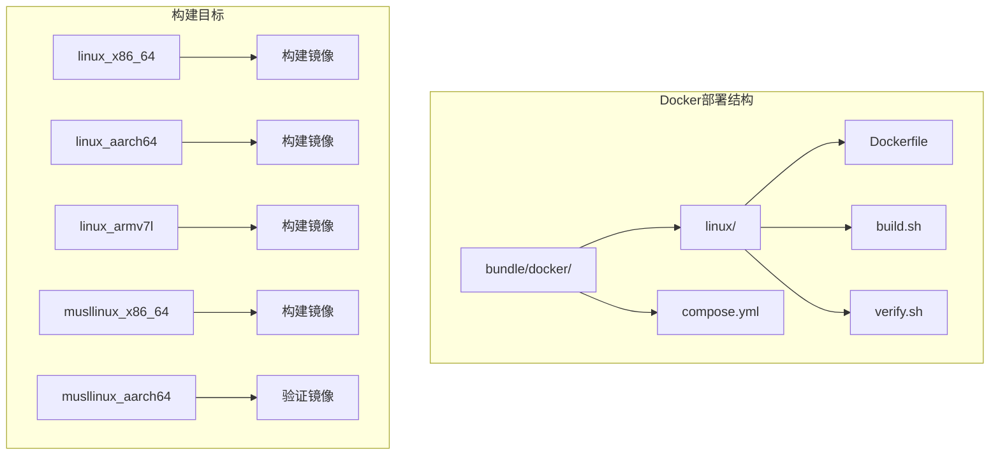
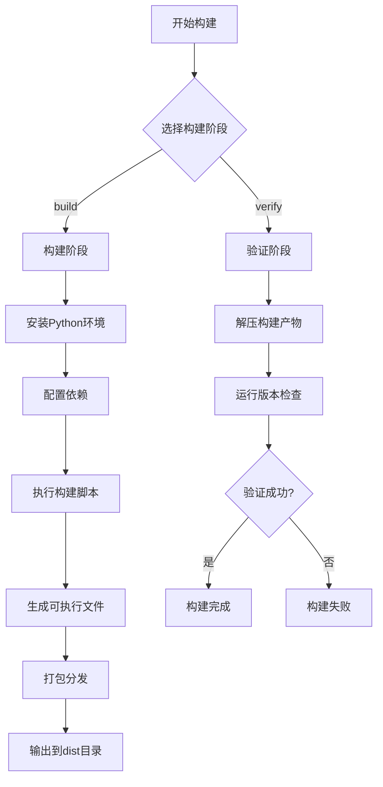
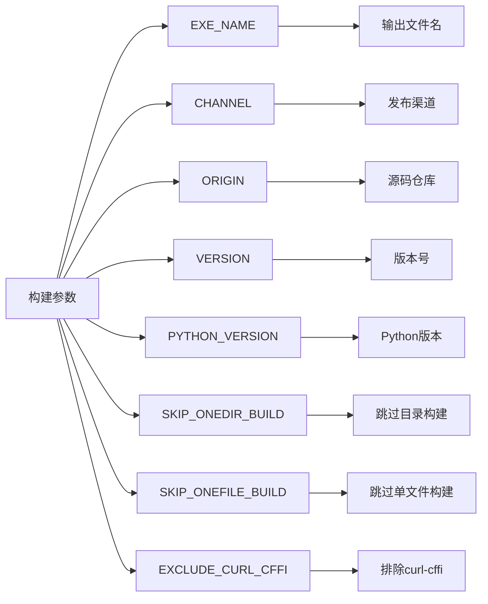
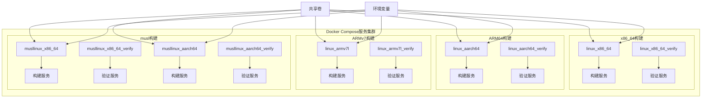
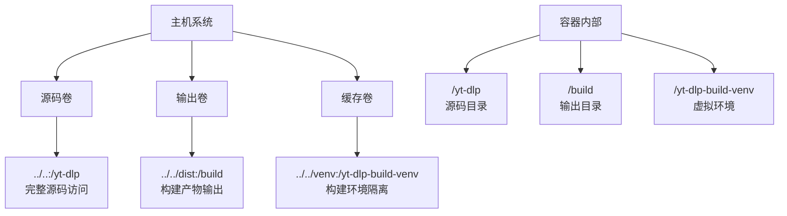
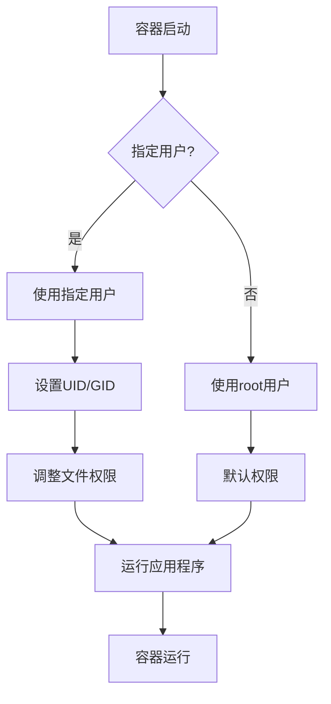
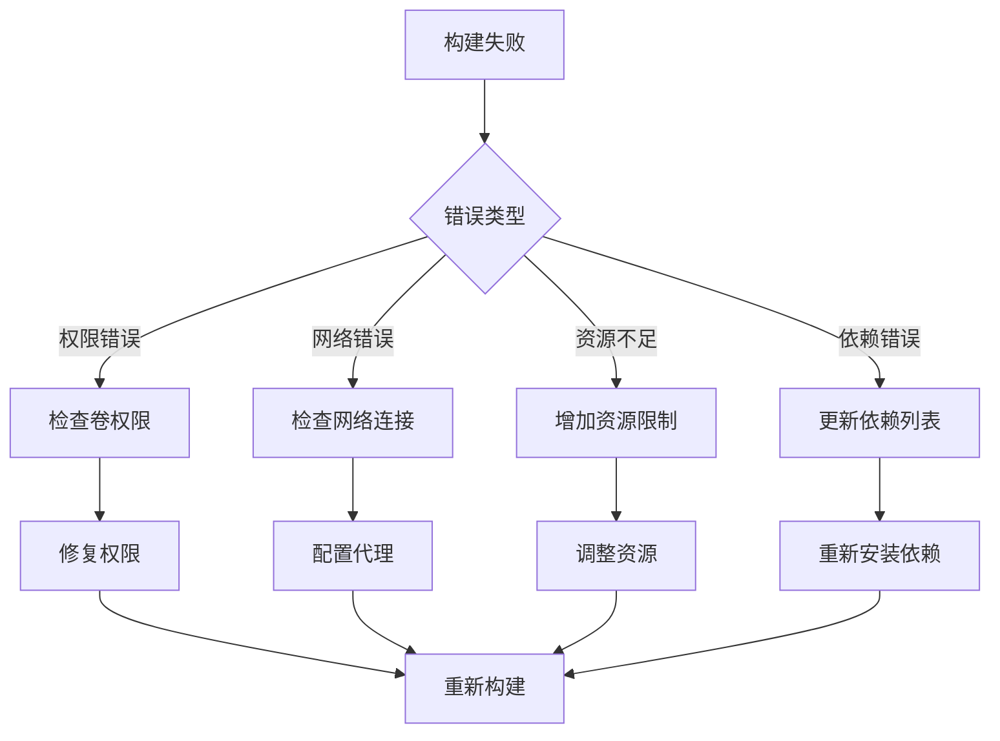

# Docker容器化部署

<cite>
**本文档中引用的文件**
- [Dockerfile](file://bundle/docker/linux/Dockerfile)
- [compose.yml](file://bundle/docker/compose.yml)
- [build.sh](file://bundle/docker/linux/build.sh)
- [verify.sh](file://bundle/docker/linux/verify.sh)
- [pyproject.toml](file://pyproject.toml)
- [Makefile](file://Makefile)
- [README.md](file://README.md)
</cite>

## 目录
1. [简介](#简介)
2. [项目结构概览](#项目结构概览)
3. [Docker镜像构建架构](#docker镜像构建架构)
4. [多阶段构建策略详解](#多阶段构建策略详解)
5. [Docker Compose服务配置](#docker-compose服务配置)
6. [环境变量配置](#环境变量配置)
7. [卷挂载和数据持久化](#卷挂载和数据持久化)
8. [网络配置](#网络配置)
9. [高级配置选项](#高级配置选项)
10. [部署实践指南](#部署实践指南)
11. [故障排除](#故障排除)
12. [最佳实践](#最佳实践)

## 简介

yt-dlp是一个功能丰富的命令行音频/视频下载器，支持数千个网站。该项目提供了完整的Docker容器化部署方案，通过多阶段构建策略确保构建的效率和安全性。本指南将详细介绍如何使用Docker部署yt-dlp，包括镜像构建、服务编排、配置管理和故障排除。

## 项目结构概览

yt-dlp的Docker部署相关文件主要位于`bundle/docker/`目录下：



**图表来源**
- [Dockerfile](file://bundle/docker/linux/Dockerfile#L1-L17)
- [compose.yml](file://bundle/docker/compose.yml#L1-L179)

**章节来源**
- [Dockerfile](file://bundle/docker/linux/Dockerfile#L1-L17)
- [compose.yml](file://bundle/docker/compose.yml#L1-L179)

## Docker镜像构建架构

### 多阶段构建设计

yt-dlp采用精心设计的多阶段构建架构，每个构建阶段都有明确的职责：



**图表来源**
- [build.sh](file://bundle/docker/linux/build.sh#L1-L49)
- [verify.sh](file://bundle/docker/linux/verify.sh#L1-L52)

### 构建阶段详解

#### 构建阶段（Build Stage）
构建阶段负责从源码编译生成可执行文件：

1. **Python环境准备**：默认使用Python 3.13，支持动态版本配置
2. **虚拟环境创建**：隔离构建依赖，避免污染系统环境
3. **依赖安装**：安装PyInstaller、curl-cffi等构建工具
4. **代码生成**：生成懒加载提取器优化启动性能
5. **版本更新**：根据渠道和版本参数更新版本信息
6. **二进制生成**：支持单文件和目录两种打包方式

#### 验证阶段（Verify Stage）
验证阶段确保构建产物的正确性和可用性：

1. **产物检查**：验证可执行文件的存在和完整性
2. **版本验证**：确认程序能够正常输出版本信息
3. **更新测试**：如果指定了更新目标，测试升级功能
4. **兼容性验证**：确保在不同环境中都能正常运行

**章节来源**
- [build.sh](file://bundle/docker/linux/build.sh#L1-L49)
- [verify.sh](file://bundle/docker/linux/verify.sh#L1-L52)

## 多阶段构建策略详解

### 基础镜像选择

yt-dlp根据不同平台和需求选择了专门的构建基础镜像：

| 平台架构 | 基础镜像 | 特点 |
|---------|---------|------|
| x86_64 (通用) | `ghcr.io/yt-dlp/manylinux2014_x86_64-shared:latest` | 支持广泛Linux发行版 |
| aarch64 (ARM64) | `ghcr.io/yt-dlp/manylinux2014_aarch64-shared:latest` | ARM64架构优化 |
| armv7l (ARMv7) | `ghcr.io/yt-dlp/manylinux_2_31_armv7l-shared:latest` | 32位ARM架构 |
| musllinux_x86_64 | `ghcr.io/yt-dlp/musllinux_1_2_x86_64-shared:latest` | musl libc环境 |
| musllinux_aarch64 | `ghcr.io/yt-dlp/musllinux_1_2_aarch64-shared:latest` | ARM64 musl环境 |

### 构建参数配置

构建过程中支持多种自定义参数：



**图表来源**
- [compose.yml](file://bundle/docker/compose.yml#L6-L15)

**章节来源**
- [compose.yml](file://bundle/docker/compose.yml#L1-L179)

## Docker Compose服务配置

### 服务架构图



**图表来源**
- [compose.yml](file://bundle/docker/compose.yml#L1-L179)

### 平台支持矩阵

| 服务名称 | 目标平台 | 基础镜像 | 特殊配置 |
|---------|---------|---------|---------|
| linux_x86_64 | linux/amd64 | manylinux2014_x86_64-shared | 标准构建 |
| linux_aarch64 | linux/arm64 | manylinux2014_aarch64-shared | ARM64优化 |
| linux_armv7l | linux/arm/v7 | manylinux_2_31_armv7l-shared | 32位ARM |
| musllinux_x86_64 | linux/amd64 | musllinux_1_2_x86_64-shared | musl libc |
| musllinux_aarch64 | linux/arm64 | musllinux_1_2_aarch64-shared | ARM64 musl |

### 卷挂载策略

不同服务采用不同的卷挂载策略：

1. **标准构建服务**：
   - 源码挂载：`../..:/yt-dlp`（完整源码访问）
   - 输出目录：`../../dist:/build`（构建产物）

2. **ARMv7服务**：
   - 额外虚拟环境挂载：`../../venv:/yt-dlp-build-venv`
   - 用于保持构建环境一致性

**章节来源**
- [compose.yml](file://bundle/docker/compose.yml#L1-L179)

## 环境变量配置

### 必需环境变量

| 变量名 | 描述 | 示例值 | 必需性 |
|-------|------|--------|--------|
| `EXE_NAME` | 输出可执行文件名 | `yt-dlp` | 必需 |
| `CHANNEL` | 发布渠道 | `stable`, `nightly`, `master` | 必需 |
| `ORIGIN` | 源码仓库地址 | `yt-dlp/yt-dlp` | 必需 |

### 可选环境变量

| 变量名 | 描述 | 默认值 | 用途 |
|-------|------|--------|------|
| `VERSION` | 版本号 | 自动检测 | 指定具体版本 |
| `PYTHON_VERSION` | Python版本 | `3.13` | 构建环境 |
| `SKIP_ONEDIR_BUILD` | 跳过目录构建 | 空 | 减少构建时间 |
| `SKIP_ONEFILE_BUILD` | 跳过单文件构建 | 空 | 减少构建时间 |
| `UPDATE_TO` | 更新目标版本 | 空 | 验证更新功能 |
| `EXCLUDE_CURL_CFFI` | 排除curl-cffi | 空 | 减小体积 |

### 环境变量使用示例

```bash
# 构建稳定版本
export EXE_NAME=yt-dlp
export CHANNEL=stable
export ORIGIN=yt-dlp/yt-dlp

# 构建特定版本
export VERSION=2024.01.01

# 跳过单文件构建
export SKIP_ONEFILE_BUILD=1

# 使用特定Python版本
export PYTHON_VERSION=3.12
```

**章节来源**
- [compose.yml](file://bundle/docker/compose.yml#L6-L15)

## 卷挂载和数据持久化

### 卷类型和用途



### 数据持久化策略

1. **源码持久化**：
   - 保持源码在宿主机的版本控制
   - 容器内只读访问源码
   - 支持热更新和增量构建

2. **构建产物持久化**：
   - 将构建结果保存到宿主机
   - 支持跨容器复用
   - 便于部署和分发

3. **构建环境隔离**：
   - 虚拟环境独立挂载
   - 避免不同构建间的依赖冲突
   - 提高构建稳定性

### 卷权限管理

```bash
# 设置适当的权限
sudo chown -R $USER:$USER ../../dist
sudo chmod -R 755 ../../dist

# 创建构建目录
mkdir -p ../../dist
mkdir -p ../../venv
```

**章节来源**
- [compose.yml](file://bundle/docker/compose/compose.yml#L18-L179)

## 网络配置

### 网络模式选择

yt-dlp的Docker部署采用以下网络配置策略：

1. **默认桥接网络**：
   - 适用于大多数构建场景
   - 提供基本的容器间通信
   - 支持外部网络访问

2. **主机网络模式**：
   - 适用于需要直接访问主机网络的服务
   - 减少网络层开销
   - 适合高性能要求的场景

3. **无网络模式**：
   - 适用于离线构建环境
   - 完全隔离网络访问
   - 增强安全性

### 端口映射策略

虽然yt-dlp本身不需要端口映射，但在某些部署场景中可能需要：

```yaml
ports:
  - "8080:8080"  # 如果需要Web界面
  - "9090:9090"  # 监控端口
```

### 网络安全配置

```yaml
networks:
  default:
    driver: bridge
    ipam:
      config:
        - subnet: 172.20.0.0/16
```

## 高级配置选项

### 用户权限配置



### 时区配置

```yaml
environment:
  - TZ=Asia/Shanghai
  - LANG=en_US.UTF-8
  - LC_ALL=en_US.UTF-8
```

### 资源限制

```yaml
deploy:
  resources:
    limits:
      cpus: '2.0'
      memory: 4G
    reservations:
      cpus: '1.0'
      memory: 2G
```

### 启动命令定制

```yaml
command: >
  sh -c "
  ln -sf /usr/share/zoneinfo/Asia/Shanghai /etc/localtime &&
  echo 'Asia/Shanghai' > /etc/timezone &&
  yt-dlp --version
  "
```

## 部署实践指南

### 快速部署步骤

1. **准备工作**：
```bash
# 克隆项目
git clone https://github.com/yt-dlp/yt-dlp.git
cd yt-dlp

# 设置环境变量
export EXE_NAME=yt-dlp
export CHANNEL=stable
export ORIGIN=yt-dlp/yt-dlp
```

2. **构建镜像**：
```bash
# 构建所有平台
docker-compose -f bundle/docker/compose.yml build

# 或者构建特定平台
docker-compose -f bundle/docker/compose.yml build linux_x86_64
```

3. **验证构建**：
```bash
# 运行验证服务
docker-compose -f bundle/docker/compose.yml run --rm linux_x86_64_verify
```

4. **部署服务**：
```bash
# 后台运行
docker-compose -f bundle/docker/compose.yml up -d

# 查看日志
docker-compose -f bundle/docker/compose.yml logs -f
```

### 自定义镜像构建

#### 创建自定义Dockerfile

```dockerfile
# 基于官方镜像
FROM ghcr.io/yt-dlp/manylinux2014_x86_64-shared:latest

# 安装额外依赖
RUN yum install -y ffmpeg-devel && \
    pip install --no-cache-dir yt-dlp[default,curl-cffi]

# 复制配置文件
COPY config/ /app/config/

# 设置工作目录
WORKDIR /app

# 启动命令
CMD ["yt-dlp", "--version"]
```

#### 扩展构建脚本

```bash
#!/bin/bash
# 自定义构建脚本

# 安装额外模块
pip install yt-dlp[default,curl-cffi,secretstorage]

# 复制配置文件
cp -r config/* /yt-dlp/

# 生成自定义版本
python -m devscripts.update_version --channel custom --origin myrepo

# 执行标准构建
./build.sh
```

### 生产环境部署

#### 容器编排配置

```yaml
version: '3.8'

services:
  yt-dlp:
    image: yt-dlp:${VERSION:-latest}
    environment:
      - EXE_NAME=${EXE_NAME:-yt-dlp}
      - CHANNEL=${CHANNEL:-stable}
      - ORIGIN=${ORIGIN:-yt-dlp/yt-dlp}
      - TZ=Asia/Shanghai
    volumes:
      - ./downloads:/downloads
      - ./config:/config
      - ./logs:/logs
    networks:
      - yt-dlp-network
    deploy:
      resources:
        limits:
          cpus: '2'
          memory: 4G
        reservations:
          cpus: '1'
          memory: 2G
    restart: unless-stopped

networks:
  yt-dlp-network:
    driver: bridge
    ipam:
      config:
        - subnet: 172.20.0.0/16
```

#### 监控和日志配置

```yaml
services:
  yt-dlp:
    logging:
      driver: "json-file"
      options:
        max-size: "10m"
        max-file: "3"
    healthcheck:
      test: ["CMD", "yt-dlp", "--version"]
      interval: 30s
      timeout: 10s
      retries: 3
      start_period: 40s
```

**章节来源**
- [compose.yml](file://bundle/docker/compose.yml#L1-L179)

## 故障排除

### 常见问题诊断

#### 构建失败问题



#### 权限问题排查

1. **检查卷权限**：
```bash
# 检查卷权限
ls -la ../../dist
ls -la ../../venv

# 修复权限
sudo chown -R $USER:$USER ../../dist ../../venv
```

2. **容器用户权限**：
```bash
# 检查容器内用户
docker exec -it <container_id> whoami
docker exec -it <container_id> id

# 切换用户运行
docker exec -it <container_id> su - appuser
```

#### 网络连接问题

1. **DNS解析问题**：
```bash
# 测试DNS解析
docker exec -it <container_id> nslookup github.com

# 检查DNS配置
docker exec -it <container_id> cat /etc/resolv.conf
```

2. **代理配置**：
```yaml
environment:
  - HTTP_PROXY=http://proxy.company.com:8080
  - HTTPS_PROXY=http://proxy.company.com:8080
  - NO_PROXY=localhost,127.0.0.1,.local
```

### 性能优化

#### 构建性能优化

1. **并行构建**：
```bash
# 使用多个CPU核心
docker-compose build --parallel

# 限制并发数
DOCKER_BUILDKIT=1 docker build --parallel=4 .
```

2. **缓存优化**：
```dockerfile
# 利用Docker缓存
COPY requirements.txt .
RUN pip install -r requirements.txt

COPY . .
```

#### 运行时性能优化

1. **内存优化**：
```yaml
deploy:
  resources:
    limits:
      memory: 2G
    reservations:
      memory: 512M
```

2. **CPU优化**：
```yaml
cpuset: "0-3"  # 固定CPU核心
cpu_quota: 100000  # CPU配额
cpu_period: 100000
```

### 日志分析

#### 容器日志查看

```bash
# 实时查看日志
docker-compose logs -f yt-dlp

# 查看特定服务日志
docker-compose logs yt-dlp

# 导出日志到文件
docker-compose logs > yt-dlp.log 2>&1
```

#### 错误日志分析

```bash
# 分析错误模式
grep -i error yt-dlp.log | tail -20

# 统计错误类型
grep -i error yt-dlp.log | awk '{print $NF}' | sort | uniq -c

# 查看最近的错误
tail -100 yt-dlp.log | grep -i error
```

**章节来源**
- [build.sh](file://bundle/docker/linux/build.sh#L1-L49)
- [verify.sh](file://bundle/docker/linux/verify.sh#L1-L52)

## 最佳实践

### 安全最佳实践

1. **最小权限原则**：
```yaml
# 使用非root用户
user: 1000:1000

# 只读卷挂载
volumes:
  - ./config:/config:ro
  - ./downloads:/downloads:rw
```

2. **镜像安全扫描**：
```bash
# 扫描镜像漏洞
docker scan yt-dlp:latest

# 使用安全基线镜像
FROM alpine:3.18
```

3. **敏感信息保护**：
```yaml
environment:
  # 使用环境变量文件
  env_file:
    - .env.production
  
  # 不要在命令中硬编码密码
  - API_KEY_FILE=/config/api_key.txt
```

### 监控和维护

1. **健康检查**：
```yaml
healthcheck:
  test: ["CMD", "yt-dlp", "--version"]
  interval: 30s
  timeout: 10s
  retries: 3
  start_period: 40s
```

2. **资源监控**：
```bash
# 监控容器资源使用
docker stats

# 监控磁盘使用
docker system df

# 监控日志大小
du -sh /var/lib/docker/containers/*
```

3. **定期维护**：
```bash
# 清理未使用的资源
docker system prune -f

# 清理构建缓存
docker builder prune -f

# 清理停止的容器
docker container prune -f
```

### 扩展性考虑

1. **水平扩展**：
```yaml
services:
  yt-dlp:
    deploy:
      replicas: 3
      placement:
        constraints:
          - node.role == worker
```

2. **负载均衡**：
```yaml
services:
  nginx:
    image: nginx:alpine
    ports:
      - "80:80"
    volumes:
      - ./nginx.conf:/etc/nginx/nginx.conf
    depends_on:
      - yt-dlp-1
      - yt-dlp-2
      - yt-dlp-3
```

3. **存储扩展**：
```yaml
volumes:
  downloads:
    driver: nfs
    driver_opts:
      share: "192.168.1.100:/exports/downloads"
```

### 文档和培训

1. **操作手册**：
   - 编写详细的部署文档
   - 记录常见问题解决方案
   - 提供故障排除指南

2. **团队培训**：
   - Docker基础知识培训
   - yt-dlp使用培训
   - 容器运维技能培训

3. **自动化文档**：
```bash
#!/bin/bash
# 自动生成部署文档
cat << EOF > DEPLOYMENT.md
# yt-dlp Docker部署

## 部署步骤

1. 准备环境...
2. 配置参数...
3. 启动服务...

## 监控指标

- CPU使用率
- 内存使用率
- 磁盘空间
- 网络带宽

## 故障排除

- 检查容器状态
- 查看日志文件
- 验证网络连接
EOF
```

通过遵循这些最佳实践，可以确保yt-dlp的Docker部署既安全又高效，同时具备良好的可维护性和扩展性。