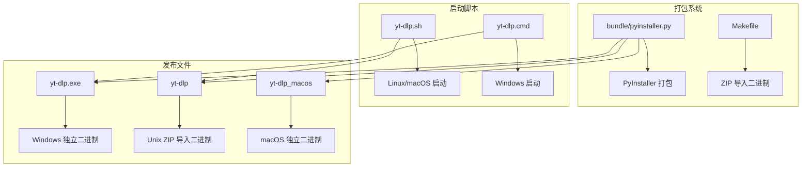
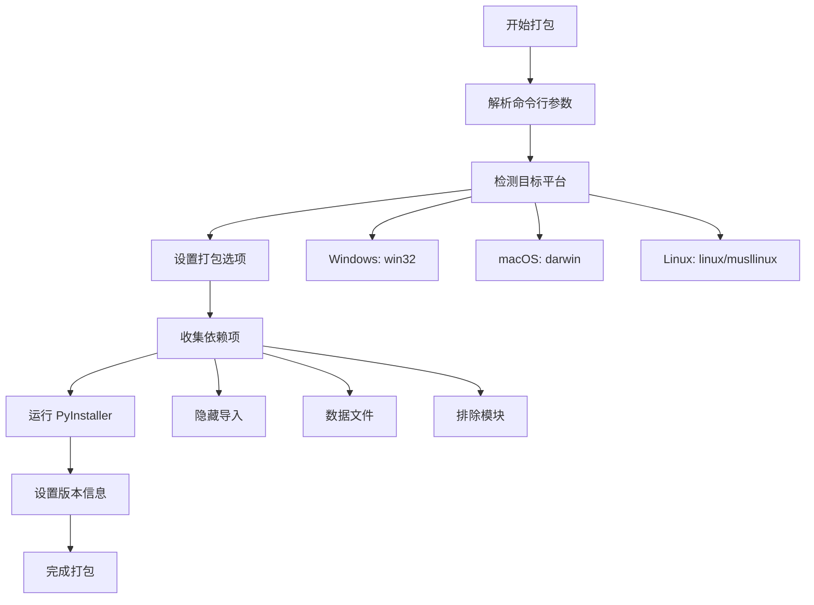
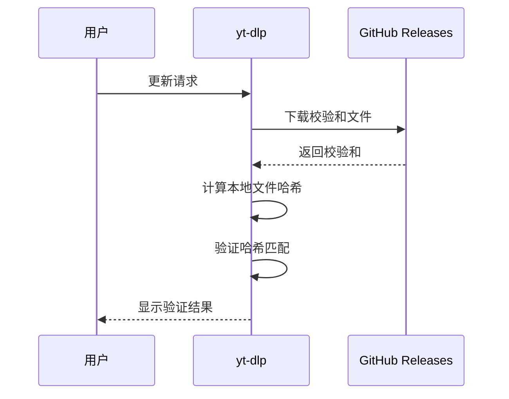

# 可执行文件安装指南

<cite>
**本文档中引用的文件**
- [bundle/pyinstaller.py](file://bundle/pyinstaller.py)
- [yt-dlp.sh](file://yt-dlp.sh)
- [yt-dlp.cmd](file://yt-dlp.cmd)
- [README.md](file://README.md)
- [Makefile](file://Makefile)
- [yt_dlp/__pyinstaller/hook-yt_dlp.py](file://yt_dlp/__pyinstaller/hook-yt_dlp.py)
- [yt_dlp/update.py](file://yt_dlp/update.py)
- [THIRD_PARTY_LICENSES.txt](file://THIRD_PARTY_LICENSES.txt)
</cite>

## 目录
1. [简介](#简介)
2. [项目结构概览](#项目结构概览)
3. [打包系统架构](#打包系统架构)
4. [启动脚本详解](#启动脚本详解)
5. [预编译二进制文件安装](#预编译二进制文件安装)
6. [手动构建可执行文件](#手动构建可执行文件)
7. [文件完整性验证](#文件完整性验证)
8. [系统路径配置](#系统路径配置)
9. [常见问题解决](#常见问题解决)
10. [总结](#总结)

## 简介

yt-dlp 提供了多种安装方式，包括预编译的独立可执行文件、源码安装和包管理器安装。本指南详细介绍了如何在不同操作系统上安装和使用这些可执行文件，包括直接下载预编译版本、手动构建以及验证文件完整性的完整流程。

## 项目结构概览

yt-dlp 的可执行文件安装系统采用模块化设计，主要组件包括：



**图表来源**
- [bundle/pyinstaller.py](file://bundle/pyinstaller.py#L1-L143)
- [Makefile](file://Makefile#L1-L175)
- [yt-dlp.sh](file://yt-dlp.sh#L1-L3)
- [yt-dlp.cmd](file://yt-dlp.cmd#L1-L2)

**章节来源**
- [bundle/pyinstaller.py](file://bundle/pyinstaller.py#L1-L143)
- [Makefile](file://Makefile#L1-L175)

## 打包系统架构

### PyInstaller 打包流程

yt-dlp 使用 PyInstaller 创建跨平台的独立可执行文件。打包过程包含以下关键步骤：



**图表来源**
- [bundle/pyinstaller.py](file://bundle/pyinstaller.py#L20-L87)

### 平台特定配置

打包系统支持多种平台和架构：

| 平台 | 架构 | 文件扩展名 | 特殊处理 |
|------|------|------------|----------|
| Windows | x86/x64 | .exe | 版本信息设置 |
| macOS | Universal | 无 | 通用二进制文件 |
| Linux | x86_64 | 无 | glibc/musl 支持 |
| Linux | aarch64 | 无 | ARM64 支持 |

**章节来源**
- [bundle/pyinstaller.py](file://bundle/pyinstaller.py#L58-L75)

## 启动脚本详解

### Linux/macOS 启动脚本 (yt-dlp.sh)

yt-dlp.sh 是为 Unix 系统设计的启动脚本，提供 Python 解释器调用机制：

```bash
#!/usr/bin/env sh
exec "${PYTHON:-python3}" -Werror -Xdev "$(dirname "$(realpath "$0")")/yt_dlp/__main__.py" "$@"
```

**功能特性：**
- 自动检测 Python 解释器
- 设置错误警告级别
- 启用开发模式
- 调用主入口模块

### Windows 启动脚本 (yt-dlp.cmd)

yt-dlp.cmd 为 Windows 系统提供批处理启动支持：

```batch
@py -Werror -Xdev "%~dp0yt_dlp\__main__.py" %*
```

**功能特性：**
- 使用 Python 启动器
- 设置错误警告级别
- 处理路径参数
- 传递命令行参数

**章节来源**
- [yt-dlp.sh](file://yt-dlp.sh#L1-L3)
- [yt-dlp.cmd](file://yt-dlp.cmd#L1-L2)

## 预编译二进制文件安装

### 推荐安装方式

根据平台选择最适合的预编译二进制文件：

| 平台 | 推荐文件 | 描述 |
|------|----------|------|
| Windows | yt-dlp.exe | Windows 8+ 独立 x64 二进制文件 |
| Linux/BSD | yt-dlp | 平台无关的 ZIP 导入二进制文件 |
| macOS | yt-dlp_macos | macOS 10.15+ 通用可执行文件 |

### 安装步骤

#### Windows 系统

1. **下载文件**
   ```powershell
   Invoke-WebRequest -Uri "https://github.com/yt-dlp/yt-dlp/releases/latest/download/yt-dlp.exe" -OutFile "yt-dlp.exe"
   ```

2. **移动到合适位置**
   ```powershell
   Move-Item "yt-dlp.exe" "$env:USERPROFILE\AppData\Local\Microsoft\WindowsApps\yt-dlp.exe"
   ```

3. **验证安装**
   ```powershell
   yt-dlp --version
   ```

#### Linux 系统

1. **下载文件**
   ```bash
   curl -L "https://github.com/yt-dlp/yt-dlp/releases/latest/download/yt-dlp" -o "yt-dlp"
   ```

2. **设置执行权限**
   ```bash
   chmod +x yt-dlp
   ```

3. **移动到系统路径**
   ```bash
   sudo mv yt-dlp /usr/local/bin/
   ```

#### macOS 系统

1. **下载文件**
   ```bash
   curl -L "https://github.com/yt-dlp/yt-dlp/releases/latest/download/yt-dlp_macos" -o "yt-dlp_macos"
   ```

2. **设置执行权限**
   ```bash
   chmod +x yt-dlp_macos
   ```

3. **移动到应用目录**
   ```bash
   sudo mv yt-dlp_macos /usr/local/bin/yt-dlp
   ```

**章节来源**
- [README.md](file://README.md#L123-L153)

## 手动构建可执行文件

### 前置条件

构建独立可执行文件需要以下环境：

- Python 3.10+ (CPython 或 PyPy)
- PyInstaller (通过安装依赖脚本自动安装)
- 必要的系统工具

### 构建步骤

#### 方法一：使用打包脚本

```bash
# 安装依赖
python3 devscripts/install_deps.py --include pyinstaller

# 生成延迟加载提取器
python3 devscripts/make_lazy_extractors.py

# 运行打包脚本
python3 -m bundle.pyinstaller
```

#### 方法二：使用 Makefile

```bash
# 安装所有依赖
make

# 或仅构建二进制文件
make yt-dlp
```

### 构建选项

打包脚本支持多种 PyInstaller 参数：

```bash
# 单文件模式（默认）
python3 -m bundle.pyinstaller --onefile

# 目录模式
python3 -m bundle.pyinstaller --onedir

# 指定位数
python3 -m bundle.pyinstaller 64  # 64位
python3 -m bundle.pyinstaller 32  # 32位
```

**章节来源**
- [README.md](file://README.md#L253-L279)
- [Makefile](file://Makefile#L100-L120)

## 文件完整性验证

### SHA2 哈希验证

yt-dlp 提供 SHA2-256 和 SHA2-512 校验和用于验证文件完整性：

#### 验证步骤

1. **下载校验和文件**
   ```bash
   # 下载 SHA2-256 校验和
   curl -L "https://github.com/yt-dlp/yt-dlp/releases/latest/download/SHA2-256SUMS" -o "SHA2-256SUMS"
   
   # 下载 SHA2-512 校验和
   curl -L "https://github.com/yt-dlp/yt-dlp/releases/latest/download/SHA2-512SUMS" -o "SHA2-512SUMS"
   ```

2. **验证文件哈希**
   ```bash
   # Linux/macOS
   sha256sum -c SHA2-256SUMS
   sha512sum -c SHA2-512SUMS
   
   # Windows (PowerShell)
   Get-FileHash -Algorithm SHA256 yt-dlp.exe | Select-Object Hash
   ```

### GPG 签名验证

使用官方公钥验证校验和文件的签名：

```bash
# 导入公钥
curl -L https://github.com/yt-dlp/yt-dlp/raw/master/public.key | gpg --import

# 验证签名
gpg --verify SHA2-256SUMS.sig SHA2-256SUMS
gpg --verify SHA2-512SUMS.sig SHA2-512SUMS
```

### 自动更新验证

yt-dlp 内置了自动验证机制：



**图表来源**
- [yt_dlp/update.py](file://yt_dlp/update.py#L436-L458)

**章节来源**
- [README.md](file://README.md#L123-L153)
- [yt_dlp/update.py](file://yt_dlp/update.py#L436-L458)

## 系统路径配置

### 添加到系统 PATH

#### Windows 系统

1. **临时添加到 PATH**
   ```powershell
   $env:PATH = "$env:USERPROFILE\AppData\Local\Microsoft\WindowsApps;$env:PATH"
   ```

2. **永久添加到 PATH**
   ```powershell
   [Environment]::SetEnvironmentVariable("PATH", "$env:USERPROFILE\AppData\Local\Microsoft\WindowsApps;$env:PATH", "User")
   ```

3. **验证配置**
   ```powershell
   $env:PATH -split ';' | Where-Object { $_ -like "*yt-dlp*" }
   ```

#### Linux/macOS 系统

1. **编辑 shell 配置文件**
   ```bash
   # Bash
   echo 'export PATH="/usr/local/bin:$PATH"' >> ~/.bashrc
   
   # Zsh
   echo 'export PATH="/usr/local/bin:$PATH"' >> ~/.zshrc
   
   # Fish
   echo 'set -gx PATH /usr/local/bin $PATH' >> ~/.config/fish/config.fish
   ```

2. **使配置生效**
   ```bash
   source ~/.bashrc  # 或对应 shell 的配置文件
   ```

### 权限配置

确保可执行文件具有正确的权限：

```bash
# Linux/macOS
sudo chmod +x /usr/local/bin/yt-dlp

# Windows (PowerShell)
Get-Acl "C:\Program Files\yt-dlp\yt-dlp.exe" | Set-Acl "C:\Program Files\yt-dlp\yt-dlp.exe"
```

**章节来源**
- [yt_dlp/utils/_utils.py](file://yt_dlp/utils/_utils.py#L2120-L2149)

## 常见问题解决

### 执行权限问题

#### Windows 权限问题

**问题症状：**
- "无法访问文件"错误
- "拒绝访问"提示

**解决方案：**
```powershell
# 以管理员身份运行 PowerShell
Start-Process powershell -Verb RunAs

# 设置执行策略
Set-ExecutionPolicy -ExecutionPolicy RemoteSigned -Scope CurrentUser

# 或者修改文件权限
icacls "yt-dlp.exe" /grant Everyone:F
```

#### Linux/macOS 权限问题

**问题症状：**
- "Permission denied" 错误
- "Operation not permitted" 提示

**解决方案：**
```bash
# 检查当前权限
ls -la yt-dlp

# 添加执行权限
chmod +x yt-dlp

# 如果需要，修复所有权
sudo chown root:root yt-dlp
sudo chmod 755 yt-dlp
```

### 依赖缺失问题

#### FFmpeg 缺失

**问题症状：**
- "ffmpeg not found" 错误
- 合并视频音频失败

**解决方案：**
```bash
# Windows (使用 Chocolatey)
choco install ffmpeg

# Linux (Ubuntu/Debian)
sudo apt update && sudo apt install ffmpeg

# macOS (使用 Homebrew)
brew install ffmpeg
```

#### Python 依赖问题

**问题症状：**
- "ModuleNotFoundError" 错误
- 功能不正常

**解决方案：**
```bash
# 检查 Python 版本
python --version

# 更新 pip
python -m pip install --upgrade pip

# 安装必需的依赖
python -m pip install yt-dlp[default]
```

### 网络连接问题

#### 防火墙阻止

**解决方案：**
```bash
# Windows 防火墙规则
New-NetFirewallRule -DisplayName "yt-dlp" -Direction Outbound -Program "C:\path\to\yt-dlp.exe" -Action Allow

# Linux iptables 规则
iptables -A OUTPUT -p tcp --dport 443 -m owner --uid-owner $(id -u) -j ACCEPT
```

#### 代理配置

**解决方案：**
```bash
# 设置 HTTP 代理
export HTTP_PROXY=http://proxy.example.com:8080
export HTTPS_PROXY=http://proxy.example.com:8080

# 或在 yt-dlp 中使用
yt-dlp --proxy http://proxy.example.com:8080 <URL>
```

### 版本兼容性问题

#### Python 版本要求

yt-dlp 需要 Python 3.10+：

```bash
# 检查 Python 版本
python --version

# 如果版本过低，升级 Python
# Windows: 下载最新版本安装
# Linux: 使用包管理器升级
sudo apt install python3.10
# 或从源码编译
```

#### 平台架构兼容性

确保下载与系统架构匹配的版本：

```bash
# 检查系统架构
uname -m  # Linux/macOS
wmic os get osarchitecture  # Windows

# 选择合适的二进制文件
# x86_64: 标准桌面/服务器
# aarch64: ARM64 设备
# x86: 32位系统
```

**章节来源**
- [yt_dlp/update.py](file://yt_dlp/update.py#L500-L599)

## 总结

本指南详细介绍了 yt-dlp 可执行文件的各种安装方式和配置方法。主要要点包括：

1. **多平台支持**：支持 Windows、Linux、macOS 等主流操作系统
2. **多种安装方式**：预编译二进制文件、源码安装、包管理器安装
3. **安全验证**：提供 SHA2 哈希和 GPG 签名验证机制
4. **灵活配置**：支持系统路径配置和环境变量设置
5. **问题诊断**：提供常见问题的解决方案和故障排除指导

通过遵循本指南，用户可以在各种环境中成功安装和配置 yt-dlp，享受其强大的媒体下载功能。定期检查更新并验证文件完整性是确保软件安全使用的必要步骤。