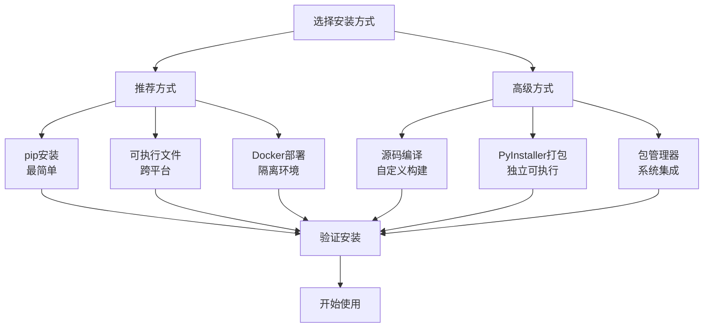
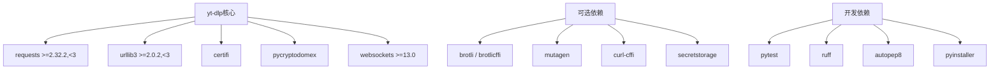
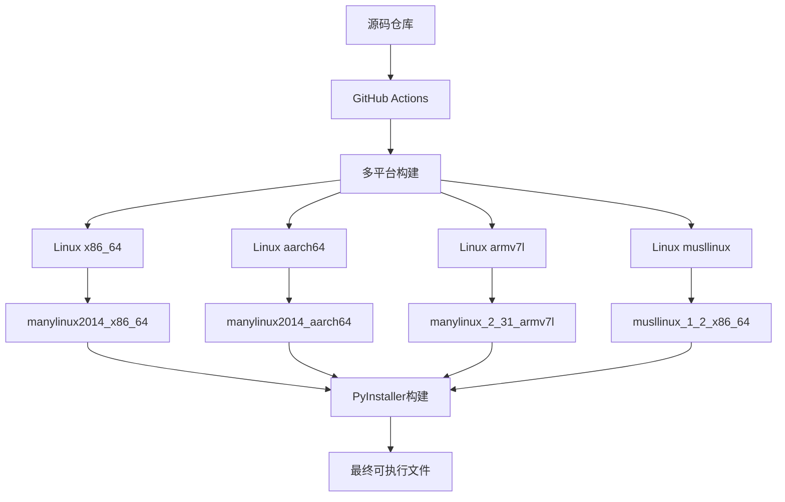

# 安装指南

<cite>
**本文档中引用的文件**
- [pyproject.toml](file://pyproject.toml)
- [README.md](file://README.md)
- [bundle/docker/compose.yml](file://bundle/docker/compose.yml)
- [bundle/pyinstaller.py](file://bundle/pyinstaller.py)
- [bundle/docker/linux/Dockerfile](file://bundle/docker/linux/Dockerfile)
- [bundle/docker/linux/build.sh](file://bundle/docker/linux/build.sh)
- [bundle/docker/linux/verify.sh](file://bundle/docker/linux/verify.sh)
- [yt-dlp.sh](file://yt-dlp.sh)
- [yt-dlp.cmd](file://yt-dlp.cmd)
- [devscripts/install_deps.py](file://devscripts/install_deps.py)
- [CONTRIBUTING.md](file://CONTRIBUTING.md)
</cite>

## 目录
1. [简介](#简介)
2. [系统要求](#系统要求)
3. [安装方式概览](#安装方式概览)
4. [通过pip安装](#通过pip安装)
5. [可执行文件安装](#可执行文件安装)
6. [Docker容器化部署](#docker容器化部署)
7. [Windows命令脚本安装](#windows命令脚本安装)
8. [源码编译安装](#源码编译安装)
9. [依赖关系详解](#依赖关系详解)
10. [常见问题解决](#常见问题解决)
11. [自动化构建机制](#自动化构建机制)
12. [高级部署选项](#高级部署选项)

## 简介

yt-dlp是一个功能丰富的命令行音频/视频下载器，支持数千个网站。本指南提供了多种安装方式，从简单的pip安装到复杂的容器化部署，满足不同用户的需求。

## 系统要求

### 基础要求
- **Python版本**: 3.10+ (CPython) 或 3.11+ (PyPy)
- **操作系统**: Windows 8+, Linux (glibc 2.17+), macOS 10.15+
- **内存**: 至少512MB可用内存
- **磁盘空间**: 最小100MB用于安装，根据下载需求可能需要更多

### 推荐依赖
- **ffmpeg和ffprobe**: 必需用于合并音视频文件和后处理任务
- **网络连接**: 用于下载和更新程序

**章节来源**
- [pyproject.toml](file://pyproject.toml#L18-L20)
- [README.md](file://README.md#L200-L250)

## 安装方式概览



## 通过pip安装

pip是安装yt-dlp最简单和推荐的方式，适用于大多数用户。

### 基础pip安装

```bash
# 安装最新稳定版
python3 -m pip install -U yt-dlp

# 用户级别安装（无需管理员权限）
python3 -m pip install --user -U yt-dlp

# 开发版本安装
python3 -m pip install -U --pre "yt-dlp[default]"
```

### 带可选依赖的安装

```bash
# 包含所有默认依赖
python3 -m pip install -U "yt-dlp[default]"

# 包含curl-cffi浏览器模拟功能
python3 -m pip install -U "yt-dlp[default,curl-cffi]"

# 包含密钥环支持
python3 -m pip install -U "yt-dlp[default,secretstorage]"
```

### 验证安装

```bash
# 检查版本
yt-dlp --version

# 测试基本功能
yt-dlp --list-extractors | head -10

# 更新检查
yt-dlp -U
```

### pip安装的优势
- 自动处理依赖关系
- 支持虚拟环境
- 易于升级和卸载
- 跨平台兼容

**章节来源**
- [pyproject.toml](file://pyproject.toml#L40-L60)
- [devscripts/install_deps.py](file://devscripts/install_deps.py#L1-L82)

## 可执行文件安装

可执行文件安装是最简单的方式，适合不想安装Python的用户。

### 下载预编译二进制文件

访问 [GitHub发布页面](https://github.com/yt-dlp/yt-dlp/releases) 获取最新的可执行文件：

#### 推荐文件
- **yt-dlp**: 平台无关的zipimport二进制文件（推荐Linux/BSD）
- **yt-dlp.exe**: Windows (Win8+) 独立x64二进制文件（推荐Windows）
- **yt-dlp_macos**: Universal macOS (10.15+) 独立可执行文件（推荐macOS）

#### 其他选项
- **yt-dlp_linux**: Linux (glibc 2.17+) 独立x86_64二进制文件
- **yt-dlp_linux_aarch64**: Linux (glibc 2.17+) 独立aarch64二进制文件
- **yt-dlp_musllinux**: Linux (musl 1.2+) 独立x86_64二进制文件

### 安装步骤

#### Linux/macOS
```bash
# 下载并设置权限
wget https://github.com/yt-dlp/yt-dlp/releases/latest/download/yt-dlp -O yt-dlp
chmod +x yt-dlp

# 移动到系统路径
sudo mv yt-dlp /usr/local/bin/

# 或者移动到用户目录
mv yt-dlp ~/.local/bin/
```

#### Windows
1. 下载 `yt-dlp.exe`
2. 将文件放置在系统PATH中的某个目录
3. 在命令提示符中测试：`yt-dlp --version`

### 自动更新机制

```bash
# 使用内置更新功能
yt-dlp -U

# 切换到夜间版本
yt-dlp --update-to nightly

# 升级到特定版本
yt-dlp --update-to stable@2023.07.06
```

**章节来源**
- [README.md](file://README.md#L100-L150)

## Docker容器化部署

Docker部署提供了完全隔离的运行环境，适合服务器部署和批量处理。

### 基础Docker使用

```bash
# 拉取官方镜像
docker pull ytldlp/yt-dlp

# 运行基本下载
docker run --rm -v "$(pwd):/downloads" ytldlp/yt-dlp \
    https://www.youtube.com/watch?v=dQw4w9WgXcQ

# 交互式会话
docker run --rm -it ytldlp/yt-dlp --version
```

### 数据卷挂载

```bash
# 挂载下载目录
docker run --rm -v "/host/downloads:/downloads" ytldlp/yt-dlp URL

# 挂载配置文件
docker run --rm -v "/host/config:/config" ytldlp/yt-dlp URL

# 挂载多个目录
docker run --rm \
    -v "/host/downloads:/downloads" \
    -v "/host/config:/config" \
    -v "/host/cache:/cache" \
    ytldlp/yt-dlp URL
```

### Docker Compose部署

创建 `docker-compose.yml` 文件：

```yaml
version: '3.8'
services:
  yt-dlp:
    image: ytldlp/yt-dlp
    container_name: yt-dlp
    volumes:
      - ./downloads:/downloads
      - ./config:/config
    environment:
      - TZ=Asia/Shanghai
    restart: unless-stopped
    networks:
      - media
    command: >
      --config-location /config/yt-dlp.conf
      --output "/downloads/%(title)s.%(ext)s"
      --retries 10
      --merge-output-format mp4
```

### 自定义Docker镜像

```dockerfile
FROM ytldlp/yt-dlp:latest

# 添加自定义配置
COPY yt-dlp.conf /config/

# 创建启动脚本
COPY entrypoint.sh /entrypoint.sh
RUN chmod +x /entrypoint.sh

ENTRYPOINT ["/entrypoint.sh"]
```

### 生产环境部署考虑

```bash
# 使用非root用户
docker run --user $(id -u):$(id -g) \
    -v "$(pwd):/downloads" \
    ytldlp/yt-dlp URL

# 内存限制
docker run --memory=512m \
    -v "$(pwd):/downloads" \
    ytldlp/yt-dlp URL

# CPU限制
docker run --cpus=2 \
    -v "$(pwd):/downloads" \
    ytldlp/yt-dlp URL
```

**章节来源**
- [bundle/docker/compose.yml](file://bundle/docker/compose.yml#L1-L179)
- [bundle/docker/linux/Dockerfile](file://bundle/docker/linux/Dockerfile#L1-L17)

## Windows命令脚本安装

Windows用户可以使用提供的批处理脚本来简化安装和使用。

### 脚本特性

yt-dlp提供了两个主要的启动脚本：
- **yt-dlp.cmd**: Windows批处理脚本
- **yt-dlp.bat**: 传统批处理脚本

### 安装方法

#### 方法一：直接下载
1. 访问 [GitHub发布页面](https://github.com/yt-dlp/yt-dlp/releases)
2. 下载 `yt-dlp.exe` 或 `yt-dlp_win.zip`
3. 解压到目标目录
4. 将目录添加到系统PATH

#### 方法二：使用pip
```cmd
python -m pip install yt-dlp
```

### 命令行使用

```cmd
REM 基本下载
yt-dlp https://www.youtube.com/watch?v=dQw4w9WgXcQ

REM 指定输出格式
yt-dlp -f bestvideo+bestaudio https://example.com

REM 批量下载
yt-dlp -a urls.txt

REM 显示帮助
yt-dlp --help
```

### 环境变量配置

```cmd
REM 设置临时环境变量
set PYTHONWARNINGS=ignore
set YT_DLP_CONFIG=custom_config.conf

REM 永久设置PATH
setx PATH "%PATH%;C:\Program Files\yt-dlp"
```

### 常见Windows问题

#### DLL错误解决
如果遇到 `MSVCR100.dll` 缺失错误：
1. 下载并安装 [Microsoft Visual C++ 2010 SP1 Redistributable Package (x86)](https://download.microsoft.com/download/1/6/5/165255E7-1014-4D0A-B094-B6A430A6BFFC/vcredist_x86.exe)
2. 重启命令提示符

#### 权限问题
```cmd
REM 以管理员身份运行
runas /user:Administrator "yt-dlp https://example.com"

REM 设置执行策略
Set-ExecutionPolicy -ExecutionPolicy RemoteSigned -Scope CurrentUser
```

**章节来源**
- [yt-dlp.cmd](file://yt-dlp.cmd#L1-L2)
- [yt-dlp.sh](file://yt-dlp.sh#L1-L3)

## 源码编译安装

对于需要自定义构建或开发贡献的用户，可以直接从源码编译yt-dlp。

### 准备工作

```bash
# 克隆仓库
git clone https://github.com/yt-dlp/yt-dlp.git
cd yt-dlp

# 创建虚拟环境
python3 -m venv venv
source venv/bin/activate  # Linux/macOS
# 或
venv\Scripts\activate     # Windows
```

### 安装开发依赖

```bash
# 安装基础依赖
python -m devscripts.install_deps

# 安装所有可选依赖
python -m devscripts.install_deps --include default --include curl-cffi --include secretstorage

# 仅安装可选依赖
python -m devscripts.install_deps --only-optional
```

### 编译过程

#### PyInstaller构建

```bash
# 安装PyInstaller依赖
python -m devscripts.install_deps --include pyinstaller

# 生成延迟加载提取器
python -m devscripts.make_lazy_extractors

# 构建单文件可执行文件
python -m bundle.pyinstaller

# 构建目录版本
python -m bundle.pyinstaller --onedir
```

#### 平台独立二进制文件

```bash
# 安装构建工具
sudo apt-get install make pandoc  # Ubuntu/Debian
brew install make pandoc          # macOS

# 编译
make
```

### 自定义构建选项

```bash
# 构建32位版本
python -m bundle.pyinstaller 32

# 构建ARM版本
python -m bundle.pyinstaller --name yt-dlp_arm64

# 排除某些模块
python -m bundle.pyinstaller --exclude-module=requests
```

### 开发环境设置

```bash
# 设置pre-commit钩子
hatch run setup

# 运行测试
hatch test

# 格式化代码
hatch fmt
```

**章节来源**
- [README.md](file://README.md#L300-L400)
- [devscripts/install_deps.py](file://devscripts/install_deps.py#L1-L82)
- [CONTRIBUTING.md](file://CONTRIBUTING.md#L150-L200)

## 依赖关系详解

yt-dlp具有灵活的依赖管理系统，支持按需安装不同的功能组件。

### 核心依赖



**图表来源**
- [pyproject.toml](file://pyproject.toml#L40-L80)

### 默认依赖组

| 依赖包 | 版本要求 | 功能描述 |
|--------|----------|----------|
| `requests` | `>=2.32.2,<3` | HTTP请求库，支持HTTPS代理和持久连接 |
| `urllib3` | `>=2.0.2,<3` | 底层HTTP连接池 |
| `certifi` | - | Mozilla根证书包 |
| `pycryptodomex` | - | AES-128 HLS流解密 |
| `websockets` | `>=13.0` | WebSocket协议支持 |

### 可选依赖组

#### curl-cffi组
```bash
# 安装浏览器模拟功能
python3 -m pip install "yt-dlp[curl-cffi]"
```
- **curl-cffi**: 提供Chrome、Edge、Safari等浏览器模拟
- **支持平台**: 大多数平台（排除部分特殊构建）

#### secretstorage组
```bash
# 安装密钥环支持
python3 -m pip install "yt-dlp[secretstorage]"
```
- **cffi**: C语言绑定库
- **secretstorage**: GNOME密钥环支持

#### 构建依赖
```bash
# 开发环境完整安装
python3 -m pip install "yt-dlp[build]"
```
- **build**: Python包构建工具
- **hatchling**: 现代构建系统
- **pip**: 包管理器
- **setuptools**: Python扩展包工具

### 依赖安装策略

```bash
# 渐进式安装
python3 -m pip install yt-dlp          # 基础功能
python3 -m pip install "yt-dlp[default]" # 包含所有默认依赖
python3 -m pip install "yt-dlp[all]"     # 包含所有可选依赖

# 自定义安装
python3 -m pip install requests certifi
```

**章节来源**
- [pyproject.toml](file://pyproject.toml#L40-L80)

## 常见问题解决

### 安装相关问题

#### pip安装失败
```bash
# 问题：Permission denied
# 解决：使用用户级别安装
python3 -m pip install --user yt-dlp

# 问题：网络超时
# 解决：使用国内镜像源
python3 -m pip install -i https://pypi.tuna.tsinghua.edu.cn/simple yt-dlp

# 问题：依赖冲突
# 解决：创建虚拟环境
python3 -m venv yt-dlp-env
source yt-dlp-env/bin/activate
python3 -m pip install yt-dlp
```

#### Python版本不兼容
```bash
# 检查Python版本
python --version
python3 --version

# 升级Python（Ubuntu）
sudo apt update
sudo apt install python3.10

# 使用pyenv管理多个Python版本
pyenv install 3.10.11
pyenv global 3.10.11
```

### 运行时问题

#### 更新失败
```bash
# 强制更新
yt-dlp -U --no-check-certificate

# 手动更新
wget https://github.com/yt-dlp/yt-dlp/releases/latest/download/yt-dlp -O yt-dlp
chmod +x yt-dlp
```

#### 权限问题
```bash
# Linux/macOS权限修复
chmod +x /path/to/yt-dlp
chown $USER:$USER /path/to/yt-dlp

# Windows权限问题
# 以管理员身份运行命令提示符
```

#### 依赖缺失
```bash
# 检查依赖状态
yt-dlp -v --list-extractors

# 手动安装缺失依赖
python3 -m pip install requests certifi
```

### 性能优化

#### 下载速度优化
```bash
# 使用外部下载器
yt-dlp --downloader aria2c URL

# 限制并发连接数
yt-dlp --concurrent-fragments 4 URL

# 设置最大下载速率
yt-dlp --limit-rate 1M URL
```

#### 内存使用优化
```bash
# 减少缓冲区大小
yt-dlp --buffer-size 1M URL

# 禁用不必要的功能
yt-dlp --no-write-thumbnail --no-write-description URL
```

**章节来源**
- [README.md](file://README.md#L150-L200)

## 自动化构建机制

yt-dlp使用复杂的自动化构建系统，支持多平台、多架构的交叉编译。

### 构建架构概览



**图表来源**
- [bundle/docker/compose.yml](file://bundle/docker/compose.yml#L1-L50)
- [bundle/docker/linux/Dockerfile](file://bundle/docker/linux/Dockerfile#L1-L17)

### Docker构建流程

#### 构建阶段
1. **基础镜像准备**: 使用专门的manylinux镜像
2. **环境配置**: 设置Python版本和构建参数
3. **依赖安装**: 安装PyInstaller和其他构建工具
4. **源码编译**: 执行PyInstaller打包
5. **结果处理**: 创建ZIP包和独立可执行文件

#### 验证阶段
1. **功能测试**: 验证可执行文件基本功能
2. **更新测试**: 测试版本更新机制
3. **兼容性检查**: 确保在目标平台上正常运行

### 构建脚本详解

#### build.sh脚本功能
- **Python环境管理**: 自动选择和配置Python版本
- **虚拟环境创建**: 隔离构建环境
- **依赖安装**: 按需安装构建依赖
- **版本控制**: 自动更新版本号
- **输出生成**: 创建最终的可执行文件

#### verify.sh脚本功能
- **ZIP包验证**: 检查压缩包完整性
- **独立文件验证**: 测试单文件可执行程序
- **更新功能测试**: 验证版本更新机制
- **兼容性测试**: 确保跨平台兼容性

### 自定义构建配置

```bash
# 环境变量配置
export EXE_NAME="yt-dlp_custom"
export CHANNEL="stable"
export ORIGIN="yt-dlp/yt-dlp"
export VERSION="2024.01.01"

# 构建选项
export SKIP_ONEDIR_BUILD="1"  # 跳过目录版本
export SKIP_ONEFILE_BUILD="1" # 跳过单文件版本
export EXCLUDE_CURL_CFFI="1"  # 排除curl-cffi

# 执行构建
./build.sh
```

**章节来源**
- [bundle/docker/linux/build.sh](file://bundle/docker/linux/build.sh#L1-L49)
- [bundle/docker/linux/verify.sh](file://bundle/docker/linux/verify.sh#L1-L52)
- [bundle/pyinstaller.py](file://bundle/pyinstaller.py#L1-L143)

## 高级部署选项

### 企业级部署

#### 代理服务器配置
```bash
# HTTP代理
export HTTP_PROXY=http://proxy.company.com:8080
export HTTPS_PROXY=https://proxy.company.com:8080

# 无代理域名
export NO_PROXY=localhost,127.0.0.1,.company.com

# 配置文件
echo "proxy = http://proxy.company.com:8080" > ~/.config/yt-dlp/config
```

#### 企业防火墙绕过
```bash
# 使用curl-cffi进行浏览器模拟
python3 -m pip install "yt-dlp[curl-cffi]"
yt-dlp --impersonate chrome https://example.com

# 设置自定义User-Agent
yt-dlp --user-agent "Mozilla/5.0 (compatible; CorporateBot/1.0)" URL
```

### 批量处理部署

#### 作业调度系统集成
```bash
#!/bin/bash
# yt-dlp批量处理脚本

# 配置文件路径
CONFIG_DIR="/etc/yt-dlp"
DOWNLOAD_DIR="/var/downloads"
LOG_DIR="/var/log/yt-dlp"

# 创建必要的目录
mkdir -p "$DOWNLOAD_DIR" "$LOG_DIR"

# 批量处理函数
process_playlist() {
    local playlist_url="$1"
    local output_format="$2"
    local log_file="$LOG_DIR/$(date +%Y%m%d_%H%M%S)_playlist.log"
    
    yt-dlp \
        --config-location "$CONFIG_DIR/playlist.conf" \
        --output "$DOWNLOAD_DIR/%(uploader)s/%(title)s.%(ext)s" \
        --merge-output-format mp4 \
        --write-description \
        --write-thumbnail \
        --write-info-json \
        --download-archive "$DOWNLOAD_DIR/.downloaded_videos" \
        "$playlist_url" \
        >> "$log_file" 2>&1
}

# 主程序
case "$1" in
    "daily")
        process_playlist "https://www.youtube.com/channel/UC..." "best"
        ;;
    "weekly")
        process_playlist "https://www.twitch.tv/streamer" "best"
        ;;
    *)
        echo "Usage: $0 {daily|weekly}"
        exit 1
        ;;
esac
```

#### 监控和告警
```bash
#!/bin/bash
# yt-dlp监控脚本

LOG_FILE="/var/log/yt-dlp/latest.log"
ALERT_EMAIL="admin@company.com"

# 检查最近的日志条目
if tail -n 10 "$LOG_FILE" | grep -q "ERROR"; then
    mail -s "yt-dlp错误报告" "$ALERT_EMAIL" << EOF
yt-dlp检测到错误，请检查日志文件：
$(tail -n 20 "$LOG_FILE")
EOF
fi

# 检查磁盘空间
DISK_USAGE=$(df /var/downloads | awk 'NR==2 {print $5}' | sed 's/%//')
if [ "$DISK_USAGE" -gt 90 ]; then
    mail -s "磁盘空间警告" "$ALERT_EMAIL" << EOF
/var/downloads目录使用率超过90%：
$(df -h /var/downloads)
EOF
fi
```

### 容器编排部署

#### Kubernetes部署
```yaml
apiVersion: apps/v1
kind: Deployment
metadata:
  name: yt-dlp
spec:
  replicas: 3
  selector:
    matchLabels:
      app: yt-dlp
  template:
    metadata:
      labels:
        app: yt-dlp
    spec:
      containers:
      - name: yt-dlp
        image: ytldlp/yt-dlp:latest
        resources:
          limits:
            memory: "1Gi"
            cpu: "500m"
          requests:
            memory: "512Mi"
            cpu: "250m"
        volumeMounts:
        - name: downloads
          mountPath: /downloads
        - name: config
          mountPath: /config
      volumes:
      - name: downloads
        persistentVolumeClaim:
          claimName: yt-dlp-storage
      - name: config
        configMap:
          name: yt-dlp-config
```

#### Docker Swarm部署
```yaml
version: '3.8'
services:
  yt-dlp:
    image: ytldlp/yt-dlp:latest
    deploy:
      replicas: 3
      resources:
        limits:
          memory: 1G
        reservations:
          memory: 512M
      restart_policy:
        condition: on-failure
    volumes:
      - yt_dlp_data:/downloads
      - yt_dlp_config:/config
    configs:
      - source: yt_dlp_config
        target: /config/yt-dlp.conf

configs:
  yt_dlp_config:
    external: true

volumes:
  yt_dlp_data:
    driver: nfs
    driver_opts:
      share: "192.168.1.100:/exports/yt-dlp"
```

### 性能调优

#### 网络优化
```bash
# TCP窗口调节
echo 'net.core.rmem_max = 16777216' >> /etc/sysctl.conf
echo 'net.core.wmem_max = 16777216' >> /etc/sysctl.conf
echo 'net.ipv4.tcp_rmem = 4096 87380 16777216' >> /etc/sysctl.conf
echo 'net.ipv4.tcp_wmem = 4096 65536 16777216' >> /etc/sysctl.conf
sysctl -p
```

#### 存储优化
```bash
# SSD优化
echo 'vm.swappiness = 10' >> /etc/sysctl.conf
echo 'vm.vfs_cache_pressure = 50' >> /etc/sysctl.conf

# 文件系统优化
mount -o remount,noatime,nodiratime /var/downloads
```

**章节来源**
- [bundle/docker/compose.yml](file://bundle/docker/compose.yml#L1-L179)
- [CONTRIBUTING.md](file://CONTRIBUTING.md#L200-L300)

## 结论

本安装指南涵盖了yt-dlp的各种安装方式，从简单的pip安装到复杂的容器化部署。每种方式都有其适用场景：

- **pip安装**: 适合大多数用户，简单易用
- **可执行文件**: 适合不想安装Python的用户
- **Docker部署**: 适合服务器环境和批量处理
- **源码编译**: 适合开发者和需要自定义功能的用户

选择合适的安装方式取决于您的具体需求、技术能力和部署环境。无论哪种方式，都建议定期更新yt-dlp以获得最新的功能和安全修复。

如需更详细的配置选项或遇到特定问题，请参考官方文档或社区资源。