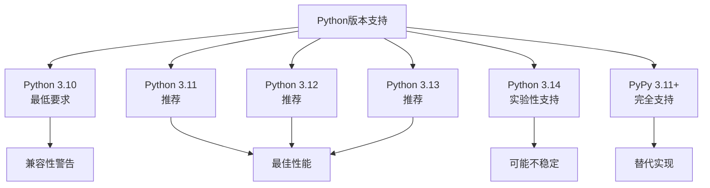

# 通过pip安装yt-dlp

<cite>
**本文档中引用的文件**
- [pyproject.toml](file://pyproject.toml)
- [README.md](file://README.md)
- [yt_dlp/__init__.py](file://yt_dlp/__init__.py)
- [yt_dlp/version.py](file://yt_dlp/version.py)
- [devscripts/install_deps.py](file://devscripts/install_deps.py)
- [yt_dlp/update.py](file://yt_dlp/update.py)
- [Changelog.md](file://Changelog.md)
</cite>

## 目录
1. [简介](#简介)
2. [系统要求](#系统要求)
3. [Python版本支持](#python版本支持)
4. [核心依赖项](#核心依赖项)
5. [安装方法](#安装方法)
6. [操作系统特定安装](#操作系统特定安装)
7. [验证安装](#验证安装)
8. [更新yt-dlp](#更新yt-dlp)
9. [虚拟环境安装](#虚拟环境安装)
10. [常见问题解决](#常见问题解决)
11. [故障排除指南](#故障排除指南)

## 简介

yt-dlp是一个功能丰富的命令行音频/视频下载器，支持数千个网站。本指南详细介绍如何使用pip包管理器安装yt-dlp，包括不同操作系统的具体安装步骤、依赖管理和故障排除。

## 系统要求

### 最低系统要求

- **Python版本**: Python 3.10或更高版本（推荐使用最新稳定版本）
- **操作系统**: Windows 10+、macOS 10.15+、Linux（大多数发行版）
- **内存**: 至少512MB可用内存
- **磁盘空间**: 安装后约50MB，下载时根据文件大小而定

### 支持的Python实现

- **CPython**: 完全支持（推荐）
- **PyPy**: 3.11+版本支持

**节来源**
- [pyproject.toml](file://pyproject.toml#L20-L25)
- [yt_dlp/__init__.py](file://yt_dlp/__init__.py#L1-L5)

## Python版本支持

### 当前支持的Python版本



**图表来源**
- [pyproject.toml](file://pyproject.toml#L20-L25)
- [Changelog.md](file://Changelog.md#L1001-L1009)

### 版本变更历史

- **2025.10.22**: 将最低必需Python版本提升至3.10
- **2025.08.11**: 将最低推荐Python版本提升至3.10
- **2024.11.04**: 将最低必需Python版本提升至3.9

**节来源**
- [Changelog.md](file://Changelog.md#L1001-L1009)
- [Changelog.md](file://Changelog.md#L221-L231)

## 核心依赖项

### 必需依赖

yt-dlp的默认安装组包含以下核心依赖：

| 依赖项 | 版本要求 | 用途 |
|--------|----------|------|
| brotli | CPython: `>=1.0.9` | Brotli内容编码支持 |
| brotlicffi | 其他实现 | Brotli内容编码支持（CPython以外） |
| certifi | `>=2023.7.22` | Mozilla根证书包 |
| mutagen | `>=1.46.0` | 音频元数据处理 |
| pycryptodomex | `>=3.18.0` | AES-128 HLS流解密 |
| requests | `>=2.32.2,<3` | HTTP库 |
| urllib3 | `>=2.0.2,<3` | 底层HTTP连接 |
| websockets | `>=13.0` | WebSocket下载支持 |

### 可选依赖

| 组名 | 包含的包 | 用途 |
|------|----------|------|
| default | 所有必需依赖 | 默认安装组 |
| curl-cffi | curl-cffi>=0.5.10 | 浏览器伪装支持 |
| secretstorage | cffi, secretstorage | Linux密钥环支持 |
| build | build, hatchling, pip, setuptools, wheel | 构建工具 |
| dev | pre-commit, static-analysis, test | 开发工具 |
| pyinstaller | pyinstaller>=6.13.0 | 独立可执行文件构建 |

**节来源**
- [pyproject.toml](file://pyproject.toml#L40-L85)

## 安装方法

### 基本安装命令

```bash
# 安装最新版本（推荐）
python3 -m pip install -U yt-dlp[default]

# 使用pipx（隔离安装）
pipx install yt-dlp

# 用户级别安装
python3 -m pip install -U --user yt-dlp[default]
```

### 分组安装

```bash
# 只安装核心依赖
python3 -m pip install -U yt-dlp

# 安装所有可选依赖
python3 -m pip install -U yt-dlp[default,curl-cffi,secretstorage]

# 自定义组合
python3 -m pip install -U yt-dlp[curl-cffi]
```

### 开发者安装

```bash
# 开发环境安装
python3 -m pip install -U yt-dlp[dev]

# 构建工具安装
python3 -m pip install -U yt-dlp[build]
```

**节来源**
- [devscripts/install_deps.py](file://devscripts/install_deps.py#L41-L80)

## 操作系统特定安装

### Windows系统

#### PowerShell安装

```powershell
# 检查Python版本
python --version

# 更新pip
python -m pip install --upgrade pip

# 安装yt-dlp
python -m pip install -U yt-dlp[default]

# 验证安装
yt-dlp --version
```

#### CMD安装

```cmd
:: 检查Python路径
where python

:: 安装yt-dlp
python -m pip install -U yt-dlp[default]

:: 添加到PATH（如果需要）
set PATH=%PATH%;%APPDATA%\Python\Python311\Scripts
```

#### Windows注意事项

- **Python 3.10+**: 确保已安装Python 3.10或更高版本
- **Visual C++运行时**: 大多数情况下自动包含，但某些情况下可能需要手动安装
- **权限**: 推荐使用用户级别安装避免管理员权限问题

### macOS系统

#### Homebrew安装

```bash
# 使用Homebrew（推荐）
brew install yt-dlp

# 或者使用pip
python3 -m pip install -U yt-dlp[default]
```

#### macOS特定配置

```bash
# 检查Python版本
python3 --version

# 安装（如果未安装Xcode命令行工具）
xcode-select --install

# 安装yt-dlp
python3 -m pip install -U yt-dlp[default]
```

#### macOS注意事项

- **macOS 10.15+**: 支持通用二进制文件
- **Apple Silicon**: 原生支持M1/M2芯片
- **权限**: 可能需要授予终端访问权限

### Linux系统

#### 包管理器安装

```bash
# Ubuntu/Debian
sudo apt update
sudo apt install python3-pip
python3 -m pip install -U yt-dlp[default]

# CentOS/RHEL/Fedora
sudo yum install python3-pip
python3 -m pip install -U yt-dlp[default]

# Arch Linux
sudo pacman -S python-pip
python3 -m pip install -U yt-dlp[default]
```

#### 发行版特定安装

```bash
# Alpine Linux
apk add py3-pip
python3 -m pip install -U yt-dlp[default]

# Gentoo
emerge dev-python/yt-dlp
```

#### Linux注意事项

- **glibc版本**: 大多数二进制文件需要glibc 2.17+
- **musl libc**: 支持musl的发行版使用特殊构建
- **权限**: 系统级安装需要sudo权限

**节来源**
- [README.md](file://README.md#L100-L200)

## 验证安装

### 基本验证

```bash
# 检查版本
yt-dlp --version

# 获取帮助
yt-dlp --help

# 列出支持的提取器
yt-dlp --list-extractors
```

### 详细验证

```bash
# 检查依赖项
yt-dlp --version --verbose

# 测试基本功能
yt-dlp --simulate https://www.youtube.com/watch?v=dQw4w9WgXcQ
```

### 验证输出示例

```
yt-dlp version 2025.10.22 (source)
Python 3.11.9
[pycryptodome] available
[requests] available
[websockets] available
...
```

**节来源**
- [yt_dlp/version.py](file://yt_dlp/version.py#L1-L16)

## 更新yt-dlp

### 使用内置更新功能

```bash
# 更新到最新版本
yt-dlp -U

# 更新到特定版本
yt-dlp --update-to nightly
yt-dlp --update-to stable@2025.10.22

# 强制更新
yt-dlp --update-to master
```

### 使用pip更新

```bash
# 更新pip包
python3 -m pip install -U yt-dlp[default]

# 更新到预发布版本
python3 -m pip install -U --pre yt-dlp[default]
```

### 更新渠道说明

| 渠道 | 描述 | 适用场景 |
|------|------|----------|
| stable | 稳定版本 | 生产环境推荐 |
| nightly | 每日构建 | 测试新功能 |
| master | 主分支构建 | 开发测试 |

**节来源**
- [yt_dlp/update.py](file://yt_dlp/update.py#L1-L50)
- [README.md](file://README.md#L200-L300)

## 虚拟环境安装

### 创建虚拟环境

```bash
# 创建虚拟环境
python3 -m venv yt-dlp-env

# 激活虚拟环境
# Linux/macOS
source yt-dlp-env/bin/activate

# Windows
yt-dlp-env\Scripts\activate.bat
```

### 在虚拟环境中安装

```bash
# 安装yt-dlp
pip install yt-dlp[default]

# 验证安装
yt-dlp --version

# 退出虚拟环境
deactivate
```

### 虚拟环境优势

- **隔离依赖**: 不影响系统其他Python包
- **多版本共存**: 可以同时安装不同版本
- **易于清理**: 删除整个目录即可移除
- **权限安全**: 无需管理员权限

### 最佳实践

```bash
# 创建专用目录
mkdir ~/yt-dlp-project
cd ~/yt-dlp-project

# 初始化虚拟环境
python3 -m venv venv
source venv/bin/activate

# 安装yt-dlp
pip install yt-dlp[default]

# 创建启动脚本
echo '#!/bin/bash' > run_ytdlp.sh
echo 'source ~/yt-dlp-project/venv/bin/activate' >> run_ytdlp.sh
echo 'yt-dlp "$@"' >> run_ytdlp.sh
chmod +x run_ytdlp.sh
```

## 常见问题解决

### 权限错误

#### 错误信息
```
PermissionError: [Errno 13] Permission denied: '/usr/local/bin/yt-dlp'
```

#### 解决方案

```bash
# 方法1：使用用户级别安装
python3 -m pip install -U --user yt-dlp[default]

# 方法2：使用虚拟环境
python3 -m venv myenv
source myenv/bin/activate
pip install yt-dlp[default]

# 方法3：临时提升权限（不推荐）
sudo python3 -m pip install -U yt-dlp[default]
```

### 依赖冲突

#### 错误信息
```
ERROR: pip's dependency resolver does not currently consider all the packages that are installed
```

#### 解决方案

```bash
# 升级pip和setuptools
python3 -m pip install --upgrade pip setuptools

# 强制重新安装
python3 -m pip install -U --force-reinstall yt-dlp[default]

# 使用隔离安装
pipx install yt-dlp
```

### 网络问题

#### 错误信息
```
Could not fetch URL https://pypi.org/simple/yt-dlp/: There was a problem confirming the ssl certificate
```

#### 解决方案

```bash
# 更新pip证书
python3 -m pip install --upgrade certifi

# 使用国内镜像源
python3 -m pip install -U yt-dlp[default] -i https://pypi.tuna.tsinghua.edu.cn/simple

# 设置环境变量
export PIP_INDEX_URL=https://pypi.tuna.tsinghua.edu.cn/simple
python3 -m pip install -U yt-dlp[default]
```

### Python版本问题

#### 错误信息
```
ImportError: You are using an unsupported version of Python. Only Python versions 3.10 and above are supported by yt-dlp
```

#### 解决方案

```bash
# 检查当前Python版本
python --version

# 升级Python（Ubuntu示例）
sudo apt update
sudo apt install python3.11

# 或者使用pyenv管理多个Python版本
pyenv install 3.11.9
pyenv global 3.11.9
```

**节来源**
- [yt_dlp/__init__.py](file://yt_dlp/__init__.py#L1-L5)

## 故障排除指南

### 诊断命令

```bash
# 显示详细信息
yt-dlp --verbose --version

# 测试网络连接
yt-dlp --simulate --skip-download https://www.youtube.com/watch?v=dQw4w9WgXcQ

# 检查配置文件
yt-dlp --list-extractors --verbose
```

### 日志分析

```bash
# 启用调试模式
yt-dlp --verbose --dump-pages URL

# 查看网络流量
yt-dlp --print-traffic URL

# 输出JSON格式信息
yt-dlp --dump-json URL
```

### 性能优化

```bash
# 限制并发连接数
yt-dlp --concurrent-fragments 1 URL

# 调整缓冲区大小
yt-dlp --buffer-size 64K URL

# 使用外部下载器
yt-dlp --downloader aria2c URL
```

### 常见错误模式

| 错误类型 | 可能原因 | 解决方案 |
|----------|----------|----------|
| SSL证书错误 | 网络代理或防火墙 | 更新certifi或使用代理 |
| 连接超时 | 网络不稳定 | 增加重试次数或使用代理 |
| 格式不可用 | 网站反爬虫 | 使用浏览器伪装 |
| 权限被拒绝 | 文件系统权限 | 检查目标目录权限 |

### 社区支持

- **GitHub Issues**: https://github.com/yt-dlp/yt-dlp/issues
- **Discord服务器**: https://discord.gg/H5MNcFW63r
- **Wiki页面**: https://github.com/yt-dlp/yt-dlp/wiki

**节来源**
- [README.md](file://README.md#L300-L400)

## 结论

通过pip安装yt-dlp提供了灵活且强大的安装方式，支持多种操作系统和使用场景。遵循本指南的最佳实践可以确保顺利安装和使用yt-dlp，同时避免常见的安装问题。

记住定期更新yt-dlp以获得最新的功能和修复，保持与网站的兼容性。对于生产环境，建议使用虚拟环境隔离安装，以避免与其他Python项目的依赖冲突。