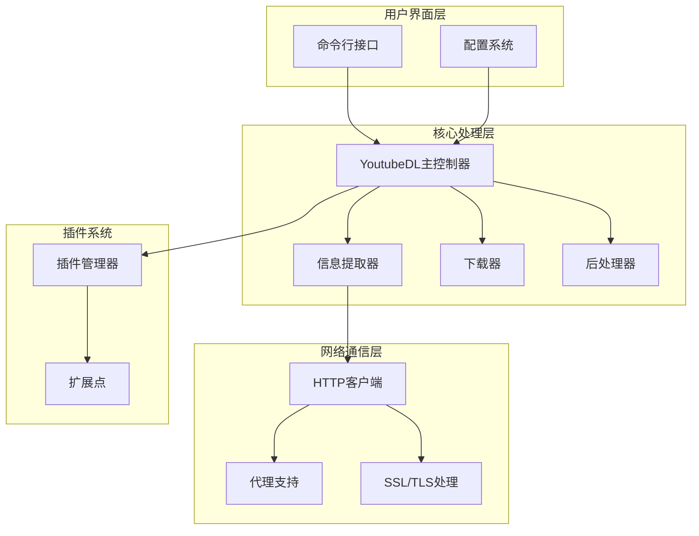
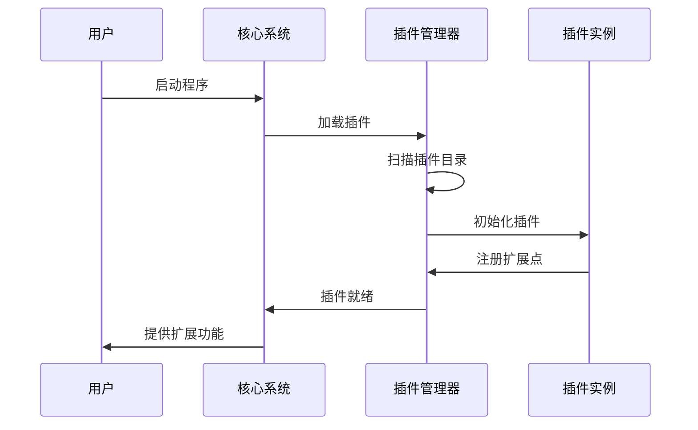
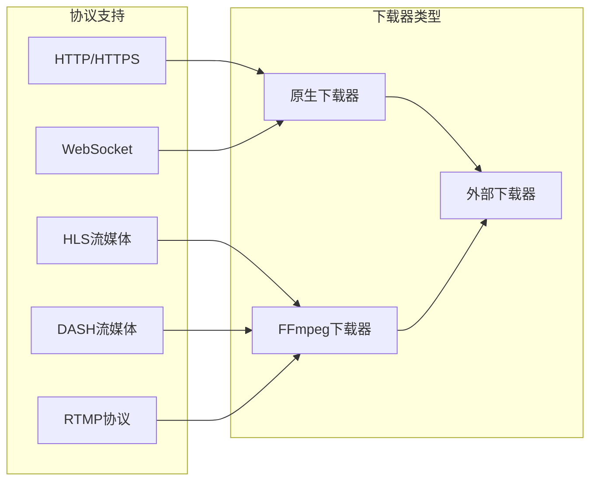

# 工具概述与核心价值

<cite>
**本文档中引用的文件**
- [README.md](file://README.md)
- [pyproject.toml](file://pyproject.toml)
- [yt_dlp/__init__.py](file://yt_dlp/__init__.py)
- [yt_dlp/YoutubeDL.py](file://yt_dlp/YoutubeDL.py)
- [yt_dlp/options.py](file://yt_dlp/options.py)
- [yt_dlp/plugins.py](file://yt_dlp/plugins.py)
- [yt_dlp/downloader/__init__.py](file://yt_dlp/downloader/__init__.py)
- [supportedsites.md](file://supportedsites.md)
- [Changelog.md](file://Changelog.md)
</cite>

## 目录
1. [项目简介](#项目简介)
2. [核心功能与价值主张](#核心功能与价值主张)
3. [项目架构概览](#项目架构概览)
4. [支持的网站生态](#支持的网站生态)
5. [模块化设计优势](#模块化设计优势)
6. [技术架构详解](#技术架构详解)
7. [项目发展历程](#项目发展历程)
8. [与同类工具的对比](#与同类工具的对比)
9. [目标用户群体](#目标用户群体)
10. [总结](#总结)

## 项目简介

yt-dlp是一个功能丰富的命令行音频/视频下载工具，支持从数千个网站提取和下载音视频内容。该项目是youtube-dl的活跃分支，基于已停止维护的youtube-dlc项目构建，致力于为用户提供稳定、高效的媒体下载解决方案。

### 核心特性

- **广泛的网站支持**：支持数千个主流视频平台和音频服务
- **强大的信息提取能力**：能够从复杂的网页结构中准确提取媒体信息
- **灵活的格式选择**：提供精细的视频和音频格式控制选项
- **先进的后处理功能**：集成FFmpeg进行高质量的媒体转换和合并
- **模块化架构设计**：便于维护和扩展的功能模块

**章节来源**
- [README.md](file://README.md#L1-L50)
- [pyproject.toml](file://pyproject.toml#L1-L50)

## 核心功能与价值主张

### 信息提取能力

yt-dlp的核心价值在于其卓越的信息提取能力。通过专门设计的extractor系统，它能够：

- **智能解析网页内容**：自动识别和提取各种格式的媒体链接
- **处理动态内容**：支持JavaScript渲染的现代网页应用
- **多语言支持**：覆盖全球主要语言的视频平台
- **实时更新**：持续适配各平台的接口变更

### 格式选择与优化

系统提供精细化的格式选择机制：

- **多码率支持**：从标清到4K甚至8K的全分辨率覆盖
- **多种编码格式**：支持H.264、H.265、VP9等主流编码
- **音频质量调节**：从语音到无损音质的全方位选择
- **容器格式兼容**：MP4、MKV、WEBM等多种格式支持

### 后处理与转换

集成的后处理系统确保最佳的媒体质量：

- **自动格式合并**：无缝合并分离的音视频流
- **质量优化**：智能调整编码参数以平衡质量和文件大小
- **元数据管理**：完整保留和转换媒体元数据
- **批量处理**：高效处理大量媒体文件

**章节来源**
- [yt_dlp/__init__.py](file://yt_dlp/__init__.py#L1-L100)
- [yt_dlp/YoutubeDL.py](file://yt_dlp/YoutubeDL.py#L1-L200)

## 项目架构概览

yt-dlp采用高度模块化的架构设计，主要包含以下核心组件：

**图表来源**
- [yt_dlp/__init__.py](file://yt_dlp/__init__.py#L1-L50)
- [yt_dlp/YoutubeDL.py](file://yt_dlp/YoutubeDL.py#L1-L100)

### 架构设计原则

1. **单一职责原则**：每个模块专注于特定功能领域
2. **开放封闭原则**：对扩展开放，对修改封闭
3. **依赖倒置原则**：高层模块不依赖低层模块的具体实现
4. **接口隔离原则**：提供细粒度的接口定义

**章节来源**
- [yt_dlp/options.py](file://yt_dlp/options.py#L1-L100)

## 支持的网站生态

yt-dlp拥有庞大的网站支持生态，涵盖以下主要类别：

### 主流视频平台
- **社交媒体**：YouTube、Facebook、Instagram、Twitter/X
- **专业视频服务**：Vimeo、Dailymotion、Twitch
- **直播平台**：斗鱼、虎牙、B站等中国直播平台
- **教育平台**：Coursera、Khan Academy、TED

### 音频服务
- **音乐平台**：Spotify、Apple Music、SoundCloud
- **播客服务**：Podbean、Libsyn、Anchor
- **电台服务**：Mixcloud、Radiooooo

### 专业内容平台
- **新闻媒体**：BBC、CNN、NHK
- **企业培训**：LinkedIn Learning、Udemy
- **政府机构**：NASA、WHO官方频道

### 内容数量统计

根据最新的支持站点列表，yt-dlp目前支持超过700个不同的网站和服务提供商，涵盖了全球主要的媒体分发平台。

**章节来源**
- [supportedsites.md](file://supportedsites.md#L1-L100)

## 模块化设计优势

### Extractor系统

yt-dlp的extractor系统是其架构的核心亮点：

```mermaid
classDiagram
class InfoExtractor {
+string IE_NAME
+string _VALID_URL
+list _TESTS
+extract(url) dict
+_real_extract(url) dict
+_download_webpage(url) string
}
class YoutubeIE {
+string IE_NAME
+string _VALID_URL
+extract(url) dict
+_real_extract(url) dict
}
class GenericIE {
+string IE_NAME
+string _VALID_URL
+extract(url) dict
+_real_extract(url) dict
}
class CustomExtractor {
+string IE_NAME
+string _VALID_URL
+extract(url) dict
+_real_extract(url) dict
}
InfoExtractor <|-- YoutubeIE
InfoExtractor <|-- GenericIE
InfoExtractor <|-- CustomExtractor
```

**图表来源**
- [yt_dlp/extractor/_extractors.py](file://yt_dlp/extractor/_extractors.py)

#### 设计优势

1. **可扩展性**：新网站支持只需添加新的extractor类
2. **可测试性**：每个extractor都有独立的测试套件
3. **可维护性**：清晰的继承层次和标准化接口
4. **可复用性**：通用功能在基类中实现

### 插件系统

yt-dlp提供了强大的插件扩展机制：

**图表来源**
- [yt_dlp/plugins.py](file://yt_dlp/plugins.py#L1-L100)

**章节来源**
- [yt_dlp/plugins.py](file://yt_dlp/plugins.py#L1-L200)

## 技术架构详解

### 下载器架构

yt-dlp实现了多种下载协议的支持：

**图表来源**
- [yt_dlp/downloader/__init__.py](file://yt_dlp/downloader/__init__.py#L1-L50)

### 后处理器流水线

后处理系统采用流水线模式，支持多种媒体转换操作：

1. **格式转换**：音频/视频编码格式转换
2. **质量优化**：比特率和分辨率调整
3. **元数据嵌入**：封面图片和播放信息
4. **文件合并**：分离的音视频流合并
5. **批量处理**：多文件协调处理

**章节来源**
- [yt_dlp/downloader/__init__.py](file://yt_dlp/downloader/__init__.py#L1-L132)

## 项目发展历程

### 起源与演进

yt-dlp项目经历了重要的发展里程碑：

#### 项目起源（2021年）
- 从youtube-dl项目分叉而来
- 基于youtube-dlc项目继续开发
- 项目名称正式更改为yt-dlp

#### 技术演进
- **2021年**：项目组织化管理，建立完整的开发流程
- **2022年**：引入现代化的代码架构和测试框架
- **2023年**：增强插件系统和扩展能力
- **2024年**：优化性能和用户体验

#### 社区建设
- 建立活跃的开发者社区
- 完善的贡献者指南和开发规范
- 定期发布稳定版本和功能更新

**章节来源**
- [Changelog.md](file://Changelog.md#L5532-L5550)

## 与同类工具的对比

### 技术优势对比

| 特性 | yt-dlp | youtube-dl | 其他工具 |
|------|--------|------------|----------|
| 网站支持数量 | 700+ | 1000+（已停止更新） | 变化较大 |
| 更新频率 | 活跃维护 | 已停止 | 不同 |
| 性能优化 | 先进算法 | 基础实现 | 参差不齐 |
| 插件系统 | 完整支持 | 无 | 部分支持 |
| 多语言支持 | 全面覆盖 | 有限 | 不一致 |

### 功能对比

#### 核心功能
- **信息提取**：yt-dlp在复杂网页解析方面表现更优
- **格式支持**：提供更广泛的编码格式和质量选项
- **稳定性**：持续维护确保长期可用性

#### 开发体验
- **文档完善**：详细的使用说明和API文档
- **测试覆盖**：全面的自动化测试体系
- **社区支持**：活跃的开发者社区和问题响应

## 目标用户群体

### 初级用户
- **个人媒体收藏**：需要下载喜欢的视频或音乐
- **学习资源获取**：获取教育视频和讲座内容
- **娱乐内容消费**：下载电影、电视剧、综艺节目

### 中级用户
- **内容创作者**：需要备份和存档自己的作品
- **研究人员**：收集学术资料和研究素材
- **内容管理者**：批量管理和整理媒体文件

### 高级用户
- **开发者**：嵌入到自己的应用程序中
- **系统管理员**：大规模媒体内容管理
- **自动化专家**：集成到工作流程中

### 专业用户
- **媒体公司**：内容分发和归档
- **教育机构**：教育资源本地化
- **企业用户**：内部培训材料管理

## 总结

yt-dlp作为一个功能强大、架构先进的命令行媒体下载工具，在众多方面展现出显著优势：

### 技术价值
- **模块化设计**：清晰的架构层次和良好的可扩展性
- **持续维护**：活跃的开发团队和稳定的更新周期
- **技术创新**：采用现代化的编程实践和最佳实践

### 实用价值
- **广泛兼容**：支持数千个网站和多种媒体格式
- **高质量输出**：提供专业的媒体处理和转换功能
- **用户友好**：简洁的命令行界面和丰富的配置选项

### 生态价值
- **开源社区**：活跃的开发者社区和完善的贡献机制
- **标准化**：遵循行业标准和最佳实践
- **可持续性**：长期的发展规划和维护承诺

yt-dlp不仅是一个优秀的工具，更是现代软件开发理念的实践典范。它展示了如何通过合理的架构设计、持续的改进和社区协作，构建出既满足当前需求又具备未来发展潜力的优秀软件产品。

对于需要可靠、高效媒体下载解决方案的用户来说，yt-dlp无疑是最值得信赖的选择。无论是个人用户还是企业用户，都能从中获得卓越的使用体验和价值回报。