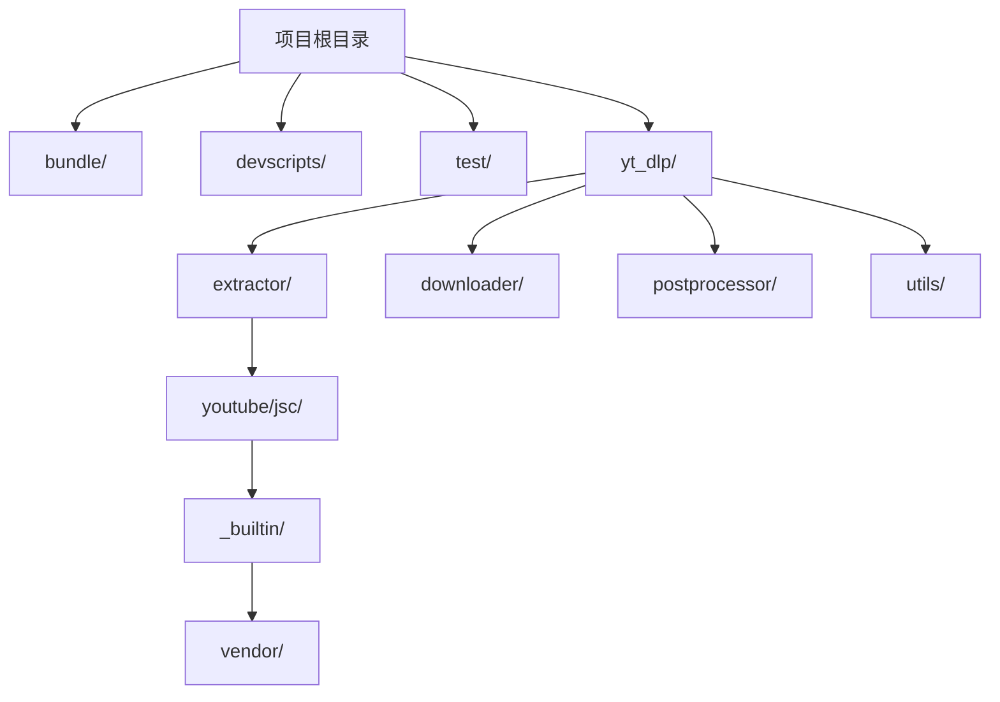
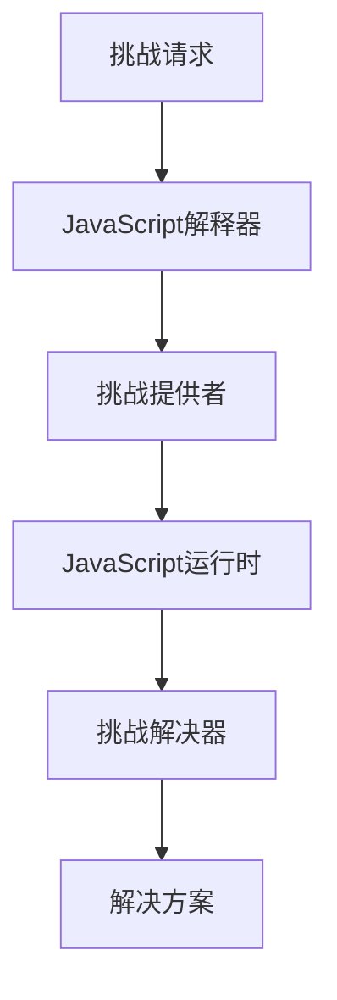
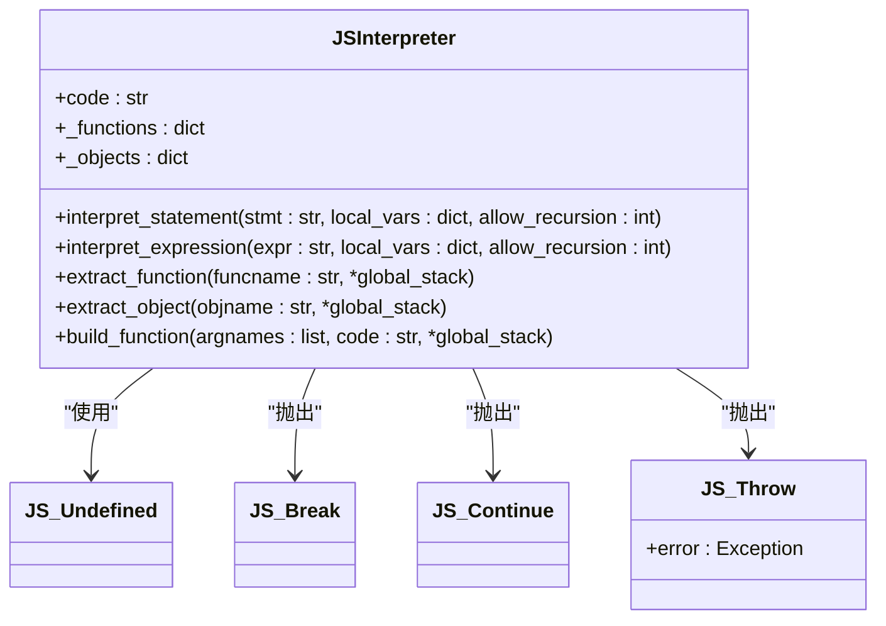
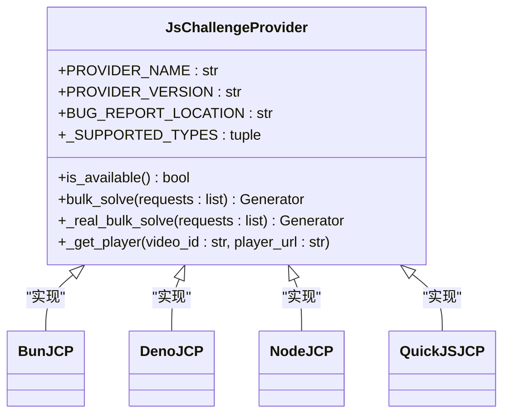
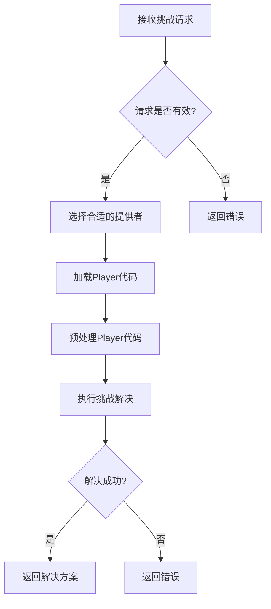
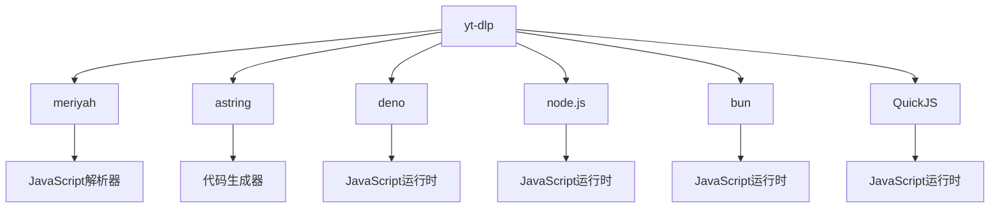

# JavaScript挑战解决架构

<cite>
**本文档引用的文件**   
- [jsinterp.py](file://yt_dlp/jsinterp.py)
- [test_jsinterp.py](file://test/test_jsinterp.py)
- [yt.solver.core.js](file://yt_dlp/extractor/youtube/jsc/_builtin/vendor/yt.solver.core.js)
- [yt.solver.bun.lib.js](file://yt_dlp/extractor/youtube/jsc/_builtin/vendor/yt.solver.bun.lib.js)
- [yt.solver.deno.lib.js](file://yt_dlp/extractor/youtube/jsc/_builtin/vendor/yt.solver.deno.lib.js)
- [provider.py](file://yt_dlp/extractor/youtube/jsc/provider.py)
- [test_ejs_integration.py](file://test/test_jsc/test_ejs_integration.py)
</cite>

## 目录
1. [简介](#简介)
2. [项目结构](#项目结构)
3. [核心组件](#核心组件)
4. [架构概述](#架构概述)
5. [详细组件分析](#详细组件分析)
6. [依赖分析](#依赖分析)
7. [性能考虑](#性能考虑)
8. [故障排除指南](#故障排除指南)
9. [结论](#结论)

## 简介
yt-dlp 是一个功能丰富的命令行音视频下载器，支持数千个网站。该项目是 [youtube-dl](https://github.com/ytdl-org/youtube-dl) 的一个分支，基于现已停止维护的 [youtube-dlc](https://github.com/blackjack4494/yt-dlc)。本项目特别关注JavaScript挑战解决架构，用于处理YouTube等网站的反爬虫机制。

## 项目结构
yt-dlp 项目的结构清晰，主要分为以下几个部分：
- `bundle/`: 包含Docker和PyInstaller相关的构建脚本
- `devscripts/`: 开发脚本，用于生成文档、测试、依赖管理等
- `test/`: 测试代码，包括JavaScript解释器和挑战解决的测试
- `yt_dlp/`: 核心代码，包含提取器、下载器、后处理器等
- 根目录下的各种配置文件和文档

**Diagram sources**
- [yt_dlp/extractor/youtube/jsc/_builtin/vendor/yt.solver.core.js](file://yt_dlp/extractor/youtube/jsc/_builtin/vendor/yt.solver.core.js)

**Section sources**
- [yt_dlp/extractor/youtube/jsc/_builtin/vendor/yt.solver.core.js](file://yt_dlp/extractor/youtube/jsc/_builtin/vendor/yt.solver.core.js)

## 核心组件
JavaScript挑战解决架构的核心组件包括JavaScript解释器、挑战提供者和解决器。这些组件协同工作，以解析和执行JavaScript代码，从而解决网站的反爬虫挑战。

**Section sources**
- [jsinterp.py](file://yt_dlp/jsinterp.py)
- [provider.py](file://yt_dlp/extractor/youtube/jsc/provider.py)

## 架构概述
JavaScript挑战解决架构采用分层设计，主要包括以下几个层次：
1. **挑战请求层**：负责生成和管理JavaScript挑战请求
2. **解释器层**：负责解析和执行JavaScript代码
3. **提供者层**：负责选择合适的JavaScript运行时环境
4. **解决器层**：负责实际执行挑战解决逻辑

**Diagram sources**
- [jsinterp.py](file://yt_dlp/jsinterp.py)
- [provider.py](file://yt_dlp/extractor/youtube/jsc/provider.py)

## 详细组件分析

### JavaScript解释器分析
JavaScript解释器是整个架构的核心，负责解析和执行JavaScript代码。它实现了基本的JavaScript语法和操作符，能够处理复杂的表达式和函数调用。

**Diagram sources**
- [jsinterp.py](file://yt_dlp/jsinterp.py)

**Section sources**
- [jsinterp.py](file://yt_dlp/jsinterp.py)

### 挑战提供者分析
挑战提供者负责管理不同的JavaScript运行时环境，并根据系统配置选择合适的运行时来执行挑战解决。

**Diagram sources**
- [provider.py](file://yt_dlp/extractor/youtube/jsc/provider.py)

**Section sources**
- [provider.py](file://yt_dlp/extractor/youtube/jsc/provider.py)

### 挑战解决流程分析
挑战解决流程涉及多个步骤，从接收挑战请求到返回解决方案，整个过程需要精确的协调和错误处理。

**Diagram sources**
- [test_ejs_integration.py](file://test/test_jsc/test_ejs_integration.py)

**Section sources**
- [test_ejs_integration.py](file://test/test_jsc/test_ejs_integration.py)

## 依赖分析
JavaScript挑战解决架构依赖于多个外部组件和库，这些依赖关系确保了架构的灵活性和可扩展性。

**Diagram sources**
- [yt.solver.deno.lib.js](file://yt_dlp/extractor/youtube/jsc/_builtin/vendor/yt.solver.deno.lib.js)
- [yt.solver.bun.lib.js](file://yt_dlp/extractor/youtube/jsc/_builtin/vendor/yt.solver.bun.lib.js)

**Section sources**
- [yt.solver.deno.lib.js](file://yt_dlp/extractor/youtube/jsc/_builtin/vendor/yt.solver.deno.lib.js)
- [yt.solver.bun.lib.js](file://yt_dlp/extractor/youtube/jsc/_builtin/vendor/yt.solver.bun.lib.js)

## 性能考虑
JavaScript挑战解决架构在设计时考虑了性能因素，通过缓存、预处理和并行执行等技术来提高效率。

- **缓存机制**：对已解析的Player代码进行缓存，避免重复解析
- **预处理**：在执行挑战解决前对Player代码进行预处理，提取关键函数
- **并行执行**：支持同时处理多个挑战请求，提高整体吞吐量

## 故障排除指南
在使用JavaScript挑战解决架构时，可能会遇到各种问题。以下是一些常见的故障排除建议：

- **JavaScript运行时不可用**：确保已安装并配置了支持的JavaScript运行时（如deno、node.js等）
- **挑战解决失败**：检查Player代码是否已更新，可能需要更新挑战解决逻辑
- **性能问题**：考虑启用缓存机制，或优化挑战解决逻辑

**Section sources**
- [test_jsinterp.py](file://test/test_jsinterp.py)

## 结论
JavaScript挑战解决架构是yt-dlp项目中的关键组件，它通过灵活的分层设计和强大的JavaScript解释能力，有效地解决了现代网站的反爬虫机制。该架构不仅具有良好的可扩展性，还通过多种优化技术确保了高性能和可靠性。