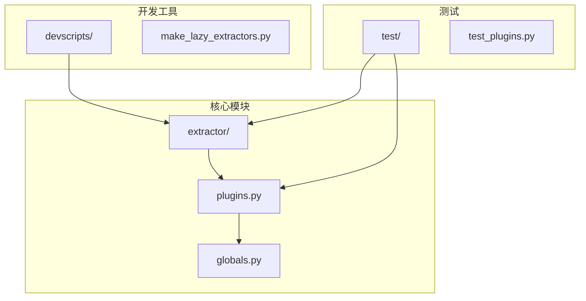
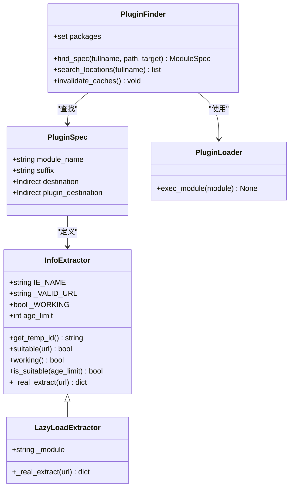
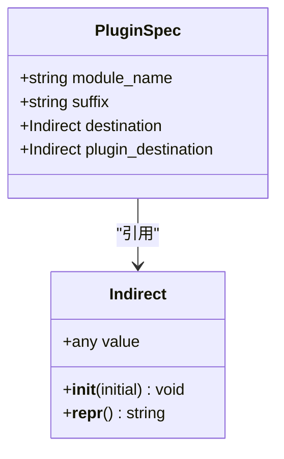
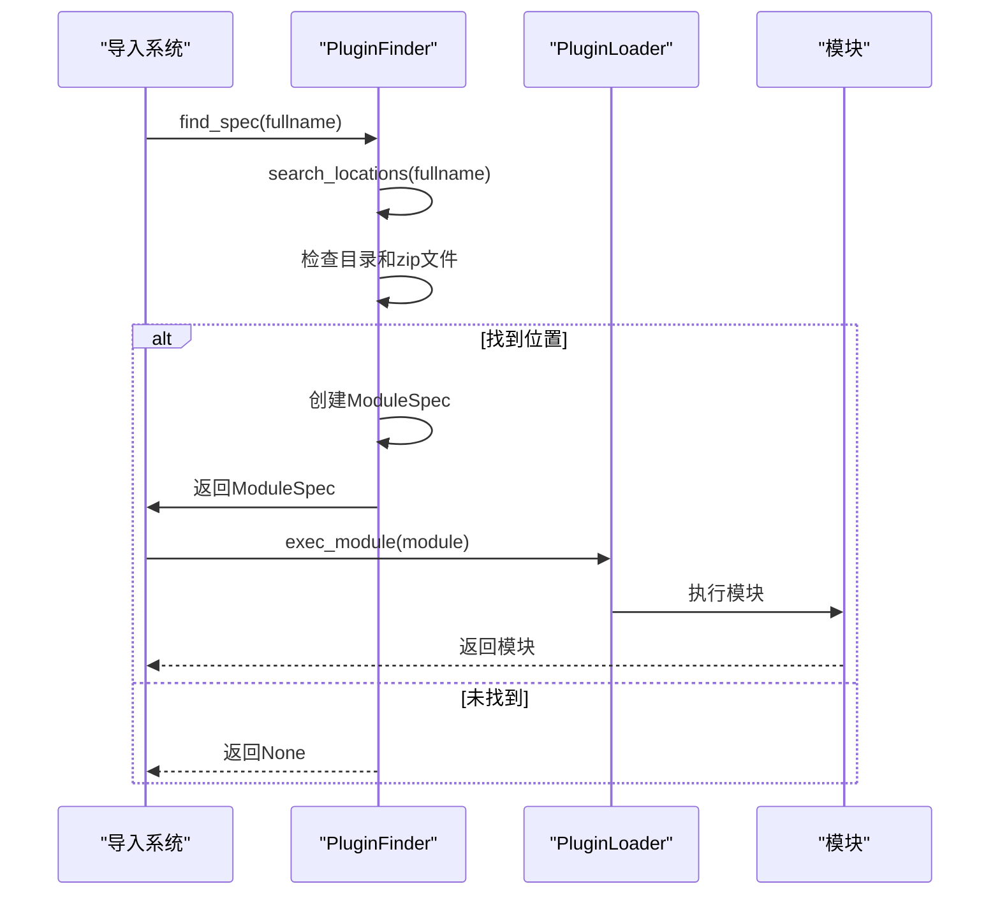
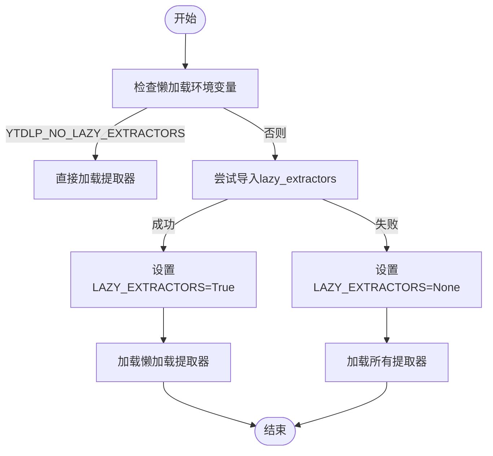
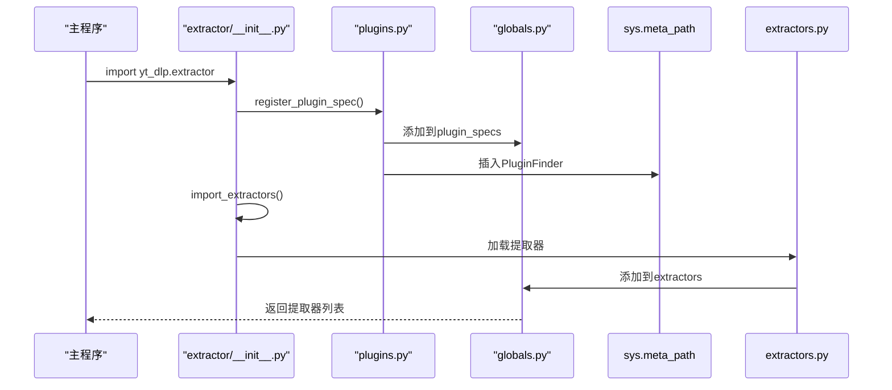
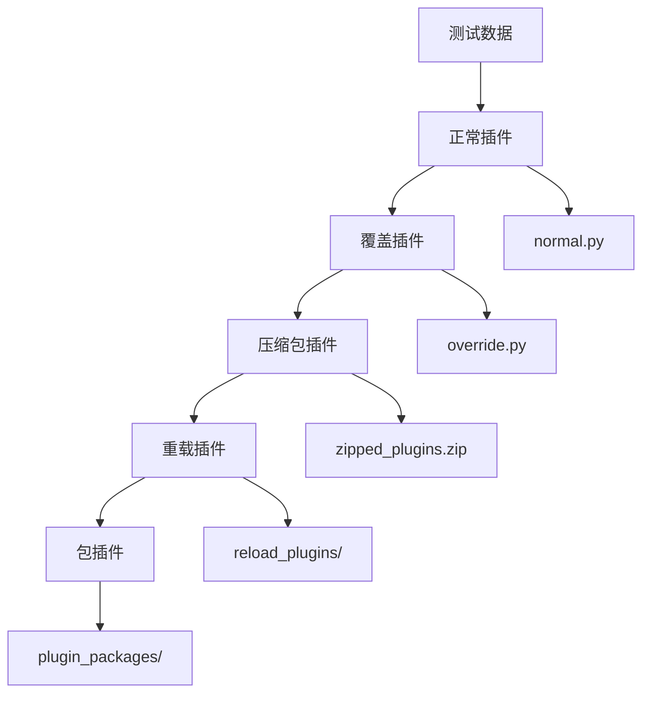

# 提取器生态系统扩展

<cite>
**本文档引用的文件**   
- [__init__.py](file://yt_dlp/__init__.py)
- [plugins.py](file://yt_dlp/plugins.py)
- [globals.py](file://yt_dlp/globals.py)
- [extractor/__init__.py](file://yt_dlp/extractor/__init__.py)
- [extractor/common.py](file://yt_dlp/extractor/common.py)
- [extractor/extractors.py](file://yt_dlp/extractor/extractors.py)
- [make_lazy_extractors.py](file://devscripts/make_lazy_extractors.py)
- [test_plugins.py](file://test/test_plugins.py)
</cite>

## 目录
1. [项目结构](#项目结构)
2. [核心组件](#核心组件)
3. [提取器系统架构](#提取器系统架构)
4. [插件系统机制](#插件系统机制)
5. [提取器加载流程](#提取器加载流程)
6. [测试与验证](#测试与验证)

## 项目结构

yt-dlp项目的提取器生态系统主要分布在`yt_dlp/extractor/`目录下，包含120多个具体的提取器实现文件。整个系统通过模块化设计实现了灵活的扩展能力。



**图源**
- [yt_dlp/extractor/](file://yt_dlp/extractor/)
- [yt_dlp/plugins.py](file://yt_dlp/plugins.py)
- [yt_dlp/globals.py](file://yt_dlp/globals.py)
- [devscripts/make_lazy_extractors.py](file://devscripts/make_lazy_extractors.py)
- [test/test_plugins.py](file://test/test_plugins.py)

**本节来源**
- [yt_dlp/extractor/](file://yt_dlp/extractor/)
- [devscripts/make_lazy_extractors.py](file://devscripts/make_lazy_extractors.py)

## 核心组件

提取器生态系统的核心组件包括提取器基类、插件管理器和全局状态管理器。这些组件协同工作，实现了动态加载和管理提取器的功能。

**本节来源**
- [yt_dlp/extractor/common.py](file://yt_dlp/extractor/common.py#L107-L200)
- [yt_dlp/plugins.py](file://yt_dlp/plugins.py#L1-L248)
- [yt_dlp/globals.py](file://yt_dlp/globals.py#L1-L42)

## 提取器系统架构

yt-dlp的提取器系统采用分层架构设计，通过懒加载机制优化性能，同时支持插件扩展。



**图源**
- [yt_dlp/extractor/common.py](file://yt_dlp/extractor/common.py#L107-L200)
- [yt_dlp/plugins.py](file://yt_dlp/plugins.py#L53-L59)
- [yt_dlp/plugins.py](file://yt_dlp/plugins.py#L116-L159)

**本节来源**
- [yt_dlp/extractor/common.py](file://yt_dlp/extractor/common.py#L107-L200)
- [yt_dlp/plugins.py](file://yt_dlp/plugins.py#L53-L248)

## 插件系统机制

yt-dlp的插件系统通过Python的导入机制和元路径查找器实现，支持从多个位置动态加载插件。

### 插件规范定义

插件系统使用`PluginSpec`类定义插件规范，包含模块名称、后缀、目标位置等信息。



**图源**
- [yt_dlp/plugins.py](file://yt_dlp/plugins.py#L53-L59)
- [yt_dlp/globals.py](file://yt_dlp/globals.py#L10-L15)

### 插件查找器

`PluginFinder`类实现了元路径查找器，负责在指定位置查找和加载插件。



**图源**
- [yt_dlp/plugins.py](file://yt_dlp/plugins.py#L116-L159)

**本节来源**
- [yt_dlp/plugins.py](file://yt_dlp/plugins.py#L68-L248)

## 提取器加载流程

提取器的加载流程涉及多个步骤，从初始化到实际加载，确保系统能够正确识别和使用各种提取器。

### 懒加载机制

yt-dlp采用懒加载机制来优化启动性能，只有在需要时才加载具体的提取器。



**图源**
- [yt_dlp/extractor/extractors.py](file://yt_dlp/extractor/extractors.py#L1-L38)

### 提取器注册流程

提取器的注册流程确保所有可用的提取器都能被系统识别和使用。



**图源**
- [yt_dlp/extractor/__init__.py](file://yt_dlp/extractor/__init__.py#L1-L55)
- [yt_dlp/plugins.py](file://yt_dlp/plugins.py#L243-L248)
- [yt_dlp/globals.py](file://yt_dlp/globals.py#L18-L20)

**本节来源**
- [yt_dlp/extractor/extractors.py](file://yt_dlp/extractor/extractors.py#L1-L38)
- [yt_dlp/extractor/__init__.py](file://yt_dlp/extractor/__init__.py#L1-L55)

## 测试与验证

yt-dlp提供了完整的测试套件来验证提取器生态系统的正确性和稳定性。

### 插件测试用例

测试用例覆盖了插件系统的各种使用场景，确保功能的可靠性。

```mermaid
classDiagram
class TestPlugins {
+TEST_PLUGIN_DIR Path
+setUp() void
+tearDown() void
+test_directories_containing_plugins() void
+test_extractor_classes() void
+test_postprocessor_classes() void
+test_importing_zipped_module() void
+test_reloading_plugins() void
+test_extractor_override_plugin() void
+test_load_all_plugin_types() void
+test_no_plugin_dirs() void
+test_set_plugin_dirs() void
+test_invalid_plugin_dir() void
+test_append_plugin_dirs() void
+test_get_plugin_spec() void
}
TestPlugins --> "unittest.TestCase" : 继承
```

**图源**
- [test/test_plugins.py](file://test/test_plugins.py#L63-L247)

### 测试数据结构

测试数据提供了各种插件场景的示例，用于验证系统行为。



**图源**
- [test/testdata/yt_dlp_plugins/](file://test/testdata/yt_dlp_plugins/)
- [test/testdata/zipped_plugins.zip](file://test/testdata/zipped_plugins.zip)
- [test/testdata/reload_plugins/](file://test/testdata/reload_plugins/)
- [test/testdata/plugin_packages/](file://test/testdata/plugin_packages/)

**本节来源**
- [test/test_plugins.py](file://test/test_plugins.py#L1-L247)
- [test/testdata/](file://test/testdata/)