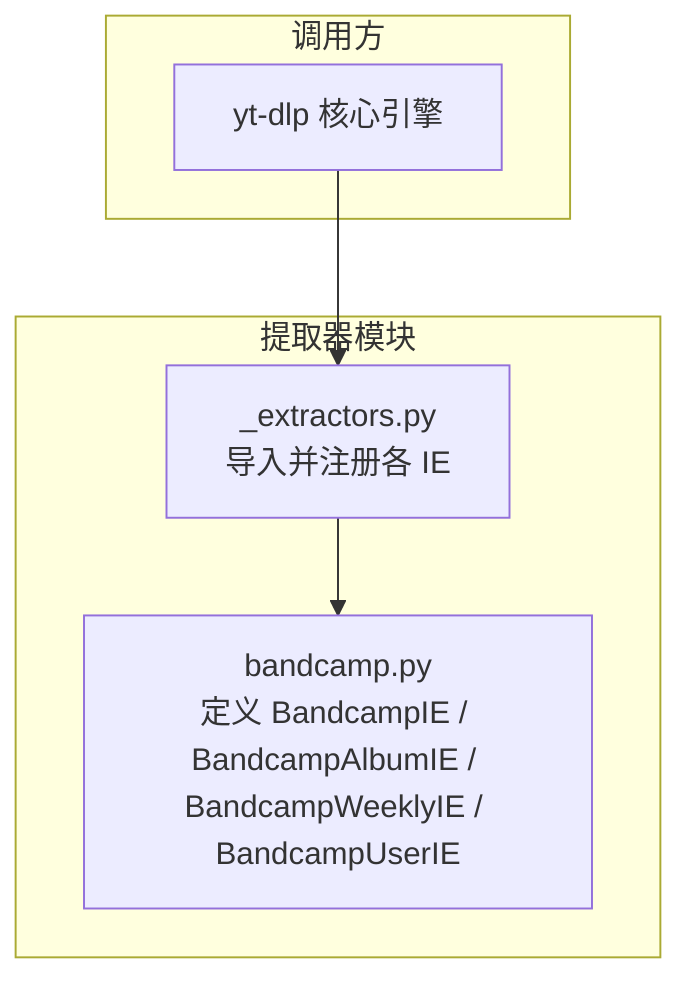
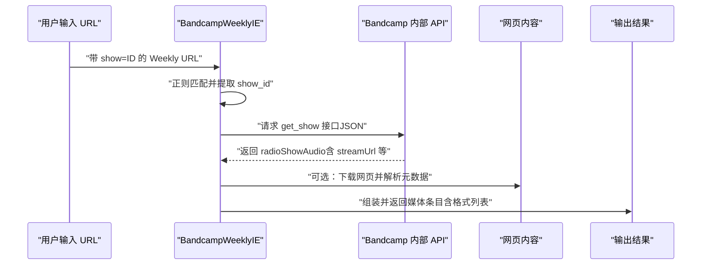
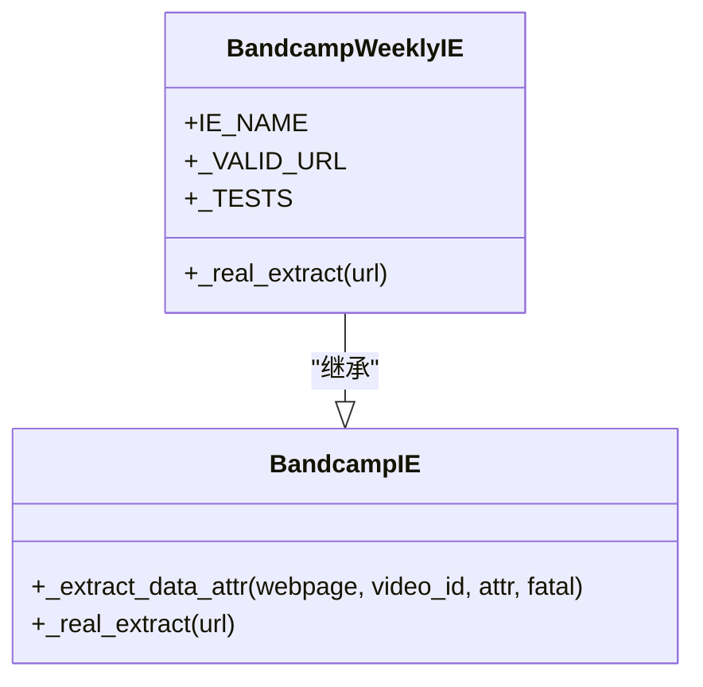
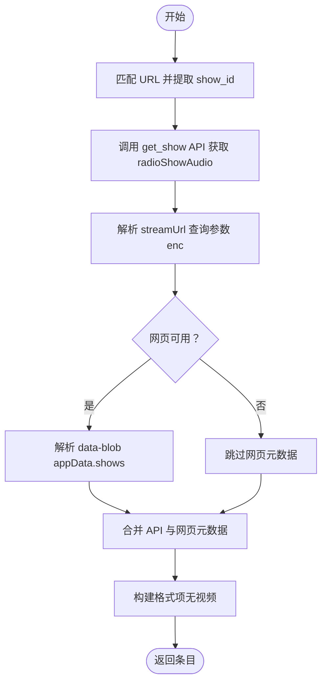
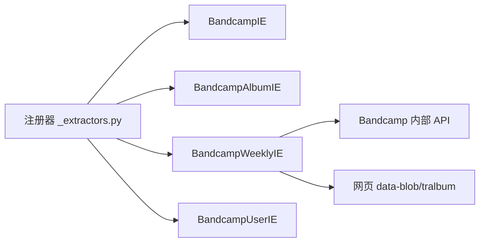

# Bandcamp Weekly URL 结构

<cite>
**本文引用的文件**
- [yt_dlp/extractor/bandcamp.py](file://yt_dlp/extractor/bandcamp.py)
- [yt_dlp/extractor/_extractors.py](file://yt_dlp/extractor/_extractors.py)
</cite>

## 目录
1. [简介](#简介)
2. [项目结构](#项目结构)
3. [核心组件](#核心组件)
4. [架构总览](#架构总览)
5. [详细组件分析](#详细组件分析)
6. [依赖关系分析](#依赖关系分析)
7. [性能考量](#性能考量)
8. [故障排查指南](#故障排查指南)
9. [结论](#结论)
10. [附录](#附录)

## 简介
本文件系统性梳理 yt-dlp 中对 Bandcamp Weekly（每周精选节目）URL 的识别与解析机制，重点说明 URL 结构、正则匹配规则、数据来源与提取流程，并提供面向使用者与开发者的参考路径与可视化图示。

## 项目结构
- Bandcamp Weekly 的解析逻辑集中在 extractor 子模块中：
  - 主要实现位于：yt_dlp/extractor/bandcamp.py
  - 提取器注册位于：yt_dlp/extractor/_extractors.py
- 该模块同时包含对单曲、专辑、用户页等其他 Bandcamp 资源的解析器，但本文聚焦 Weekly URL 结构与处理流程。

图表来源
- [yt_dlp/extractor/bandcamp.py](file://yt_dlp/extractor/bandcamp.py#L1-L50)
- [yt_dlp/extractor/_extractors.py](file://yt_dlp/extractor/_extractors.py#L190-L210)

章节来源
- [yt_dlp/extractor/bandcamp.py](file://yt_dlp/extractor/bandcamp.py#L1-L50)
- [yt_dlp/extractor/_extractors.py](file://yt_dlp/extractor/_extractors.py#L190-L210)

## 核心组件
- BandcampWeeklyIE：专门用于识别与提取 Bandcamp Weekly 播客节目的 URL。
  - 关键点：
    - URL 正则：支持带可选查询参数的 show= 数字 ID 形式
    - 数据来源：通过 Bandcamp 内部 API 获取节目音频信息
    - 输出字段：包含节目标题、系列名、时长、发布日期、封面图、格式列表等

章节来源
- [yt_dlp/extractor/bandcamp.py](file://yt_dlp/extractor/bandcamp.py#L414-L478)

## 架构总览
- URL 匹配与路由
  - BandcampWeeklyIE 使用正则匹配 Weekly URL，确保仅在符合 show 参数的 URL 上触发
  - 同时存在 Album/Track/User 等其他 IE，它们会避免与 Weekly URL 冲突
- 数据获取链路
  - 先从网页中提取元数据（可选）
  - 再调用 Bandcamp 内部 API 获取音频流与节目详情
  - 最终组装为标准媒体条目输出

图表来源
- [yt_dlp/extractor/bandcamp.py](file://yt_dlp/extractor/bandcamp.py#L414-L478)

## 详细组件分析

### BandcampWeeklyIE 类结构
- 继承关系
  - BandcampWeeklyIE 继承自 BandcampIE（通用 Bandcamp 抽象基类）
- 关键属性
  - IE_NAME：标识为 “Bandcamp:weekly”
  - _VALID_URL：正则表达式，限定 Weekly URL 的形式
  - _TESTS：测试样例，覆盖基本播放与带额外查询参数的情况
- 关键方法
  - _real_extract：核心提取逻辑，包括 API 请求、URL 解析、格式组装

图表来源
- [yt_dlp/extractor/bandcamp.py](file://yt_dlp/extractor/bandcamp.py#L28-L40)
- [yt_dlp/extractor/bandcamp.py](file://yt_dlp/extractor/bandcamp.py#L414-L478)

章节来源
- [yt_dlp/extractor/bandcamp.py](file://yt_dlp/extractor/bandcamp.py#L28-L40)
- [yt_dlp/extractor/bandcamp.py](file://yt_dlp/extractor/bandcamp.py#L414-L478)

### URL 结构与正则匹配
- 基本形式
  - https://bandcamp.com/radio?show=ID
- 变体与容错
  - 支持可选的末尾斜杠
  - 支持 show 参数前有其他查询参数（如 foo=bar）
- 匹配要点
  - 使用命名捕获组 id 提取 show ID
  - 仅当 URL 符合该模式时才由 BandcampWeeklyIE 处理

章节来源
- [yt_dlp/extractor/bandcamp.py](file://yt_dlp/extractor/bandcamp.py#L414-L438)

### 数据来源与提取流程
- API 请求
  - 调用 https://bandcamp.com/api/bcradio_api/1/get_show
  - 请求体包含 { id: show_id }，Content-Type 为 application/json
  - 返回值中包含 radioShowAudio 字段，其中包含 streamUrl、title、date、duration 等
- 网页元数据（可选）
  - 若网页可用，解析 data-blob 中 appData.shows 列表，按 showId 过滤匹配
  - 用于补充标题、描述、封面等信息
- 格式组装
  - 从 streamUrl 的查询参数 enc 中解析编码与码率
  - 生成单一格式项（无视频，vcodec 为 none）

图表来源
- [yt_dlp/extractor/bandcamp.py](file://yt_dlp/extractor/bandcamp.py#L440-L478)

章节来源
- [yt_dlp/extractor/bandcamp.py](file://yt_dlp/extractor/bandcamp.py#L440-L478)

### 与其他 Bandcamp 提取器的关系
- Album/Track/User 等 IE 会避免与 Weekly URL 冲突
  - AlbumIE 在 suitable 中显式排除 Weekly 与 Track URL
  - 这保证了 Weekly URL 不会被错误地路由到专辑或单曲解析器

章节来源
- [yt_dlp/extractor/bandcamp.py](file://yt_dlp/extractor/bandcamp.py#L380-L412)

## 依赖关系分析
- 注册与导入
  - _extractors.py 中导入 BandcampIE、BandcampAlbumIE、BandcampWeeklyIE、BandcampUserIE
  - 由核心引擎统一调度，根据 URL 正则选择对应 IE
- 外部依赖
  - 依赖 Bandcamp 内部 API（get_show）
  - 依赖网页中的 data-* 属性（tralbum/blob）以补充元数据

图表来源
- [yt_dlp/extractor/_extractors.py](file://yt_dlp/extractor/_extractors.py#L190-L210)
- [yt_dlp/extractor/bandcamp.py](file://yt_dlp/extractor/bandcamp.py#L414-L478)

章节来源
- [yt_dlp/extractor/_extractors.py](file://yt_dlp/extractor/_extractors.py#L190-L210)
- [yt_dlp/extractor/bandcamp.py](file://yt_dlp/extractor/bandcamp.py#L414-L478)

## 性能考量
- API 调用开销
  - Weekly 解析需要一次 API 请求与一次网页请求（可选），建议在批量抓取时注意频率控制
- 流格式解析
  - 仅解析单一格式项，避免多格式并行下载带来的资源浪费
- 缓存与重试
  - 可结合外部缓存策略减少重复请求；若 API 返回失败，建议重试并降级使用网页元数据

## 故障排查指南
- 常见问题
  - URL 不被识别：确认是否包含 show= 数字 ID，且无多余非法字符
  - API 返回为空：检查网络连通性与 show_id 是否有效
  - 网页元数据缺失：部分页面可能不包含 data-blob，不影响音频流解析
- 定位路径
  - URL 匹配与提取：参见 Weekly URL 正则与 _real_extract
  - API 请求与响应解析：参见 get_show 调用与 radioShowAudio 字段处理
  - 网页元数据回退：参见 data-blob 解析与 appData.shows 过滤

章节来源
- [yt_dlp/extractor/bandcamp.py](file://yt_dlp/extractor/bandcamp.py#L414-L478)

## 结论
- Bandcamp Weekly URL 的结构非常明确：以 bandcamp.com/radio 为主路径，必须携带 show= 数字 ID 的查询参数
- yt-dlp 通过专用的 BandcampWeeklyIE 实现精准匹配与高效解析，优先使用内部 API 获取音频流，辅以网页元数据增强
- 该设计既保证了对 Weekly URL 的稳定支持，又避免了与其他 Bandcamp 资源解析器的冲突

## 附录
- 使用建议
  - 优先使用带 show= 的标准 URL
  - 如需指定音质，可通过格式过滤参数进行选择
- 开发参考
  - URL 正则与测试样例：参见 Weekly IE 的 _VALID_URL 与 _TESTS
  - API 接口与字段：参见 _real_extract 中的 get_show 调用与 radioShowAudio 字段