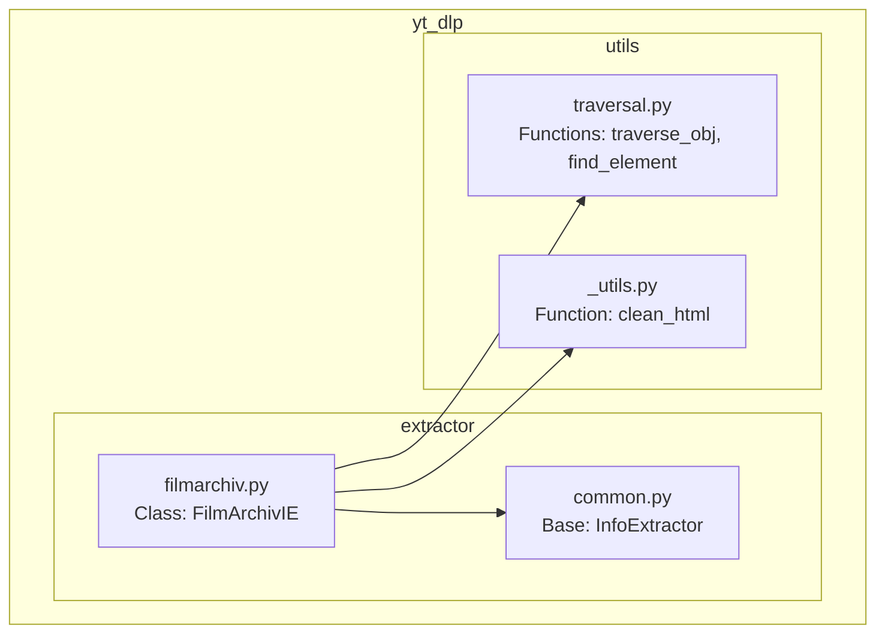
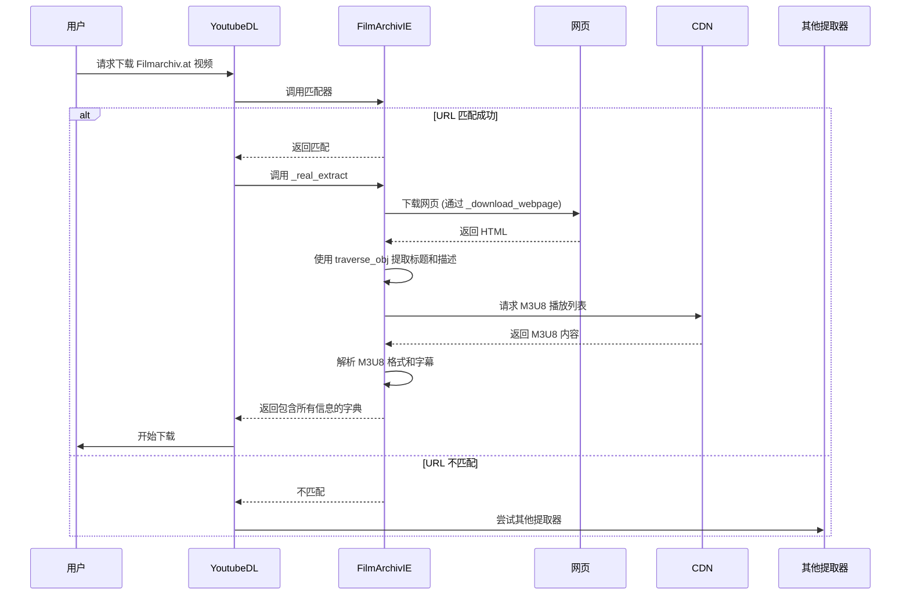
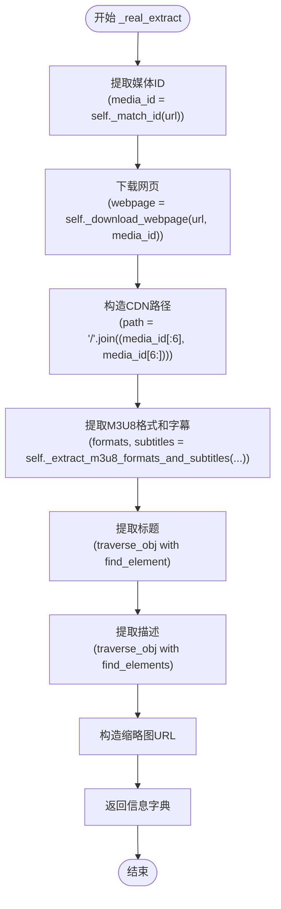
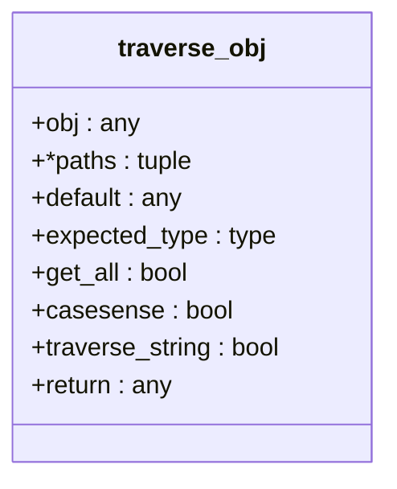
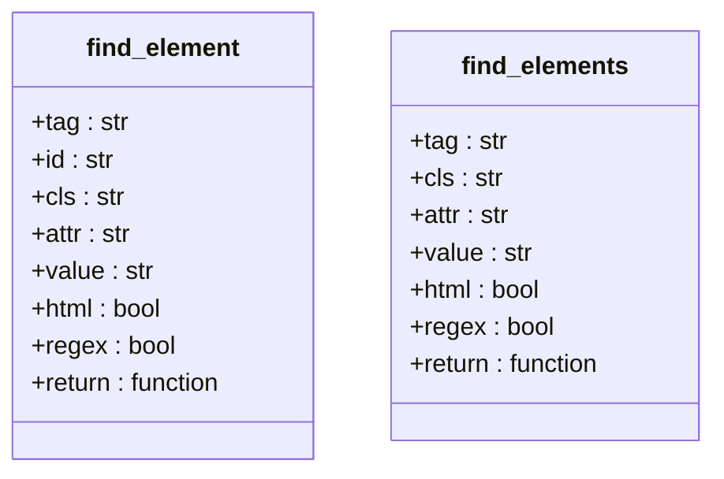
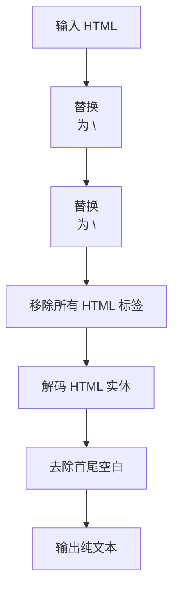
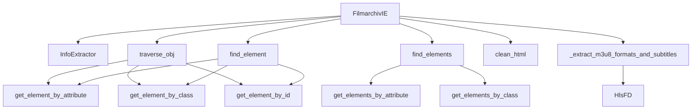

# Filmarchiv.at 提取器

<cite>
**本文档中引用的文件**  
- [filmarchiv.py](file://yt_dlp/extractor/filmarchiv.py)
- [common.py](file://yt_dlp/extractor/common.py)
- [traversal.py](file://yt_dlp/utils/traversal.py)
- [utils/_utils.py](file://yt_dlp/utils/_utils.py)
</cite>

## 目录
1. [简介](#简介)
2. [项目结构](#项目结构)
3. [核心组件](#核心组件)
4. [架构概述](#架构概述)
5. [详细组件分析](#详细组件分析)
6. [依赖分析](#依赖分析)
7. [性能考虑](#性能考虑)
8. [故障排除指南](#故障排除指南)
9. [结论](#结论)

## 简介
Filmarchiv.at 提取器是 yt-dlp 项目中的一个信息提取器，专门用于从 https://www.filmarchiv.at/de/filmarchiv-on/video/ 网站提取视频信息。该提取器能够解析视频页面，获取视频标题、描述、缩略图以及通过 HLS (HTTP Live Streaming) 协议提供的视频格式和字幕信息。提取器的设计遵循 yt-dlp 的通用架构，继承自 `InfoExtractor` 基类，并利用了一系列工具函数来处理网页内容和媒体格式。

## 项目结构
yt-dlp 项目的结构是模块化的，主要组件包括提取器（extractor）、下载器（downloader）、后处理器（postprocessor）和工具函数（utils）。Filmarchiv.at 提取器位于 `yt_dlp/extractor/` 目录下，其功能依赖于 `common.py` 中定义的基类和通用方法，以及 `utils/` 目录下的各种实用工具。



**图源**
- [filmarchiv.py](file://yt_dlp/extractor/filmarchiv.py)
- [common.py](file://yt_dlp/extractor/common.py)
- [traversal.py](file://yt_dlp/utils/traversal.py)
- [utils/_utils.py](file://yt_dlp/utils/_utils.py)

**节源**
- [filmarchiv.py](file://yt_dlp/extractor/filmarchiv.py)
- [common.py](file://yt_dlp/extractor/common.py)

## 核心组件
Filmarchiv.at 提取器的核心组件是 `FilmArchivIE` 类，它继承自 `InfoExtractor`。该类的主要职责是：
1.  **URL 匹配**: 使用 `_VALID_URL` 正则表达式来识别和匹配有效的 Filmarchiv.at 视频页面 URL。
2.  **信息提取**: 通过 `_real_extract` 方法下载网页内容，并从中提取视频的元数据（如标题、描述、缩略图）和媒体格式信息。
3.  **测试用例**: 通过 `_TESTS` 字段提供内置的测试用例，用于验证提取器的正确性。

**节源**
- [filmarchiv.py](file://yt_dlp/extractor/filmarchiv.py#L10-L33)

## 架构概述
Filmarchiv.at 提取器的架构是典型的 yt-dlp 提取器模式。它首先通过 `_match_id` 方法从 URL 中提取视频 ID，然后使用 `_download_webpage` 下载视频页面的 HTML 内容。接着，它利用 `traverse_obj` 和 `find_element` 等工具函数从 HTML 中提取标题和描述。对于视频流，它构造一个指向 M3U8 播放列表的 URL，并调用父类的 `_extract_m3u8_formats_and_subtitles` 方法来解析 HLS 流，获取可用的视频格式和字幕。



**图源**
- [filmarchiv.py](file://yt_dlp/extractor/filmarchiv.py#L35-L52)
- [common.py](file://yt_dlp/extractor/common.py#L2169-L2368)

## 详细组件分析

### FilmArchivIE 类分析
`FilmArchivIE` 类是整个提取过程的核心。它定义了提取器的行为和属性。

#### 类属性分析
```mermaid
classDiagram
class FilmArchivIE {
+IE_DESC : str
+_VALID_URL : str
+_TESTS : list
}
FilmArchivIE : IE_DESC = 'FILMARCHIV ON'
FilmArchivIE : _VALID_URL = r'https? : //(? : www\.)?filmarchiv\.at/de/filmarchiv-on/video/(?P<id>f_[0-9a-zA-Z]{5,})'
FilmArchivIE : _TESTS = [ ... ]
```

**图源**
- [filmarchiv.py](file://yt_dlp/extractor/filmarchiv.py#L11-L33)

#### _real_extract 方法分析
该方法是提取逻辑的入口，它协调了网页下载、信息提取和格式解析。



**图源**
- [filmarchiv.py](file://yt_dlp/extractor/filmarchiv.py#L35-L52)

**节源**
- [filmarchiv.py](file://yt_dlp/extractor/filmarchiv.py#L35-L52)

### 工具函数分析
`FilmArchivIE` 依赖于多个强大的工具函数来完成其任务。

#### traverse_obj 函数分析
`traverse_obj` 是一个通用的对象遍历函数，用于安全地从嵌套的字典、列表或 HTML 元素中提取数据。它支持多种查询方式，包括键访问、函数过滤和正则表达式匹配。



**图源**
- [traversal.py](file://yt_dlp/utils/traversal.py#L38-L104)

#### find_element 和 find_elements 函数分析
这些函数是 `traverse_obj` 的辅助函数，专门用于在 HTML 字符串中查找特定的元素。`find_element` 返回第一个匹配的元素，而 `find_elements` 返回所有匹配的元素。



**图源**
- [traversal.py](file://yt_dlp/utils/traversal.py#L398-L431)

#### clean_html 函数分析
`clean_html` 函数用于清理 HTML 片段，将其转换为纯文本。它会移除 HTML 标签，将换行符（`<br>`）转换为文本换行，并解码 HTML 实体。



**图源**
- [utils/_utils.py](file://yt_dlp/utils/_utils.py#L524-L537)

**节源**
- [utils/_utils.py](file://yt_dlp/utils/_utils.py#L524-L537)

## 依赖分析
Filmarchiv.at 提取器的依赖关系清晰地展示了其模块化设计。



**图源**
- [filmarchiv.py](file://yt_dlp/extractor/filmarchiv.py)
- [common.py](file://yt_dlp/extractor/common.py)
- [traversal.py](file://yt_dlp/utils/traversal.py)

**节源**
- [filmarchiv.py](file://yt_dlp/extractor/filmarchiv.py)
- [common.py](file://yt_dlp/extractor/common.py)
- [traversal.py](file://yt_dlp/utils/traversal.py)

## 性能考虑
Filmarchiv.at 提取器的性能主要受网络请求和 HTML 解析的影响。它执行两次主要的网络请求：一次是下载视频页面的 HTML，另一次是下载 M3U8 播放列表。`traverse_obj` 函数的效率很高，因为它使用了生成器和惰性求值，避免了不必要的数据复制。对于大规模下载，建议使用 yt-dlp 的缓存功能来减少对网站的重复请求。

## 故障排除指南
如果 Filmarchiv.at 提取器无法正常工作，可以参考以下步骤进行排查：

1.  **检查 URL**: 确保提供的 URL 与 `_VALID_URL` 正则表达式完全匹配。
2.  **检查网络连接**: 确认可以访问 `filmarchiv.at` 和 `cdn.filmarchiv.at`。
3.  **查看 HTML 结构**: 网站的 HTML 结构可能已更改，导致 `find_element` 和 `find_elements` 无法找到目标元素。需要更新选择器。
4.  **检查 M3U8 URL**: 确认构造的 M3U8 URL (`https://cdn.filmarchiv.at/{path}_v1_sv1/playlist.m3u8`) 是否有效。
5.  **运行测试**: 使用 `_TESTS` 中的 URL 运行 yt-dlp 的测试套件，以验证提取器的基本功能。

**节源**
- [filmarchiv.py](file://yt_dlp/extractor/filmarchiv.py#L13-L33)

## 结论
Filmarchiv.at 提取器是一个设计良好、功能明确的 yt-dlp 组件。它有效地利用了 yt-dlp 框架提供的强大工具，如 `InfoExtractor` 基类、`traverse_obj` 和 `find_element`，实现了对特定网站视频内容的可靠提取。其代码结构清晰，易于维护和扩展。通过本分析，我们全面了解了其工作原理、内部组件和依赖关系，为未来的维护和调试提供了坚实的基础。