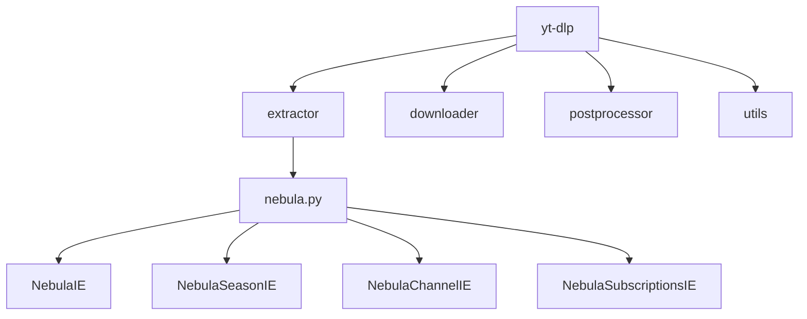
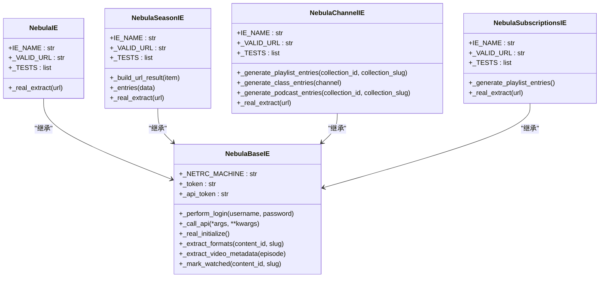
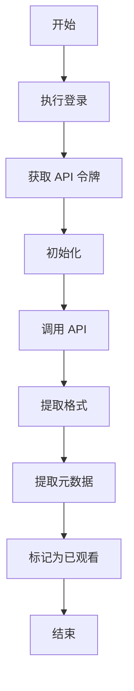
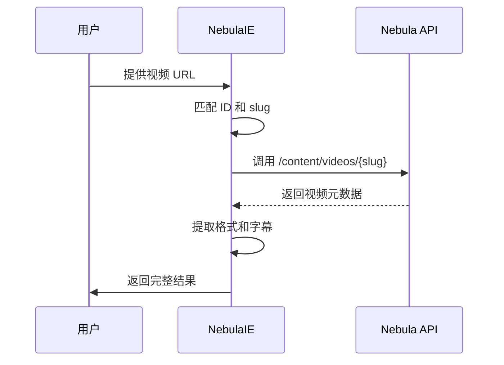
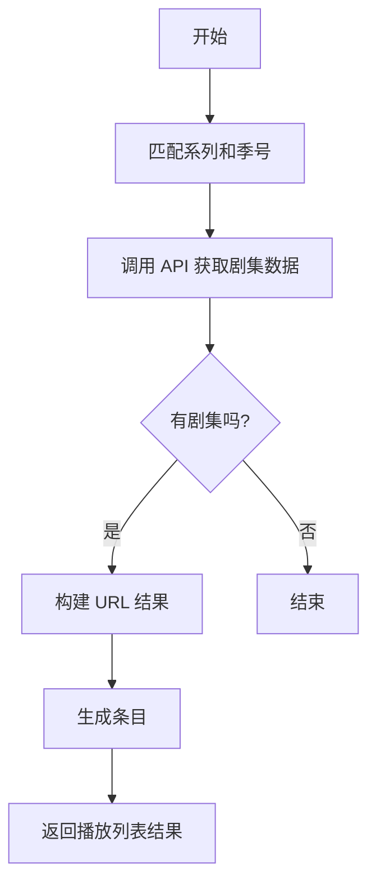
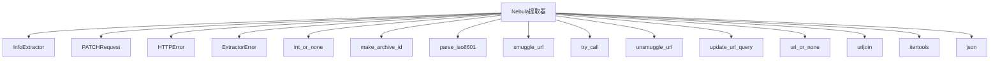

# Nebula.tv 剧集支持

<cite>
**本文档中引用的文件**
- [nebula.py](file://yt_dlp/extractor/nebula.py)
- [supportedsites.md](file://supportedsites.md)
- [Changelog.md](file://Changelog.md)
</cite>

## 目录
1. [简介](#简介)
2. [项目结构](#项目结构)
3. [核心组件](#核心组件)
4. [架构概述](#架构概述)
5. [详细组件分析](#详细组件分析)
6. [依赖分析](#依赖分析)
7. [性能考虑](#性能考虑)
8. [故障排除指南](#故障排除指南)
9. [结论](#结论)

## 简介
yt-dlp 是一个功能丰富的命令行音视频下载器，支持数千个网站，包括 Nebula.tv。该项目是 youtube-dl 的一个分支，旨在提供更现代和更稳定的功能集。Nebula.tv 是一个由知名内容创作者组成的流媒体平台，yt-dlp 提供了对 Nebula.tv 上视频、剧集、频道和订阅内容的全面支持。

**Section sources**
- [README.md](file://README.md#L19)

## 项目结构
yt-dlp 项目具有清晰的模块化结构，主要组件包括提取器（extractor）、下载器（downloader）、后处理器（postprocessor）和工具（utils）。Nebula.tv 的支持功能主要位于 `yt_dlp/extractor/nebula.py` 文件中，该文件实现了多个提取器类来处理不同类型的 Nebula.tv 内容。

**Diagram sources**
- [nebula.py](file://yt_dlp/extractor/nebula.py#L126-L512)

**Section sources**
- [project_structure](file://project_structure)

## 核心组件
Nebula.tv 支持的核心组件是 `nebula.py` 文件中的多个提取器类。这些类继承自 `NebulaBaseIE`，并实现了特定的功能来处理不同类型的 Nebula.tv 内容。主要的提取器包括用于单个视频的 `NebulaIE`、用于剧集的 `NebulaSeasonIE`、用于频道的 `NebulaChannelIE` 和用于订阅内容的 `NebulaSubscriptionsIE`。

**Section sources**
- [nebula.py](file://yt_dlp/extractor/nebula.py#L25-L512)

## 架构概述
Nebula.tv 提取器的架构基于 yt-dlp 的通用提取器框架。`NebulaBaseIE` 类提供了基础功能，如登录、API 调用和格式提取。具体的提取器类则负责处理特定类型的 URL 和内容。整个架构设计为可扩展和模块化，使得添加新功能和修复问题变得相对简单。

**Diagram sources**
- [nebula.py](file://yt_dlp/extractor/nebula.py#L25-L512)

## 详细组件分析

### NebulaBaseIE 分析
`NebulaBaseIE` 是所有 Nebula 提取器的基类，提供了共享的功能和方法。它处理身份验证、API 调用和视频元数据提取等核心功能。

#### 功能分析

**Diagram sources**
- [nebula.py](file://yt_dlp/extractor/nebula.py#L25-L124)

**Section sources**
- [nebula.py](file://yt_dlp/extractor/nebula.py#L25-L124)

### NebulaIE 分析
`NebulaIE` 类负责处理单个视频的提取。它通过视频 slug 从 API 获取元数据，并使用提取的格式信息来构建最终的下载结果。

#### 工作流程

**Diagram sources**
- [nebula.py](file://yt_dlp/extractor/nebula.py#L126-L248)

**Section sources**
- [nebula.py](file://yt_dlp/extractor/nebula.py#L126-L248)

### NebulaSeasonIE 分析
`NebulaSeasonIE` 类专门用于处理剧集内容。它通过剧集的系列名称和季号来获取剧集信息，并生成包含所有剧集的播放列表。

#### 剧集处理流程

**Diagram sources**
- [nebula.py](file://yt_dlp/extractor/nebula.py#L483-L512)

**Section sources**
- [nebula.py](file://yt_dlp/extractor/nebula.py#L483-L512)

## 依赖分析
Nebula.tv 提取器依赖于 yt-dlp 的核心功能，如 `InfoExtractor` 基类、网络请求功能和实用工具函数。此外，它还依赖于外部库如 `itertools` 和 `json` 来处理数据和迭代。

**Diagram sources**
- [nebula.py](file://yt_dlp/extractor/nebula.py#L1-L21)

**Section sources**
- [nebula.py](file://yt_dlp/extractor/nebula.py#L1-L21)

## 性能考虑
Nebula.tv 提取器在设计时考虑了性能优化。例如，`_extract_formats` 方法实现了重试机制，以应对临时的网络问题。此外，API 调用被封装在 `_call_api` 方法中，该方法在遇到授权错误时会自动重新授权，从而减少了因令牌过期而导致的失败。

## 故障排除指南
如果在使用 Nebula.tv 提取器时遇到问题，可以参考以下步骤进行故障排除：
1. 确保 yt-dlp 是最新版本。
2. 检查是否需要登录才能访问特定内容。
3. 验证提供的 URL 是否正确。
4. 查看详细的错误消息以确定问题的根源。

**Section sources**
- [nebula.py](file://yt_dlp/extractor/nebula.py#L70-L86)

## 结论
yt-dlp 对 Nebula.tv 的支持是全面且功能丰富的，涵盖了从单个视频到完整剧集和频道的各种内容类型。通过模块化的设计和清晰的架构，Nebula 提取器能够高效地处理各种下载需求，并为用户提供稳定可靠的下载体验。