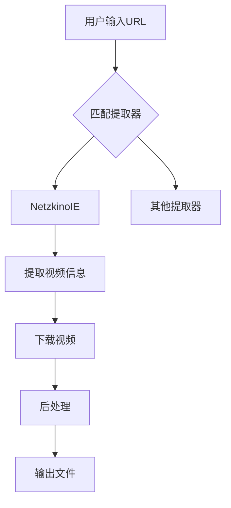
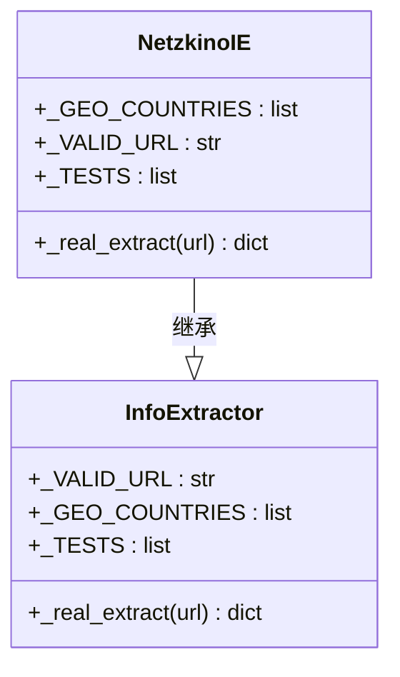
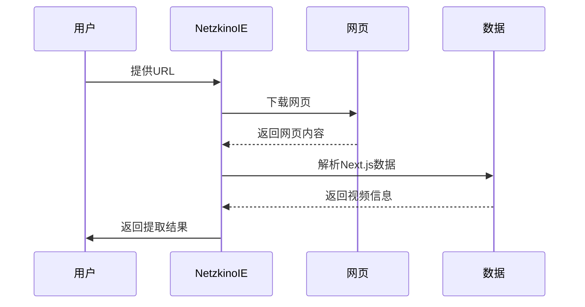
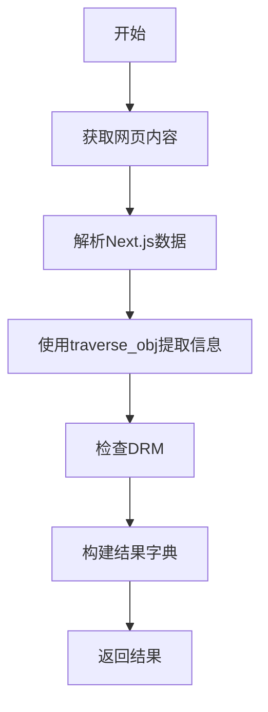
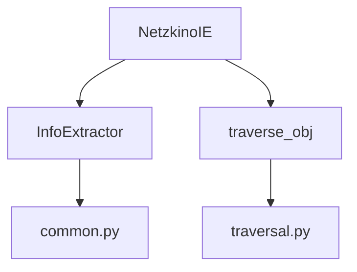

# NetzkinoIE 重构

<cite>
**本文档引用的文件**   
- [netzkino.py](file://yt_dlp/extractor/netzkino.py#L1-L61)
- [common.py](file://yt_dlp/extractor/common.py#L107-L579)
- [traversal.py](file://yt_dlp/utils/traversal.py#L38-L313)
</cite>

## 目录
1. [项目结构](#项目结构)
2. [核心组件](#核心组件)
3. [架构概述](#架构概述)
4. [详细组件分析](#详细组件分析)
5. [依赖分析](#依赖分析)

## 项目结构
yt-dlp 项目是一个功能丰富的命令行音视频下载工具，支持数千个网站。项目结构清晰，主要分为以下几个部分：

- **bundle/**: 包含用于构建独立可执行文件的脚本，如 Docker 配置和 PyInstaller 脚本。
- **devscripts/**: 包含开发脚本，如自动补全脚本、测试脚本和构建脚本。
- **test/**: 包含测试文件和测试数据，用于验证提取器和下载功能。
- **yt_dlp/**: 核心代码目录，包含提取器、下载器、后处理器和工具函数。
- **根目录文件**: 包含 README、许可证、配置文件和构建脚本。

**Diagram sources**
- [README.md](file://README.md#L1-L800)

## 核心组件
yt-dlp 的核心组件包括信息提取器（InfoExtractor）、下载器（Downloader）和后处理器（PostProcessor）。信息提取器负责从特定网站提取视频信息，下载器负责下载视频文件，后处理器负责对下载的文件进行处理。

**Section sources**
- [common.py](file://yt_dlp/extractor/common.py#L107-L579)

## 架构概述
yt-dlp 的架构基于模块化设计，各个组件之间通过清晰的接口进行通信。信息提取器继承自 `InfoExtractor` 类，通过重写 `_real_extract` 方法来实现特定网站的视频信息提取。下载器和后处理器也采用类似的继承机制。

**Diagram sources**
- [common.py](file://yt_dlp/extractor/common.py#L107-L579)

## 详细组件分析
### NetzkinoIE 分析
NetzkinoIE 是一个专门用于从 Netzkino 网站提取视频信息的提取器。它继承自 `InfoExtractor` 类，并实现了 `_real_extract` 方法来解析网页内容并提取视频信息。

#### 类图

**Diagram sources**
- [netzkino.py](file://yt_dlp/extractor/netzkino.py#L11-L61)
- [common.py](file://yt_dlp/extractor/common.py#L107-L579)

#### 提取流程

**Diagram sources**
- [netzkino.py](file://yt_dlp/extractor/netzkino.py#L33-L61)

### 数据提取分析
NetzkinoIE 使用 `traverse_obj` 函数来从复杂的嵌套数据结构中提取所需信息。该函数支持多种路径匹配方式，能够灵活地处理不同的数据结构。

#### 数据提取流程

**Diagram sources**
- [netzkino.py](file://yt_dlp/extractor/netzkino.py#L33-L61)
- [traversal.py](file://yt_dlp/utils/traversal.py#L38-L313)

## 依赖分析
NetzkinoIE 依赖于 yt-dlp 的核心模块，包括 `InfoExtractor` 类和 `traverse_obj` 函数。这些依赖关系确保了提取器能够正确地解析网页内容并提取视频信息。

**Diagram sources**
- [netzkino.py](file://yt_dlp/extractor/netzkino.py#L1-L61)
- [common.py](file://yt_dlp/extractor/common.py#L107-L579)
- [traversal.py](file://yt_dlp/utils/traversal.py#L38-L313)

**Section sources**
- [netzkino.py](file://yt_dlp/extractor/netzkino.py#L1-L61)
- [common.py](file://yt_dlp/extractor/common.py#L107-L579)
- [traversal.py](file://yt_dlp/utils/traversal.py#L38-L313)