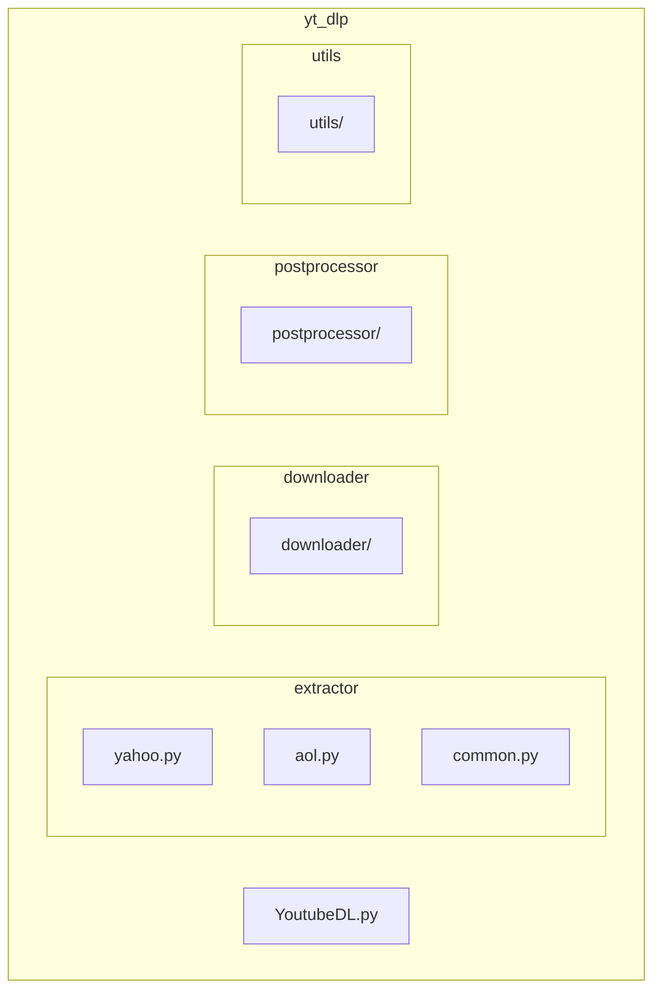
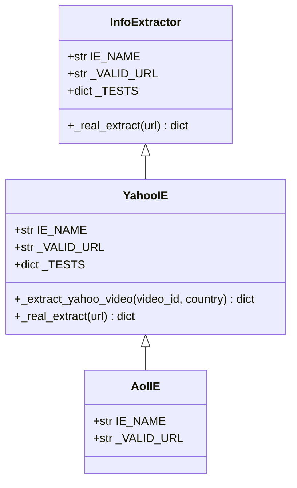
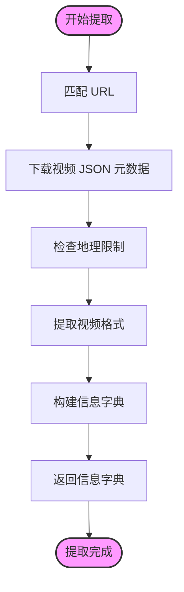
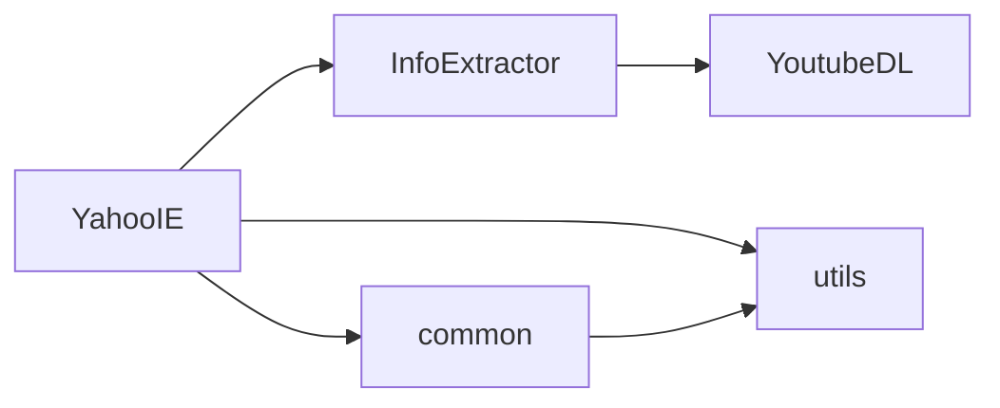

# YahooIE 现代化

<cite>
**本文档中引用的文件**   
- [yahoo.py](file://yt_dlp/extractor/yahoo.py)
- [aol.py](file://yt_dlp/extractor/aol.py)
- [YoutubeDL.py](file://yt_dlp/YoutubeDL.py)
- [_extractors.py](file://yt_dlp/extractor/_extractors.py)
- [common.py](file://yt_dlp/extractor/common.py)
</cite>

## 目录
1. [简介](#简介)
2. [项目结构](#项目结构)
3. [核心组件](#核心组件)
4. [架构概述](#架构概述)
5. [详细组件分析](#详细组件分析)
6. [依赖分析](#依赖分析)
7. [性能考虑](#性能考虑)
8. [故障排除指南](#故障排除指南)
9. [结论](#结论)

## 简介
YahooIE 是 yt-dlp 项目中用于从 Yahoo 网站提取视频信息的提取器。它负责处理 Yahoo 视频页面的 URL，提取视频元数据（如标题、描述、持续时间等）和可用的视频格式，然后将这些信息提供给下载器进行实际的视频下载。YahooIE 的设计遵循 yt-dlp 的通用提取器模式，通过继承 `InfoExtractor` 基类来实现其功能。

## 项目结构
yt-dlp 项目的结构是模块化的，主要组件包括提取器（extractor）、下载器（downloader）、后处理器（postprocessor）和工具（utils）。YahooIE 作为提取器的一部分，位于 `yt_dlp/extractor/` 目录下。

**Diagram sources**
- [yahoo.py](file://yt_dlp/extractor/yahoo.py)
- [aol.py](file://yt_dlp/extractor/aol.py)
- [common.py](file://yt_dlp/extractor/common.py)
- [YoutubeDL.py](file://yt_dlp/YoutubeDL.py)

**Section sources**
- [yahoo.py](file://yt_dlp/extractor/yahoo.py)
- [aol.py](file://yt_dlp/extractor/aol.py)

## 核心组件
YahooIE 的核心功能包括 URL 匹配、视频信息提取和格式解析。它通过 `_VALID_URL` 正则表达式匹配 Yahoo 视频页面的 URL，并使用 `_real_extract` 方法执行实际的提取过程。该提取器还支持从 AOL 页面提取视频，因为 AOL 使用了 Yahoo 的视频服务。

**Section sources**
- [yahoo.py](file://yt_dlp/extractor/yahoo.py#L20-L258)
- [aol.py](file://yt_dlp/extractor/aol.py#L12-L15)

## 架构概述
YahooIE 的架构遵循 yt-dlp 提取器的标准模式。它继承自 `InfoExtractor` 类，并重写 `_real_extract` 方法来实现特定于 Yahoo 的提取逻辑。提取过程涉及下载网页内容、解析 JSON 数据以获取视频元数据和格式信息，并构建包含所有必要信息的字典。

**Diagram sources**
- [yahoo.py](file://yt_dlp/extractor/yahoo.py)
- [aol.py](file://yt_dlp/extractor/aol.py)
- [common.py](file://yt_dlp/extractor/common.py)

## 详细组件分析

### YahooIE 分析
YahooIE 是处理 Yahoo 视频的主要提取器。它通过向 Yahoo 的视频 API 发送请求来获取视频的元数据和格式信息。

#### 提取流程

**Diagram sources**
- [yahoo.py](file://yt_dlp/extractor/yahoo.py#L139-L258)

#### URL 匹配
YahooIE 使用一个复杂的正则表达式来匹配各种 Yahoo 域名和视频页面的 URL 结构。这包括支持不同的国家/地区代码（如 `tw.`、`es-us.`）和各种子域。

**Section sources**
- [yahoo.py](file://yt_dlp/extractor/yahoo.py#L23)

#### 视频信息提取
`_extract_yahoo_video` 方法是 YahooIE 的核心，它负责从 Yahoo 的 API 获取视频信息。该方法会下载 JSON 数据，解析视频格式（包括 HLS 和 MP4），并处理字幕。

**Section sources**
- [yahoo.py](file://yt_dlp/extractor/yahoo.py#L139-L209)

### AolIE 分析
AolIE 是一个简单的提取器，它继承自 YahooIE，用于处理 AOL 视频页面。由于 AOL 使用 Yahoo 的视频服务，因此可以直接复用 YahooIE 的功能。

**Section sources**
- [aol.py](file://yt_dlp/extractor/aol.py)

## 依赖分析
YahooIE 依赖于 yt-dlp 的核心组件，如 `InfoExtractor` 基类和各种工具函数。它还依赖于网络模块来发送 HTTP 请求和处理响应。

**Diagram sources**
- [yahoo.py](file://yt_dlp/extractor/yahoo.py)
- [common.py](file://yt_dlp/extractor/common.py)
- [YoutubeDL.py](file://yt_dlp/YoutubeDL.py)

**Section sources**
- [yahoo.py](file://yt_dlp/extractor/yahoo.py)
- [common.py](file://yt_dlp/extractor/common.py)

## 性能考虑
YahooIE 的性能主要取决于网络请求的速度和 Yahoo API 的响应时间。由于它需要下载多个 JSON 文件来获取视频格式信息，因此在高延迟网络环境下可能会有性能瓶颈。

## 故障排除指南
如果 YahooIE 无法正常工作，可以检查以下几点：
- 确保网络连接正常。
- 检查 Yahoo 视频页面的 URL 是否符合 `_VALID_URL` 正则表达式的模式。
- 查看 yt-dlp 的日志输出，了解是否有网络错误或 API 响应异常。

**Section sources**
- [yahoo.py](file://yt_dlp/extractor/yahoo.py)

## 结论
YahooIE 是一个功能完整的提取器，能够有效地从 Yahoo 和 AOL 网站提取视频信息。通过继承和复用现有代码，它实现了对多个相关网站的支持，展示了 yt-dlp 项目中提取器设计的灵活性和可扩展性。