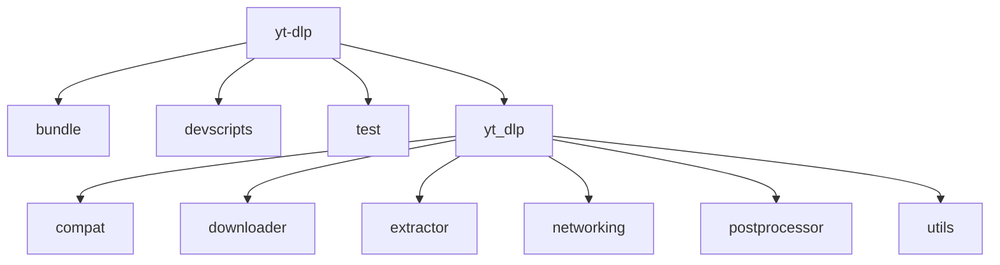
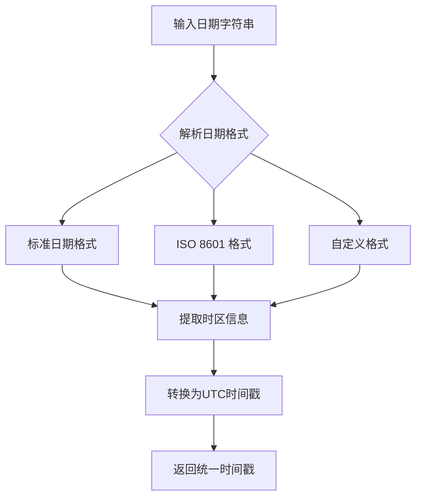
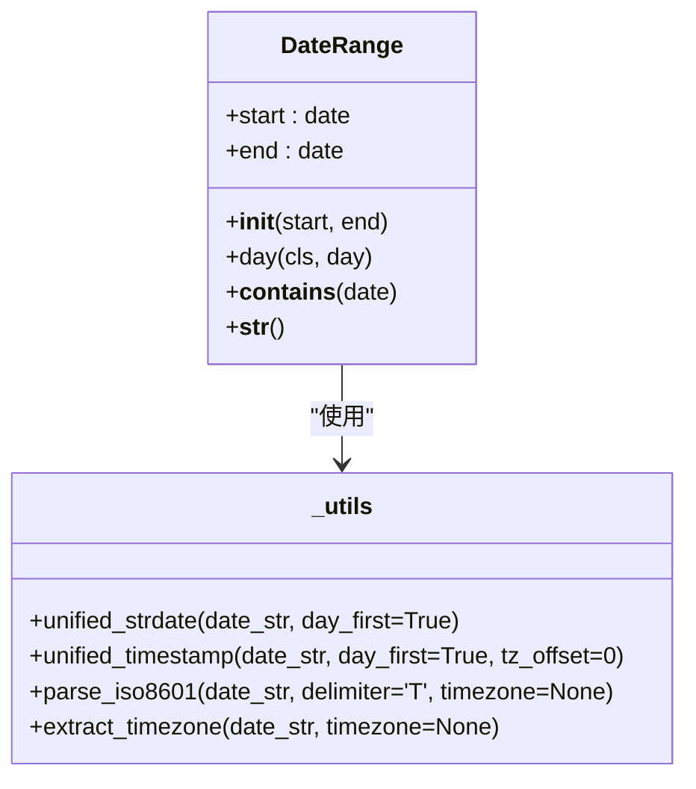
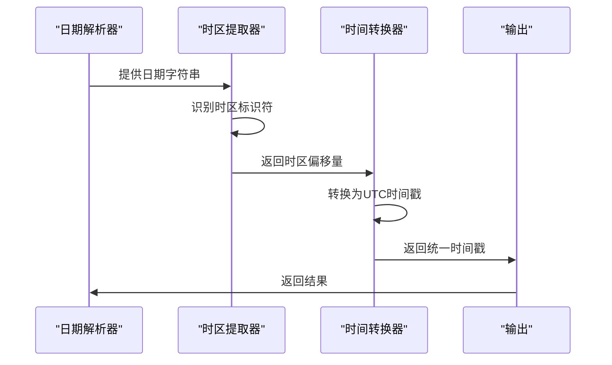
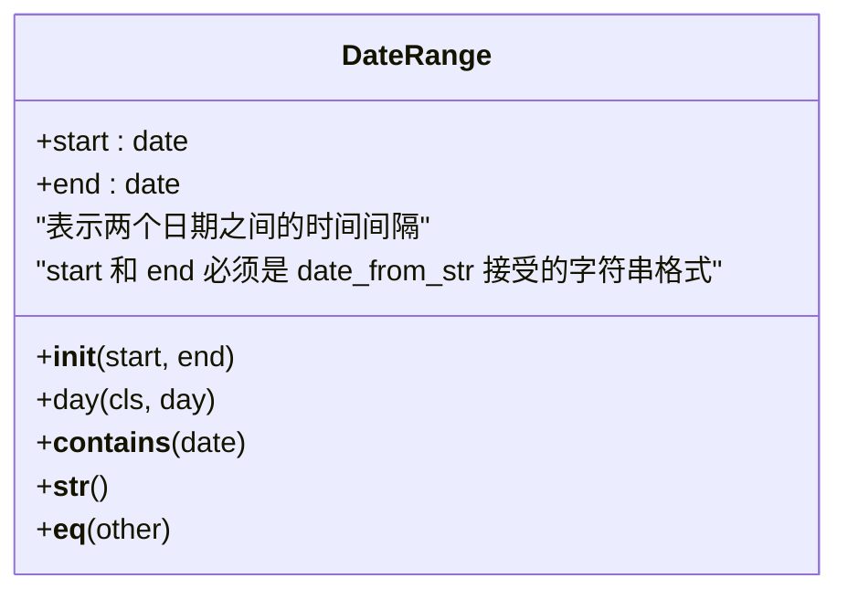
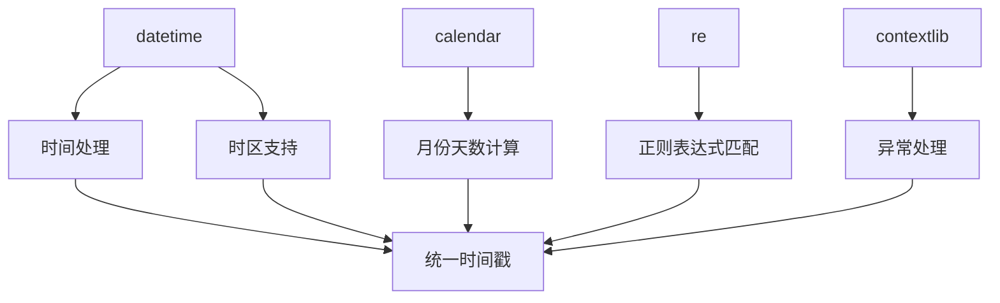

# 统一时间戳时区支持

<cite>
**本文档引用的文件**   
- [README.md](file://README.md)
- [__init__.py](file://yt_dlp/__init__.py)
- [YoutubeDL.py](file://yt_dlp/YoutubeDL.py)
- [_utils.py](file://yt_dlp/utils/_utils.py)
- [test_utils.py](file://test/test_utils.py)
- [compat.py](file://yt_dlp/compat/__init__.py)
</cite>

## 目录
1. [简介](#简介)
2. [项目结构](#项目结构)
3. [核心组件](#核心组件)
4. [架构概述](#架构概述)
5. [详细组件分析](#详细组件分析)
6. [依赖分析](#依赖分析)
7. [性能考虑](#性能考虑)
8. [故障排除指南](#故障排除指南)
9. [结论](#结论)

## 简介
yt-dlp 是一个功能丰富的命令行音视频下载器，支持数千个网站。该项目是 youtube-dl 的一个分支，基于已不再活跃的 youtube-dlc。本项目在时间戳和时区处理方面提供了强大的支持，能够解析和处理各种日期格式和时区信息。

**Section sources**
- [README.md](file://README.md#L1-L800)

## 项目结构
yt-dlp 项目具有清晰的目录结构，主要组件包括：
- `bundle/`: 包含 Docker 和 PyInstaller 打包相关的文件
- `devscripts/`: 开发工具脚本
- `test/`: 测试文件和测试数据
- `yt_dlp/`: 核心代码目录
  - `compat/`: 兼容性模块
  - `downloader/`: 下载器实现
  - `extractor/`: 提取器实现
  - `networking/`: 网络相关功能
  - `postprocessor/`: 后处理器
  - `utils/`: 工具函数

**Diagram sources **
- [README.md](file://README.md#L1-L800)

## 核心组件
yt-dlp 的核心功能围绕时间戳和时区处理构建，主要涉及以下几个关键组件：
- 时间解析工具：统一处理各种日期格式
- 时区支持：正确处理不同时区的时间戳
- 日期范围：支持日期范围过滤功能

**Section sources**
- [__init__.py](file://yt_dlp/__init__.py#L1-L800)
- [_utils.py](file://yt_dlp/utils/_utils.py#L1-L200)

## 架构概述
yt-dlp 的时间戳处理架构基于 Python 的 datetime 模块，通过一系列工具函数和类来实现统一的时间处理。系统能够识别和解析多种日期格式，并正确处理时区信息。

**Diagram sources **
- [_utils.py](file://yt_dlp/utils/_utils.py#L1200-L1242)
- [test_utils.py](file://test/test_utils.py#L461-L486)

## 详细组件分析

### 时间解析组件分析
yt-dlp 实现了一套完整的日期时间解析系统，能够处理多种日期格式和时区表示。

#### 日期格式处理

**Diagram sources **
- [_utils.py](file://yt_dlp/utils/_utils.py#L1409-L1444)
- [test_utils.py](file://test/test_utils.py#L426-L432)

#### 时区处理流程

**Diagram sources **
- [_utils.py](file://yt_dlp/utils/_utils.py#L1200-L1242)
- [compat.py](file://yt_dlp/compat/__init__.py#L30)

### 日期范围组件分析
yt-dlp 提供了日期范围过滤功能，允许用户指定下载日期范围。

#### 日期范围类

**Diagram sources **
- [_utils.py](file://yt_dlp/utils/_utils.py#L1409-L1444)

## 依赖分析
yt-dlp 的时间戳处理功能依赖于 Python 标准库中的多个模块：

**Diagram sources **
- [_utils.py](file://yt_dlp/utils/_utils.py#L1-L200)
- [compat.py](file://yt_dlp/compat/__init__.py)

## 性能考虑
yt-dlp 在时间戳处理方面进行了优化，确保高效处理大量日期数据：

1. **缓存机制**：使用 functools.cache 装饰器缓存常用函数的结果
2. **预编译正则表达式**：预先编译常用的正则表达式模式
3. **批量处理**：支持批量日期解析操作
4. **异常处理**：使用 contextlib.suppress 减少异常开销

**Section sources**
- [_utils.py](file://yt_dlp/utils/_utils.py#L172-L185)

## 故障排除指南
在使用 yt-dlp 的时间戳功能时，可能会遇到以下常见问题：

1. **日期格式不识别**：确保日期字符串符合支持的格式
2. **时区处理错误**：检查时区标识符是否正确
3. **时间戳精度问题**：注意毫秒和微秒的处理差异
4. **日期范围边界问题**：确认日期范围的包含关系

**Section sources**
- [test_utils.py](file://test/test_utils.py#L461-L864)
- [_utils.py](file://yt_dlp/utils/_utils.py#L1200-L1242)

## 结论
yt-dlp 提供了一套完整且灵活的时间戳和时区处理系统，能够有效处理各种日期格式和时区信息。通过统一的 API 接口，用户可以方便地解析、转换和比较时间数据，为音视频下载提供了可靠的时间处理基础。