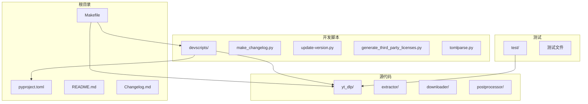
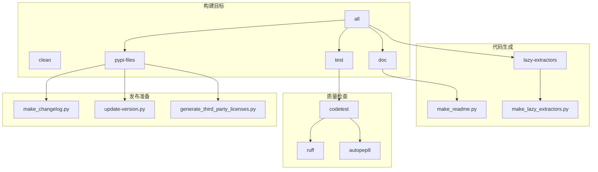
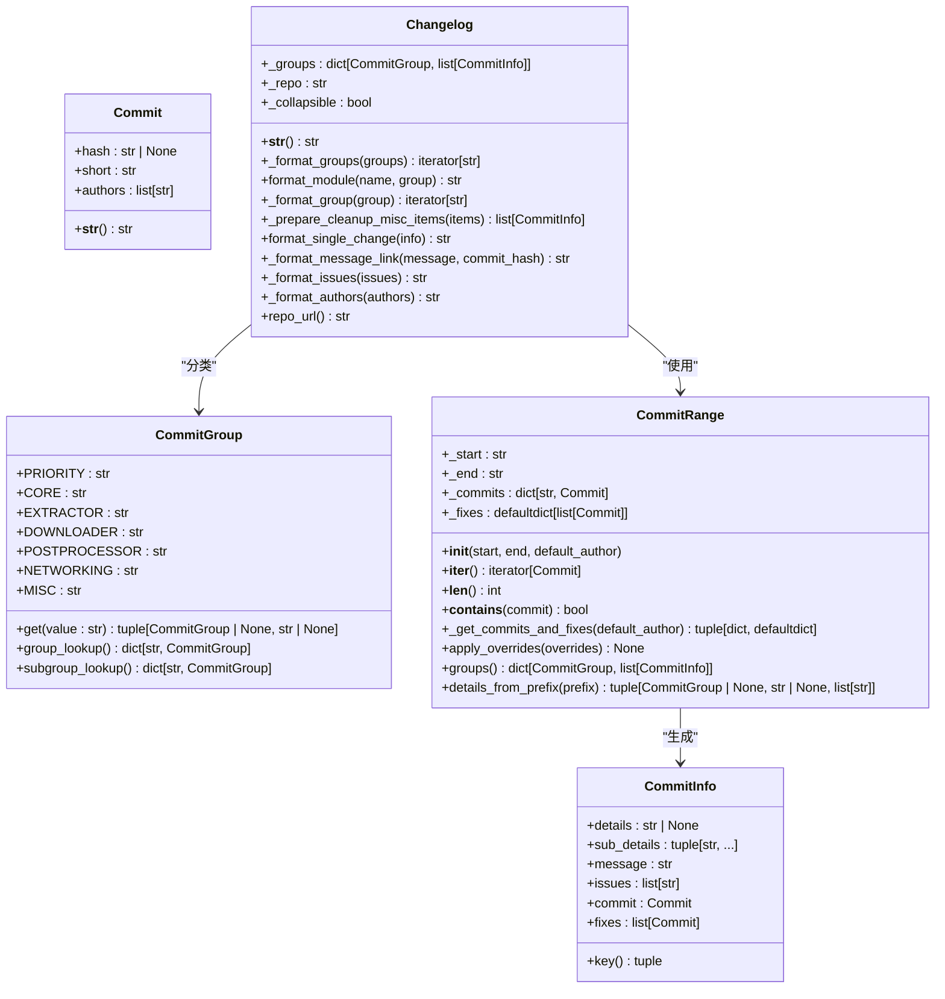
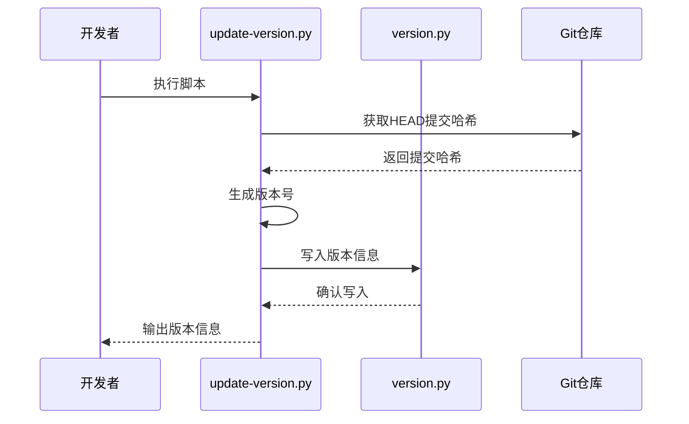
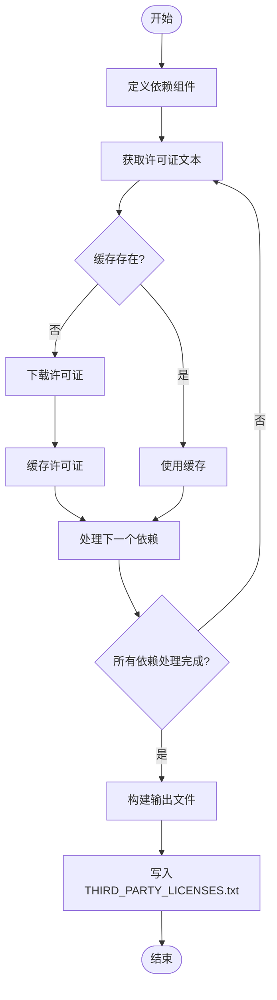
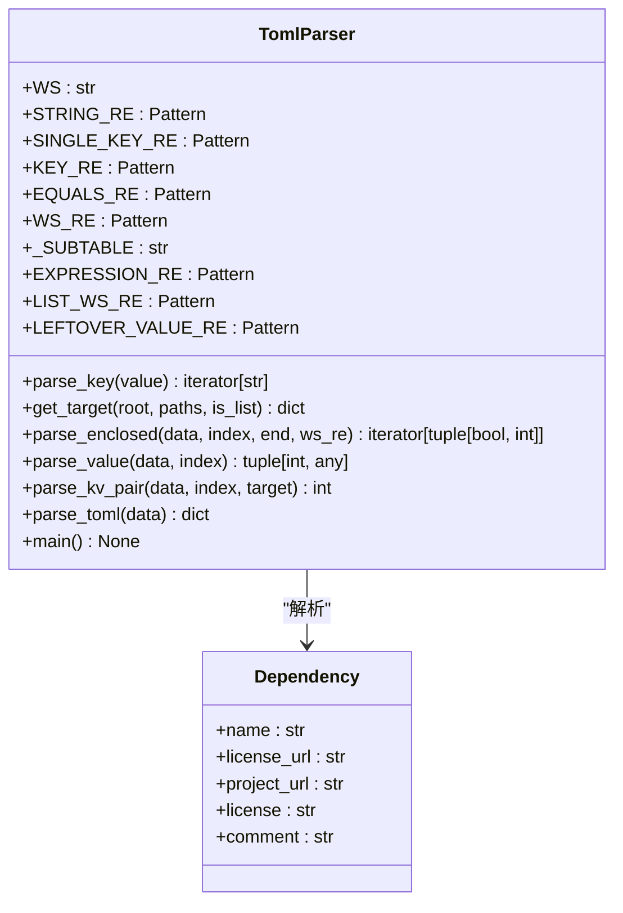
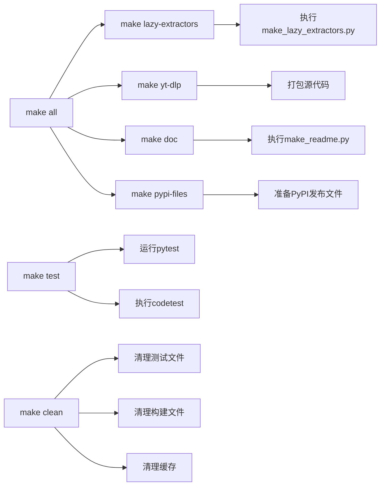
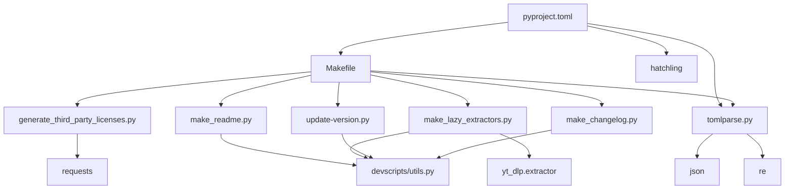

# 开发工作流

<cite>
**本文档引用的文件**
- [Makefile](file://Makefile)
- [devscripts/make_changelog.py](file://devscripts/make_changelog.py)
- [devscripts/update-version.py](file://devscripts/update-version.py)
- [devscripts/generate_third_party_licenses.py](file://devscripts/generate_third_party_licenses.py)
- [devscripts/tomlparse.py](file://devscripts/tomlparse.py)
- [devscripts/utils.py](file://devscripts/utils.py)
- [pyproject.toml](file://pyproject.toml)
- [devscripts/make_lazy_extractors.py](file://devscripts/make_lazy_extractors.py)
- [devscripts/make_readme.py](file://devscripts/make_readme.py)
</cite>

## 目录
1. [简介](#简介)
2. [项目结构](#项目结构)
3. [核心组件](#核心组件)
4. [架构概述](#架构概述)
5. [详细组件分析](#详细组件分析)
6. [依赖分析](#依赖分析)
7. [性能考虑](#性能考虑)
8. [故障排除指南](#故障排除指南)
9. [结论](#结论)
10. [附录](#附录)（如有必要）

## 简介
本文档详细介绍了yt-dlp项目的开发工作流，重点说明了代码贡献的标准流程。文档涵盖了使用各种开发脚本（如make_changelog.py、update-version.py、generate_third_party_licenses.py和tomlparse.py）的自动化任务，以及通过Makefile目标执行的构建和代码生成流程。目标是为开发者提供一个端到端的工作流指导，包括代码生成、格式化和质量检查。

## 项目结构
yt-dlp项目具有清晰的模块化结构，主要分为以下几个部分：
- `bundle/`: 包含Docker和PyInstaller相关的打包脚本
- `devscripts/`: 包含所有开发和自动化脚本
- `test/`: 包含测试代码和测试数据
- `yt_dlp/`: 主要的源代码包
- 根目录下的配置和文档文件

这种结构将开发工具、测试代码和生产代码明确分离，便于维护和协作。

**图源**
- [Makefile](file://Makefile)
- [devscripts/](file://devscripts/)
- [yt_dlp/](file://yt_dlp/)

**节源**
- [Makefile](file://Makefile)
- [pyproject.toml](file://pyproject.toml)

## 核心组件
本节分析开发工作流中的核心自动化组件，包括变更日志生成、版本更新、许可证管理和配置解析等关键脚本。

**节源**
- [devscripts/make_changelog.py](file://devscripts/make_changelog.py)
- [devscripts/update-version.py](file://devscripts/update-version.py)
- [devscripts/generate_third_party_licenses.py](file://devscripts/generate_third_party_licenses.py)
- [devscripts/tomlparse.py](file://devscripts/tomlparse.py)

## 架构概述
yt-dlp的开发工作流架构围绕Makefile构建系统展开，通过一系列自动化脚本实现代码生成、质量检查和发布准备。核心架构包括：
1. **构建系统**: Makefile作为主要的构建和自动化工具
2. **代码生成**: 动态生成提取器和文档
3. **质量保证**: 代码格式化和静态分析
4. **发布准备**: 版本管理、变更日志和许可证生成

**图源**
- [Makefile](file://Makefile)
- [devscripts/make_changelog.py](file://devscripts/make_changelog.py)
- [devscripts/update-version.py](file://devscripts/update-version.py)
- [devscripts/generate_third_party_licenses.py](file://devscripts/generate_third_party_licenses.py)

## 详细组件分析
本节详细分析开发工作流中的各个关键组件及其功能。

### 变更日志生成
`make_changelog.py`脚本用于从Git提交历史生成格式化的变更日志。该脚本分析提交消息，根据预定义的分类（如核心、提取器、下载器等）对变更进行分组，并生成包含链接的Markdown格式输出。

**图源**
- [devscripts/make_changelog.py](file://devscripts/make_changelog.py)

**节源**
- [devscripts/make_changelog.py](file://devscripts/make_changelog.py)

### 版本号更新
`update-version.py`脚本负责更新项目的版本号。它根据当前日期和Git提交哈希生成版本号，并将其写入`yt_dlp/version.py`文件。脚本支持指定更新通道、源仓库和版本后缀等选项。

**图源**
- [devscripts/update-version.py](file://devscripts/update-version.py)

**节源**
- [devscripts/update-version.py](file://devscripts/update-version.py)

### 第三方许可证管理
`generate_third_party_licenses.py`脚本用于收集和生成项目依赖的第三方组件的许可证文本。脚本定义了所有依赖组件的许可证信息，并从网络获取许可证文本，最终生成一个包含所有许可证的聚合文件。

**图源**
- [devscripts/generate_third_party_licenses.py](file://devscripts/generate_third_party_licenses.py)

**节源**
- [devscripts/generate_third_party_licenses.py](file://devscripts/generate_third_party_licenses.py)

### 配置解析
`tomlparse.py`是一个简单的TOML文件解析器，专门用于解析`pyproject.toml`文件。它支持基本的TOML语法，但不支持多行字符串和无效文件。

**图源**
- [devscripts/tomlparse.py](file://devscripts/tomlparse.py)

**节源**
- [devscripts/tomlparse.py](file://devscripts/tomlparse.py)

### Makefile构建目标
Makefile定义了项目的主要构建和自动化目标，是开发工作流的核心。通过执行不同的Make目标，可以完成代码生成、文档生成、测试运行等任务。

**图源**
- [Makefile](file://Makefile)

**节源**
- [Makefile](file://Makefile)

## 依赖分析
项目开发工作流的依赖关系主要体现在脚本之间的调用和数据流。核心依赖包括：

**图源**
- [Makefile](file://Makefile)
- [pyproject.toml](file://pyproject.toml)
- [devscripts/utils.py](file://devscripts/utils.py)

**节源**
- [Makefile](file://Makefile)
- [pyproject.toml](file://pyproject.toml)
- [devscripts/utils.py](file://devscripts/utils.py)

## 性能考虑
虽然开发工作流脚本主要关注功能而非性能，但某些脚本的设计考虑了效率问题：
- `make_changelog.py`使用缓存和批量处理来提高Git历史分析的效率
- `generate_third_party_licenses.py`缓存下载的许可证文件以避免重复网络请求
- `tomlparse.py`使用正则表达式进行快速解析
- Makefile目标设计为可并行执行，提高构建效率

这些优化确保了开发工具在大型项目中也能快速响应。

## 故障排除指南
在使用开发工作流时可能遇到的常见问题及解决方案：

**节源**
- [Makefile](file://Makefile)
- [devscripts/make_changelog.py](file://devscripts/make_changelog.py)
- [devscripts/update-version.py](file://devscripts/update-version.py)
- [devscripts/generate_third_party_licenses.py](file://devscripts/generate_third_party_licenses.py)

### Makefile目标执行失败
当Makefile目标执行失败时，应检查：
1. 是否安装了所有必要的依赖
2. Python版本是否符合要求（>=3.10）
3. Git仓库是否完整
4. 环境变量是否正确设置

### 变更日志生成问题
如果`make_changelog.py`无法正确生成变更日志：
1. 检查Git提交消息是否符合预定义格式
2. 确认`changelog_override.json`文件是否存在且格式正确
3. 验证网络连接是否正常（脚本需要访问GitHub）

### 版本更新失败
当`update-version.py`执行失败时：
1. 确保在Git仓库中执行
2. 检查输出文件路径是否有写权限
3. 验证Python环境是否正常

### 许可证生成失败
如果`generate_third_party_licenses.py`无法完成：
1. 检查网络连接
2. 确认`requests`库已安装
3. 验证目标文件路径权限

## 结论
yt-dlp项目的开发工作流通过一系列精心设计的脚本和Makefile目标，实现了高度自动化的开发和发布流程。从代码生成到质量检查，再到发布准备，每个环节都有相应的工具支持。这种自动化不仅提高了开发效率，还确保了代码质量和发布一致性。开发者可以专注于核心功能开发，而将重复性任务交给自动化工具处理。

## 附录
### Makefile主要目标
| 目标 | 描述 |
|------|------|
| all | 默认目标，执行所有主要构建任务 |
| clean | 清理测试和构建生成的文件 |
| doc | 生成文档文件 |
| test | 运行测试套件 |
| pypi-files | 准备PyPI发布所需的文件 |
| lazy-extractors | 生成惰性加载的提取器模块 |

### 开发脚本功能概览
| 脚本 | 主要功能 |
|------|------|
| make_changelog.py | 从Git历史生成变更日志 |
| update-version.py | 更新项目版本号 |
| generate_third_party_licenses.py | 生成第三方许可证文件 |
| tomlparse.py | 解析TOML配置文件 |
| make_lazy_extractors.py | 生成惰性加载的提取器 |
| make_readme.py | 从帮助文本生成README |