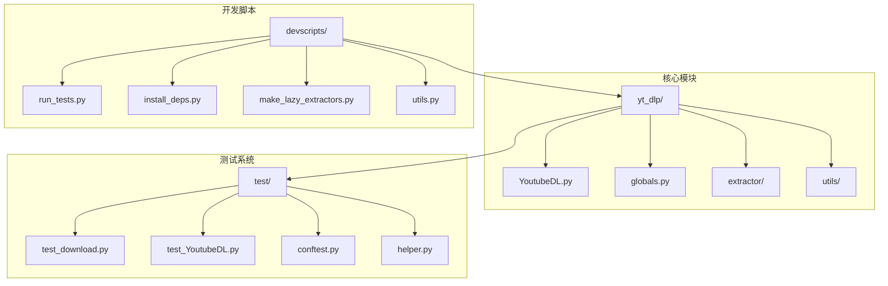
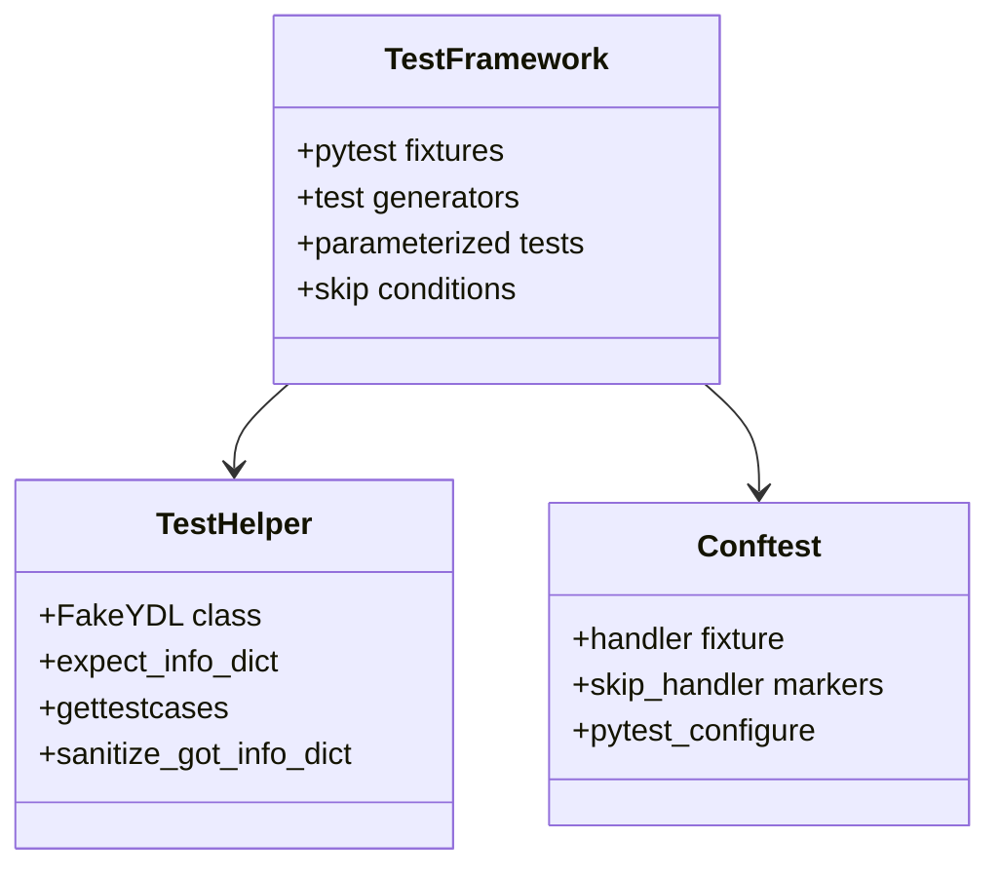
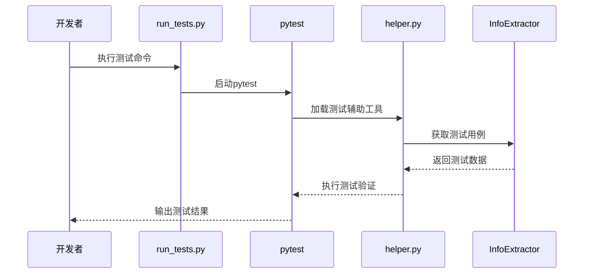
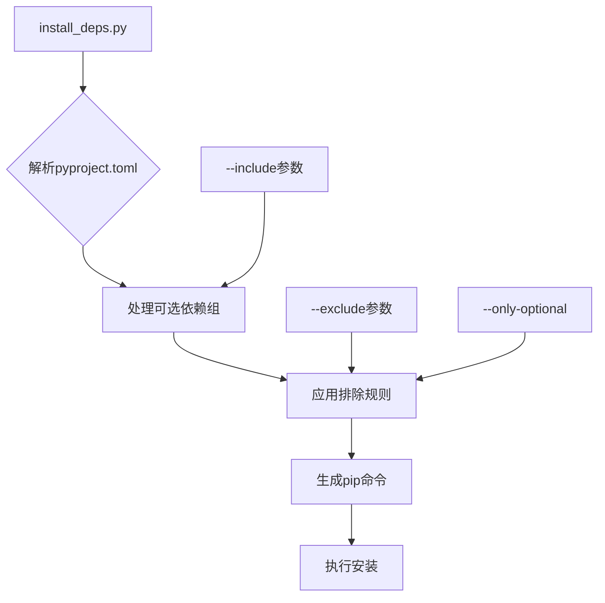
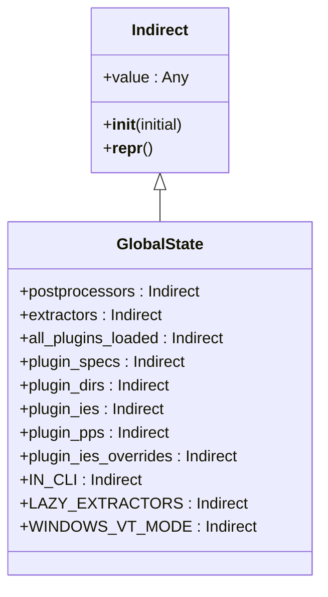
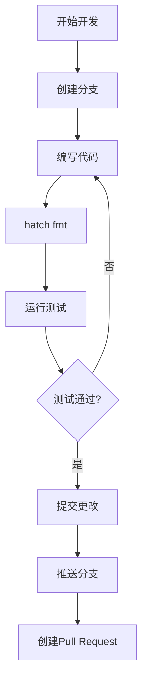
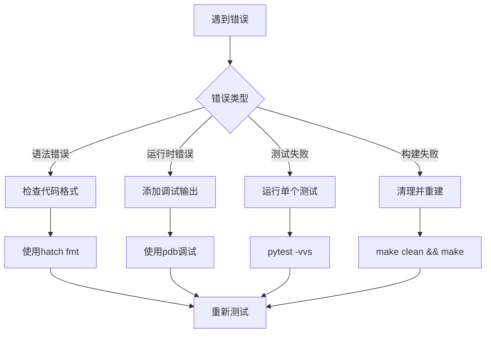

# 开发者调试指南

<cite>
**本文档中引用的文件**
- [README.md](file://README.md)
- [CONTRIBUTING.md](file://CONTRIBUTING.md)
- [test/conftest.py](file://test/conftest.py)
- [test/helper.py](file://test/helper.py)
- [test/test_download.py](file://test/test_download.py)
- [test/test_YoutubeDL.py](file://test/test_YoutubeDL.py)
- [devscripts/run_tests.py](file://devscripts/run_tests.py)
- [devscripts/install_deps.py](file://devscripts/install_deps.py)
- [devscripts/utils.py](file://devscripts/utils.py)
- [devscripts/make_lazy_extractors.py](file://devscripts/make_lazy_extractors.py)
- [devscripts/setup_variables.py](file://devscripts/setup_variables.py)
- [yt_dlp/globals.py](file://yt_dlp/globals.py)
- [Makefile](file://Makefile)
</cite>

## 目录
1. [简介](#简介)
2. [项目结构概览](#项目结构概览)
3. [测试框架详解](#测试框架详解)
4. [开发工具链](#开发工具链)
5. [全局状态管理系统](#全局状态管理系统)
6. [开发环境设置](#开发环境设置)
7. [调试技巧与最佳实践](#调试技巧与最佳实践)
8. [常见问题解决方案](#常见问题解决方案)
9. [贡献代码指南](#贡献代码指南)
10. [故障排除](#故障排除)

## 简介

本指南为yt-dlp项目的开发者提供了全面的调试支持内容。yt-dlp是一个功能丰富的命令行音视频下载器，支持数千个网站。本指南涵盖了从基础测试运行到高级调试技术的完整开发流程。

## 项目结构概览



**图表来源**
- [yt_dlp/globals.py](file://yt_dlp/globals.py#L1-L33)
- [test/conftest.py](file://test/conftest.py#L1-L65)
- [devscripts/run_tests.py](file://devscripts/run_tests.py#L1-L78)

**章节来源**
- [README.md](file://README.md#L1-L100)
- [CONTRIBUTING.md](file://CONTRIBUTING.md#L1-L50)

## 测试框架详解

### 测试架构概述

yt-dlp采用基于pytest的测试框架，提供了完整的测试生态系统：



**图表来源**
- [test/conftest.py](file://test/conftest.py#L1-L65)
- [test/helper.py](file://test/helper.py#L1-L100)

### 核心测试组件

#### 1. 测试配置文件 (conftest.py)

测试配置文件定义了pytest的fixture和标记系统：

- **handler fixture**: 提供请求处理器的测试包装器
- **skip_handler标记**: 条件跳过特定处理器的测试
- **skip_handler_if标记**: 基于条件动态跳过测试

#### 2. 测试辅助工具 (helper.py)

测试辅助工具提供了丰富的测试功能：

- **FakeYDL类**: 模拟YoutubeDL实例进行测试
- **expect_info_dict函数**: 验证提取器输出的标准化方法
- **sanitize_got_info_dict函数**: 清理和标准化测试结果
- **gettestcases函数**: 动态生成测试用例

#### 3. 测试执行流程



**图表来源**
- [devscripts/run_tests.py](file://devscripts/run_tests.py#L20-L50)
- [test/helper.py](file://test/helper.py#L100-L200)

**章节来源**
- [test/conftest.py](file://test/conftest.py#L1-L65)
- [test/helper.py](file://test/helper.py#L1-L385)
- [devscripts/run_tests.py](file://devscripts/run_tests.py#L1-L78)

## 开发工具链

### 依赖管理工具 (install_deps.py)

依赖管理工具提供了灵活的依赖安装方案：



**图表来源**
- [devscripts/install_deps.py](file://devscripts/install_deps.py#L30-L82)

### 代码生成工具

#### 懒加载提取器生成器 (make_lazy_extractors.py)

懒加载提取器生成器优化了启动性能：

- **静态属性提取**: 自动识别和复制类属性
- **方法代码生成**: 生成延迟加载的方法实现
- **继承关系处理**: 正确处理类继承层次结构

#### 版本管理工具 (setup_variables.py)

版本管理工具处理发布流程：

- **渠道管理**: 支持stable、nightly、master等发布渠道
- **版本计算**: 自动生成版本号
- **仓库配置**: 处理源仓库和目标仓库的配置

**章节来源**
- [devscripts/install_deps.py](file://devscripts/install_deps.py#L1-L82)
- [devscripts/make_lazy_extractors.py](file://devscripts/make_lazy_extractors.py#L1-L116)
- [devscripts/setup_variables.py](file://devscripts/setup_variables.py#L1-L158)

## 全局状态管理系统

### 全局状态架构



**图表来源**
- [yt_dlp/globals.py](file://yt_dlp/globals.py#L1-L33)

### 全局状态特性

#### 1. 延迟初始化模式

全局状态使用Indirect类实现延迟初始化：

- **值封装**: 使用value属性存储实际值
- **延迟访问**: 只在需要时才初始化
- **类型安全**: 保持类型一致性

#### 2. 插件系统集成

全局状态管理插件系统的生命周期：

- **插件发现**: 自动扫描插件目录
- **规格管理**: 存储插件元数据
- **优先级控制**: 处理插件覆盖逻辑

#### 3. 调试影响分析

全局状态对调试的影响：

- **状态追踪**: 记录全局状态变化
- **内存监控**: 监控全局对象的内存使用
- **并发安全**: 确保多线程环境下的状态一致性

**章节来源**
- [yt_dlp/globals.py](file://yt_dlp/globals.py#L1-L33)

## 开发环境设置

### 环境准备步骤

#### 1. 克隆和初始化

```bash
# 克隆仓库
git clone https://github.com/yt-dlp/yt-dlp.git
cd yt-dlp

# 安装开发依赖
python -m devscripts.install_deps --include dev
```

#### 2. 设置预提交钩子

```bash
# 安装pre-commit钩子
pre-commit install
```

#### 3. 创建虚拟环境

```bash
# 使用hatch创建虚拟环境
hatch shell
```

### 开发工作流程



**图表来源**
- [CONTRIBUTING.md](file://CONTRIBUTING.md#L150-L200)

**章节来源**
- [CONTRIBUTING.md](file://CONTRIBUTING.md#L150-L250)

## 调试技巧与最佳实践

### 测试调试策略

#### 1. 单元测试调试

```python
# 在测试中添加调试断点
import pdb; pdb.set_trace()

# 或使用Python内置断点
breakpoint()
```

#### 2. 集成测试调试

```python
# 使用pytest的-x选项在失败时停止
pytest -xvs test/test_download.py

# 运行特定测试
pytest test/test_download.py::TestDownload::test_specific_case
```

#### 3. 性能调试

```python
# 使用cProfile分析性能
python -m cProfile -o profile.stats devscripts/run_tests.py

# 分析结果
python -c "import pstats; pstats.Stats('profile.stats').sort_stats('cumulative').print_stats(10)"
```

### 日志和错误处理

#### 1. 调试日志配置

```python
# 在测试中启用详细日志
import logging
logging.basicConfig(level=logging.DEBUG)

# 或在命令行中使用-v参数
yt-dlp -v URL
```

#### 2. 错误处理模式

```python
# 使用try-catch捕获特定异常
try:
    result = extractor.extract(url)
except ExtractorError as e:
    print(f"提取器错误: {e}")
    # 记录详细错误信息
    import traceback
    traceback.print_exc()
```

### 内存和性能监控

#### 1. 内存使用监控

```python
import tracemalloc

# 启用内存跟踪
tracemalloc.start()

# 运行代码
result = extractor.extract(url)

# 查看内存使用情况
current, peak = tracemalloc.get_traced_memory()
print(f"当前内存使用: {current / 1024 / 1024:.1f} MB")
print(f"峰值内存使用: {peak / 1024 / 1024:.1f} MB")

tracemalloc.stop()
```

#### 2. 性能基准测试

```python
import timeit

# 测试提取器性能
def test_extraction():
    return extractor.extract(url)

# 执行基准测试
time_taken = timeit.timeit(test_extraction, number=10)
print(f"平均执行时间: {time_taken / 10:.3f}秒")
```

## 常见问题解决方案

### 测试相关问题

#### 1. 测试超时问题

**症状**: 测试长时间无响应或超时
**解决方案**:
```bash
# 增加测试超时时间
pytest --timeout=300

# 跳过网络相关的测试
pytest -m "not download"
```

#### 2. 依赖缺失问题

**症状**: 测试因缺少依赖而失败
**解决方案**:
```bash
# 重新安装所有依赖
python -m devscripts.install_deps --include dev

# 检查依赖完整性
python -m devscripts.install_deps --print
```

#### 3. 平台兼容性问题

**症状**: 在特定平台上测试失败
**解决方案**:
```bash
# 跳过平台特定的测试
pytest -k "not windows"  # 跳过Windows测试
pytest -k "not macos"    # 跳过macOS测试
```

### 提取器开发问题

#### 1. URL匹配失败

**症状**: 新提取器无法正确匹配URL
**解决方案**:
```python
# 添加调试输出
print(f"匹配URL: {url}")
print(f"有效URL模式: {_VALID_URL}")

# 使用正则表达式调试
import re
match = re.match(_VALID_URL, url)
print(f"匹配结果: {match.groups() if match else '无匹配'}")
```

#### 2. 数据提取不完整

**症状**: 提取的数据字段缺失或不正确
**解决方案**:
```python
# 使用调试模式运行
yt-dlp -v --dump-json URL

# 检查网页内容
yt-dlp --write-pages URL

# 验证HTML选择器
from yt_dlp.extractor.common import InfoExtractor
ie = YourExtractorIE()
webpage = ie._download_webpage(url, video_id)
print(webpage[:1000])  # 打印前1000字符
```

### 构建和部署问题

#### 1. 编译失败

**症状**: 构建过程中出现编译错误
**解决方案**:
```bash
# 清理构建缓存
make clean

# 重新生成懒加载提取器
python devscripts/make_lazy_extractors.py

# 使用平台独立二进制构建
make yt-dlp
```

#### 2. 依赖冲突

**症状**: 不同依赖版本冲突导致的问题
**解决方案**:
```bash
# 检查依赖树
pipdeptree

# 强制更新所有依赖
python -m devscripts.install_deps --include dev -u

# 使用虚拟环境隔离
python -m venv venv
source venv/bin/activate
```

## 贡献代码指南

### 代码规范要求

#### 1. 代码格式化

```bash
# 使用hatch自动格式化
hatch fmt

# 或使用单独的工具
ruff check --fix .
autopep8 --in-place .
```

#### 2. 类型注解

```python
# 推荐的类型注解示例
def extract_formats(self, webpage: str) -> List[Dict[str, Any]]:
    """提取视频格式列表"""
    formats = []
    # 实现细节...
    return formats
```

#### 3. 文档字符串

```python
def extract_info(self, url: str) -> Dict[str, Any]:
    """从URL提取视频信息
    
    Args:
        url: 要提取的视频URL
        
    Returns:
        包含视频信息的字典
        
    Raises:
        ExtractorError: 当提取失败时抛出
    """
    # 实现细节...
```

### 测试覆盖率要求

#### 1. 新功能测试

```python
# 必须为新功能提供测试
_TEST_CASES = [{
    'url': 'https://example.com/video',
    'md5': 'expected_md5_hash',
    'info_dict': {
        'id': 'video_id',
        'title': 'Video Title',
        'ext': 'mp4',
        'duration': 120,
    }
}]
```

#### 2. 边界条件测试

```python
# 测试边界条件
_TEST_CASES = [
    {
        'url': 'https://example.com/video',
        'info_dict': {
            'id': 'video_id',
            'title': 'Short Video',
            'ext': 'mp4',
            'duration': 1,  # 最小持续时间
        }
    },
    {
        'url': 'https://example.com/video',
        'info_dict': {
            'id': 'video_id',
            'title': 'Long Video',
            'ext': 'mp4',
            'duration': 3600,  # 最大持续时间
        }
    }
]
```

**章节来源**
- [CONTRIBUTING.md](file://CONTRIBUTING.md#L250-L400)

## 故障排除

### 调试工具集

#### 1. 网络调试

```bash
# 启用详细网络日志
yt-dlp -v --print-traffic URL

# 测试代理连接
yt-dlp --proxy http://proxy:8080 URL

# 检查SSL证书
yt-dlp --no-check-certificates URL
```

#### 2. 页面内容调试

```bash
# 下载页面内容用于调试
yt-dlp --write-pages URL

# 检查页面编码
yt-dlp --encoding utf-8 URL

# 强制使用特定浏览器头
yt-dlp --user-agent "Mozilla/5.0..." URL
```

#### 3. 提取器调试

```bash
# 使用通用提取器强制提取
yt-dlp --force-generic-extractor URL

# 跳过特定提取器
yt-dlp --ignore-extractors specific_extractor URL

# 显示提取器描述
yt-dlp --list-extractors
yt-dlp --extractor-descriptions
```

### 性能优化调试

#### 1. 启动性能分析

```bash
# 测量启动时间
time yt-dlp --version

# 分析导入时间
python -X importtime -c "import yt_dlp" 2>&1 | grep yt_dlp
```

#### 2. 内存使用优化

```python
# 监控内存使用
import psutil
import os

process = psutil.Process(os.getpid())
print(f"初始内存使用: {process.memory_info().rss / 1024 / 1024:.1f} MB")

# 运行代码后再次检查
print(f"最终内存使用: {process.memory_info().rss / 1024 / 1024:.1f} MB")
```

### 错误诊断流程



### 社区支持资源

#### 1. 获取帮助

- **GitHub Issues**: 报告bug和功能请求
- **Discord服务器**: 实时讨论和技术支持
- **Wiki文档**: 详细的使用和开发指南

#### 2. 贡献方式

- **代码贡献**: 提交Pull Request
- **文档改进**: 改进文档和示例
- **测试支持**: 帮助维护测试套件
- **社区参与**: 回答其他用户的问题

**章节来源**
- [README.md](file://README.md#L800-L1000)
- [CONTRIBUTING.md](file://CONTRIBUTING.md#L400-L600)

## 结论

本开发者调试指南提供了yt-dlp项目开发的完整技术支持。通过掌握测试框架、开发工具链、全局状态管理和调试技巧，开发者可以高效地贡献代码并解决复杂问题。

关键要点：
- 熟练使用pytest测试框架和相关工具
- 理解全局状态管理系统的设计原理
- 掌握各种调试技术和故障排除方法
- 遵循项目的代码规范和贡献流程

随着项目的不断发展，建议定期查看最新的开发文档和社区指南，以保持与项目发展方向的一致性。