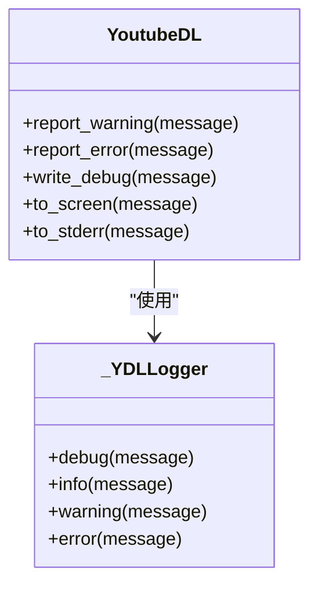
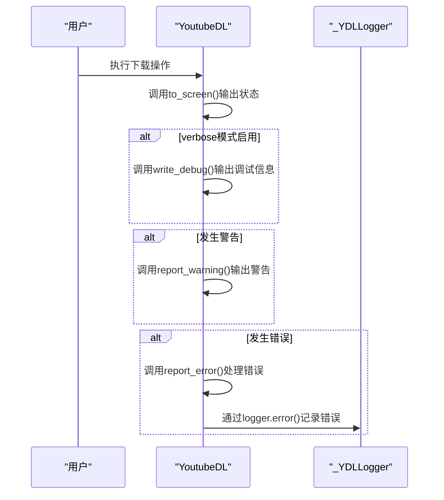
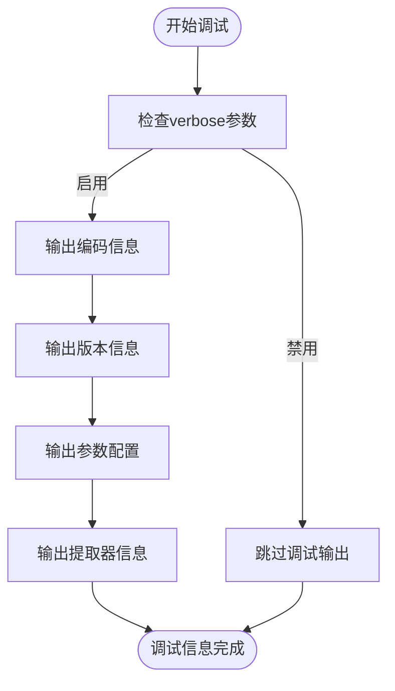
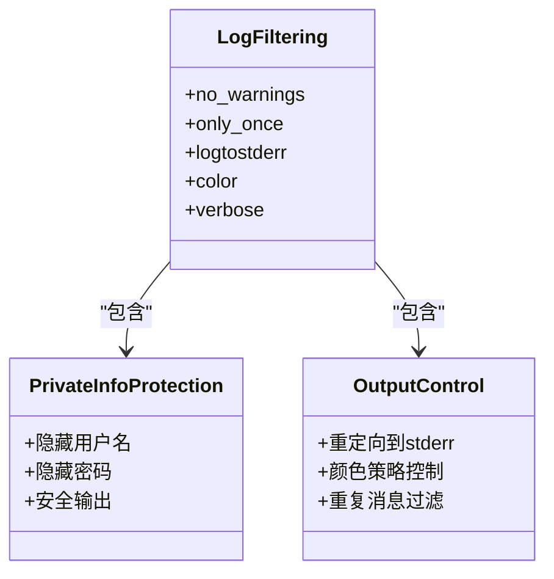
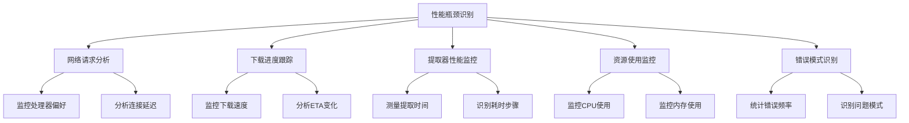

# 日志分析

<cite>
**本文档中引用的文件**  
- [YoutubeDL.py](file://yt_dlp/YoutubeDL.py)
- [utils/_utils.py](file://yt_dlp/utils/_utils.py)
- [test_verbose_output.py](file://test/test_verbose_output.py)
- [test_execution.py](file://test/test_execution.py)
</cite>

## 目录
1. [日志系统概述](#日志系统概述)
2. [日志级别与输出格式](#日志级别与输出格式)
3. [日志记录机制实现](#日志记录机制实现)
4. [调试输出与网络请求分析](#调试输出与网络请求分析)
5. [日志过滤与关键信息提取](#日志过滤与关键信息提取)
6. [性能瓶颈识别方法](#性能瓶颈识别方法)
7. [测试用例中的日志行为](#测试用例中的日志行为)

## 日志系统概述

yt-dlp的日志系统是一个完整的日志记录框架，负责处理从信息提取、网络请求到下载过程中的所有日志输出。该系统通过`YoutubeDL`类中的日志方法和`_YDLLogger`辅助类实现，提供了不同级别的日志输出功能，包括debug、info、warning和error级别。日志系统不仅用于向用户显示操作状态，还为诊断网络请求、信息提取和下载过程中的问题提供了详细的调试信息。

**Section sources**
- [YoutubeDL.py](file://yt_dlp/YoutubeDL.py#L0-L100)

## 日志级别与输出格式

yt-dlp实现了四个主要的日志级别，每个级别都有特定的输出格式和用途：

- **DEBUG级别**：通过`write_debug`方法实现，输出以`[debug]`前缀标识，主要用于开发调试和详细过程跟踪。当`verbose`参数启用时，这些信息会被输出到标准错误流。
- **INFO级别**：通过`to_screen`方法实现，用于输出常规操作信息，如下载进度、文件处理状态等。这些信息直接显示在屏幕上，帮助用户了解程序执行状态。
- **WARNING级别**：通过`report_warning`方法实现，输出以`WARNING:`前缀标识并以黄色高亮显示（在支持颜色的终端中）。用于提示潜在问题或非致命错误。
- **ERROR级别**：通过`report_error`方法实现，输出以`ERROR:`前缀标识并以红色高亮显示。用于报告严重错误和异常情况，可能导致程序终止。

日志输出还支持颜色编码，通过`Styles`命名空间定义了不同类型的文本颜色，如`HEADERS`（黄色）、`FILENAME`（绿色）、`ERROR`（红色）等，提高了日志的可读性。

**Diagram sources **
- [YoutubeDL.py](file://yt_dlp/YoutubeDL.py#L1076-L1102)
- [utils/_utils.py](file://yt_dlp/utils/_utils.py#L5658-L5684)

**Section sources**
- [YoutubeDL.py](file://yt_dlp/YoutubeDL.py#L1076-L1102)
- [utils/_utils.py](file://yt_dlp/utils/_utils.py#L5658-L5684)

## 日志记录机制实现

yt-dlp的日志记录机制基于`YoutubeDL`类中的多个输出方法和`_YDLLogger`辅助类。核心实现包括：

1. **输出流管理**：`YoutubeDL`类初始化时创建`_out_files`命名空间，管理`out`、`error`和`screen`三个输出流，分别对应标准输出、标准错误和屏幕显示。

2. **颜色格式化**：通过`_format_text`、`_format_out`、`_format_screen`和`_format_err`方法实现文本颜色格式化。这些方法根据终端能力决定是否应用颜色编码。

3. **日志方法实现**：
   - `to_screen`：将消息输出到屏幕，受`quiet`参数控制
   - `to_stderr`：将消息输出到标准错误流
   - `trouble`：处理下载问题，根据`ignoreerrors`参数决定是否抛出异常
   - `write_debug`：仅在`verbose`模式下输出调试信息

4. **自定义日志器支持**：通过`logger`参数支持自定义日志器，允许用户注入自己的日志处理逻辑。

**Diagram sources **
- [YoutubeDL.py](file://yt_dlp/YoutubeDL.py#L930-L1010)
- [utils/_utils.py](file://yt_dlp/utils/_utils.py#L5658-L5684)

**Section sources**
- [YoutubeDL.py](file://yt_dlp/YoutubeDL.py#L930-L1010)
- [utils/_utils.py](file://yt_dlp/utils/_utils.py#L5658-L5684)

## 调试输出与网络请求分析

yt-dlp提供了详细的调试输出功能，特别适用于分析网络请求和信息提取过程。通过`verbose`参数启用详细输出模式，可以获取以下关键信息：

1. **网络请求调试**：`RequestDirector`类在`verbose`模式下会输出处理请求的处理器偏好信息，帮助诊断网络连接问题。

2. **编码信息输出**：`print_debug_header`方法输出详细的编码信息，包括区域设置编码、文件系统编码和首选编码，有助于解决字符编码相关问题。

3. **HTTP流量监控**：虽然代码中没有直接实现，但通过`debug_printtraffic`参数可以打印发送和接收的HTTP流量，用于分析网络通信。

4. **调试信息结构**：调试输出包含版本信息、变体来源、参数配置等，为问题诊断提供了完整的上下文。

**Diagram sources **
- [YoutubeDL.py](file://yt_dlp/YoutubeDL.py#L3978-L4041)
- [networking/common.py](file://yt_dlp/networking/common.py#L176-L198)

**Section sources**
- [YoutubeDL.py](file://yt_dlp/YoutubeDL.py#L3978-L4041)
- [networking/common.py](file://yt_dlp/networking/common.py#L176-L198)

## 日志过滤与关键信息提取

yt-dlp的日志系统提供了多种日志过滤和关键信息提取方法：

1. **警告过滤**：通过`no_warnings`参数可以完全禁用警告输出，或通过`only_once`参数确保相同警告只显示一次。

2. **私密信息保护**：在`test_verbose_output.py`测试用例中验证了私密信息（如用户名和密码）不会在日志中明文显示，保护了用户敏感信息。

3. **输出重定向**：通过`logtostderr`参数可以将所有输出重定向到标准错误流，便于日志收集和分析。

4. **颜色控制**：通过`color`参数控制输出颜色策略，支持`always`、`auto`、`never`等选项，适应不同终端环境。

5. **重复消息过滤**：`only_once`参数机制防止相同消息重复输出，提高了日志的可读性。

**Diagram sources **
- [test_verbose_output.py](file://test/test_verbose_output.py#L0-L75)
- [YoutubeDL.py](file://yt_dlp/YoutubeDL.py#L650-L678)

**Section sources**
- [test_verbose_output.py](file://test/test_verbose_output.py#L0-L75)
- [YoutubeDL.py](file://yt_dlp/YoutubeDL.py#L650-L678)

## 性能瓶颈识别方法

通过分析yt-dlp的日志系统，可以采用以下方法识别性能瓶颈：

1. **网络请求分析**：监控`RequestDirector`的处理器偏好输出，识别网络请求处理中的延迟问题。

2. **下载进度跟踪**：通过`progress_hooks`机制获取下载进度信息，分析下载速度和ETA（预计完成时间）变化。

3. **提取器性能监控**：观察信息提取过程中的日志输出时间间隔，识别耗时较长的提取步骤。

4. **资源使用监控**：虽然代码中没有直接实现，但可以通过外部工具监控CPU和内存使用情况，结合日志时间戳分析性能瓶颈。

5. **错误模式识别**：通过分析重复出现的警告和错误，识别可能导致性能下降的问题模式。

**Diagram sources **
- [YoutubeDL.py](file://yt_dlp/YoutubeDL.py#L1076-L1102)
- [networking/common.py](file://yt_dlp/networking/common.py#L176-L198)

**Section sources**
- [YoutubeDL.py](file://yt_dlp/YoutubeDL.py#L1076-L1102)
- [networking/common.py](file://yt_dlp/networking/common.py#L176-L198)

## 测试用例中的日志行为

yt-dlp的测试用例验证了日志系统的关键行为：

1. **私密信息保护测试**：`test_verbose_output.py`中的测试用例验证了用户名和密码等私密信息不会在日志中明文显示，确保了用户数据安全。

2. **执行模式测试**：`test_execution.py`验证了不同执行模式（主模块执行、导入执行、命令行执行）下的日志行为一致性。

3. **警告处理测试**：测试用例验证了警告信息的正确输出格式和颜色编码，确保用户能够清晰识别潜在问题。

4. **错误处理测试**：通过模拟错误情况，验证了错误信息的完整性和异常处理机制的可靠性。

这些测试确保了日志系统在各种使用场景下的稳定性和安全性，为用户提供了可靠的诊断工具。

**Section sources**
- [test_verbose_output.py](file://test/test_verbose_output.py#L0-L75)
- [test_execution.py](file://test/test_execution.py#L0-L60)