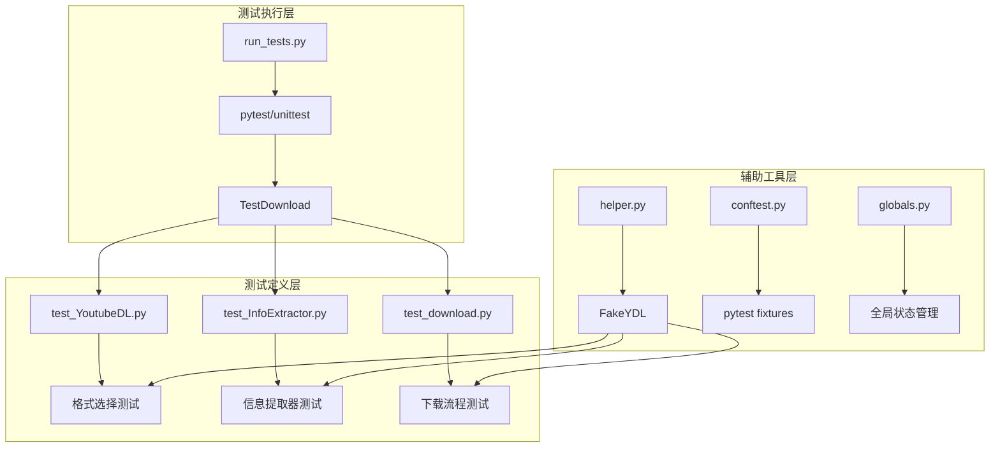
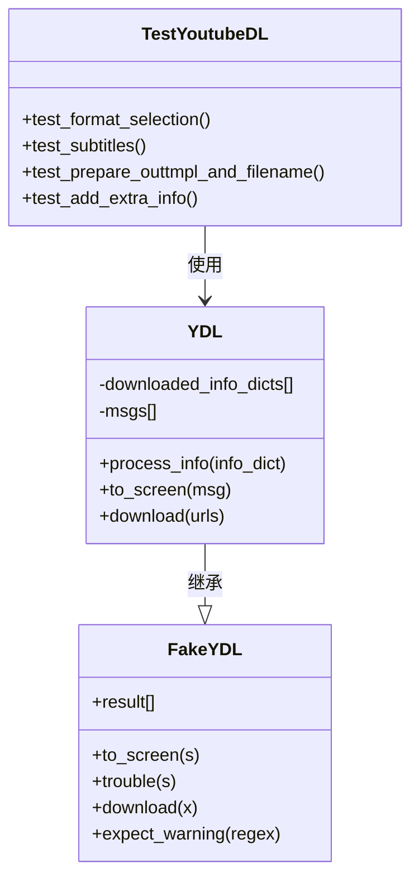
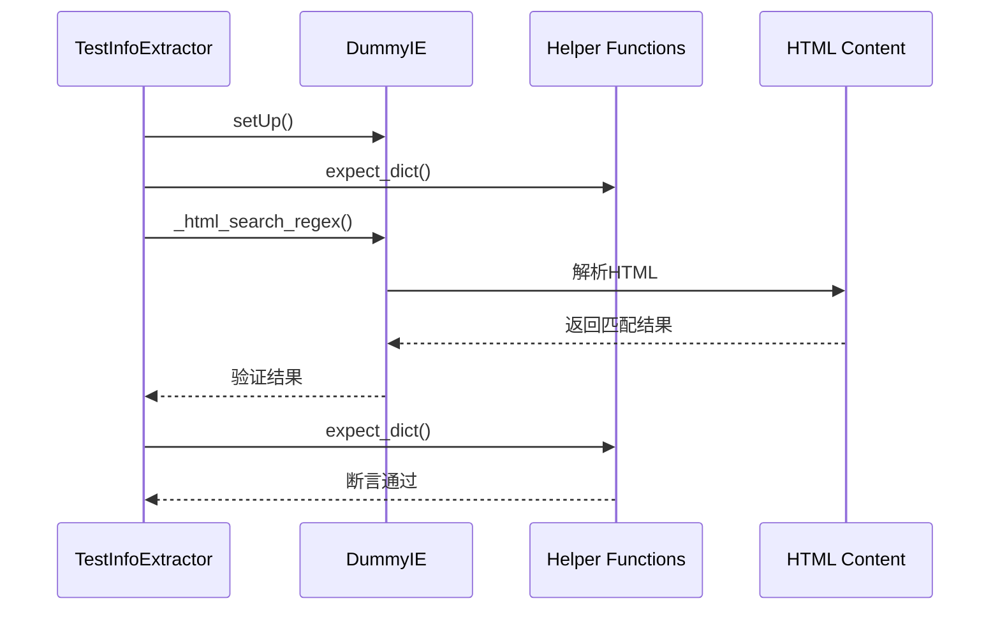
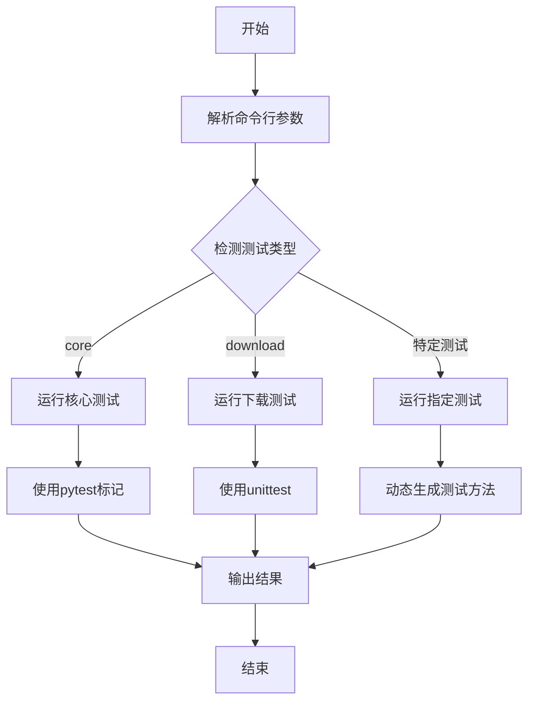
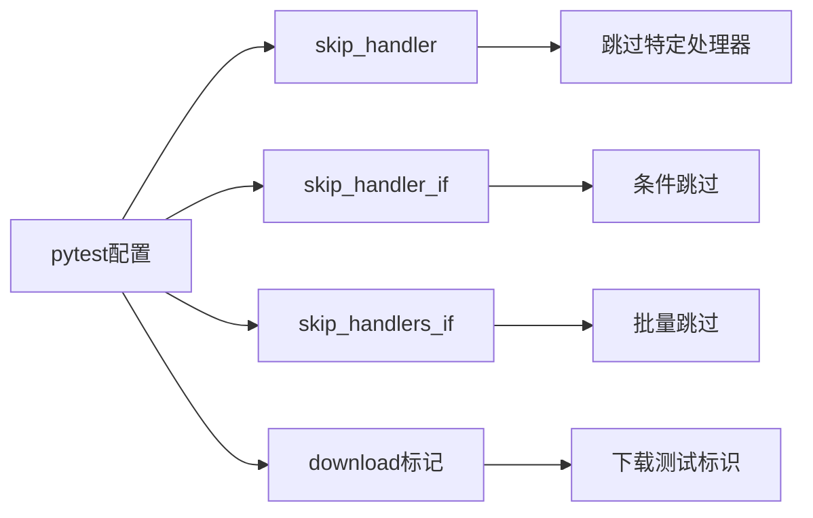
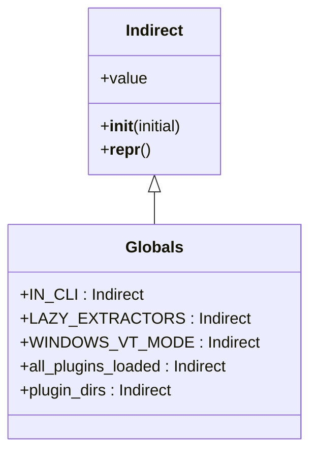
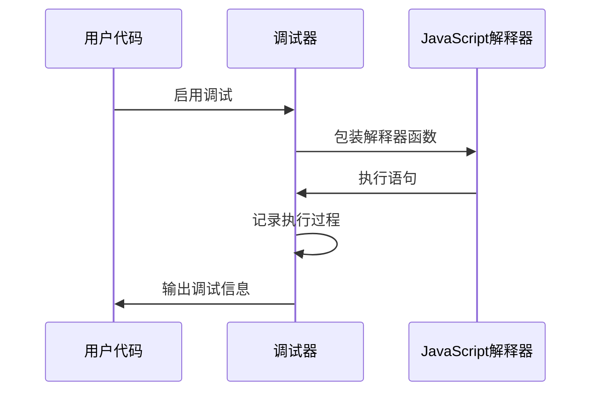
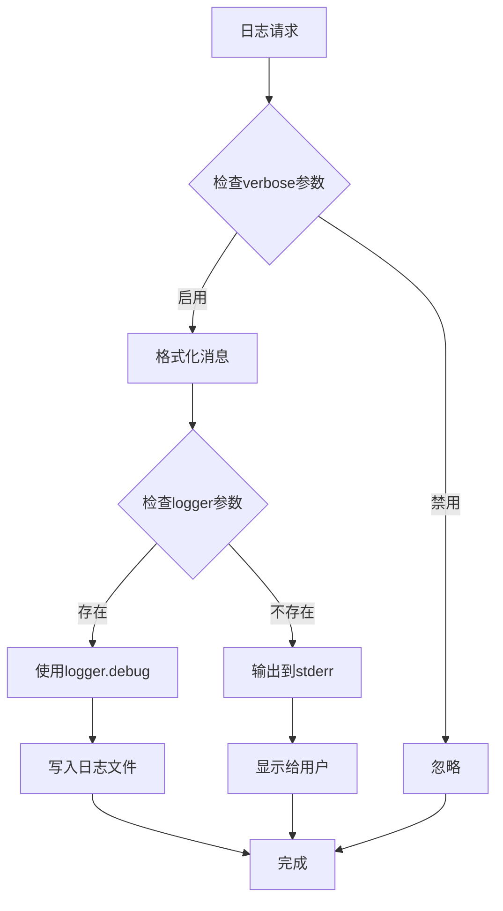
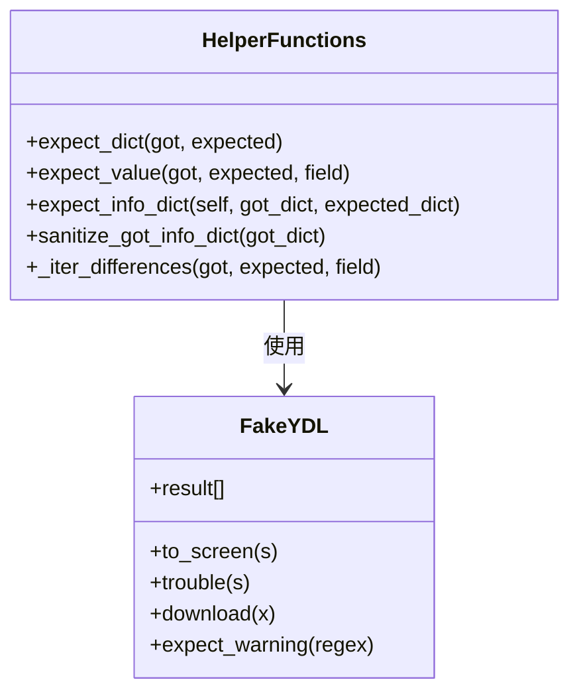

# 调试技巧

<cite>
**本文档中引用的文件**
- [test/test_YoutubeDL.py](file://test/test_YoutubeDL.py)
- [test/test_InfoExtractor.py](file://test/test_InfoExtractor.py)
- [test/test_download.py](file://test/test_download.py)
- [devscripts/run_tests.py](file://devscripts/run_tests.py)
- [yt_dlp/globals.py](file://yt_dlp/globals.py)
- [test/helper.py](file://test/helper.py)
- [test/conftest.py](file://test/conftest.py)
- [test/parameters.json](file://test/parameters.json)
- [test/test_verbose_output.py](file://test/test_verbose_output.py)
- [yt_dlp/YoutubeDL.py](file://yt_dlp/YoutubeDL.py)
- [yt_dlp/jsinterp.py](file://yt_dlp/jsinterp.py)
</cite>

## 目录
1. [简介](#简介)
2. [测试框架概述](#测试框架概述)
3. [核心测试文件分析](#核心测试文件分析)
4. [调试工具和脚本](#调试工具和脚本)
5. [全局状态变量调试](#全局状态变量调试)
6. [断点和日志跟踪](#断点和日志跟踪)
7. [变量检查和验证](#变量检查和验证)
8. [最佳实践](#最佳实践)
9. [故障排除指南](#故障排除指南)
10. [总结](#总结)

## 简介

yt-dlp项目采用了一套完善的测试框架来确保代码质量和功能正确性。本文档详细介绍如何使用test/目录中的测试用例进行问题排查，以及如何利用各种调试工具和技术来快速定位和解决代码缺陷。

测试框架基于Python的unittest和pytest，提供了丰富的调试功能，包括：
- 详细的错误报告和堆栈跟踪
- 可配置的日志输出级别
- 断点和单步调试支持
- 全局状态变量监控
- 测试用例隔离和清理

## 测试框架概述

### 架构设计



**图表来源**
- [devscripts/run_tests.py](file://devscripts/run_tests.py#L1-L78)
- [test/test_download.py](file://test/test_download.py#L1-L310)
- [test/helper.py](file://test/helper.py#L1-L385)

### 测试分类

项目测试主要分为以下几类：

| 测试类型 | 文件位置 | 主要功能 | 调试用途 |
|---------|---------|---------|---------|
| 核心功能测试 | test_YoutubeDL.py | 格式选择、标题处理等 | 验证核心业务逻辑 |
| 信息提取测试 | test_InfoExtractor.py | HTML解析、JSON提取等 | 检查数据提取准确性 |
| 下载流程测试 | test_download.py | 完整下载流程 | 验证端到端功能 |
| 网络请求测试 | 各种test_*.py | 网络交互、错误处理 | 检查网络相关问题 |

**节来源**
- [test/test_YoutubeDL.py](file://test/test_YoutubeDL.py#L1-L1368)
- [test/test_InfoExtractor.py](file://test/test_InfoExtractor.py#L1-L2167)
- [test/test_download.py](file://test/test_download.py#L1-L310)

## 核心测试文件分析

### TestYoutubeDL测试类

TestYoutubeDL类专注于验证YouTubeDL的核心功能，特别是格式选择和文件名处理逻辑。



**图表来源**
- [test/test_YoutubeDL.py](file://test/test_YoutubeDL.py#L20-L50)
- [test/helper.py](file://test/helper.py#L70-L120)

### TestInfoExtractor测试类

TestInfoExtractor类专门测试信息提取器的各种HTML解析和数据提取功能。



**图表来源**
- [test/test_InfoExtractor.py](file://test/test_InfoExtractor.py#L50-L100)
- [test/helper.py](file://test/helper.py#L150-L200)

### TestDownload测试类

TestDownload类是最大的测试模块，负责验证完整的下载流程和各种边界情况。

**节来源**
- [test/test_YoutubeDL.py](file://test/test_YoutubeDL.py#L1-L1368)
- [test/test_InfoExtractor.py](file://test/test_InfoExtractor.py#L1-L2167)
- [test/test_download.py](file://test/test_download.py#L1-L310)

## 调试工具和脚本

### run_tests.py脚本

run_tests.py是项目的主要测试执行脚本，提供了灵活的测试运行选项。



**图表来源**
- [devscripts/run_tests.py](file://devscripts/run_tests.py#L15-L78)

#### 基本使用方法

| 命令格式 | 功能描述 | 示例 |
|---------|---------|------|
| `python devscripts/run_tests.py` | 运行所有核心测试 | `python devscripts/run_tests.py` |
| `python devscripts/run_tests.py download` | 运行下载测试 | `python devscripts/run_tests.py download` |
| `python devscripts/run_tests.py test_name` | 运行特定测试 | `python devscripts/run_tests.py test_YoutubeDL` |
| `python devscripts/run_tests.py -k "pattern"` | 运行匹配模式的测试 | `python devscripts/run_tests.py -k "test_format"` |

#### 高级调试选项

```bash
# 启用详细输出
python devscripts/run_tests.py -v

# 跳过下载测试
python devscripts/run_tests.py core

# 使用pytest参数
python devscripts/run_tests.py --pytest-args="-x --tb=long"

# CI环境运行
CI=true python devscripts/run_tests.py
```

**节来源**
- [devscripts/run_tests.py](file://devscripts/run_tests.py#L1-L78)

### pytest配置和标记

项目使用pytest进行测试管理，提供了丰富的标记系统用于测试控制。



**图表来源**
- [test/conftest.py](file://test/conftest.py#L40-L65)

**节来源**
- [test/conftest.py](file://test/conftest.py#L1-L65)

## 全局状态变量调试

### globals.py中的关键变量

globals.py文件定义了影响调试行为的全局状态变量。

| 变量名 | 类型 | 默认值 | 调试作用 |
|-------|------|--------|---------|
| `IN_CLI` | Indirect(bool) | False | 标识是否在命令行界面运行 |
| `LAZY_EXTRACTORS` | Indirect(bool/None) | None | 控制提取器的延迟加载 |
| `WINDOWS_VT_MODE` | Indirect(bool/None) | False | Windows虚拟终端模式 |



**图表来源**
- [yt_dlp/globals.py](file://yt_dlp/globals.py#L10-L33)

### 调试全局变量的方法

#### 1. 检查当前状态

```python
from yt_dlp.globals import IN_CLI, LAZY_EXTRACTORS, WINDOWS_VT_MODE

print(f"CLI模式: {IN_CLI.value}")
print(f"延迟加载: {LAZY_EXTRACTORS.value}")
print(f"VT模式: {WINDOWS_VT_MODE.value}")
```

#### 2. 修改调试行为

```python
# 强制启用延迟加载
from yt_dlp.globals import LAZY_EXTRACTORS
LAZY_EXTRACTORS.value = True

# 设置为命令行模式
from yt_dlp.globals import IN_CLI
IN_CLI.value = True
```

**节来源**
- [yt_dlp/globals.py](file://yt_dlp/globals.py#L1-L33)

## 断点和日志跟踪

### 内置调试器

项目包含一个JavaScript解释器调试器，可以用于跟踪复杂的JavaScript表达式求值过程。



**图表来源**
- [yt_dlp/jsinterp.py](file://yt_dlp/jsinterp.py#L230-L260)

#### 调试器使用示例

调试器默认处于禁用状态，需要手动启用：

```python
# 在jsinterp.py中启用调试
class Debugger:
    ENABLED = True  # 启用调试器
    
    @staticmethod
    def write(*args, level=100):
        # 自定义调试输出格式
        write_string(f'[debug] JS: {"  " * (100 - level)}{" ".join(args)}\n')
```

### 日志记录系统

YoutubeDL类提供了完整的日志记录功能，支持不同级别的调试信息。



**图表来源**
- [yt_dlp/YoutubeDL.py](file://yt_dlp/YoutubeDL.py#L1104-L1136)

#### 日志级别配置

| 参数 | 功能 | 调试用途 |
|------|------|---------|
| `verbose` | 启用详细输出 | 查看完整执行流程 |
| `logger` | 自定义日志记录器 | 集成到外部日志系统 |
| `no_warnings` | 忽略警告信息 | 减少噪音输出 |
| `ignoreerrors` | 忽略错误继续执行 | 测试错误处理逻辑 |

**节来源**
- [yt_dlp/YoutubeDL.py](file://yt_dlp/YoutubeDL.py#L1017-L1136)
- [yt_dlp/jsinterp.py](file://yt_dlp/jsinterp.py#L221-L260)

## 变量检查和验证

### helper.py中的验证工具

helper.py提供了强大的数据验证和比较功能，用于测试结果的精确匹配。



**图表来源**
- [test/helper.py](file://test/helper.py#L150-L300)

### 数据验证机制

#### 1. 字典比较

```python
def expect_dict(self, got_dict, expected_dict):
    """比较两个字典，报告差异"""
    if message := _expect_value('dictionaries differ', got_dict, expected_dict, None):
        self.fail(message)
```

#### 2. 字段验证

```python
def expect_info_dict(self, got_dict, expected_dict):
    """验证信息字典的完整性"""
    # 检查必需字段
    mandatory_fields = ['id', 'title']
    if expected_dict.get('ext'):
        mandatory_fields.extend(('url', 'ext'))
    
    # 验证字段存在性
    for key in mandatory_fields:
        self.assertTrue(got_dict.get(key), f'Missing mandatory field {key}')
```

#### 3. 数据净化

```python
def sanitize_got_info_dict(got_dict):
    """净化测试数据，移除临时字段"""
    IGNORED_FIELDS = (
        'formats', 'thumbnails', 'subtitles', 'automatic_captions',
        'autonumber', 'playlist', 'format_index', 'video_ext',
        'audio_ext', 'duration_string', 'epoch', 'n_entries'
    )
    
    return {
        key: sanitize(key, value) 
        for key, value in got_dict.items()
        if value is not None and key not in IGNORED_FIELDS
    }
```

**节来源**
- [test/helper.py](file://test/helper.py#L150-L385)

## 最佳实践

### 1. 设置断点的最佳时机

#### 在关键函数入口设置断点

```python
# 在extract_info函数入口
def extract_info(self, url, download=True, process=True):
    import pdb; pdb.set_trace()  # 设置断点
    # 原有代码...
```

#### 使用条件断点

```python
# 只在特定条件下触发断点
def process_info(self, info_dict):
    if info_dict.get('extractor') == 'youtube':
        import pdb; pdb.set_trace()
    # 处理逻辑...
```

### 2. 日志跟踪策略

#### 添加自定义日志

```python
# 在关键路径添加日志
def _real_extract(self, url):
    self.to_screen(f'[debug] 开始处理URL: {url}')
    
    # 处理逻辑
    self.to_screen(f'[debug] 提取到格式数量: {len(formats)}')
    
    return result
```

#### 使用结构化日志

```python
# 使用JSON格式记录复杂数据
import json

def log_complex_data(data, label):
    self.to_screen(f'[debug] {label}: {json.dumps(data, indent=2)}')
```

### 3. 变量检查技巧

#### 检查对象属性

```python
# 检查对象结构
def debug_object(obj, name='object'):
    self.to_screen(f'[debug] {name} 属性:')
    for attr in dir(obj):
        if not attr.startswith('_'):
            try:
                value = getattr(obj, attr)
                self.to_screen(f'  {attr}: {value}')
            except Exception as e:
                self.to_screen(f'  {attr}: 访问失败 - {e}')
```

#### 深度比较

```python
# 深度比较两个对象
def deep_compare(obj1, obj2, path=''):
    if isinstance(obj1, dict) and isinstance(obj2, dict):
        for key in set(obj1.keys()) | set(obj2.keys()):
            deep_compare(obj1.get(key), obj2.get(key), f'{path}.{key}')
    elif isinstance(obj1, list) and isinstance(obj2, list):
        for i, (item1, item2) in enumerate(zip(obj1, obj2)):
            deep_compare(item1, item2, f'{path}[{i}]')
    else:
        if obj1 != obj2:
            self.to_screen(f'[diff] {path}: {obj1} != {obj2}')
```

### 4. 测试用例调试

#### 创建最小可复现案例

```python
# 在test_download.py中添加调试用例
def test_debug_case(self):
    """调试用的最小可复现案例"""
    test_case = {
        'name': 'debug_test',
        'url': 'https://example.com/debug',
        'info_dict': {
            'id': 'debug',
            'title': 'Debug Video',
            'ext': 'mp4'
        }
    }
    
    # 单独运行这个测试
    generator(test_case, 'test_debug')
```

#### 使用pytest调试

```bash
# 使用pytest的调试功能
python -m pytest test/test_download.py::TestDownload::test_debug_case -s --pdb

# 或者使用pytest-xdist进行并行调试
python -m pytest test/test_download.py::TestDownload::test_debug_case --pdb
```

## 故障排除指南

### 常见问题和解决方案

#### 1. 测试超时

**症状**: 测试长时间无响应
**原因**: 网络请求超时或死循环
**解决方案**:
```bash
# 增加超时时间
python devscripts/run_tests.py -k "not timeout"

# 启用详细输出查看卡住的位置
python devscripts/run_tests.py -v
```

#### 2. 内存泄漏

**症状**: 测试运行时间越来越长
**原因**: 对象未正确释放
**解决方案**:
```python
# 在helper.py中添加内存监控
import psutil
import os

def monitor_memory():
    process = psutil.Process(os.getpid())
    memory_mb = process.memory_info().rss / 1024 / 1024
    return memory_mb

# 在测试中定期检查
self.to_screen(f'[memory] 当前内存使用: {monitor_memory():.2f} MB')
```

#### 3. 并发问题

**症状**: 测试结果不稳定
**原因**: 竞态条件或共享状态
**解决方案**:
```python
# 使用线程安全的测试
import threading

class ThreadSafeTest(unittest.TestCase):
    def setUp(self):
        self.lock = threading.Lock()
        
    def test_concurrent_access(self):
        with self.lock:
            # 安全的操作
            pass
```

#### 4. 网络相关问题

**症状**: 网络请求失败
**原因**: 网络连接或代理问题
**解决方案**:
```python
# 在parameters.json中配置代理
{
    "proxy": "http://proxy.example.com:8080",
    "socket_timeout": 30,
    "retry_sleep_functions": [1, 2, 4, 8]
}
```

### 调试工具链


**节来源**
- [test/parameters.json](file://test/parameters.json#L1-L49)
- [test/test_verbose_output.py](file://test/test_verbose_output.py#L1-L76)

## 总结

yt-dlp项目的调试体系是一个完整而强大的测试框架，它提供了从基础单元测试到端到端集成测试的全方位覆盖。通过合理使用这些调试工具和技术，开发者可以：

1. **快速定位问题**: 利用详细的错误报告和堆栈跟踪
2. **深入分析逻辑**: 通过断点和变量检查
3. **验证修复效果**: 使用自动化测试确保问题已解决
4. **预防未来问题**: 通过持续集成和回归测试

掌握这些调试技巧不仅有助于解决当前遇到的问题，更能提升整体的开发效率和代码质量。建议开发者在日常工作中养成良好的调试习惯，充分利用项目提供的各种调试工具和资源。